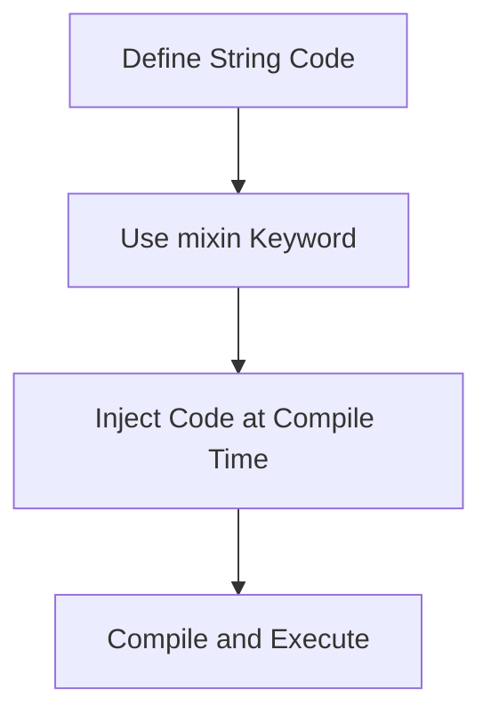

## 3.12 String Mixins and Code Generation

In the realm of advanced systems programming, the D programming language stands out with its powerful metaprogramming capabilities. Among these, string mixins and code generation are particularly noteworthy. They allow developers to inject and generate code dynamically at compile time, offering a level of flexibility and efficiency that can significantly enhance software development processes.

### Understanding String Mixins

String mixins in D are a unique feature that allows you to insert code into your program at compile time. This is achieved by converting strings into executable code, which the compiler then processes as if it were written directly in the source code. This capability is particularly useful for generating repetitive code patterns, creating domain-specific languages (DSLs), and optimizing performance-critical sections of code.

#### Code Injection with String Mixins

**Code Injection** refers to the process of inserting code into a program dynamically. In D, this is accomplished using the `mixin` keyword, which evaluates a string expression and injects the resulting code into the program. This can be particularly useful for scenarios where the code structure is repetitive or can be determined at compile time.

```d
import std.stdio;

void main() {
    string code = "writeln(\"Hello, World!\");";
    mixin(code); // Injects the code at compile time
}
```

In this example, the string `code` is injected into the program using `mixin`, resulting in the execution of `writeln("Hello, World!");` as if it were part of the original source code.

#### Dynamic Code Creation

**Dynamic Code Creation** involves generating code based on conditions or parameters known at compile time. This can be particularly powerful when dealing with templates or configurations that vary across different builds or environments.

Consider a scenario where you need to generate a series of functions based on a list of operations:

```d
import std.stdio;

enum operations = ["add", "subtract", "multiply", "divide"];

foreach (op; operations) {
    mixin("void " ~ op ~ "(int a, int b) { writeln(\"" ~ op ~ ": \", a " ~ opSymbol(op) ~ " b); }");
}

string opSymbol(string op) {
    switch (op) {
        case "add": return "+";
        case "subtract": return "-";
        case "multiply": return "*";
        case "divide": return "/";
        default: return "";
    }
}

void main() {
    add(5, 3);
    subtract(5, 3);
    multiply(5, 3);
    divide(5, 3);
}
```

In this example, we dynamically create four functions (`add`, `subtract`, `multiply`, `divide`) by iterating over a list of operations and using string mixins to inject the corresponding code.

### Metaprogramming Applications

String mixins are a cornerstone of metaprogramming in D, enabling developers to write code that writes code. This can lead to significant reductions in boilerplate code and the creation of more expressive and flexible APIs.

#### Creating Domain-Specific Languages (DSLs)

One of the most powerful applications of string mixins is the creation of DSLs. By leveraging compile-time code generation, you can create specialized languages tailored to specific problem domains, enhancing both readability and maintainability.

```d
import std.stdio;

mixin template SQLQuery(string table, string[] columns) {
    string query = "SELECT " ~ columns.join(", ") ~ " FROM " ~ table ~ ";";
    mixin("void executeQuery() { writeln(\"Executing: " ~ query ~ "\"); }");
}

mixin SQLQuery!("users", ["id", "name", "email"]);

void main() {
    executeQuery();
}
```

In this example, we define a simple DSL for generating SQL queries. The `SQLQuery` template takes a table name and a list of columns, generating a `SELECT` statement and an `executeQuery` function to print it.

#### Reducing Boilerplate Code

String mixins can also be used to reduce boilerplate code, which is often repetitive and error-prone. By generating code dynamically, you can ensure consistency and reduce the likelihood of mistakes.

```d
import std.stdio;

enum fields = ["name", "age", "email"];

foreach (field; fields) {
    mixin("string get" ~ capitalize(field) ~ "() { return " ~ field ~ "; }");
    mixin("void set" ~ capitalize(field) ~ "(string value) { " ~ field ~ " = value; }");
}

string name;
string age;
string email;

void main() {
    setName("Alice");
    writeln(getName());
}
```

Here, we generate getter and setter functions for a list of fields, reducing the need to manually write each function.

### Best Practices for String Mixins

While string mixins offer powerful capabilities, they should be used judiciously to maintain code readability and maintainability. Here are some best practices to consider:

- **Keep Code Readable**: Ensure that the generated code is easy to understand and maintain. Use clear and descriptive variable names and comments to explain the purpose of the code.
- **Limit Complexity**: Avoid overly complex mixins that are difficult to debug or understand. Break down complex logic into smaller, manageable pieces.
- **Use Templates**: Combine string mixins with templates to encapsulate and reuse common patterns.
- **Test Thoroughly**: Since mixins generate code dynamically, ensure that the generated code is thoroughly tested to catch any potential errors.
- **Document Usage**: Clearly document the purpose and usage of string mixins in your codebase to aid future developers in understanding their function.

### Visualizing Code Generation

To better understand the flow of code generation using string mixins, let's visualize the process with a flowchart:



**Figure 1**: This flowchart illustrates the process of using string mixins to inject and execute code at compile time.

### Try It Yourself

To fully grasp the power of string mixins, try modifying the examples provided. Experiment with different operations, fields, or DSLs to see how string mixins can simplify your code. Consider creating a small DSL for a specific task in your current project and observe the benefits.

### References and Further Reading

- [D Programming Language Official Documentation](https://dlang.org/)
- [Metaprogramming in D](https://wiki.dlang.org/Metaprogramming)
- [Understanding Mixins in D](https://dlang.org/spec/template-mixin.html)

### Knowledge Check

Before we conclude, let's reinforce your understanding with a few questions and exercises.

- **What are string mixins, and how do they differ from regular code?**
- **How can string mixins be used to create DSLs?**
- **What are some best practices for using string mixins in a maintainable way?**

### Embrace the Journey

Remember, mastering string mixins and code generation in D is a journey. As you continue to explore these features, you'll discover new ways to enhance your code's flexibility and efficiency. Keep experimenting, stay curious, and enjoy the process!

## Quiz Time!



### What is the primary purpose of string mixins in D?

- [x] To inject code at compile time
- [ ] To execute code at runtime
- [ ] To manage memory allocation
- [ ] To handle exceptions

> **Explanation:** String mixins are used to inject code at compile time, allowing for dynamic code generation.

### How do string mixins contribute to metaprogramming?

- [x] By allowing code to be generated dynamically
- [ ] By managing runtime exceptions
- [ ] By optimizing memory usage
- [ ] By simplifying syntax

> **Explanation:** String mixins enable dynamic code generation, which is a key aspect of metaprogramming.

### Which keyword is used to inject code using string mixins?

- [x] mixin
- [ ] import
- [ ] template
- [ ] alias

> **Explanation:** The `mixin` keyword is used to inject code from a string at compile time.

### What is a common use case for string mixins?

- [x] Reducing boilerplate code
- [ ] Managing memory
- [ ] Handling concurrency
- [ ] Optimizing algorithms

> **Explanation:** String mixins are often used to reduce boilerplate code by generating repetitive code patterns.

### What should be considered when using string mixins?

- [x] Code readability and maintainability
- [ ] Memory allocation
- [ ] Runtime performance
- [ ] Exception handling

> **Explanation:** It's important to maintain code readability and maintainability when using string mixins.

### How can string mixins be combined with templates?

- [x] To encapsulate and reuse common patterns
- [ ] To manage memory allocation
- [ ] To handle exceptions
- [ ] To optimize runtime performance

> **Explanation:** Combining string mixins with templates allows for encapsulation and reuse of common code patterns.

### What is a DSL in the context of string mixins?

- [x] Domain-Specific Language
- [ ] Dynamic Syntax Language
- [ ] Data Structure Language
- [ ] Distributed System Language

> **Explanation:** A DSL, or Domain-Specific Language, is a specialized language created for a specific problem domain, often using string mixins.

### What is a potential downside of using complex string mixins?

- [x] Difficulty in debugging
- [ ] Increased memory usage
- [ ] Slower runtime performance
- [ ] Reduced code readability

> **Explanation:** Complex string mixins can be difficult to debug and may reduce code readability.

### What is the role of the `opSymbol` function in the dynamic code creation example?

- [x] To return the appropriate operator symbol for each operation
- [ ] To execute the generated code
- [ ] To manage memory allocation
- [ ] To handle exceptions

> **Explanation:** The `opSymbol` function returns the appropriate operator symbol for each operation in the dynamic code creation example.

### True or False: String mixins can only be used for generating functions.

- [ ] True
- [x] False

> **Explanation:** String mixins can be used for generating any type of code, not just functions.



---
