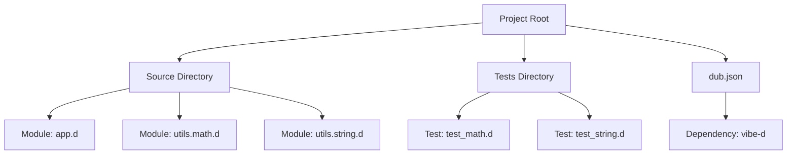

## 3.13 Module System and Package Management

In the realm of advanced systems programming, the ability to organize and manage code efficiently is paramount. The D programming language offers a robust module system and package management capabilities through DUB, which are essential for building scalable and maintainable software systems. In this section, we will delve into the intricacies of D's module system, explore the nuances of visibility and access control, and provide a comprehensive guide to managing dependencies and building projects with DUB.

### Understanding Modules in D

Modules in D are the fundamental building blocks for organizing code into logical units. They allow developers to encapsulate functionality, promote code reuse, and maintain a clean separation of concerns. A module in D is essentially a single source file, and the module name is typically derived from the file path.

#### Defining a Module

To define a module in D, use the `module` keyword followed by the module name. The module name should match the file path and name, excluding the `.d` extension. For example, a file located at `src/utils/math.d` would have the following module declaration:

```d
module utils.math;

// Function to add two numbers
int add(int a, int b) {
    return a + b;
}
```

#### Importing Modules

Modules can be imported using the `import` statement, allowing access to the public symbols defined within the module. For instance, to use the `add` function from the `utils.math` module, you would write:

```d
import utils.math;

void main() {
    int result = add(5, 3);
    writeln("The result is: ", result);
}
```

### Visibility and Access Control

D provides several access specifiers to control the visibility of symbols within a module. These specifiers are crucial for encapsulating implementation details and exposing only the necessary interfaces.

#### Public, Private, Protected, and Package

- **`public`**: Symbols declared as `public` are accessible from any module.
- **`private`**: Symbols declared as `private` are accessible only within the module they are defined in.
- **`protected`**: Symbols declared as `protected` are accessible within the module and its submodules.
- **`package`**: Symbols declared as `package` are accessible within the same package.

Here's an example demonstrating these access specifiers:

```d
module utils.math;

public int add(int a, int b) {
    return a + b;
}

private int subtract(int a, int b) {
    return a - b;
}

protected int multiply(int a, int b) {
    return a * b;
}

package int divide(int a, int b) {
    return a / b;
}
```

### Package Management with DUB

DUB is the official package and build manager for the D programming language. It simplifies the process of managing dependencies, building projects, and distributing packages.

#### Getting Started with DUB

To create a new D project with DUB, use the following command:

```bash
dub init myproject
```

This command initializes a new project with a basic directory structure and a `dub.json` file, which contains metadata about the project and its dependencies.

#### Managing Dependencies

Dependencies in DUB are specified in the `dub.json` file. To add a dependency, simply include it in the `dependencies` section. For example:

```json
{
    "name": "myproject",
    "dependencies": {
        "vibe-d": "~>0.9.3"
    }
}
```

To install the dependencies and build the project, run:

```bash
dub build
```

#### Building and Running Projects

DUB provides a convenient way to build and run projects. Use the following command to build and run your project:

```bash
dub run
```

This command compiles the project and executes the resulting binary.

### Structure and Organization

Organizing code effectively is crucial for maintaining a scalable and manageable codebase. Here are some best practices for structuring D projects:

#### Directory Structure

Adopt a consistent directory structure that reflects the logical organization of your code. A typical D project might have the following structure:

```
myproject/
├── source/
│   ├── app.d
│   ├── utils/
│   │   ├── math.d
│   │   └── string.d
├── tests/
│   ├── test_math.d
│   └── test_string.d
├── dub.json
└── README.md
```

#### Naming Conventions

Use descriptive and consistent naming conventions for modules, functions, and variables. This practice enhances readability and makes it easier to navigate the codebase.

#### Documentation

Document your code thoroughly using D's built-in documentation generation tool, `ddoc`. Well-documented code is easier to understand and maintain.

### Visualizing Module and Package Management

To better understand the module system and package management in D, let's visualize the relationships between modules, packages, and dependencies using a Mermaid.js diagram.



This diagram illustrates the hierarchical structure of a D project, highlighting the source and test directories, modules, and dependencies.

### Try It Yourself

To reinforce your understanding of D's module system and package management, try the following exercises:

1. Create a new D project using DUB and define a module with a few functions.
2. Experiment with different access specifiers (`public`, `private`, `protected`, `package`) and observe their effects on symbol visibility.
3. Add a dependency to your project using DUB and explore how it integrates with your code.

### Knowledge Check

- Explain the purpose of modules in D and how they contribute to code organization.
- Describe the role of access specifiers in controlling symbol visibility within modules.
- Outline the steps to create a new D project with DUB and manage dependencies.

### Embrace the Journey

Remember, mastering the module system and package management in D is a journey. As you continue to explore and experiment, you'll gain a deeper understanding of how to organize and manage code effectively. Keep pushing the boundaries, stay curious, and enjoy the process of building robust and scalable software systems.

## Quiz Time!



### What is the primary purpose of modules in D?

- [x] To organize code into logical units
- [ ] To execute code at compile-time
- [ ] To manage memory allocation
- [ ] To handle concurrency

> **Explanation:** Modules in D are used to organize code into logical units, promoting encapsulation and code reuse.

### Which access specifier allows symbols to be accessible only within the module they are defined in?

- [ ] public
- [x] private
- [ ] protected
- [ ] package

> **Explanation:** The `private` access specifier restricts symbol visibility to within the module they are defined in.

### How do you specify a dependency in a DUB project?

- [ ] By using the `import` statement
- [x] By adding it to the `dependencies` section in `dub.json`
- [ ] By creating a `package.d` file
- [ ] By defining it in the `source` directory

> **Explanation:** Dependencies in a DUB project are specified in the `dependencies` section of the `dub.json` file.

### What command is used to initialize a new D project with DUB?

- [ ] dub create
- [ ] dub new
- [x] dub init
- [ ] dub start

> **Explanation:** The `dub init` command is used to initialize a new D project with a basic directory structure and `dub.json` file.

### Which of the following is a best practice for organizing D projects?

- [x] Using a consistent directory structure
- [ ] Mixing source and test files in the same directory
- [ ] Avoiding the use of modules
- [ ] Keeping all code in a single file

> **Explanation:** Using a consistent directory structure is a best practice for organizing D projects, enhancing maintainability and scalability.

### What tool is used to generate documentation in D?

- [ ] DUB
- [ ] DMD
- [x] ddoc
- [ ] ldc2

> **Explanation:** `ddoc` is the tool used to generate documentation in D, allowing developers to create well-documented codebases.

### Which access specifier allows symbols to be accessible within the same package?

- [ ] public
- [ ] private
- [ ] protected
- [x] package

> **Explanation:** The `package` access specifier allows symbols to be accessible within the same package.

### What is the role of the `dub.json` file in a D project?

- [x] To contain metadata about the project and its dependencies
- [ ] To store the project's source code
- [ ] To define the project's module structure
- [ ] To execute the project's main function

> **Explanation:** The `dub.json` file contains metadata about the project and its dependencies, guiding the build and package management process.

### True or False: DUB can only manage dependencies for D projects.

- [ ] True
- [x] False

> **Explanation:** While DUB is primarily used for D projects, it can also manage dependencies for projects that include C and C++ code, thanks to D's interoperability features.

### What is the benefit of using access specifiers in D?

- [x] To control the visibility and accessibility of symbols
- [ ] To improve the performance of the code
- [ ] To simplify the syntax of the language
- [ ] To enable parallel execution of functions

> **Explanation:** Access specifiers in D are used to control the visibility and accessibility of symbols, ensuring encapsulation and modularity.


