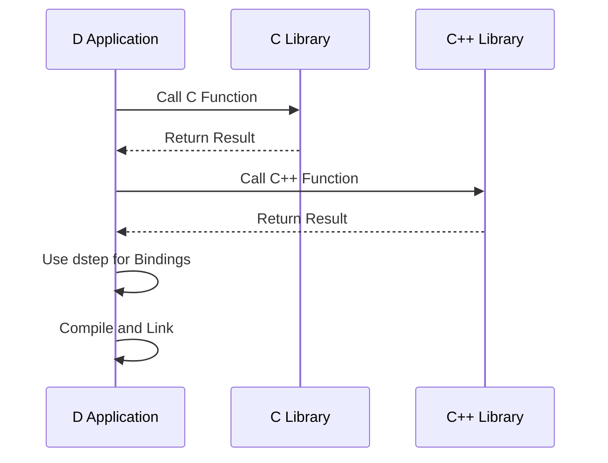

## 3.14 Interfacing with C and C++ Code

Interfacing with C and C++ code is a crucial aspect of systems programming in D. This capability allows developers to leverage existing libraries and frameworks, thus enhancing the functionality and performance of their applications. In this section, we will explore how to import C functions and variables using `extern` declarations, manage C++ interoperability, utilize binding tools like dstep, and examine practical use cases for extending D applications with existing libraries.

### Understanding `extern` Declarations

The `extern` keyword in D is used to declare functions and variables that are defined in another language, typically C or C++. This is essential for calling functions from C libraries or accessing global variables defined in C code.

#### Importing C Functions and Variables

To import a C function or variable, you need to declare it with the `extern` keyword, specifying the linkage type. Here's a simple example of how to import a C function:

```d
extern(C) {
    int printf(const char* format, ...);
}

void main() {
    printf("Hello, World from D!\n");
}
```

In this example, we declare the `printf` function from the C standard library. The `extern(C)` block indicates that the functions within it use C linkage, which is necessary for the D compiler to correctly call the C function.

#### Handling C Data Types

When interfacing with C, it's important to use compatible data types. D provides several aliases for C types, such as `c_int`, `c_char`, and `c_void`, which ensure compatibility with C's primitive types.

```d
extern(C) {
    void cFunction(c_int a, c_char* str);
}
```

### C++ Interoperability

Interfacing with C++ is more complex than C due to features like name mangling, classes, and templates. However, D provides mechanisms to handle these challenges.

#### Name Mangling

C++ compilers often mangle names to support function overloading, which can complicate linking. D allows you to specify the mangled name using the `pragma(mangle)` directive:

```d
extern(C++) {
    pragma(mangle, "_Z7cppFunci");
    void cppFunc(int);
}
```

In this example, `cppFunc` is a C++ function with a mangled name `_Z7cppFunci`. The `pragma(mangle)` directive tells the D compiler to use the specified mangled name when linking.

#### Calling C++ Classes

D can also interface with C++ classes, but this requires careful handling of constructors, destructors, and member functions. Here's an example:

```d
extern(C++) {
    class CppClass {
        this();
        ~this();
        void method();
    }
}

void main() {
    auto obj = new CppClass();
    obj.method();
}
```

In this example, we declare a C++ class `CppClass` with a constructor, destructor, and a method. The D compiler will handle the necessary C++ ABI details to ensure correct calls.

### Binding Tools: Using dstep

Manually writing bindings for large C or C++ libraries can be tedious and error-prone. Tools like dstep automate this process by generating D bindings from C or C++ headers.

#### Installing and Using dstep

To use dstep, first install it from its [GitHub repository](https://github.com/jacob-carlborg/dstep). Once installed, you can generate D bindings with a simple command:

```bash
dstep -o output.d input.h
```

This command reads the C header file `input.h` and generates a D module `output.d` with the necessary bindings.

#### Example: Binding a C Library

Consider a simple C library with the following header:

```c
// mathlib.h
int add(int a, int b);
double multiply(double x, double y);
```

Using dstep, you can generate the following D bindings:

```d
extern(C) {
    int add(int a, int b);
    double multiply(double x, double y);
}
```

These bindings can be directly used in your D code to call the C library functions.

### Use Cases: Extending D Applications with Existing Libraries

Interfacing with C and C++ allows D developers to extend their applications by leveraging existing libraries. Here are some common use cases:

#### Using System Libraries

Many operating systems provide system libraries written in C. By interfacing with these libraries, D applications can perform system-level tasks such as file I/O, networking, and process management.

#### Integrating Third-Party Libraries

There are numerous third-party libraries available in C and C++ for tasks like image processing, machine learning, and database access. By creating bindings, D applications can utilize these libraries without rewriting existing code.

#### Performance Optimization

In some cases, performance-critical code may be implemented in C or C++ for efficiency. By interfacing with this code, D applications can achieve high performance while maintaining the benefits of D's high-level features.

### Visualizing the Interfacing Process

To better understand the process of interfacing with C and C++ code, let's visualize the workflow using a sequence diagram.



This diagram illustrates the interaction between a D application and C/C++ libraries. The D application calls functions from the libraries, receives results, and uses tools like dstep to generate necessary bindings.

### Try It Yourself

To solidify your understanding, try modifying the code examples provided. For instance, add more functions to the C library and generate bindings using dstep. Experiment with calling C++ class methods and handling different data types.

### References and Links

- [D Programming Language: Interfacing to C](https://dlang.org/spec/interfaceToC.html)
- [D Programming Language: Interfacing to C++](https://dlang.org/spec/cpp_interface.html)
- [dstep GitHub Repository](https://github.com/jacob-carlborg/dstep)

### Knowledge Check

- What is the purpose of the `extern` keyword in D?
- How does D handle name mangling when interfacing with C++?
- What tool can be used to generate D bindings from C headers?

### Embrace the Journey

Remember, interfacing with C and C++ is a powerful feature of D that opens up a world of possibilities. As you continue to explore and experiment, you'll gain a deeper understanding of how to leverage existing code and libraries to enhance your D applications. Keep pushing the boundaries, stay curious, and enjoy the journey!

## Quiz Time!



### What is the primary purpose of the `extern` keyword in D?

- [x] To declare functions and variables defined in another language
- [ ] To define new functions in D
- [ ] To optimize D code for performance
- [ ] To handle exceptions in D

> **Explanation:** The `extern` keyword is used to declare functions and variables that are defined in another language, such as C or C++.

### How does D handle name mangling when interfacing with C++?

- [x] Using the `pragma(mangle)` directive
- [ ] By automatically resolving mangled names
- [ ] Through a special compiler flag
- [ ] By renaming functions in D

> **Explanation:** D uses the `pragma(mangle)` directive to specify the mangled name of a C++ function, ensuring correct linkage.

### Which tool is commonly used to generate D bindings from C headers?

- [x] dstep
- [ ] dub
- [ ] ldc
- [ ] gdc

> **Explanation:** dstep is a tool that generates D bindings from C headers, simplifying the process of interfacing with C libraries.

### What is a common use case for interfacing D with C libraries?

- [x] Extending D applications with existing libraries
- [ ] Writing new libraries in D
- [ ] Compiling D code to C
- [ ] Debugging D applications

> **Explanation:** Interfacing with C libraries allows D applications to leverage existing libraries, extending their functionality.

### What is the role of `extern(C++)` in D?

- [x] To declare functions and classes with C++ linkage
- [ ] To optimize D code for C++ compilers
- [ ] To convert D code to C++
- [ ] To handle exceptions in C++

> **Explanation:** `extern(C++)` is used to declare functions and classes that use C++ linkage, allowing D to interface with C++ code.

### What is the benefit of using dstep for generating bindings?

- [x] Automates the process and reduces errors
- [ ] Increases the performance of D applications
- [ ] Simplifies the syntax of D code
- [ ] Enhances the security of D applications

> **Explanation:** dstep automates the process of generating bindings, reducing the likelihood of errors and saving time.

### How can D handle C++ classes when interfacing?

- [x] By declaring them with `extern(C++)`
- [ ] By converting them to D classes
- [ ] By using a special compiler flag
- [ ] By renaming them in D

> **Explanation:** D can handle C++ classes by declaring them with `extern(C++)`, allowing for proper interfacing.

### What is a challenge when interfacing with C++ compared to C?

- [x] Name mangling and handling classes
- [ ] Lack of compatible data types
- [ ] Inability to call functions
- [ ] Limited support for C++ libraries

> **Explanation:** Name mangling and handling classes are challenges when interfacing with C++ due to its complex features.

### What is the purpose of `pragma(mangle)` in D?

- [x] To specify the mangled name of a C++ function
- [ ] To optimize D code for performance
- [ ] To handle exceptions in C++
- [ ] To declare new functions in D

> **Explanation:** `pragma(mangle)` is used to specify the mangled name of a C++ function, ensuring correct linkage.

### True or False: D can interface with both C and C++ code.

- [x] True
- [ ] False

> **Explanation:** D can interface with both C and C++ code, allowing developers to leverage existing libraries and frameworks.


