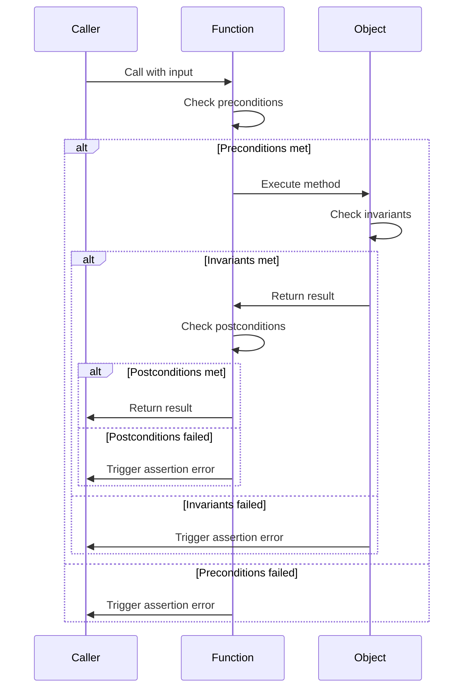

## 3.15 Contracts and Invariants

In the realm of software engineering, ensuring the correctness of code is paramount. The D programming language offers robust features for enforcing software correctness through the use of contracts and invariants. These features are part of the broader concept known as **Design by Contract** (DbC), which was introduced by Bertrand Meyer in the Eiffel programming language. In this section, we will delve into the concepts of contracts and invariants in D, exploring how they can be used to define preconditions, postconditions, and class invariants to ensure that software behaves as expected.

### Design by Contract: Using `in`, `out`, and `invariant` Blocks

Design by Contract is a methodology that treats software components as "contracts" between the component and its clients. These contracts specify the obligations and benefits of the component, ensuring that the software adheres to its intended behavior. In D, contracts are implemented using `in`, `out`, and `invariant` blocks.

#### Preconditions and Postconditions

Preconditions and postconditions are integral parts of a contract. They define the expectations for function inputs and outputs, respectively.

- **Preconditions**: These are conditions that must be true before a function is executed. They define what the function expects from its callers. If a precondition is violated, it indicates a bug in the caller's code.

- **Postconditions**: These are conditions that must be true after a function has executed. They define what the function guarantees to its callers. If a postcondition is violated, it indicates a bug in the function's implementation.

Let's explore how to implement preconditions and postconditions in D using a simple example:

```d
import std.stdio;

// Function to calculate the square root of a number
double calculateSquareRoot(double number)
in {
    assert(number >= 0, "Precondition failed: number must be non-negative");
}
out(double result) {
    assert(result >= 0, "Postcondition failed: result must be non-negative");
}
body {
    return number.sqrt();
}

void main() {
    writeln(calculateSquareRoot(9)); // Outputs: 3
    writeln(calculateSquareRoot(-1)); // Triggers precondition failure
}
```

In this example, the `calculateSquareRoot` function has a precondition that the input number must be non-negative. The postcondition ensures that the result is also non-negative. If either condition is violated, an assertion error is triggered, helping to identify bugs early in the development process.

#### Class Invariants

Class invariants are conditions that must hold true for an object throughout its lifetime, except during the execution of its methods. They ensure that the object's state remains consistent.

To define class invariants in D, use the `invariant` block within a class. Here's an example:

```d
import std.stdio;

class BankAccount {
    private double balance;

    this(double initialBalance) {
        balance = initialBalance;
    }

    void deposit(double amount) {
        balance += amount;
    }

    void withdraw(double amount) {
        balance -= amount;
    }

    double getBalance() const {
        return balance;
    }

    invariant {
        assert(balance >= 0, "Invariant failed: balance must be non-negative");
    }
}

void main() {
    auto account = new BankAccount(100);
    account.deposit(50);
    writeln(account.getBalance()); // Outputs: 150
    account.withdraw(200); // Triggers invariant failure
}
```

In this example, the `BankAccount` class has an invariant that the balance must always be non-negative. This invariant is checked after each method execution, ensuring that the class maintains a consistent state.

### Debugging and Validation: Using Contracts to Find Bugs Early

Contracts are not only useful for enforcing correctness but also for debugging and validation. By defining clear contracts, developers can catch bugs early in the development process, reducing the cost and effort of fixing them later.

#### Benefits of Using Contracts

1. **Early Bug Detection**: Contracts help identify bugs at the point of failure, making it easier to trace and fix them.

2. **Clear Documentation**: Contracts serve as documentation for the expected behavior of functions and classes, making the code more understandable.

3. **Improved Reliability**: By enforcing correctness, contracts contribute to the overall reliability of the software.

4. **Simplified Testing**: Contracts reduce the need for extensive testing by ensuring that the software adheres to its specified behavior.

#### Debugging with Contracts

When a contract is violated, D's runtime system provides detailed information about the failure, including the file name, line number, and the failed assertion. This information is invaluable for debugging.

Consider the following scenario:

```d
import std.stdio;

class Rectangle {
    private double width;
    private double height;

    this(double width, double height) {
        this.width = width;
        this.height = height;
    }

    double area()
    in {
        assert(width > 0 && height > 0, "Precondition failed: dimensions must be positive");
    }
    out(double result) {
        assert(result > 0, "Postcondition failed: area must be positive");
    }
    body {
        return width * height;
    }

    invariant {
        assert(width > 0 && height > 0, "Invariant failed: dimensions must be positive");
    }
}

void main() {
    auto rect = new Rectangle(5, 10);
    writeln(rect.area()); // Outputs: 50
    rect = new Rectangle(-5, 10); // Triggers invariant failure
}
```

In this example, the `Rectangle` class has preconditions, postconditions, and invariants to ensure that the dimensions are positive. If any of these conditions are violated, the program will provide detailed information about the failure, aiding in debugging.

### Visualizing Contracts and Invariants

To better understand the flow of contracts and invariants, let's visualize the process using a sequence diagram.



This diagram illustrates the sequence of events when a function is called with contracts and invariants. It shows how preconditions, postconditions, and invariants are checked at different stages of the function execution.

### Try It Yourself

To deepen your understanding of contracts and invariants in D, try modifying the code examples provided. Here are some suggestions:

1. **Modify Preconditions**: Change the preconditions in the `calculateSquareRoot` function to allow negative numbers and observe the behavior.

2. **Add More Invariants**: Add additional invariants to the `BankAccount` class, such as ensuring that the balance does not exceed a certain limit.

3. **Experiment with Postconditions**: Modify the postconditions in the `Rectangle` class to check for specific area values.

By experimenting with these modifications, you will gain a deeper understanding of how contracts and invariants work in D and how they can be used to enforce software correctness.

### Knowledge Check

Before we conclude, let's reinforce what we've learned with a few questions:

- What is the purpose of preconditions in a contract?
- How do postconditions contribute to software correctness?
- What role do class invariants play in maintaining object state?
- How can contracts aid in debugging and validation?

### Embrace the Journey

Remember, mastering contracts and invariants is a journey. As you continue to explore these concepts, you'll discover new ways to enhance the correctness and reliability of your software. Keep experimenting, stay curious, and enjoy the journey!

### References and Links

For further reading on Design by Contract and related topics, consider the following resources:

- [Design by Contract on Wikipedia](https://en.wikipedia.org/wiki/Design_by_contract)
- [D Programming Language Documentation](https://dlang.org/)
- [Eiffel: The Language](https://archive.eiffel.com/doc/manuals/technology/contract/)

## Quiz Time!



### What is the primary purpose of preconditions in a contract?

- [x] To define expectations for function inputs
- [ ] To ensure the function's output is correct
- [ ] To maintain object state consistency
- [ ] To document the function's behavior

> **Explanation:** Preconditions define what the function expects from its callers, ensuring that inputs meet certain criteria before execution.

### How do postconditions contribute to software correctness?

- [x] By defining expectations for function outputs
- [ ] By maintaining object state consistency
- [ ] By documenting the function's behavior
- [ ] By ensuring inputs meet certain criteria

> **Explanation:** Postconditions define what the function guarantees to its callers, ensuring that outputs meet certain criteria after execution.

### What role do class invariants play in maintaining object state?

- [x] They ensure the object's state remains consistent
- [ ] They define expectations for function inputs
- [ ] They document the function's behavior
- [ ] They ensure the function's output is correct

> **Explanation:** Class invariants are conditions that must hold true for an object throughout its lifetime, ensuring consistent state.

### How can contracts aid in debugging and validation?

- [x] By identifying bugs at the point of failure
- [ ] By documenting the function's behavior
- [ ] By ensuring inputs meet certain criteria
- [ ] By maintaining object state consistency

> **Explanation:** Contracts provide detailed information about failures, making it easier to trace and fix bugs.

### What is the benefit of using contracts for early bug detection?

- [x] They help identify bugs at the point of failure
- [ ] They document the function's behavior
- [ ] They ensure inputs meet certain criteria
- [ ] They maintain object state consistency

> **Explanation:** Contracts catch bugs early in the development process, reducing the cost and effort of fixing them later.

### What is the purpose of the `invariant` block in a class?

- [x] To ensure object state remains consistent
- [ ] To define expectations for function inputs
- [ ] To document the function's behavior
- [ ] To ensure the function's output is correct

> **Explanation:** The `invariant` block defines conditions that must hold true for an object throughout its lifetime, ensuring consistent state.

### How do contracts serve as documentation?

- [x] They specify the expected behavior of functions and classes
- [ ] They ensure inputs meet certain criteria
- [ ] They maintain object state consistency
- [ ] They ensure the function's output is correct

> **Explanation:** Contracts clearly define the obligations and benefits of a component, making the code more understandable.

### What happens when a contract is violated in D?

- [x] An assertion error is triggered
- [ ] The program continues execution
- [ ] The function's output is incorrect
- [ ] The object's state becomes inconsistent

> **Explanation:** When a contract is violated, D's runtime system triggers an assertion error, providing detailed information about the failure.

### How can you modify the `calculateSquareRoot` function to allow negative numbers?

- [x] Change the precondition to allow negative numbers
- [ ] Change the postcondition to allow negative numbers
- [ ] Remove the invariant block
- [ ] Modify the function's output

> **Explanation:** By changing the precondition, you can allow negative numbers as input, altering the function's expected behavior.

### True or False: Contracts reduce the need for extensive testing by ensuring software adheres to its specified behavior.

- [x] True
- [ ] False

> **Explanation:** Contracts enforce correctness, reducing the need for extensive testing by ensuring that the software behaves as expected.


