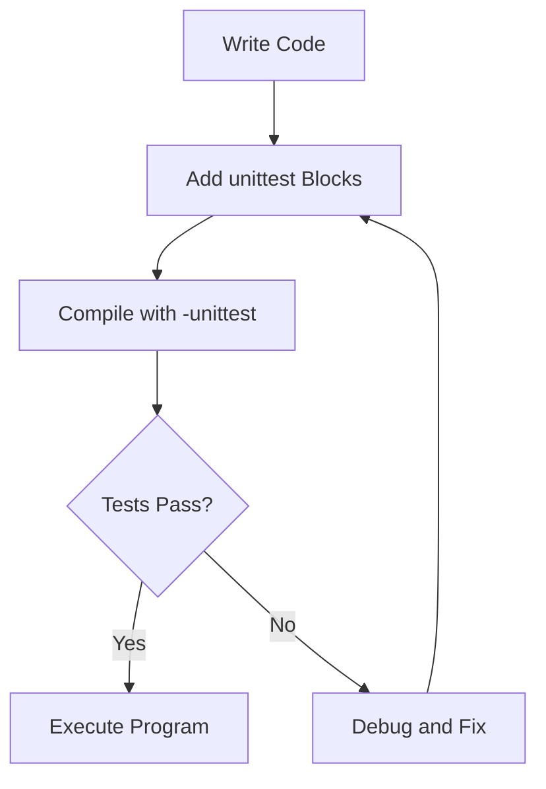

## 3.17 Unit Testing with Built-in `unittest` Blocks

Unit testing is a crucial aspect of software development, ensuring that individual components of a program function as intended. In the D programming language, unit testing is seamlessly integrated into the language itself through the use of `unittest` blocks. This section will guide you through the process of writing, running, and optimizing unit tests in D, leveraging its built-in capabilities to enhance software reliability and maintainability.

### Integrated Testing: Writing Tests Directly in the Source Code

One of the standout features of D is its ability to incorporate unit tests directly within the source code. This integration simplifies the testing process and encourages developers to adopt a test-driven development (TDD) approach.

#### Why Use `unittest` Blocks?

- **Simplicity**: `unittest` blocks are straightforward to use, requiring no additional libraries or frameworks.
- **Proximity**: Tests are located near the code they test, making it easier to understand the context and purpose of each test.
- **Encouragement of TDD**: By integrating tests into the development process, D promotes a culture of testing early and often.

#### Writing Your First `unittest` Block

To create a `unittest` block in D, simply use the `unittest` keyword followed by a block of code. Here's a basic example:

```d
module mymodule;

int add(int a, int b) {
    return a + b;
}

unittest {
    assert(add(2, 3) == 5);
    assert(add(-1, 1) == 0);
}
```

In this example, the `unittest` block tests the `add` function to ensure it returns the correct sum. The `assert` statements verify that the function behaves as expected.

### Running Tests: Compiling and Executing Tests with the Compiler Flag

Running unit tests in D is as simple as compiling your code with the `-unittest` flag. This flag tells the D compiler to include and execute all `unittest` blocks during the compilation process.

#### Compiling with `-unittest`

To compile and run your tests, use the following command:

```bash
dmd -unittest mymodule.d
```

If all tests pass, the program will execute without any output. If a test fails, the compiler will provide detailed information about the failure, including the file name, line number, and the specific assertion that failed.

#### Automating Test Execution

For larger projects, it's beneficial to automate the testing process. Tools like `dub`, D's package manager and build tool, can be configured to run tests automatically. Here's a simple `dub.json` configuration:

```json
{
    "name": "myproject",
    "dependencies": {},
    "configurations": [
        {
            "name": "unittest",
            "buildOptions": ["unittests"]
        }
    ]
}
```

With this configuration, running `dub test` will compile and execute all `unittest` blocks in your project.

### Test Coverage: Ensuring Code is Thoroughly Tested

Test coverage is a metric that indicates the percentage of your code that is tested by your unit tests. High test coverage is often associated with higher code quality, as it suggests that more of your code is verified to work correctly.

#### Measuring Test Coverage in D

D provides tools to measure test coverage, such as `dmd`'s `-cov` flag. This flag generates a coverage report that highlights which parts of your code are covered by tests.

```bash
dmd -unittest -cov mymodule.d
```

The coverage report will show the percentage of code covered and highlight uncovered lines, helping you identify areas that need additional tests.

#### Improving Test Coverage

To improve test coverage, consider the following strategies:

- **Identify Critical Paths**: Focus on testing critical code paths and edge cases.
- **Refactor for Testability**: Simplify complex functions and break them into smaller, testable units.
- **Use Mocking**: Mock external dependencies to isolate the code under test.

### Best Practices: Writing Effective and Meaningful Tests

Effective unit tests are essential for maintaining software quality. Here are some best practices to consider when writing tests in D:

#### Keep Tests Small and Focused

Each test should verify a single aspect of the code's behavior. This makes it easier to identify the cause of a failure and simplifies test maintenance.

#### Use Descriptive Test Names

Descriptive names help convey the purpose of a test. Consider using a naming convention that includes the function name and the expected outcome.

```d
unittest {
    assert(add(2, 3) == 5, "add should return the sum of two numbers");
}
```

#### Test Edge Cases

Ensure your tests cover edge cases, such as boundary values and invalid inputs. This helps catch potential bugs that might not be apparent with typical inputs.

#### Avoid Dependencies

Tests should be independent of each other and not rely on external resources. This ensures that tests can be run in any order and on any machine.

#### Use Assertions Wisely

Assertions are the backbone of unit tests. Use them to verify expected outcomes, and provide meaningful messages to aid in debugging when a test fails.

### Try It Yourself

To solidify your understanding of `unittest` blocks in D, try modifying the example code. Add more functions and corresponding tests, experiment with edge cases, and measure test coverage using the `-cov` flag.

### Visualizing the Testing Process

To better understand the flow of unit testing in D, let's visualize the process using a flowchart.



This flowchart illustrates the iterative nature of testing in D, where writing code, adding tests, and debugging are part of a continuous cycle.

### References and Links

For further reading on unit testing in D, consider the following resources:

- [D Programming Language Official Documentation](https://dlang.org/)
- [DUB Package Manager](https://code.dlang.org/)
- [Test-Driven Development: By Example](https://www.amazon.com/Test-Driven-Development-Kent-Beck/dp/0321146530)

### Knowledge Check

Before moving on, consider these questions to test your understanding:

- What are the benefits of using `unittest` blocks in D?
- How do you run unit tests in D?
- What is the purpose of the `-cov` flag?
- How can you improve test coverage in your code?

### Embrace the Journey

Remember, mastering unit testing in D is a journey. As you continue to write and refine your tests, you'll gain a deeper understanding of your code and improve its quality. Keep experimenting, stay curious, and enjoy the process!

### Formatting and Structure

Organize your tests with clear headings and subheadings, and use bullet points to break down complex information. Highlight important terms or concepts using bold or italic text sparingly.

### Writing Style

Use first-person plural (we, let's) to create a collaborative feel, and avoid gender-specific pronouns. Define acronyms and abbreviations upon first use.

## Quiz Time!



### What is the primary purpose of `unittest` blocks in D?

- [x] To integrate testing directly into the source code
- [ ] To replace the need for external testing frameworks
- [ ] To improve code performance
- [ ] To automatically generate documentation

> **Explanation:** `unittest` blocks in D are designed to integrate testing directly into the source code, making it easier to maintain and understand tests in context.

### How do you run unit tests in D?

- [x] By compiling with the `-unittest` flag
- [ ] By using an external testing library
- [ ] By writing a separate test script
- [ ] By enabling a setting in the IDE

> **Explanation:** Unit tests in D are run by compiling the code with the `-unittest` flag, which includes and executes all `unittest` blocks.

### What does the `-cov` flag do?

- [x] Measures test coverage
- [ ] Compiles the code with optimizations
- [ ] Generates a performance report
- [ ] Enables debugging mode

> **Explanation:** The `-cov` flag in D measures test coverage, providing insights into which parts of the code are covered by tests.

### Which of the following is a best practice for writing unit tests?

- [x] Keep tests small and focused
- [ ] Test multiple functionalities in one test
- [ ] Depend on external resources
- [ ] Use vague test names

> **Explanation:** Keeping tests small and focused is a best practice as it makes them easier to maintain and understand.

### What should you do if a test fails?

- [x] Debug and fix the code
- [ ] Ignore the failure
- [ ] Remove the test
- [ ] Rewrite the test to pass

> **Explanation:** If a test fails, you should debug and fix the code to ensure it meets the expected behavior.

### Why is it important to test edge cases?

- [x] To catch potential bugs that might not be apparent with typical inputs
- [ ] To make tests more complex
- [ ] To increase test execution time
- [ ] To simplify the code

> **Explanation:** Testing edge cases helps catch potential bugs that might not be apparent with typical inputs, ensuring more robust code.

### How can you automate the testing process in D?

- [x] By using `dub` with a `unittest` configuration
- [ ] By writing a custom script
- [ ] By manually running tests
- [ ] By using a third-party tool

> **Explanation:** You can automate the testing process in D by using `dub` with a `unittest` configuration, which simplifies running tests.

### What is a benefit of using descriptive test names?

- [x] They convey the purpose of a test
- [ ] They make tests run faster
- [ ] They reduce code size
- [ ] They improve code security

> **Explanation:** Descriptive test names convey the purpose of a test, making it easier to understand and maintain.

### What is the role of assertions in unit tests?

- [x] To verify expected outcomes
- [ ] To generate test data
- [ ] To compile the code
- [ ] To document the code

> **Explanation:** Assertions are used in unit tests to verify expected outcomes, ensuring the code behaves as intended.

### True or False: Unit tests should rely on external resources.

- [ ] True
- [x] False

> **Explanation:** Unit tests should not rely on external resources to ensure they are independent and can be run in any order and environment.




