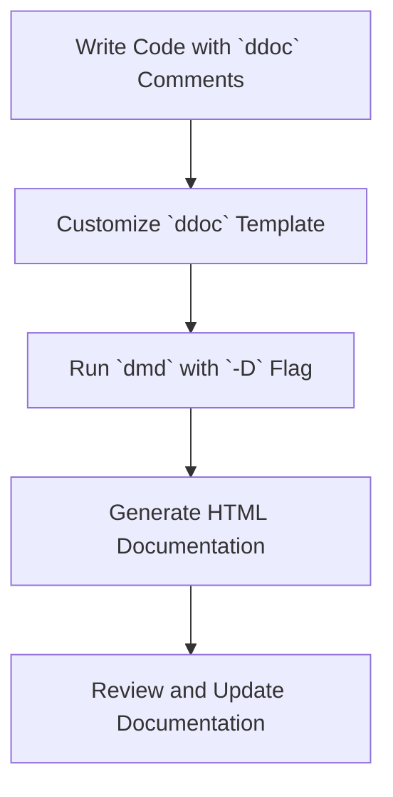

## 3.18 Documentation Generation with `ddoc`

In the realm of software development, documentation is as crucial as the code itself. It serves as a guide for developers, helping them understand the intricacies of the codebase, and ensuring that the software can be maintained and extended over time. In the D programming language, `ddoc` is a powerful tool that facilitates the automatic generation of documentation directly from code comments. This section will delve into the nuances of using `ddoc`, covering its syntax, customization options, and strategies for maintaining documentation in sync with code changes.

### Automatic Documentation: Generating Docs from Code Comments

Automatic documentation generation is a practice where documentation is created directly from the comments within the source code. This approach ensures that the documentation is always aligned with the code, reducing the chances of discrepancies that can occur when documentation is maintained separately.

#### Benefits of Automatic Documentation

1. **Consistency**: Since the documentation is generated from the code itself, it is inherently consistent with the codebase.
2. **Efficiency**: Reduces the overhead of maintaining separate documentation files.
3. **Accessibility**: Makes it easier for new developers to understand the code by providing immediate access to relevant documentation.
4. **Up-to-date Information**: As the code evolves, the documentation evolves with it, ensuring that it remains current.

### `ddoc` Syntax: Formatting Comments for Documentation

`ddoc` uses a specific syntax to format comments that are intended for documentation. These comments are typically placed above the code elements they describe, such as functions, classes, or modules.

#### Basic `ddoc` Comment Structure

In D, `ddoc` comments are denoted by `///` or `/** ... */`. Here's a simple example:

```d
/// This function adds two numbers.
int add(int a, int b) {
    return a + b;
}
```

In the above example, the comment `/// This function adds two numbers.` will be included in the generated documentation for the `add` function.

#### Detailed `ddoc` Syntax

`ddoc` supports a variety of tags and formatting options to create rich documentation. Some of the commonly used tags include:

- **`Params`**: Describes the parameters of a function.
- **`Returns`**: Describes the return value of a function.
- **`Throws`**: Describes exceptions that a function might throw.
- **`Authors`**: Specifies the author(s) of the code.
- **`See`**: Provides references to related documentation.

Here's an example illustrating the use of these tags:

```d
/**
 * Adds two numbers and returns the result.
 *
 * Params:
 *   a = The first number.
 *   b = The second number.
 *
 * Returns: The sum of `a` and `b`.
 *
 * Throws: `ArithmeticException` if the result overflows.
 *
 * Authors: John Doe
 *
 * See_Also: `subtract`, `multiply`
 */
int add(int a, int b) {
    return a + b;
}
```

### Customization: Adjusting Templates and Styles

While `ddoc` provides a default template for documentation generation, it also allows for customization to match the specific needs of a project or organization.

#### Customizing `ddoc` Templates

`ddoc` templates are written in HTML and can be customized to change the appearance and structure of the generated documentation. To customize a template, you need to create a `ddoc` file with your desired HTML structure and include it during the documentation generation process.

#### Example of a Custom `ddoc` Template

```html
<!DOCTYPE html>
<html lang="en">
<head>
    <meta charset="UTF-8">
    <title>My Project Documentation</title>
    <style>
        body { font-family: Arial, sans-serif; }
        h1 { color: #333; }
        /* Additional styles */
    </style>
</head>
<body>
    <h1>Project Documentation</h1>
    <!-- ddoc content will be inserted here -->
</body>
</html>
```

To use this template, you would run the `dmd` compiler with the `-D` flag and specify your custom template file:

```bash
dmd -D -Dfoutput.html -Hdmy_template.html my_code.d
```

#### Customizing Styles with CSS

In addition to HTML templates, you can also use CSS to style the generated documentation. This allows for a consistent look and feel across all documentation pages.

### Maintaining Documentation: Keeping Docs Up-to-Date with Code Changes

Maintaining up-to-date documentation is crucial for the long-term success of any software project. Here are some strategies to ensure your `ddoc` documentation remains current:

#### Integrate Documentation Generation into the Build Process

By integrating `ddoc` generation into your build process, you ensure that documentation is updated every time the code is compiled. This can be achieved using build automation tools like Make, CMake, or custom scripts.

#### Regularly Review and Update Comments

Encourage developers to review and update comments as part of the code review process. This practice helps catch outdated or incorrect documentation early.

#### Use Version Control for Documentation

Just like code, documentation should be version-controlled. This allows you to track changes, revert to previous versions if necessary, and collaborate effectively with other developers.

#### Conduct Documentation Audits

Periodically conduct audits of your documentation to ensure it accurately reflects the current state of the codebase. This can be done as part of regular maintenance or during major project milestones.

### Try It Yourself

To get hands-on experience with `ddoc`, try generating documentation for a small D project. Start by adding `ddoc` comments to your code, then customize the template and styles to match your preferences. Experiment with different tags and formatting options to see how they affect the generated documentation.

### Visualizing the Documentation Process

To better understand the flow of documentation generation with `ddoc`, consider the following diagram:



**Diagram Description**: This flowchart illustrates the process of generating documentation using `ddoc`. It begins with writing code that includes `ddoc` comments, followed by customizing the `ddoc` template. The `dmd` compiler is then run with the `-D` flag to generate HTML documentation, which is subsequently reviewed and updated as needed.

### References and Links

- [D Programming Language Documentation](https://dlang.org/)
- [ddoc Documentation](https://dlang.org/spec/ddoc.html)
- [DMD Compiler Documentation](https://dlang.org/dmd-linux.html)

### Knowledge Check

To reinforce your understanding of `ddoc` and its capabilities, consider the following questions and exercises:

1. What are the benefits of using `ddoc` for documentation generation?
2. How can you customize the appearance of `ddoc`-generated documentation?
3. Describe the process of integrating `ddoc` generation into a build system.
4. Create a small D program with `ddoc` comments and generate documentation for it.

### Embrace the Journey

Remember, mastering `ddoc` is just one step in your journey to becoming a proficient D programmer. As you continue to explore the language, you'll discover new tools and techniques that will enhance your ability to create high-quality software. Keep experimenting, stay curious, and enjoy the process!

## Quiz Time!



### What is the primary benefit of using `ddoc` for documentation generation?

- [x] Consistency with the codebase
- [ ] Faster code execution
- [ ] Reduced memory usage
- [ ] Enhanced security

> **Explanation:** `ddoc` ensures that documentation is consistent with the codebase, as it is generated directly from code comments.

### Which tag is used in `ddoc` to describe function parameters?

- [ ] `Authors`
- [x] `Params`
- [ ] `Returns`
- [ ] `Throws`

> **Explanation:** The `Params` tag is used to describe the parameters of a function in `ddoc`.

### How can you customize the appearance of `ddoc`-generated documentation?

- [x] By using custom HTML templates and CSS
- [ ] By modifying the D compiler
- [ ] By changing the source code
- [ ] By using a different programming language

> **Explanation:** Custom HTML templates and CSS can be used to change the appearance of `ddoc`-generated documentation.

### What command is used to generate documentation with `ddoc`?

- [ ] `gcc`
- [ ] `javac`
- [x] `dmd -D`
- [ ] `python`

> **Explanation:** The `dmd -D` command is used to generate documentation with `ddoc`.

### What is a recommended practice for maintaining up-to-date documentation?

- [x] Integrate documentation generation into the build process
- [ ] Write documentation in a separate file
- [ ] Avoid using comments in code
- [ ] Use a different programming language

> **Explanation:** Integrating documentation generation into the build process ensures that documentation is updated with each code change.

### Which of the following is NOT a `ddoc` tag?

- [ ] `Returns`
- [ ] `Throws`
- [x] `Compile`
- [ ] `See`

> **Explanation:** `Compile` is not a `ddoc` tag. `Returns`, `Throws`, and `See` are valid tags.

### What is the purpose of the `Authors` tag in `ddoc`?

- [ ] To specify the return type of a function
- [ ] To describe exceptions thrown by a function
- [x] To specify the author(s) of the code
- [ ] To list related functions

> **Explanation:** The `Authors` tag is used to specify the author(s) of the code in `ddoc`.

### How can you ensure that `ddoc` documentation is consistent with the code?

- [x] By generating documentation directly from code comments
- [ ] By writing documentation in a separate document
- [ ] By using a different programming language
- [ ] By avoiding the use of comments

> **Explanation:** Generating documentation directly from code comments ensures consistency with the code.

### What is the role of CSS in `ddoc` documentation?

- [x] To style the appearance of the documentation
- [ ] To compile the documentation
- [ ] To execute the documentation
- [ ] To translate the documentation

> **Explanation:** CSS is used to style the appearance of `ddoc`-generated documentation.

### True or False: `ddoc` can only generate documentation for functions.

- [ ] True
- [x] False

> **Explanation:** `ddoc` can generate documentation for various code elements, including functions, classes, and modules.


