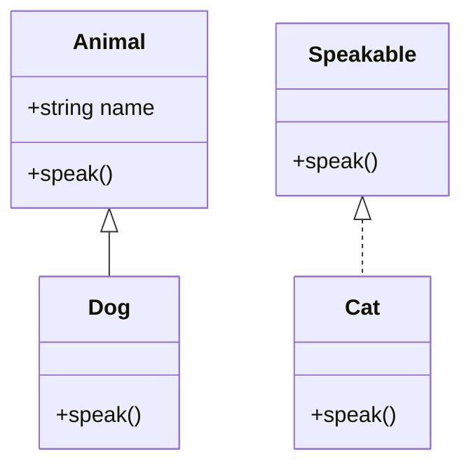

## 3.2 Classes, Structs, and Interfaces

In the D programming language, understanding the distinctions and appropriate use cases for classes, structs, and interfaces is crucial for building efficient and maintainable software systems. These constructs form the backbone of object-oriented and systems programming in D, allowing developers to model complex systems with clarity and precision. Let's delve into each of these constructs, explore their differences, and understand their roles in advanced systems programming.

### Classes vs. Structs

#### Differences in Behavior

**Classes** in D are reference types, meaning they are allocated on the heap, and variables hold references to their memory locations. This allows for dynamic memory management and polymorphic behavior, making classes suitable for scenarios where objects need to be shared or modified across different parts of a program.

**Structs**, on the other hand, are value types. They are typically allocated on the stack, and variables hold the actual data. This makes structs more efficient in terms of memory allocation and access speed, as they avoid the overhead of heap allocation and garbage collection. However, this also means that structs do not support inheritance and polymorphism in the same way classes do.

#### Use Cases

- **Classes** are ideal for scenarios requiring:
  - **Inheritance and Polymorphism**: When you need to create a hierarchy of types with shared behavior.
  - **Dynamic Memory Management**: When objects need to be shared or modified across different scopes.
  - **Complex Object Models**: When modeling entities with complex behaviors and states.

- **Structs** are best suited for:
  - **Performance-Critical Applications**: Where memory allocation and deallocation overhead must be minimized.
  - **Simple Data Structures**: When modeling simple, immutable data structures.
  - **Interfacing with C Libraries**: As structs can be directly mapped to C structs.

#### Performance Implications

The choice between classes and structs can significantly impact performance. Classes incur the overhead of heap allocation and garbage collection, which can be a bottleneck in performance-critical applications. Structs, being stack-allocated, offer faster access times and reduced memory footprint, making them suitable for high-performance scenarios.

### Inheritance and Polymorphism

#### Implementing Object-Oriented Principles with Classes

D supports object-oriented programming (OOP) principles through classes, allowing developers to implement inheritance and polymorphism. This enables the creation of flexible and reusable code by defining base classes with common behavior and extending them with derived classes.

```d
class Animal {
    string name;
    this(string name) {
        this.name = name;
    }
    void speak() {
        writeln("Animal sound");
    }
}

class Dog : Animal {
    this(string name) {
        super(name);
    }
    override void speak() {
        writeln("Woof!");
    }
}

void main() {
    Animal a = new Dog("Buddy");
    a.speak(); // Outputs: Woof!
}
```

In this example, `Dog` inherits from `Animal`, overriding the `speak` method to provide specific behavior. This demonstrates polymorphism, where the method call is resolved at runtime based on the actual object type.

### Interfaces and Abstract Classes

#### Defining Contracts and Abstract Behaviors

**Interfaces** in D define a contract that classes must adhere to, specifying methods that must be implemented without providing any implementation details. This allows for decoupling the definition of behavior from its implementation, promoting flexibility and reusability.

```d
interface Speakable {
    void speak();
}

class Cat : Speakable {
    void speak() {
        writeln("Meow!");
    }
}

void main() {
    Speakable s = new Cat();
    s.speak(); // Outputs: Meow!
}
```

**Abstract Classes** serve a similar purpose but can include both abstract methods (without implementation) and concrete methods (with implementation). They are useful when you want to provide a common base with shared functionality while enforcing certain methods to be implemented by derived classes.

```d
abstract class Vehicle {
    abstract void move();
    void start() {
        writeln("Starting vehicle...");
    }
}

class Car : Vehicle {
    override void move() {
        writeln("Car is moving");
    }
}

void main() {
    Vehicle v = new Car();
    v.start(); // Outputs: Starting vehicle...
    v.move();  // Outputs: Car is moving
}
```

### Value Types and Reference Types

#### Understanding How Structs (Value Types) and Classes (Reference Types) Are Handled

In D, the distinction between value types and reference types is crucial for understanding memory management and performance characteristics.

- **Value Types (Structs)**: 
  - Stored directly in memory, typically on the stack.
  - Copied by value when assigned or passed to functions, leading to independent copies.
  - Suitable for small, immutable data structures where performance is critical.

- **Reference Types (Classes)**:
  - Stored as references to memory locations, typically on the heap.
  - Copied by reference, meaning multiple variables can refer to the same object.
  - Suitable for complex objects requiring dynamic memory management and polymorphism.

### Visualizing Classes, Structs, and Interfaces

To better understand the relationships and differences between classes, structs, and interfaces, let's visualize these concepts using a class diagram.



**Diagram Explanation**: 
- `Animal` is a base class with a `name` attribute and a `speak` method.
- `Dog` inherits from `Animal`, overriding the `speak` method.
- `Speakable` is an interface implemented by `Cat`, which provides its own `speak` method.

### Try It Yourself

Experiment with the following code examples to deepen your understanding:

1. Modify the `Dog` class to include a new method `fetch()` and call it from the `main` function.
2. Create a new struct `Point` with `x` and `y` coordinates and implement a method to calculate the distance from the origin.
3. Define an interface `Movable` with a method `move()` and implement it in a new class `Bicycle`.

### References and Links

- [D Programming Language Specification](https://dlang.org/spec/spec.html)
- [D Language Tour: Classes](https://tour.dlang.org/tour/en/basics/classes)
- [D Language Tour: Interfaces](https://tour.dlang.org/tour/en/basics/interfaces)
- [D Language Tour: Structs](https://tour.dlang.org/tour/en/basics/structs)

### Knowledge Check

- What are the key differences between classes and structs in D?
- How does inheritance work in D, and what are its benefits?
- What is the role of interfaces in D, and how do they differ from abstract classes?

### Embrace the Journey

Remember, mastering the use of classes, structs, and interfaces in D is a journey. As you continue to explore these constructs, you'll gain deeper insights into designing robust and efficient software systems. Keep experimenting, stay curious, and enjoy the process!

## Quiz Time!



### What is the primary difference between classes and structs in D?

- [x] Classes are reference types, while structs are value types.
- [ ] Classes are value types, while structs are reference types.
- [ ] Classes and structs are both reference types.
- [ ] Classes and structs are both value types.

> **Explanation:** Classes in D are reference types, meaning they are allocated on the heap and accessed via references. Structs are value types, meaning they are allocated on the stack and copied by value.

### Which of the following is true about inheritance in D?

- [x] Classes can inherit from other classes.
- [ ] Structs can inherit from other structs.
- [ ] Interfaces can inherit from classes.
- [ ] Classes cannot inherit from interfaces.

> **Explanation:** In D, classes can inherit from other classes, allowing for polymorphic behavior. Structs do not support inheritance.

### What is the purpose of an interface in D?

- [x] To define a contract that classes must implement.
- [ ] To provide a default implementation for methods.
- [ ] To store data in a structured format.
- [ ] To manage memory allocation.

> **Explanation:** Interfaces in D define a contract that classes must implement, specifying methods without providing implementation details.

### How are structs typically allocated in D?

- [x] On the stack.
- [ ] On the heap.
- [ ] In the global memory space.
- [ ] In the static memory space.

> **Explanation:** Structs in D are typically allocated on the stack, making them efficient for performance-critical applications.

### What is a key benefit of using classes in D?

- [x] Support for polymorphism and dynamic memory management.
- [ ] Faster memory access compared to structs.
- [ ] Ability to directly map to C structs.
- [ ] Reduced memory footprint.

> **Explanation:** Classes in D support polymorphism and dynamic memory management, making them suitable for complex object models.

### Which of the following is a characteristic of value types in D?

- [x] They are copied by value.
- [ ] They are copied by reference.
- [ ] They are always allocated on the heap.
- [ ] They support polymorphism.

> **Explanation:** Value types, such as structs, are copied by value, meaning each copy is independent of the others.

### What is the role of an abstract class in D?

- [x] To provide a base class with both abstract and concrete methods.
- [ ] To define a contract without any implementation.
- [ ] To manage memory allocation for derived classes.
- [ ] To store data in a structured format.

> **Explanation:** Abstract classes in D provide a base class with both abstract methods (without implementation) and concrete methods (with implementation).

### How do interfaces differ from abstract classes in D?

- [x] Interfaces only define methods without implementation, while abstract classes can include implementations.
- [ ] Interfaces can include method implementations, while abstract classes cannot.
- [ ] Interfaces are used for memory management, while abstract classes are not.
- [ ] Interfaces are value types, while abstract classes are reference types.

> **Explanation:** Interfaces in D only define methods without implementation, whereas abstract classes can include both abstract and concrete methods.

### What happens when a struct is passed to a function in D?

- [x] A copy of the struct is passed to the function.
- [ ] A reference to the struct is passed to the function.
- [ ] The struct is automatically converted to a class.
- [ ] The struct is moved to the heap.

> **Explanation:** When a struct is passed to a function in D, a copy of the struct is passed, maintaining the value semantics.

### True or False: In D, classes can implement multiple interfaces.

- [x] True
- [ ] False

> **Explanation:** In D, classes can implement multiple interfaces, allowing for flexible and modular design.


