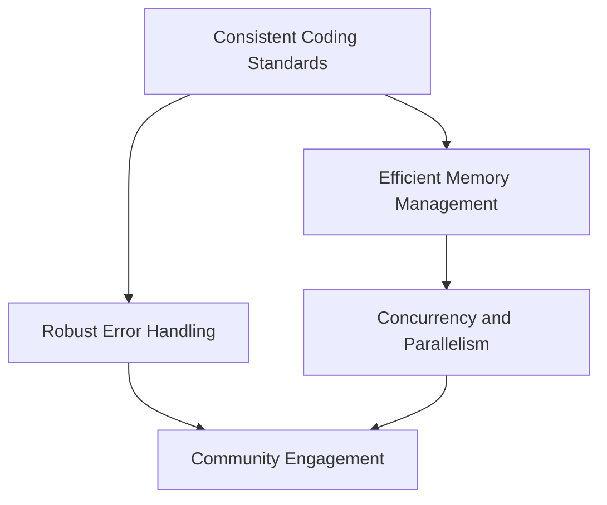

## 3.20 Best Practices for Modern D Programming

As expert software engineers and architects, mastering the D programming language involves more than just understanding syntax and features. It requires adopting best practices that ensure your code is efficient, maintainable, and robust. In this section, we will delve into essential best practices for modern D programming, focusing on coding standards, performance considerations, error handling, and community engagement.

### Coding Standards: Consistency in Style and Formatting

Adopting a consistent coding style is crucial for readability and maintainability. Here are some key practices:

#### 1. **Naming Conventions**

- **Variables and Functions**: Use camelCase for variables and functions. For example, `calculateSum` or `userName`.
- **Constants**: Use ALL_CAPS with underscores for constants, such as `MAX_BUFFER_SIZE`.
- **Types**: Use PascalCase for types, such as `UserAccount` or `TransactionLog`.

#### 2. **Code Layout and Indentation**

- **Indentation**: Use spaces (typically four) for indentation to ensure consistency across different editors.
- **Line Length**: Keep lines under 80 characters to enhance readability.
- **Braces**: Place opening braces on the same line as the statement. For example:

  ```d
  if (condition) {
      // code block
  }
  ```

#### 3. **Commenting and Documentation**

- **Inline Comments**: Use inline comments sparingly to explain complex logic.
- **Function Documentation**: Use DDoc comments (`///`) to document functions and modules. This helps generate documentation automatically.

  ```d
  /// Calculates the sum of two numbers.
  /// Params:
  ///     a = First number
  ///     b = Second number
  /// Returns: The sum of `a` and `b`.
  int calculateSum(int a, int b) {
      return a + b;
  }
  ```

#### 4. **Consistent Use of Language Features**

- **Use `auto`**: Leverage `auto` for type inference where appropriate, but avoid overuse to maintain clarity.
- **Immutable and Const**: Use `immutable` and `const` to enforce immutability and const correctness.

### Performance Considerations: Writing Efficient D Code

Performance is a critical aspect of systems programming. Here are strategies to optimize your D code:

#### 1. **Efficient Memory Management**

- **Avoid Unnecessary Allocations**: Use stack allocation (`scope`) where possible to reduce garbage collection overhead.
- **Slices and Arrays**: Use slices instead of arrays for dynamic memory management. Slices provide a view into an array and can be resized efficiently.

  ```d
  int[] numbers = [1, 2, 3, 4, 5];
  int[] subArray = numbers[1 .. 4]; // Efficient slicing
  ```

- **Custom Allocators**: Implement custom allocators for specific use cases to control memory allocation and deallocation.

#### 2. **Compile-Time Optimization**

- **Compile-Time Function Execution (CTFE)**: Use CTFE to perform calculations at compile time, reducing runtime overhead.

  ```d
  enum factorial(int n) = n <= 1 ? 1 : n * factorial(n - 1);
  ```

- **Templates and Mixins**: Use templates and mixins for code generation and reuse, reducing duplication and improving performance.

#### 3. **Concurrency and Parallelism**

- **Use `std.parallelism`**: Leverage `std.parallelism` for data parallelism, which can automatically distribute work across multiple threads.

  ```d
  import std.parallelism;

  auto results = parallel(map!(a => a * a)(range(1, 1000)));
  ```

- **Message Passing**: Use `std.concurrency` for safe message passing between threads, avoiding shared state and potential race conditions.

### Error Handling: Robust Techniques for Handling Failures

Robust error handling is essential for building reliable systems. Here are best practices for error handling in D:

#### 1. **Exceptions and Error Propagation**

- **Use Exceptions**: Use exceptions for handling unexpected errors. Ensure exceptions are caught and handled appropriately.

  ```d
  try {
      // Code that may throw
  } catch (Exception e) {
      // Handle exception
  }
  ```

- **Error Propagation**: Use `nothrow` functions to indicate that a function does not throw exceptions, improving reliability.

#### 2. **Contracts and Invariants**

- **Design by Contract**: Use contracts (`in`, `out`, `assert`) to define preconditions, postconditions, and invariants, ensuring code correctness.

  ```d
  void process(int value)
  in {
      assert(value > 0, "Value must be positive");
  } body {
      // Function implementation
  }
  ```

#### 3. **Logging and Monitoring**

- **Logging**: Implement logging to capture errors and system behavior. Use structured logging for better analysis.
- **Monitoring**: Use monitoring tools to track application performance and detect anomalies.

### Community Guidelines: Engaging with the D Community and Contributing

Engaging with the D programming community is vital for staying updated and contributing to the language's growth. Here are ways to engage:

#### 1. **Participate in Forums and Discussions**

- **D Language Forums**: Join forums like the D Language Forum to discuss topics, ask questions, and share knowledge.
- **Social Media**: Follow D language communities on platforms like Twitter and Reddit for updates and discussions.

#### 2. **Contribute to Open Source**

- **Open Source Projects**: Contribute to D open source projects on platforms like GitHub. This helps improve the language and gain experience.
- **Documentation and Tutorials**: Write documentation and tutorials to help others learn D programming.

#### 3. **Attend Conferences and Meetups**

- **DConf**: Attend DConf, the official D language conference, to learn from experts and network with other developers.
- **Local Meetups**: Participate in local D programming meetups to connect with the community and share experiences.

### Try It Yourself

To solidify your understanding, try modifying the following code examples:

1. **Modify the `calculateSum` function** to handle a list of numbers instead of just two.
2. **Implement a custom allocator** for a specific use case and compare its performance with the default allocator.
3. **Create a simple logging system** that captures errors and writes them to a file.

### Visualizing D Programming Best Practices

Below is a diagram illustrating the interaction between different best practices in D programming:



**Diagram Description**: This diagram shows how consistent coding standards lead to efficient memory management and robust error handling. Efficient memory management supports concurrency and parallelism, while robust error handling and concurrency practices enhance community engagement.

### Knowledge Check

Reflect on the following questions to reinforce your understanding:

1. Why is it important to use `immutable` and `const` in D programming?
2. How can `std.parallelism` improve the performance of your D applications?
3. What are the benefits of participating in the D programming community?

### Embrace the Journey

Remember, mastering D programming is a continuous journey. As you apply these best practices, you'll develop more efficient, maintainable, and robust software systems. Keep experimenting, stay curious, and enjoy the journey!

## Quiz Time!



### What is the recommended naming convention for variables and functions in D?

- [x] camelCase
- [ ] snake_case
- [ ] PascalCase
- [ ] kebab-case

> **Explanation:** camelCase is recommended for variables and functions in D to maintain consistency and readability.

### How should constants be named in D programming?

- [x] ALL_CAPS with underscores
- [ ] camelCase
- [ ] PascalCase
- [ ] snake_case

> **Explanation:** Constants should be named using ALL_CAPS with underscores to distinguish them from variables.

### What is the purpose of using `auto` in D programming?

- [x] Type inference
- [ ] Memory allocation
- [ ] Error handling
- [ ] Concurrency management

> **Explanation:** `auto` is used for type inference, allowing the compiler to deduce the type of a variable.

### Which feature helps perform calculations at compile time in D?

- [x] Compile-Time Function Execution (CTFE)
- [ ] Mixins
- [ ] Templates
- [ ] Contracts

> **Explanation:** CTFE allows calculations to be performed at compile time, reducing runtime overhead.

### What is the benefit of using `std.parallelism` in D?

- [x] Data parallelism
- [ ] Error handling
- [ ] Memory management
- [ ] Code documentation

> **Explanation:** `std.parallelism` provides data parallelism, distributing work across multiple threads for improved performance.

### How can you indicate that a function does not throw exceptions in D?

- [x] Use `nothrow`
- [ ] Use `@safe`
- [ ] Use `@trusted`
- [ ] Use `@system`

> **Explanation:** `nothrow` is used to indicate that a function does not throw exceptions, enhancing reliability.

### What is the purpose of using contracts in D programming?

- [x] Define preconditions, postconditions, and invariants
- [ ] Manage memory allocation
- [ ] Handle concurrency
- [ ] Perform type inference

> **Explanation:** Contracts define preconditions, postconditions, and invariants, ensuring code correctness.

### How can you engage with the D programming community?

- [x] Participate in forums and discussions
- [ ] Avoid open source contributions
- [ ] Ignore social media platforms
- [ ] Focus solely on personal projects

> **Explanation:** Engaging in forums and discussions helps stay updated and contribute to the D community.

### What is a key benefit of contributing to open source projects in D?

- [x] Gain experience and improve the language
- [ ] Avoid collaboration
- [ ] Limit knowledge sharing
- [ ] Focus on proprietary software

> **Explanation:** Contributing to open source projects helps improve the language and gain valuable experience.

### True or False: Attending DConf can help you learn from experts and network with other developers.

- [x] True
- [ ] False

> **Explanation:** Attending DConf provides opportunities to learn from experts and network with other developers.


