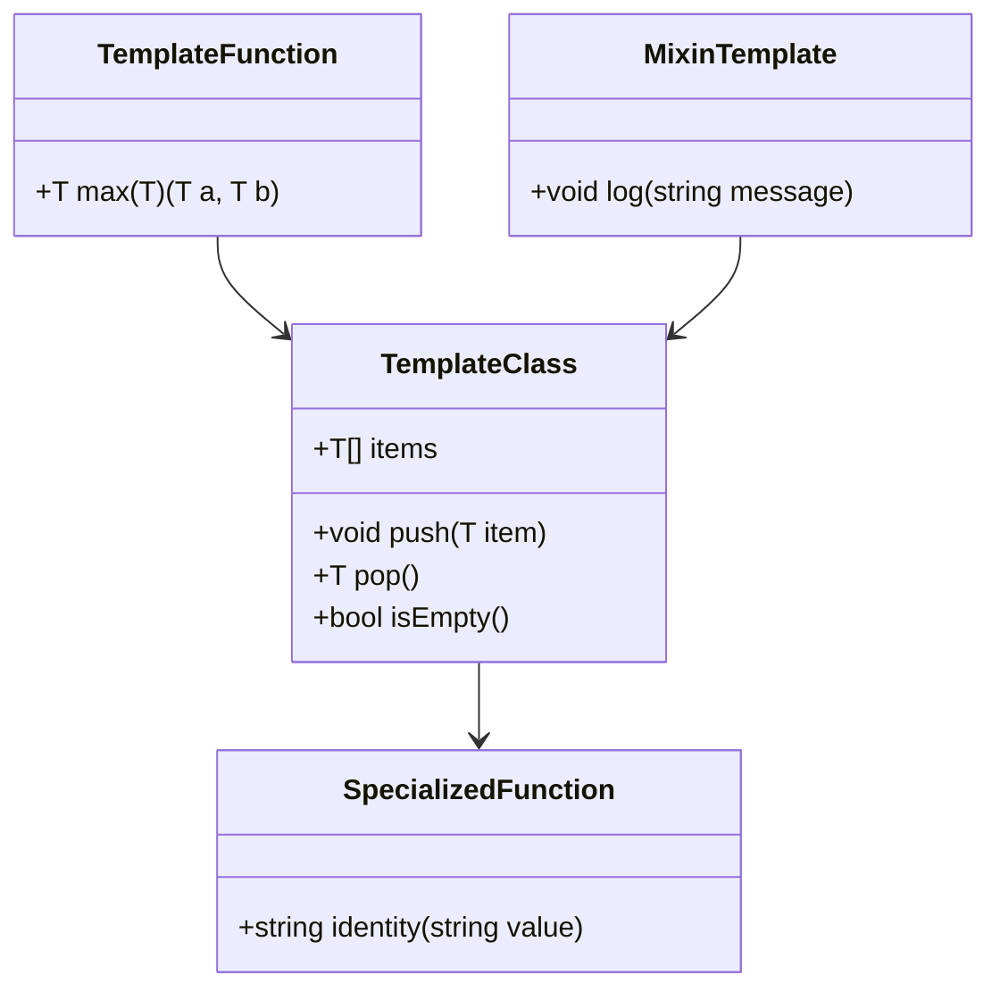

## 3.3 Templates and Generics in D

In the realm of systems programming, the ability to write generic and reusable code is paramount. The D programming language offers powerful features such as templates and generics that allow developers to create flexible and efficient code. In this section, we will delve into the intricacies of templates and generics in D, exploring template functions and classes, template constraints, specialization, and mixin templates. By the end of this guide, you will have a comprehensive understanding of how to leverage these features to enhance your software development practices.

### Template Functions and Classes

Templates in D allow you to write generic code that can work with any data type. This is particularly useful in systems programming, where performance and code reusability are critical. Let's start by exploring how to define and use template functions and classes.

#### Template Functions

A template function in D is a function that can operate on different data types without being rewritten for each one. Here's a simple example:

```d
// A generic function to find the maximum of two values
T max(T)(T a, T b) {
    return a > b ? a : b;
}

void main() {
    writeln(max(10, 20)); // Works with integers
    writeln(max(10.5, 20.5)); // Works with doubles
    writeln(max('a', 'b')); // Works with characters
}
```

In this example, `max` is a template function that takes a type parameter `T`. The function can be used with any type that supports the `>` operator. This is a simple yet powerful way to write reusable code.

#### Template Classes

Template classes work similarly to template functions, allowing you to define classes that can operate on any data type. Here's an example of a simple stack implementation using a template class:

```d
// A generic stack class
struct Stack(T) {
    private T[] items;

    void push(T item) {
        items ~= item;
    }

    T pop() {
        if (items.length == 0) {
            throw new Exception("Stack is empty");
        }
        return items[$ - 1];
    }

    bool isEmpty() {
        return items.length == 0;
    }
}

void main() {
    auto intStack = Stack!int();
    intStack.push(1);
    intStack.push(2);
    writeln(intStack.pop()); // Outputs: 2

    auto stringStack = Stack!string();
    stringStack.push("Hello");
    stringStack.push("World");
    writeln(stringStack.pop()); // Outputs: World
}
```

In this example, `Stack` is a template class that can store any type of data. The `push` and `pop` methods work with the type specified when the stack is instantiated.

### Template Constraints

Template constraints in D allow you to control the instantiation of templates based on certain conditions. This is useful for ensuring that templates are only instantiated with types that meet specific requirements.

#### Using Template Constraints

Template constraints are specified using the `if` keyword. Here's an example:

```d
// A function that only works with numeric types
T add(T)(T a, T b) if (isNumeric!T) {
    return a + b;
}

void main() {
    writeln(add(10, 20)); // Works with integers
    writeln(add(10.5, 20.5)); // Works with doubles
    // writeln(add("Hello", "World")); // Error: string is not numeric
}
```

In this example, the `add` function is constrained to only work with numeric types. The `isNumeric` trait checks if a type is numeric, preventing the function from being instantiated with non-numeric types.

### Specialization

Specialization allows you to create specialized implementations of templates for specific types. This is useful when you need to optimize or modify behavior for certain types.

#### Template Specialization Example

Here's an example of template specialization:

```d
// A generic function with a specialized implementation for strings
T identity(T)(T value) {
    return value;
}

string identity(string value) {
    return "String: " ~ value;
}

void main() {
    writeln(identity(42)); // Outputs: 42
    writeln(identity("Hello")); // Outputs: String: Hello
}
```

In this example, the `identity` function has a generic implementation and a specialized implementation for strings. When the function is called with a string, the specialized version is used.

### Mixin Templates

Mixin templates in D allow you to reuse code across multiple classes or functions. This is achieved by defining a mixin template and using the `mixin` keyword to include it in other code.

#### Mixin Template Example

Here's an example of using mixin templates:

```d
// Define a mixin template for logging
mixin template Logger() {
    void log(string message) {
        writeln("Log: ", message);
    }
}

// Use the mixin template in a class
class MyClass {
    mixin Logger;

    void doSomething() {
        log("Doing something");
    }
}

void main() {
    auto obj = new MyClass();
    obj.doSomething(); // Outputs: Log: Doing something
}
```

In this example, the `Logger` mixin template provides a `log` method that can be included in any class. The `MyClass` class uses the `Logger` mixin to gain logging capabilities.

### Visualizing Templates and Generics

To better understand how templates and generics work in D, let's visualize the process of template instantiation and specialization using a class diagram.



This diagram illustrates the relationships between template functions, template classes, specialized functions, and mixin templates. The arrows indicate how these components interact and depend on each other.

### Try It Yourself

Now that we've covered the basics of templates and generics in D, it's time to experiment with the code examples provided. Try modifying the examples to see how they behave with different data types. Here are a few suggestions:

- Modify the `max` function to work with custom types by implementing the `opCmp` method.
- Extend the `Stack` class to include a `peek` method that returns the top element without removing it.
- Create a new mixin template for error handling and use it in a class.

### References and Links

For further reading on templates and generics in D, consider exploring the following resources:

- [D Programming Language Official Documentation](https://dlang.org/)
- [D Templates and Generics Guide](https://dlang.org/spec/template.html)
- [Metaprogramming in D](https://wiki.dlang.org/Metaprogramming)

### Knowledge Check

Before we conclude, let's reinforce what we've learned with some questions and exercises:

- What are the benefits of using templates in D?
- How do template constraints improve code safety?
- When should you use template specialization?
- Experiment with creating a template function that works with both numeric and string types.

### Embrace the Journey

Remember, mastering templates and generics in D is a journey. As you continue to explore these features, you'll discover new ways to write efficient and reusable code. Keep experimenting, stay curious, and enjoy the process!

## Quiz Time!



### What is the primary benefit of using templates in D?

- [x] Code reusability and flexibility
- [ ] Improved runtime performance
- [ ] Easier debugging
- [ ] Simplified syntax

> **Explanation:** Templates allow you to write generic code that can be reused with different data types, enhancing code reusability and flexibility.

### How do template constraints help in D programming?

- [x] They control template instantiation based on conditions
- [ ] They improve runtime performance
- [ ] They simplify syntax
- [ ] They enhance error handling

> **Explanation:** Template constraints allow you to specify conditions that must be met for a template to be instantiated, ensuring type safety and correctness.

### What is template specialization used for?

- [x] Creating optimized implementations for specific types
- [ ] Simplifying code syntax
- [ ] Enhancing runtime performance
- [ ] Improving error handling

> **Explanation:** Template specialization allows you to provide specialized implementations for certain types, optimizing or altering behavior as needed.

### Which keyword is used to include a mixin template in a class?

- [x] mixin
- [ ] include
- [ ] import
- [ ] extend

> **Explanation:** The `mixin` keyword is used to include mixin templates in classes or functions, allowing code reuse.

### What is the purpose of the `isNumeric` trait in template constraints?

- [x] To check if a type is numeric
- [ ] To improve runtime performance
- [ ] To simplify syntax
- [ ] To enhance error handling

> **Explanation:** The `isNumeric` trait is used in template constraints to ensure that a type is numeric, preventing incorrect instantiation.

### Can template functions in D work with any data type?

- [x] Yes, as long as the operations are supported by the type
- [ ] No, they are limited to primitive types
- [ ] Only with numeric types
- [ ] Only with string types

> **Explanation:** Template functions can work with any data type, provided the operations within the function are supported by that type.

### What is a common use case for mixin templates?

- [x] Reusing code across multiple classes
- [ ] Improving runtime performance
- [ ] Simplifying syntax
- [ ] Enhancing error handling

> **Explanation:** Mixin templates are commonly used to reuse code across multiple classes or functions, promoting code modularity and reuse.

### How can you specialize a template function for a specific type?

- [x] By providing a specific implementation for that type
- [ ] By using the `mixin` keyword
- [ ] By using the `import` keyword
- [ ] By using the `include` keyword

> **Explanation:** Template specialization involves providing a specific implementation for a particular type, allowing for optimized or altered behavior.

### What is the role of the `opCmp` method in custom types?

- [x] To define comparison operations
- [ ] To improve runtime performance
- [ ] To simplify syntax
- [ ] To enhance error handling

> **Explanation:** The `opCmp` method is used in custom types to define comparison operations, enabling them to be used in template functions that require comparisons.

### Templates in D can only be used with primitive types. True or False?

- [ ] True
- [x] False

> **Explanation:** Templates in D can be used with any data type, not just primitive types, as long as the necessary operations are supported.


