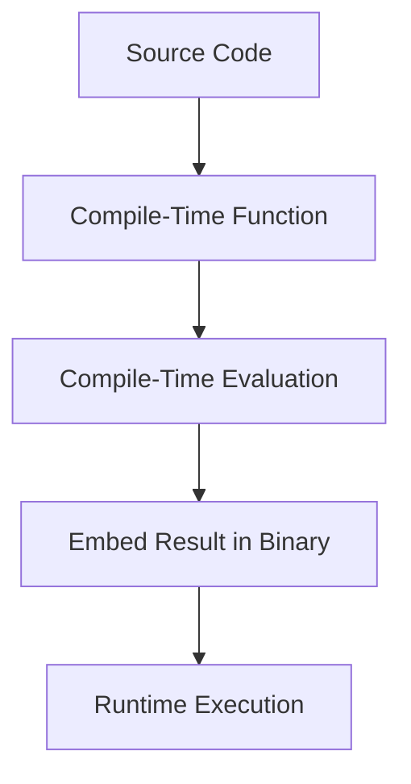

## 3.4 Compile-Time Function Execution (CTFE)

Compile-Time Function Execution (CTFE) is a powerful feature of the D programming language that allows certain functions to be executed during the compilation process rather than at runtime. This capability can significantly enhance performance, reduce runtime overhead, and enable more expressive and flexible code. In this section, we will delve into the concept of CTFE, explore its use cases, discuss its limitations, and provide best practices for leveraging this feature effectively.

### Understanding CTFE

CTFE allows functions to be evaluated at compile time, meaning the results of these functions are computed during the compilation phase and embedded directly into the compiled binary. This can lead to performance improvements by eliminating the need to perform certain calculations at runtime. CTFE is particularly useful for precomputing constant values, generating lookup tables, and performing complex calculations that remain invariant during program execution.

#### Key Concepts

- **Compile-Time Execution**: The process of executing code during the compilation phase rather than at runtime.
- **Constant Expressions**: Expressions that can be evaluated at compile time, resulting in constant values.
- **Immutable Data**: Data that does not change during program execution, making it suitable for CTFE.

### Use Cases for CTFE

CTFE can be applied in various scenarios to optimize performance and enhance code efficiency. Here are some common use cases:

#### Precomputing Values

One of the primary use cases for CTFE is precomputing values that remain constant throughout the program's execution. By evaluating these values at compile time, we can avoid redundant calculations at runtime.

```d
// Example of precomputing a factorial value at compile time
import std.stdio;

int factorial(int n) {
    return n <= 1 ? 1 : n * factorial(n - 1);
}

enum int precomputedFactorial = factorial(5);

void main() {
    writeln("Factorial of 5: ", precomputedFactorial);
}
```

In this example, the `factorial` function is executed at compile time, and the result is stored in the `precomputedFactorial` enum, which is then used in the `main` function.

#### Generating Lookup Tables

CTFE can be used to generate lookup tables, which are arrays or data structures that store precomputed results for quick access during runtime. This is particularly useful for optimizing algorithms that require frequent access to precomputed data.

```d
// Example of generating a lookup table for sine values
import std.math;
import std.stdio;

double[] generateSineTable(int size) {
    double[] table = new double[size];
    foreach (i; 0 .. size) {
        table[i] = sin(i * PI / (size - 1));
    }
    return table;
}

enum double[] sineTable = generateSineTable(10);

void main() {
    writeln("Sine Table: ", sineTable);
}
```

In this example, the `generateSineTable` function creates a lookup table for sine values, which is computed at compile time and stored in the `sineTable` enum.

#### Compile-Time Assertions

CTFE can be used to perform compile-time assertions, ensuring that certain conditions are met during compilation. This can help catch errors early in the development process.

```d
// Example of compile-time assertion
enum int maxValue = 100;
static assert(maxValue < 200, "Max value must be less than 200");

void main() {
    writeln("Max Value: ", maxValue);
}
```

In this example, the `static assert` statement checks that `maxValue` is less than 200 at compile time, providing an error message if the condition is not met.

### Limitations and Best Practices

While CTFE offers significant advantages, it also has limitations and requires careful consideration to use effectively.

#### Limitations

- **Complexity**: Not all functions can be executed at compile time. Functions that involve I/O operations, dynamic memory allocation, or runtime-dependent behavior cannot be evaluated during compilation.
- **Resource Consumption**: CTFE can increase compilation time and memory usage, especially for complex calculations or large data structures.
- **Debugging Challenges**: Debugging CTFE code can be challenging, as errors may occur during the compilation phase rather than at runtime.

#### Best Practices

- **Keep Functions Simple**: Design functions intended for CTFE to be simple and free of side effects. Avoid operations that cannot be executed at compile time.
- **Use `enum` for Constants**: Use `enum` to define compile-time constants, ensuring they are evaluated during compilation.
- **Leverage `static if`**: Use `static if` to conditionally compile code based on compile-time evaluations.
- **Profile Compilation Time**: Monitor compilation time and resource usage to ensure CTFE does not negatively impact the build process.

### Visualizing CTFE

To better understand how CTFE works, let's visualize the process using a flowchart. This diagram illustrates the steps involved in compile-time function execution.



**Figure 1: CTFE Process Flowchart**

In this flowchart, the source code is processed by the compiler, which identifies functions eligible for CTFE. These functions are evaluated at compile time, and the results are embedded directly into the binary. During runtime, the precomputed results are used, eliminating the need for redundant calculations.

### Try It Yourself

To gain hands-on experience with CTFE, try modifying the code examples provided in this section. Experiment with different functions and data structures to see how CTFE can optimize performance and enhance code efficiency.

- **Modify the `factorial` function** to compute the factorial of a different number.
- **Create a new lookup table** for cosine values using a similar approach to the sine table example.
- **Implement a compile-time assertion** to check the validity of a mathematical formula.

### Knowledge Check

Before we conclude this section, let's review some key takeaways:

- CTFE allows functions to be executed at compile time, improving performance by precomputing constant values.
- Common use cases for CTFE include precomputing values, generating lookup tables, and performing compile-time assertions.
- CTFE has limitations, such as increased compilation time and restrictions on function complexity.
- Best practices for CTFE include keeping functions simple, using `enum` for constants, and leveraging `static if` for conditional compilation.

### Embrace the Journey

Remember, mastering CTFE is just one step in your journey to becoming an expert in D programming. As you continue to explore the language's features, you'll discover new ways to optimize performance and enhance code efficiency. Keep experimenting, stay curious, and enjoy the journey!

## Quiz Time!



### What is the primary benefit of Compile-Time Function Execution (CTFE)?

- [x] Improved performance by precomputing values at compile time
- [ ] Simplified code syntax
- [ ] Enhanced runtime error handling
- [ ] Increased code readability

> **Explanation:** CTFE improves performance by precomputing values during compilation, reducing runtime overhead.

### Which of the following is a common use case for CTFE?

- [x] Generating lookup tables
- [ ] Performing I/O operations
- [ ] Dynamic memory allocation
- [ ] Handling runtime exceptions

> **Explanation:** CTFE is commonly used for generating lookup tables, which store precomputed results for quick access during runtime.

### What type of data is suitable for CTFE?

- [x] Immutable data
- [ ] Mutable data
- [ ] Dynamic data
- [ ] Runtime-dependent data

> **Explanation:** Immutable data, which does not change during program execution, is suitable for CTFE.

### Which keyword is used to define compile-time constants in D?

- [x] enum
- [ ] const
- [ ] static
- [ ] final

> **Explanation:** The `enum` keyword is used to define compile-time constants in D.

### What is a limitation of CTFE?

- [x] Increased compilation time
- [ ] Reduced code readability
- [ ] Limited support for arithmetic operations
- [ ] Inability to define constants

> **Explanation:** CTFE can increase compilation time, especially for complex calculations or large data structures.

### Which of the following operations cannot be performed during CTFE?

- [x] I/O operations
- [ ] Arithmetic calculations
- [ ] Logical comparisons
- [ ] String manipulations

> **Explanation:** I/O operations cannot be performed during CTFE, as they require runtime execution.

### What is a best practice for designing functions intended for CTFE?

- [x] Keep functions simple and free of side effects
- [ ] Use dynamic memory allocation
- [ ] Include I/O operations
- [ ] Rely on runtime-dependent behavior

> **Explanation:** Functions intended for CTFE should be simple and free of side effects to ensure they can be executed at compile time.

### How can you conditionally compile code based on compile-time evaluations?

- [x] Use `static if`
- [ ] Use `dynamic if`
- [ ] Use `runtime if`
- [ ] Use `conditional if`

> **Explanation:** The `static if` construct allows for conditional compilation based on compile-time evaluations.

### True or False: CTFE can be used to perform compile-time assertions.

- [x] True
- [ ] False

> **Explanation:** CTFE can be used to perform compile-time assertions, ensuring certain conditions are met during compilation.

### What should you monitor to ensure CTFE does not negatively impact the build process?

- [x] Compilation time and resource usage
- [ ] Code readability
- [ ] Runtime error handling
- [ ] Code syntax

> **Explanation:** Monitoring compilation time and resource usage ensures CTFE does not negatively impact the build process.




