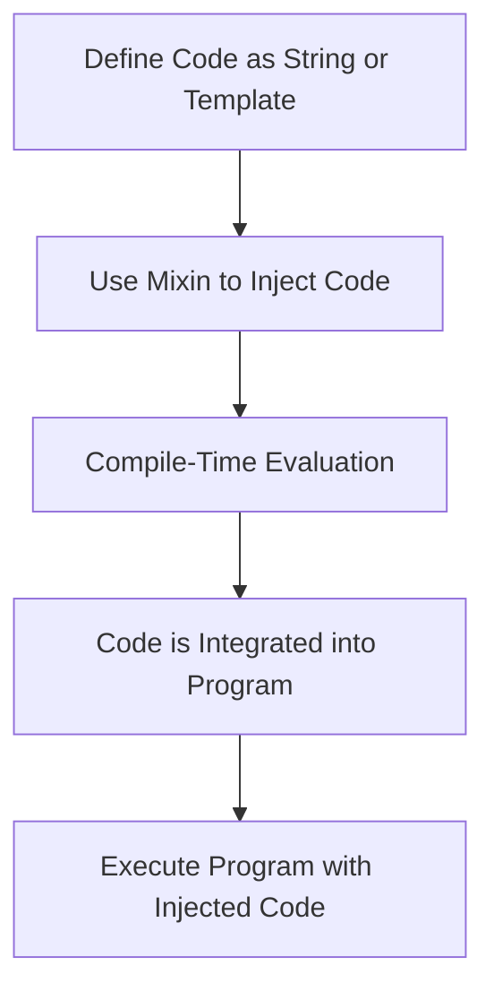

## 3.5 Mixins and Metaprogramming Techniques

In the realm of advanced systems programming, the D programming language stands out with its robust support for metaprogramming and mixins. These features empower developers to write more flexible, efficient, and reusable code by allowing the generation and manipulation of code at compile time. In this section, we will delve into the intricacies of mixins and metaprogramming techniques in D, exploring string mixins, template mixins, compile-time reflection, and generative programming.

### Understanding Mixins in D

Mixins in D provide a powerful mechanism to inject code into your program at compile time. They come in two primary forms: string mixins and template mixins. Both serve to enhance code reuse and flexibility but are used in different contexts.

#### String Mixins

String mixins allow you to inject code via strings that are evaluated at compile time. This feature is particularly useful for generating repetitive code or for scenarios where the code structure is determined dynamically.

**Example: String Mixins**

```d
import std.stdio;

void main() {
    string code = q{
        void sayHello() {
            writeln("Hello, World!");
        }
    };

    mixin(code);

    sayHello(); // Calls the injected function
}
```

In this example, the `mixin` keyword is used to inject the `sayHello` function into the program. The code is defined as a string and evaluated at compile time, allowing for dynamic code generation.

#### Template Mixins

Template mixins, on the other hand, allow you to include template code within classes or functions. They are particularly useful for code reuse and modular design.

**Example: Template Mixins**

```d
import std.stdio;

mixin template Logger() {
    void log(string message) {
        writeln("[LOG]: ", message);
    }
}

class Application {
    mixin Logger; // Injects the Logger template

    void run() {
        log("Application is running.");
    }
}

void main() {
    auto app = new Application();
    app.run();
}
```

Here, the `Logger` template is mixed into the `Application` class, providing it with logging capabilities without duplicating code.

### Metaprogramming Techniques

Metaprogramming in D allows you to write code that generates other code, offering a high degree of flexibility and power. This is achieved through compile-time reflection, generative programming, and other advanced techniques.

#### Compile-Time Reflection

Compile-time reflection enables you to inspect types and structures during compilation. This feature is invaluable for writing generic and reusable code.

**Example: Compile-Time Reflection**

```d
import std.stdio;
import std.traits;

void printTypeInfo(T)() {
    writeln("Type: ", T.stringof);
    writeln("Size: ", T.sizeof);
    writeln("Is class: ", isClass!T);
}

void main() {
    printTypeInfo!int();
    printTypeInfo!string();
}
```

In this example, the `printTypeInfo` function uses compile-time reflection to print information about the types passed to it. The `std.traits` module provides utilities for inspecting types at compile time.

#### Generative Programming

Generative programming involves creating code that writes other code, enhancing flexibility and reuse. This technique is often used in conjunction with templates and mixins.

**Example: Generative Programming**

```d
import std.stdio;

template GenerateGetter(string fieldName) {
    mixin("auto get" ~ fieldName ~ "() { return " ~ fieldName ~ "; }");
}

class Person {
    string name;
    int age;

    mixin GenerateGetter!"name";
    mixin GenerateGetter!"age";
}

void main() {
    auto person = new Person();
    person.name = "Alice";
    person.age = 30;

    writeln("Name: ", person.getname());
    writeln("Age: ", person.getage());
}
```

In this example, the `GenerateGetter` template generates getter methods for the fields of the `Person` class, demonstrating how generative programming can reduce boilerplate code.

### Visualizing Mixins and Metaprogramming

To better understand how mixins and metaprogramming work in D, let's visualize the process using a flowchart.



**Figure 1: Mixin and Metaprogramming Workflow**

This flowchart illustrates the process of defining code as a string or template, using mixins to inject it, evaluating it at compile time, integrating it into the program, and finally executing the program with the injected code.

### Key Considerations and Best Practices

When using mixins and metaprogramming in D, it's important to consider the following:

- **Readability**: While mixins and metaprogramming can reduce code duplication, they can also make code harder to read. Ensure that the generated code is well-documented and easy to understand.
- **Debugging**: Debugging code that uses mixins can be challenging. Use descriptive names and comments to make the code more maintainable.
- **Performance**: Metaprogramming can introduce compile-time overhead. Use it judiciously to avoid unnecessary complexity.
- **Safety**: Ensure that the injected code is safe and does not introduce vulnerabilities.

### Try It Yourself

Experiment with the code examples provided in this section. Try modifying the string mixin example to inject different functions or use template mixins to add new capabilities to classes. By experimenting with these techniques, you'll gain a deeper understanding of how mixins and metaprogramming can enhance your D programming projects.

### Further Reading

For more information on mixins and metaprogramming in D, consider exploring the following resources:

- [D Programming Language Documentation](https://dlang.org/)
- [Metaprogramming in D](https://wiki.dlang.org/Metaprogramming)
- [D Templates and Mixins](https://dlang.org/spec/template.html)

### Knowledge Check

Before moving on, let's review some key concepts:

- What are the two types of mixins in D, and how do they differ?
- How can compile-time reflection be used to inspect types in D?
- What are some best practices for using mixins and metaprogramming in D?

### Embrace the Journey

Remember, mastering mixins and metaprogramming in D is a journey. As you continue to explore these powerful features, you'll unlock new possibilities for creating efficient and reusable code. Keep experimenting, stay curious, and enjoy the process!

## Quiz Time!



### What is a string mixin in D?

- [x] A feature that allows injecting code via strings evaluated at compile time.
- [ ] A feature that allows runtime code execution.
- [ ] A feature that allows dynamic memory allocation.
- [ ] A feature that allows string manipulation.

> **Explanation:** String mixins in D are used to inject code via strings that are evaluated at compile time, enabling dynamic code generation.

### How do template mixins differ from string mixins?

- [x] Template mixins include template code within classes or functions.
- [ ] Template mixins are evaluated at runtime.
- [ ] Template mixins are used for string manipulation.
- [ ] Template mixins are used for memory management.

> **Explanation:** Template mixins allow you to include template code within classes or functions, providing a way to reuse code without duplicating it.

### What is compile-time reflection used for in D?

- [x] Inspecting types and structures during compilation.
- [ ] Modifying code at runtime.
- [ ] Allocating memory dynamically.
- [ ] Managing threads and concurrency.

> **Explanation:** Compile-time reflection in D is used to inspect types and structures during compilation, enabling more generic and reusable code.

### What is generative programming?

- [x] Creating code that writes other code for flexibility and reuse.
- [ ] Writing code that executes at runtime.
- [ ] Generating random numbers in a program.
- [ ] Managing memory allocation.

> **Explanation:** Generative programming involves creating code that writes other code, enhancing flexibility and reuse, often used with templates and mixins.

### Which module provides utilities for compile-time reflection in D?

- [x] `std.traits`
- [ ] `std.string`
- [ ] `std.memory`
- [ ] `std.concurrency`

> **Explanation:** The `std.traits` module in D provides utilities for compile-time reflection, allowing inspection of types and structures.

### What is a key consideration when using mixins in D?

- [x] Readability of the generated code.
- [ ] The speed of runtime execution.
- [ ] The amount of memory used.
- [ ] The number of threads created.

> **Explanation:** Readability is a key consideration when using mixins, as they can make code harder to read if not well-documented.

### What is a potential downside of metaprogramming?

- [x] Compile-time overhead.
- [ ] Increased runtime speed.
- [ ] Reduced memory usage.
- [ ] Simplified debugging.

> **Explanation:** Metaprogramming can introduce compile-time overhead, which is a potential downside if not used judiciously.

### How can you enhance the maintainability of code using mixins?

- [x] Use descriptive names and comments.
- [ ] Avoid using any comments.
- [ ] Use as many mixins as possible.
- [ ] Write all code in a single file.

> **Explanation:** Using descriptive names and comments can enhance the maintainability of code that uses mixins, making it easier to understand.

### What is the primary benefit of using generative programming?

- [x] Reducing boilerplate code.
- [ ] Increasing runtime memory usage.
- [ ] Decreasing code readability.
- [ ] Simplifying error handling.

> **Explanation:** Generative programming reduces boilerplate code by creating code that writes other code, enhancing flexibility and reuse.

### True or False: Mixins can only be used with classes in D.

- [ ] True
- [x] False

> **Explanation:** False. Mixins in D can be used with both classes and functions, providing a versatile tool for code injection.




