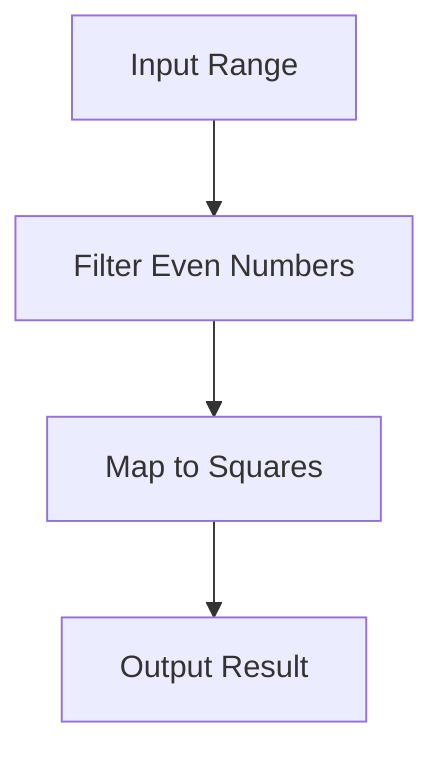

## 3.6 Functional Programming Features in D

Functional programming is a paradigm that treats computation as the evaluation of mathematical functions and avoids changing state or mutable data. The D programming language, known for its versatility and performance, incorporates several functional programming features that allow developers to write cleaner, more predictable, and maintainable code. In this section, we will explore key functional programming features in D, including immutability, pure functions, first-class functions, and ranges.

### Immutability in D

**Immutability** is a core concept in functional programming that involves creating data structures that cannot be modified after they are created. This leads to safer code, as immutable data structures are inherently thread-safe and free from side effects.

#### Leveraging `immutable` Data

In D, the `immutable` keyword is used to declare variables that cannot be changed after initialization. This ensures that the data remains constant throughout its lifetime, providing a guarantee of safety and predictability.

```d
immutable int x = 42;

// Attempting to modify `x` will result in a compile-time error
// x = 43; // Error: cannot modify immutable expression `x`
```

By using `immutable`, you can prevent accidental changes to data, which is particularly useful in concurrent programming where shared data can lead to race conditions.

#### Benefits of Immutability

- **Thread Safety**: Immutable objects can be shared across threads without synchronization.
- **Predictability**: Functions that operate on immutable data are easier to reason about.
- **Optimization**: The compiler can make optimizations knowing that data will not change.

### Pure Functions

**Pure functions** are functions that have no side effects and return the same output given the same input. They do not modify any state or interact with the outside world, making them predictable and easy to test.

#### Writing Pure Functions

In D, you can declare a function as `pure` to enforce these constraints. A `pure` function can only call other `pure` functions and cannot access global or static mutable variables.

```d
pure int add(int a, int b) {
    return a + b;
}

void main() {
    immutable result = add(3, 4); // Always returns 7
}
```

#### Advantages of Pure Functions

- **Testability**: Pure functions are easy to test because they do not depend on external state.
- **Memoization**: Results of pure functions can be cached for performance improvements.
- **Parallelization**: Pure functions can be executed in parallel without concerns about shared state.

### First-Class Functions

In D, functions are first-class citizens, meaning they can be assigned to variables, passed as arguments, and returned from other functions. This feature enables powerful abstractions and code reuse.

#### Treating Functions as Variables

You can assign a function to a variable and use it like any other data type. This allows for dynamic behavior and flexible code design.

```d
int multiply(int a, int b) {
    return a * b;
}

void main() {
    int function(int, int) op = &multiply;
    writeln(op(3, 4)); // Outputs 12
}
```

#### Higher-Order Functions

Higher-order functions are functions that take other functions as parameters or return them as results. They are a cornerstone of functional programming, enabling operations like map, filter, and reduce.

```d
int applyOperation(int a, int b, int function(int, int) op) {
    return op(a, b);
}

void main() {
    writeln(applyOperation(3, 4, &multiply)); // Outputs 12
}
```

### Ranges and Algorithms

**Ranges** in D provide a powerful abstraction for lazy evaluation and efficient data processing. They allow you to work with sequences of data without creating intermediate collections, which can lead to performance improvements.

#### Using Ranges for Lazy Evaluation

Ranges are a central concept in D's standard library, `std.range`. They represent a sequence of elements that can be iterated over, and they support lazy evaluation, meaning elements are computed on demand.

```d
import std.range;
import std.algorithm;
import std.stdio;

void main() {
    auto numbers = iota(1, 10); // Creates a range from 1 to 9
    auto evenNumbers = numbers.filter!(n => n % 2 == 0);
    evenNumbers.each!writeln; // Outputs 2, 4, 6, 8
}
```

#### Efficient Data Processing with Algorithms

D provides a rich set of algorithms in `std.algorithm` that work seamlessly with ranges. These algorithms allow you to perform complex data transformations with concise and expressive code.

```d
import std.algorithm;
import std.range;
import std.stdio;

void main() {
    auto numbers = iota(1, 10);
    auto squares = numbers.map!(n => n * n);
    squares.each!writeln; // Outputs 1, 4, 9, 16, 25, 36, 49, 64, 81
}
```

### Visualizing Functional Programming in D

To better understand how these features interact, let's visualize the flow of data through a series of transformations using ranges and algorithms.



This diagram illustrates how data flows through a pipeline of transformations, showcasing the power of functional programming in D.

### Try It Yourself

Experiment with the code examples provided by modifying them to suit your needs. Try creating your own pure functions, using `immutable` data, and working with ranges to see how these features can improve your code.

### Knowledge Check

- **What are the benefits of using immutable data in D?**
- **How do pure functions enhance testability and parallelization?**
- **What are higher-order functions and how do they enable code reuse?**
- **How do ranges facilitate lazy evaluation and efficient data processing?**

### Embrace the Journey

Remember, mastering functional programming in D is a journey. As you explore these features, you'll discover new ways to write cleaner, more efficient code. Keep experimenting, stay curious, and enjoy the process!

## Quiz Time!



### What is the primary benefit of using immutable data in D?

- [x] Thread safety
- [ ] Faster execution
- [ ] Easier syntax
- [ ] Reduced memory usage

> **Explanation:** Immutable data is inherently thread-safe because it cannot be modified, eliminating the risk of race conditions.

### What is a pure function?

- [x] A function with no side effects
- [ ] A function that modifies global state
- [ ] A function that uses mutable variables
- [ ] A function that depends on external input

> **Explanation:** Pure functions do not have side effects and always produce the same output for the same input.

### How can functions be treated as first-class citizens in D?

- [x] By assigning them to variables
- [ ] By using them only in loops
- [ ] By declaring them as `pure`
- [ ] By making them immutable

> **Explanation:** In D, functions can be assigned to variables, passed as arguments, and returned from other functions, making them first-class citizens.

### What is the advantage of using ranges in D?

- [x] Lazy evaluation
- [ ] Faster compilation
- [ ] Simpler syntax
- [ ] Increased memory usage

> **Explanation:** Ranges in D support lazy evaluation, meaning elements are computed on demand, which can improve performance.

### Which of the following is a higher-order function?

- [x] A function that takes another function as a parameter
- [ ] A function that modifies global variables
- [x] A function that returns another function
- [ ] A function that uses loops

> **Explanation:** Higher-order functions are those that take other functions as parameters or return them as results.

### What is the purpose of the `immutable` keyword in D?

- [x] To declare variables that cannot be changed
- [ ] To make functions faster
- [ ] To simplify syntax
- [ ] To reduce memory usage

> **Explanation:** The `immutable` keyword is used to declare variables that cannot be modified after initialization.

### How do pure functions benefit from memoization?

- [x] Their results can be cached for performance improvements
- [ ] They execute faster
- [x] They reduce memory usage
- [ ] They simplify syntax

> **Explanation:** Since pure functions always produce the same output for the same input, their results can be cached, improving performance.

### What is a key feature of first-class functions?

- [x] They can be passed as arguments
- [ ] They must be declared as `pure`
- [ ] They cannot be modified
- [ ] They are faster to execute

> **Explanation:** First-class functions can be passed as arguments, returned from other functions, and assigned to variables.

### How do ranges improve data processing in D?

- [x] By allowing lazy evaluation
- [ ] By reducing syntax complexity
- [ ] By increasing memory usage
- [ ] By simplifying loops

> **Explanation:** Ranges allow for lazy evaluation, meaning elements are computed on demand, which can lead to more efficient data processing.

### True or False: Pure functions can modify global variables.

- [ ] True
- [x] False

> **Explanation:** Pure functions cannot modify global variables as they have no side effects and always produce the same output for the same input.


