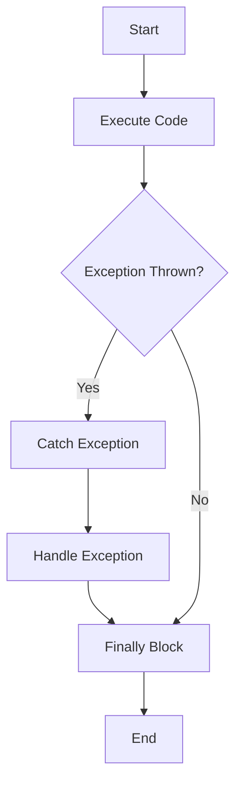

## 3.8 Error Handling and Exception Safety

In the realm of systems programming, robust error handling and exception safety are paramount. The D programming language offers a sophisticated set of tools and paradigms to manage errors effectively, ensuring that your systems remain stable and reliable even in the face of unexpected conditions. In this section, we will delve into the intricacies of error handling in D, exploring the exception mechanism, `nothrow` functions, error propagation strategies, and designing systems for stability.

### Exception Mechanism: Throwing and Catching Exceptions in D

D provides a structured exception handling mechanism similar to that found in languages like C++ and Java. This mechanism allows developers to separate error-handling code from regular code, making programs easier to read and maintain.

#### Throwing Exceptions

In D, exceptions are objects derived from the `Throwable` class. You can throw exceptions using the `throw` keyword. Here's a simple example:

```d
import std.stdio;

void divide(int a, int b) {
    if (b == 0) {
        throw new Exception("Division by zero");
    }
    writeln("Result: ", a / b);
}

void main() {
    try {
        divide(10, 0);
    } catch (Exception e) {
        writeln("Caught an exception: ", e.msg);
    }
}
```

**Explanation:**

- **Throwing**: The `throw` keyword is used to signal an error condition, in this case, division by zero.
- **Exception Object**: An instance of `Exception` is created with a descriptive message.
- **Catching**: The `try-catch` block is used to handle the exception, preventing the program from crashing.

#### Catching Exceptions

Catching exceptions in D is straightforward. You can catch specific exceptions or use a general catch-all handler. Here's how you can catch different types of exceptions:

```d
import std.stdio;

void main() {
    try {
        // Code that may throw exceptions
    } catch (FileException e) {
        writeln("File error: ", e.msg);
    } catch (Exception e) {
        writeln("General error: ", e.msg);
    } finally {
        writeln("This block always executes.");
    }
}
```

**Explanation:**

- **Specific Catch**: Catch specific exceptions first, such as `FileException`, to handle them appropriately.
- **General Catch**: Use a general `catch` block for any other exceptions.
- **Finally Block**: The `finally` block executes regardless of whether an exception was thrown, useful for cleanup tasks.

### `nothrow` Functions: Writing Functions That Do Not Throw Exceptions

In D, you can declare functions as `nothrow`, indicating that they will not throw exceptions. This is particularly useful in systems programming where exception handling overhead is undesirable.

#### Declaring `nothrow` Functions

To declare a function as `nothrow`, simply add the `nothrow` attribute:

```d
nothrow int safeDivide(int a, int b) {
    return b != 0 ? a / b : 0; // Return 0 for division by zero
}
```

**Explanation:**

- **Attribute**: The `nothrow` attribute guarantees that the function will not throw exceptions.
- **Error Handling**: Handle potential errors internally, such as returning a default value.

#### Ensuring `nothrow` Compliance

When a function is marked as `nothrow`, all functions it calls must also be `nothrow`. This ensures that the entire call chain is exception-safe.

```d
nothrow void process() {
    safeDivide(10, 2); // Calls a nothrow function
}
```

**Explanation:**

- **Call Chain**: Ensure that all functions in the call chain are `nothrow` to maintain exception safety.

### Error Propagation: Effective Strategies for Error Handling in Systems Programming

Error propagation is crucial in systems programming, where errors must be communicated effectively without compromising system stability.

#### Using Return Codes

One common strategy is to use return codes to indicate success or failure:

```d
enum ErrorCode { Success, DivisionByZero }

ErrorCode divide(int a, int b, out int result) {
    if (b == 0) {
        return ErrorCode.DivisionByZero;
    }
    result = a / b;
    return ErrorCode.Success;
}
```

**Explanation:**

- **Return Codes**: Use an `enum` to define error codes, providing a clear indication of the error type.
- **Out Parameters**: Use `out` parameters to return results.

#### Propagating Errors with Exceptions

While return codes are useful, exceptions provide a more expressive way to propagate errors:

```d
void process() {
    try {
        divide(10, 0);
    } catch (Exception e) {
        writeln("Error: ", e.msg);
        throw; // Re-throw the exception
    }
}
```

**Explanation:**

- **Re-throwing**: Use `throw` to propagate exceptions up the call stack, allowing higher-level code to handle them.

### Ensuring Stability: Designing Systems to Handle Exceptions Gracefully

Designing systems to handle exceptions gracefully is essential for maintaining stability and reliability.

#### Defensive Programming

Adopt defensive programming techniques to anticipate and handle potential errors:

- **Input Validation**: Validate inputs to prevent invalid data from causing errors.
- **Resource Management**: Use RAII (Resource Acquisition Is Initialization) to manage resources automatically.

#### Using Scope Guards

D provides scope guards to ensure that resources are released even if an exception occurs:

```d
import std.stdio;

void processFile(string filename) {
    File file;
    scope(exit) file.close(); // Ensure file is closed

    file = File(filename, "r");
    // Process file
}
```

**Explanation:**

- **Scope Guards**: Use `scope(exit)` to ensure that resources are released, maintaining system stability.

#### Designing for Exception Safety

Design your systems with exception safety in mind:

- **Basic Guarantee**: Ensure that operations leave the system in a valid state, even if an exception occurs.
- **Strong Guarantee**: Ensure that operations are either completed successfully or have no effect.
- **No-Throw Guarantee**: Ensure that operations do not throw exceptions.

### Visualizing Exception Handling Flow

To better understand the flow of exception handling, let's visualize it using a flowchart:



**Description**: This flowchart illustrates the flow of exception handling in D, showing how exceptions are caught and handled, and how the `finally` block is executed regardless of whether an exception was thrown.

### Try It Yourself

Experiment with the code examples provided in this section. Try modifying the `safeDivide` function to handle different error conditions, or implement your own error handling strategy using return codes or exceptions. Remember, practice is key to mastering error handling and exception safety in D.

### References and Links

- [D Language Specification: Exception Handling](https://dlang.org/spec/exceptions.html)
- [MDN Web Docs: Exception Handling Statements](https://developer.mozilla.org/en-US/docs/Web/JavaScript/Guide/Control_flow_and_error_handling#exception_handling_statements)
- [W3Schools: Try...Catch...Finally](https://www.w3schools.com/js/js_errors.asp)

### Knowledge Check

- What is the difference between throwing an exception and returning an error code?
- How does the `nothrow` attribute affect function design in D?
- What are scope guards, and how do they contribute to system stability?

### Embrace the Journey

Remember, mastering error handling and exception safety is a journey. As you progress, you'll build more robust and reliable systems. Keep experimenting, stay curious, and enjoy the journey!

### Quiz Time!



### What is the primary purpose of using exceptions in D?

- [x] To separate error-handling code from regular code
- [ ] To increase the complexity of the code
- [ ] To make the code run faster
- [ ] To reduce the number of lines of code

> **Explanation:** Exceptions in D are used to separate error-handling code from regular code, making programs easier to read and maintain.

### How do you declare a function as `nothrow` in D?

- [x] By adding the `nothrow` attribute to the function
- [ ] By using a special keyword inside the function body
- [ ] By ensuring the function does not call any other functions
- [ ] By using a different return type

> **Explanation:** The `nothrow` attribute is added to a function to indicate that it will not throw exceptions.

### What is the role of the `finally` block in exception handling?

- [x] To execute code regardless of whether an exception was thrown
- [ ] To catch exceptions that were not caught by other blocks
- [ ] To terminate the program if an exception occurs
- [ ] To log exceptions to a file

> **Explanation:** The `finally` block executes code regardless of whether an exception was thrown, often used for cleanup tasks.

### What is a common strategy for error propagation in systems programming?

- [x] Using return codes to indicate success or failure
- [ ] Ignoring errors and continuing execution
- [ ] Logging errors without handling them
- [ ] Using global variables to store error states

> **Explanation:** Using return codes is a common strategy for error propagation, providing a clear indication of success or failure.

### What is the `nothrow` attribute used for?

- [x] To ensure a function does not throw exceptions
- [ ] To make a function run faster
- [ ] To allow a function to throw multiple exceptions
- [ ] To catch exceptions in a function

> **Explanation:** The `nothrow` attribute ensures that a function does not throw exceptions, useful in systems programming.

### How can you ensure resources are released even if an exception occurs?

- [x] By using scope guards
- [ ] By manually closing resources in every catch block
- [ ] By using global variables
- [ ] By ignoring exceptions

> **Explanation:** Scope guards ensure that resources are released even if an exception occurs, maintaining system stability.

### What is the basic guarantee in exception safety?

- [x] Operations leave the system in a valid state, even if an exception occurs
- [ ] Operations are completed successfully or have no effect
- [ ] Operations do not throw exceptions
- [ ] Operations are logged to a file

> **Explanation:** The basic guarantee ensures that operations leave the system in a valid state, even if an exception occurs.

### What is the strong guarantee in exception safety?

- [x] Operations are either completed successfully or have no effect
- [ ] Operations leave the system in a valid state, even if an exception occurs
- [ ] Operations do not throw exceptions
- [ ] Operations are logged to a file

> **Explanation:** The strong guarantee ensures that operations are either completed successfully or have no effect.

### What is the no-throw guarantee in exception safety?

- [x] Operations do not throw exceptions
- [ ] Operations leave the system in a valid state, even if an exception occurs
- [ ] Operations are either completed successfully or have no effect
- [ ] Operations are logged to a file

> **Explanation:** The no-throw guarantee ensures that operations do not throw exceptions.

### True or False: The `finally` block is optional in D's exception handling.

- [x] True
- [ ] False

> **Explanation:** The `finally` block is optional in D's exception handling, but it is useful for executing code regardless of whether an exception was thrown.




