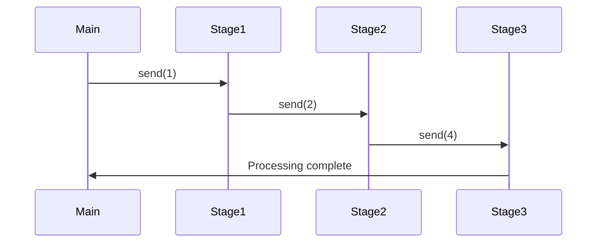

## 3.9 Concurrency and Parallelism with `std.concurrency` and `std.parallelism`

Concurrency and parallelism are critical concepts in modern software development, enabling applications to perform multiple tasks simultaneously and efficiently utilize multi-core processors. The D programming language provides robust support for these paradigms through its `std.concurrency` and `std.parallelism` modules. In this section, we will explore how to leverage these modules to build high-performance, concurrent, and parallel applications.

### Message Passing Concurrency with `std.concurrency`

The `std.concurrency` module in D facilitates message-passing concurrency, a model that avoids shared state and the complexities of locks and mutexes. Instead, it uses lightweight threads called fibers and channels for communication between threads.

#### Key Concepts

- **Fibers**: Lightweight threads managed by the D runtime, allowing for efficient context switching.
- **Channels**: Used for communication between fibers, ensuring safe data exchange without shared state.

#### Implementing Message Passing

Let's start with a simple example to demonstrate message passing using `std.concurrency`.

```d
import std.stdio;
import std.concurrency;

void worker() {
    auto tid = thisTid;
    receive((string msg) {
        writeln("Worker received: ", msg);
        send(tid, "Acknowledged: " ~ msg);
    });
}

void main() {
    auto workerTid = spawn(&worker);
    send(workerTid, "Hello, Worker!");
    receive((string response) {
        writeln("Main received: ", response);
    });
}
```

**Explanation:**

- **`spawn(&worker)`**: Creates a new fiber running the `worker` function.
- **`send(workerTid, "Hello, Worker!")`**: Sends a message to the worker fiber.
- **`receive(...)`**: Waits for a message from the worker fiber.

### Parallel Algorithms with `std.parallelism`

The `std.parallelism` module provides tools for data parallelism, allowing you to perform operations on collections of data in parallel. This is particularly useful for CPU-bound tasks that can be divided into smaller, independent tasks.

#### Key Concepts

- **Task Pool**: Manages a pool of worker threads to execute tasks concurrently.
- **Parallel Operations**: Functions like `parallel` and `taskPool` enable parallel execution of operations on collections.

#### Implementing Parallel Algorithms

Consider a scenario where we need to compute the sum of squares of a large array. Using `std.parallelism`, we can parallelize this computation.

```d
import std.stdio;
import std.parallelism;

void main() {
    auto data = iota(1, 1000000).array;
    auto result = taskPool.reduce!"a + b"((a, b) => a + b * b, data);
    writeln("Sum of squares: ", result);
}
```

**Explanation:**

- **`taskPool.reduce!"a + b"`**: Performs a parallel reduction on the data array, computing the sum of squares.
- **`iota(1, 1000000).array`**: Generates an array of numbers from 1 to 999,999.

### Synchronization Primitives

While message passing and data parallelism reduce the need for explicit synchronization, there are scenarios where synchronization primitives like locks and atomic operations are necessary.

#### Locks and Mutexes

D provides traditional synchronization primitives such as locks and mutexes for scenarios where shared state is unavoidable.

```d
import std.stdio;
import core.sync.mutex;

void main() {
    Mutex mutex;
    int sharedResource = 0;

    auto increment = () {
        synchronized(mutex) {
            sharedResource++;
        }
    };

    auto threads = new Thread[10];
    foreach (i; 0 .. 10) {
        threads[i] = new Thread(&increment);
        threads[i].start();
    }

    foreach (t; threads) {
        t.join();
    }

    writeln("Final value: ", sharedResource);
}
```

**Explanation:**

- **`Mutex`**: Provides mutual exclusion to protect shared resources.
- **`synchronized(mutex)`**: Ensures that only one thread can access the critical section at a time.

#### Atomic Operations

For fine-grained synchronization, atomic operations can be used to perform lock-free updates to shared variables.

```d
import std.stdio;
import core.atomic;

void main() {
    shared int counter = 0;

    auto increment = () {
        for (int i = 0; i < 1000; i++) {
            atomicOp!"+="(counter, 1);
        }
    };

    auto threads = new Thread[10];
    foreach (i; 0 .. 10) {
        threads[i] = new Thread(&increment);
        threads[i].start();
    }

    foreach (t; threads) {
        t.join();
    }

    writeln("Final counter value: ", counter);
}
```

**Explanation:**

- **`atomicOp!"+="(counter, 1)`**: Atomically increments the counter by 1, ensuring thread safety.

### Patterns for Concurrency

Designing concurrent systems requires careful consideration of patterns that leverage D's concurrency features effectively.

#### Actor Model

The actor model is a natural fit for message-passing concurrency, where each actor is an independent unit of computation that communicates with other actors via messages.

```d
import std.stdio;
import std.concurrency;

class Actor {
    Tid tid;

    this() {
        tid = spawn(&this.run);
    }

    void run() {
        receive((string msg) {
            writeln("Actor received: ", msg);
            send(thisTid, "Processed: " ~ msg);
        });
    }

    void sendMessage(string msg) {
        send(tid, msg);
    }
}

void main() {
    auto actor = new Actor();
    actor.sendMessage("Hello, Actor!");
    receive((string response) {
        writeln("Main received: ", response);
    });
}
```

**Explanation:**

- **`Actor`**: Encapsulates state and behavior, communicating via messages.
- **`sendMessage`**: Sends a message to the actor.

#### Pipeline Pattern

The pipeline pattern is useful for processing data in stages, where each stage can be executed concurrently.

```d
import std.stdio;
import std.concurrency;

void stage1(Tid nextStage) {
    receive((int data) {
        writeln("Stage 1 processing: ", data);
        send(nextStage, data + 1);
    });
}

void stage2(Tid nextStage) {
    receive((int data) {
        writeln("Stage 2 processing: ", data);
        send(nextStage, data * 2);
    });
}

void stage3() {
    receive((int data) {
        writeln("Stage 3 processing: ", data);
    });
}

void main() {
    auto tid3 = spawn(&stage3);
    auto tid2 = spawn(&stage2, tid3);
    auto tid1 = spawn(&stage1, tid2);

    send(tid1, 1);
}
```

**Explanation:**

- **`stage1`, `stage2`, `stage3`**: Each stage processes data and sends it to the next stage.
- **`send(tid1, 1)`**: Initiates the pipeline with data.

### Visualizing Concurrency and Parallelism

To better understand the flow of data and control in concurrent and parallel systems, let's visualize the pipeline pattern using a sequence diagram.



**Description**: This diagram illustrates the flow of data through the pipeline, with each stage processing and passing data to the next.

### Try It Yourself

Experiment with the examples provided by modifying the data or adding additional stages to the pipeline. Try implementing a new pattern using `std.concurrency` or `std.parallelism` to deepen your understanding.

### References and Links

- [D Language Concurrency](https://dlang.org/phobos/std_concurrency.html)
- [D Language Parallelism](https://dlang.org/phobos/std_parallelism.html)
- [Actor Model](https://en.wikipedia.org/wiki/Actor_model)

### Knowledge Check

- What are the benefits of using message-passing concurrency over shared-state concurrency?
- How does the `taskPool` in `std.parallelism` improve performance for data parallelism?
- What are the differences between locks and atomic operations?

### Embrace the Journey

Remember, mastering concurrency and parallelism is a journey. As you continue to explore these concepts, you'll gain the skills to build more efficient and scalable applications. Stay curious, keep experimenting, and enjoy the process!

## Quiz Time!



### What is the primary advantage of message-passing concurrency?

- [x] Avoids shared state complexities
- [ ] Requires fewer resources
- [ ] Easier to implement than shared-state concurrency
- [ ] Provides better performance than parallelism

> **Explanation:** Message-passing concurrency avoids the complexities of shared state, making it easier to manage concurrent tasks without locks.

### Which module in D is used for data parallelism?

- [ ] std.concurrency
- [x] std.parallelism
- [ ] std.data
- [ ] std.async

> **Explanation:** The `std.parallelism` module is used for data parallelism, allowing operations on collections to be executed in parallel.

### What is a fiber in D's concurrency model?

- [x] A lightweight thread managed by the D runtime
- [ ] A type of lock for synchronization
- [ ] A data structure for parallel processing
- [ ] A communication channel between threads

> **Explanation:** A fiber is a lightweight thread managed by the D runtime, enabling efficient context switching.

### How does `taskPool.reduce` function in `std.parallelism`?

- [x] Performs a parallel reduction on a collection
- [ ] Spawns new threads for each task
- [ ] Synchronizes access to shared resources
- [ ] Manages communication between fibers

> **Explanation:** The `taskPool.reduce` function performs a parallel reduction on a collection, aggregating results efficiently.

### What is the role of a mutex in concurrent programming?

- [x] Provides mutual exclusion to protect shared resources
- [ ] Facilitates message passing between threads
- [ ] Manages task scheduling
- [ ] Increases the speed of parallel computations

> **Explanation:** A mutex provides mutual exclusion, ensuring that only one thread can access a shared resource at a time.

### Which pattern is naturally suited for message-passing concurrency?

- [x] Actor Model
- [ ] Singleton Pattern
- [ ] Factory Pattern
- [ ] Observer Pattern

> **Explanation:** The actor model is naturally suited for message-passing concurrency, where actors communicate via messages.

### What is the purpose of atomic operations in concurrency?

- [x] Perform lock-free updates to shared variables
- [ ] Increase the speed of task execution
- [ ] Simplify message-passing logic
- [ ] Manage thread lifecycle

> **Explanation:** Atomic operations perform lock-free updates to shared variables, ensuring thread safety without locks.

### How can the pipeline pattern benefit concurrent systems?

- [x] Allows data to be processed in stages concurrently
- [ ] Reduces the need for synchronization
- [ ] Simplifies error handling
- [ ] Increases the number of threads

> **Explanation:** The pipeline pattern allows data to be processed in stages concurrently, improving throughput and efficiency.

### What is the main benefit of using `std.concurrency` for concurrency?

- [x] Simplifies communication between threads
- [ ] Provides better performance than parallelism
- [ ] Reduces memory usage
- [ ] Increases the number of available threads

> **Explanation:** `std.concurrency` simplifies communication between threads through message passing, avoiding shared state complexities.

### True or False: `std.parallelism` is used for message-passing concurrency.

- [ ] True
- [x] False

> **Explanation:** False. `std.parallelism` is used for data parallelism, not message-passing concurrency.


