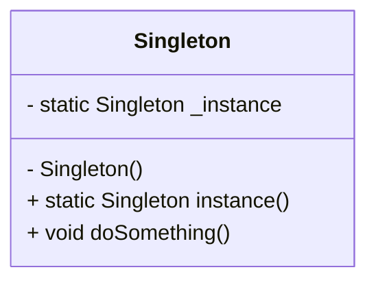

## 4.1 Singleton Pattern in D

In the realm of software design patterns, the Singleton Pattern stands out as a fundamental creational pattern. Its primary purpose is to ensure that a class has only one instance and provides a global point of access to that instance. This pattern is particularly useful in scenarios where a single object is needed to coordinate actions across the system, such as in resource management or logging systems.

### Purpose

The Singleton Pattern is designed to:

- **Ensure a single instance**: Guarantee that a class has only one instance throughout the application's lifecycle.
- **Provide global access**: Offer a global point of access to the instance, allowing it to be easily accessed from anywhere in the application.

### Implementing Singleton in D

The D programming language offers unique features that facilitate the implementation of the Singleton Pattern, such as module-level variables, thread safety mechanisms, and lazy initialization.

#### Module-Level Variables

In D, modules can be used to create single-instance modules. By leveraging D's module system, we can define a variable at the module level that acts as the singleton instance.

```d
// singleton.d
module singleton;

class Singleton {
    private static Singleton _instance;

    private this() {
        // Private constructor to prevent instantiation
    }

    public static Singleton instance() {
        if (_instance is null) {
            _instance = new Singleton();
        }
        return _instance;
    }

    public void doSomething() {
        writeln("Singleton instance is doing something.");
    }
}
```

In this example, the `Singleton` class has a private static variable `_instance` that holds the singleton instance. The constructor is private to prevent direct instantiation. The `instance` method checks if `_instance` is `null` and creates a new instance if necessary, ensuring that only one instance exists.

#### Thread Safety

When implementing the Singleton Pattern in a multithreaded environment, thread safety becomes a crucial consideration. D provides the `shared` and `synchronized` keywords to manage concurrency.

```d
// thread_safe_singleton.d
module thread_safe_singleton;

class ThreadSafeSingleton {
    private static shared ThreadSafeSingleton _instance;
    private static shared bool _initialized = false;

    private this() {
        // Private constructor
    }

    public static ThreadSafeSingleton instance() {
        synchronized {
            if (!_initialized) {
                _instance = new ThreadSafeSingleton();
                _initialized = true;
            }
        }
        return _instance;
    }

    public void doSomething() {
        writeln("Thread-safe Singleton instance is doing something.");
    }
}
```

In this code, the `synchronized` block ensures that the singleton instance is created safely in a multithreaded environment. The `shared` keyword indicates that the variables are shared among threads.

#### Lazy Initialization

Lazy initialization defers the creation of the singleton instance until it is needed, optimizing resource usage.

```d
// lazy_singleton.d
module lazy_singleton;

class LazySingleton {
    private static LazySingleton _instance;

    private this() {
        // Private constructor
    }

    public static LazySingleton instance() {
        if (_instance is null) {
            _instance = new LazySingleton();
        }
        return _instance;
    }

    public void doSomething() {
        writeln("Lazy Singleton instance is doing something.");
    }
}
```

This example demonstrates lazy initialization by checking if `_instance` is `null` before creating the singleton instance.

### Monostate Pattern

The Monostate Pattern is an alternative to the Singleton Pattern that ensures all instances of a class share the same state without enforcing a single instance.

#### Shared State

In the Monostate Pattern, the state is shared among all instances through static members.

```d
// monostate.d
module monostate;

class Monostate {
    private static int _sharedState;

    public void setSharedState(int value) {
        _sharedState = value;
    }

    public int getSharedState() {
        return _sharedState;
    }
}
```

In this example, the `_sharedState` variable is static, meaning it is shared among all instances of the `Monostate` class.

#### Implementation Techniques

The Monostate Pattern can be implemented using static members to hold shared state, allowing multiple instances to exist while maintaining a consistent state across them.

### Use Cases and Examples

The Singleton Pattern is widely used in various scenarios, such as:

- **Resource Managers**: Managing database connections, configuration settings, or any resource that should be centralized.
- **Logging Systems**: Providing a single point of access for logging, ensuring consistent logging behavior across the application.

#### Resource Manager Example

```d
// resource_manager.d
module resource_manager;

class ResourceManager {
    private static ResourceManager _instance;

    private this() {
        // Initialize resources
    }

    public static ResourceManager instance() {
        if (_instance is null) {
            _instance = new ResourceManager();
        }
        return _instance;
    }

    public void manageResources() {
        writeln("Managing resources.");
    }
}
```

#### Logging System Example

```d
// logger.d
module logger;

class Logger {
    private static Logger _instance;

    private this() {
        // Initialize logger
    }

    public static Logger instance() {
        if (_instance is null) {
            _instance = new Logger();
        }
        return _instance;
    }

    public void log(string message) {
        writeln("Log: ", message);
    }
}
```

### Design Considerations

When implementing the Singleton Pattern in D, consider the following:

- **Thread Safety**: Ensure that the singleton instance is created safely in a multithreaded environment.
- **Lazy Initialization**: Use lazy initialization to optimize resource usage.
- **Global Access**: Provide a global point of access to the singleton instance.

### Differences and Similarities

The Singleton Pattern is often confused with the Monostate Pattern. While both patterns ensure a single point of access, the Monostate Pattern allows multiple instances to exist, sharing the same state through static members.

### Visualizing Singleton Pattern

To better understand the Singleton Pattern, let's visualize its structure using a class diagram.



This diagram illustrates the Singleton class with a private static variable `_instance`, a private constructor, and a public static method `instance` that returns the singleton instance.

### Try It Yourself

Experiment with the Singleton Pattern by modifying the code examples:

- **Add Methods**: Extend the singleton classes with additional methods to perform different tasks.
- **Test Thread Safety**: Create a multithreaded application to test the thread safety of your singleton implementation.
- **Implement Monostate**: Convert the Singleton Pattern to a Monostate Pattern and observe the differences.

### References and Links

For further reading on the Singleton Pattern and its implementation in D, consider the following resources:

- [D Programming Language Documentation](https://dlang.org/)
- [Design Patterns: Elements of Reusable Object-Oriented Software](https://en.wikipedia.org/wiki/Design_Patterns)

### Knowledge Check

To reinforce your understanding of the Singleton Pattern in D, try answering the following questions:

## Quiz Time!



### What is the primary purpose of the Singleton Pattern?

- [x] Ensure a class has only one instance and provide a global point of access.
- [ ] Allow multiple instances of a class with shared state.
- [ ] Optimize memory usage by sharing instances.
- [ ] Facilitate communication between objects.

> **Explanation:** The Singleton Pattern ensures a class has only one instance and provides a global point of access to it.

### How can you implement thread safety in a Singleton Pattern in D?

- [x] Use `synchronized` blocks.
- [ ] Use `volatile` keyword.
- [ ] Use `static` keyword.
- [ ] Use `final` keyword.

> **Explanation:** The `synchronized` block ensures that the singleton instance is created safely in a multithreaded environment.

### What is lazy initialization in the context of the Singleton Pattern?

- [x] Deferring the creation of the instance until it is needed.
- [ ] Creating the instance at the start of the program.
- [ ] Initializing all variables at once.
- [ ] Using static variables for initialization.

> **Explanation:** Lazy initialization defers the creation of the singleton instance until it is needed, optimizing resource usage.

### What is the Monostate Pattern?

- [x] A pattern where all instances share the same state without enforcing a single instance.
- [ ] A pattern that ensures a class has only one instance.
- [ ] A pattern for managing multiple instances of a class.
- [ ] A pattern for optimizing memory usage.

> **Explanation:** The Monostate Pattern ensures all instances share the same state through static members, without enforcing a single instance.

### Which keyword in D indicates that variables are shared among threads?

- [x] `shared`
- [ ] `static`
- [ ] `synchronized`
- [ ] `volatile`

> **Explanation:** The `shared` keyword in D indicates that variables are shared among threads.

### What is the main difference between Singleton and Monostate Patterns?

- [x] Singleton enforces a single instance; Monostate allows multiple instances with shared state.
- [ ] Singleton allows multiple instances; Monostate enforces a single instance.
- [ ] Singleton is for resource management; Monostate is for logging.
- [ ] Singleton uses static variables; Monostate uses instance variables.

> **Explanation:** The Singleton Pattern enforces a single instance, while the Monostate Pattern allows multiple instances with shared state.

### In which scenarios is the Singleton Pattern commonly used?

- [x] Resource managers and logging systems.
- [ ] User interface components and animations.
- [ ] Data processing and analysis.
- [ ] Network communication and protocols.

> **Explanation:** The Singleton Pattern is commonly used in resource managers and logging systems to provide a single point of access.

### How does the Singleton Pattern optimize resource usage?

- [x] By ensuring only one instance is created.
- [ ] By sharing instances among classes.
- [ ] By using static variables.
- [ ] By deferring initialization.

> **Explanation:** The Singleton Pattern optimizes resource usage by ensuring only one instance is created, reducing memory overhead.

### What is the role of the `instance` method in the Singleton Pattern?

- [x] To provide a global point of access to the singleton instance.
- [ ] To initialize all variables in the class.
- [ ] To manage resource allocation.
- [ ] To handle exceptions.

> **Explanation:** The `instance` method provides a global point of access to the singleton instance, ensuring only one instance exists.

### True or False: The Singleton Pattern can be implemented using module-level variables in D.

- [x] True
- [ ] False

> **Explanation:** True. In D, module-level variables can be used to implement the Singleton Pattern by defining a variable at the module level that acts as the singleton instance.



Remember, mastering the Singleton Pattern in D is just the beginning. As you continue your journey, you'll discover more complex patterns and techniques that will enhance your software design skills. Keep experimenting, stay curious, and enjoy the journey!
