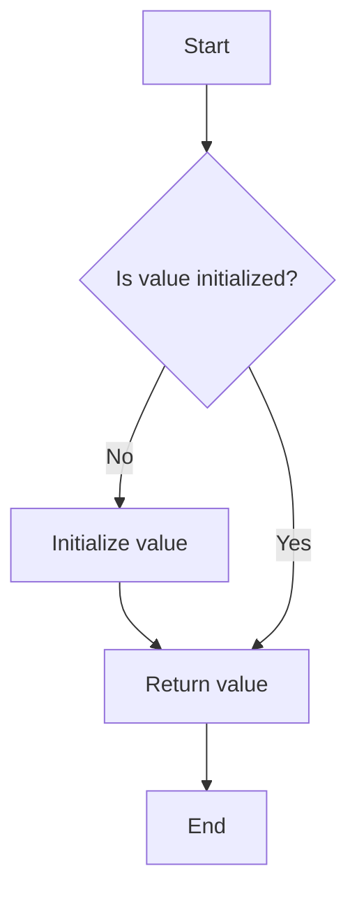

## 4.10 Lazy Initialization and Memoization

In the realm of software engineering, efficiency and performance are paramount. Two powerful techniques that help achieve these goals are **Lazy Initialization** and **Memoization**. These techniques are particularly useful in systems programming, where resource management and performance optimization are critical. In this section, we will delve into these concepts, explore their implementation in the D programming language, and provide practical examples to illustrate their benefits.

### Purpose

Lazy Initialization and Memoization serve the purpose of deferring the creation of an object or the calculation of a value until it is actually needed. This approach can lead to significant performance improvements by avoiding unnecessary computations and resource allocations.

### Implementing Lazy Initialization in D

Lazy Initialization is a design pattern that delays the instantiation of an object or the execution of a computation until it is required. This can be particularly useful in scenarios where the initialization is resource-intensive or when the object may not be needed at all.

#### Lazy Variables

In D, the `lazy` keyword can be used to define lazy parameters. This allows you to defer the evaluation of an argument until it is accessed within the function. Here's a simple example:

```d
import std.stdio;

void printLazy(lazy int value) {
    writeln("Before accessing lazy value");
    writeln("Lazy value: ", value);
    writeln("After accessing lazy value");
}

void main() {
    int expensiveComputation() {
        writeln("Performing expensive computation...");
        return 42;
    }

    printLazy(expensiveComputation());
}
```

**Explanation**: In this example, the `expensiveComputation` function is not executed until the `value` is accessed within the `printLazy` function. This demonstrates how lazy parameters can defer computation.

#### Delegates and Functions

Another approach to implementing lazy initialization in D is by using delegates or functions to wrap the initialization logic. This allows you to control when the initialization occurs.

```d
import std.stdio;

class LazyObject {
    private int _value;
    private bool _initialized = false;
    private int delegate() _initializer;

    this(int delegate() initializer) {
        _initializer = initializer;
    }

    int getValue() {
        if (!_initialized) {
            _value = _initializer();
            _initialized = true;
        }
        return _value;
    }
}

void main() {
    auto lazyObj = new LazyObject(() {
        writeln("Initializing value...");
        return 100;
    });

    writeln("Before accessing value");
    writeln("Value: ", lazyObj.getValue());
    writeln("After accessing value");
}
```

**Explanation**: In this example, the `LazyObject` class uses a delegate to defer the initialization of `_value` until `getValue` is called. This pattern is useful for managing resources that are expensive to create.

### Memoization

Memoization is a technique used to cache the results of expensive function calls and return the cached result when the same inputs occur again. This can significantly improve performance, especially for functions with expensive computations or recursive calls.

#### Caching Results

To implement memoization manually, you can use a data structure like a dictionary to store the results of function calls.

```d
import std.stdio;
import std.typecons;

int fibonacci(int n, ref int[int] cache) {
    if (n <= 1) return n;
    if (!cache.exists(n)) {
        cache[n] = fibonacci(n - 1, cache) + fibonacci(n - 2, cache);
    }
    return cache[n];
}

void main() {
    int[int] cache;
    writeln("Fibonacci(10): ", fibonacci(10, cache));
}
```

**Explanation**: This example demonstrates a simple memoization technique for the Fibonacci sequence. The `cache` stores previously computed results, avoiding redundant calculations.

#### Using `std.functional.memoize`

D provides a built-in memoization utility in the `std.functional` module. This can be used to automatically cache function results without manually managing a cache.

```d
import std.stdio;
import std.functional;

int fibonacci(int n) {
    if (n <= 1) return n;
    return fibonacci(n - 1) + fibonacci(n - 2);
}

void main() {
    auto memoizedFibonacci = memoize!fibonacci;
    writeln("Memoized Fibonacci(10): ", memoizedFibonacci(10));
}
```

**Explanation**: The `memoize` function wraps the `fibonacci` function, caching its results. This simplifies the implementation and improves performance.

### Use Cases and Examples

Lazy Initialization and Memoization are applicable in various scenarios, particularly in performance optimization and resource management.

#### Performance Optimization

By deferring computations and caching results, you can avoid unnecessary processing and improve the efficiency of your applications. This is especially beneficial in systems programming, where performance is crucial.

#### Resource Loading

Lazy Initialization is ideal for deferring the loading of heavy resources, such as large files or network data, until they are actually needed. This can reduce the startup time of applications and improve responsiveness.

### Visualizing Lazy Initialization and Memoization

To better understand these concepts, let's visualize the process of lazy initialization and memoization using a flowchart.



**Description**: This flowchart illustrates the lazy initialization process. The value is only initialized if it hasn't been already, ensuring that resources are used efficiently.

### Design Considerations

When implementing Lazy Initialization and Memoization, consider the following:

- **Thread Safety**: Ensure that your implementation is thread-safe if accessed from multiple threads.
- **Memory Usage**: Be mindful of the memory overhead introduced by caching in memoization.
- **Complexity**: Avoid overcomplicating your code with lazy initialization if the performance gains are negligible.

### Differences and Similarities

Lazy Initialization and Memoization are often confused due to their similar goals of optimizing performance. However, they differ in their approach:

- **Lazy Initialization** focuses on deferring the creation of objects or execution of computations until needed.
- **Memoization** focuses on caching the results of function calls to avoid redundant calculations.

### Try It Yourself

Experiment with the provided code examples by modifying the initialization logic or the function being memoized. Try implementing lazy initialization for a different resource or memoizing a different recursive function.

### References and Links

- [D Programming Language Documentation](https://dlang.org/)
- [Memoization in D](https://dlang.org/phobos/std_functional.html#.memoize)
- [Lazy Evaluation](https://en.wikipedia.org/wiki/Lazy_evaluation)

### Knowledge Check

- What is the primary purpose of Lazy Initialization?
- How does memoization improve performance?
- What are some potential drawbacks of using memoization?

### Embrace the Journey

Remember, mastering these techniques is just the beginning. As you continue to explore the D programming language, you'll discover more ways to optimize your code and improve performance. Keep experimenting, stay curious, and enjoy the journey!

## Quiz Time!



### What is the primary purpose of Lazy Initialization?

- [x] To defer the creation of an object or calculation until it is needed
- [ ] To immediately initialize all objects at program start
- [ ] To cache results of function calls
- [ ] To optimize memory usage

> **Explanation:** Lazy Initialization defers the creation of an object or calculation until it is actually needed, optimizing resource usage.

### How does memoization improve performance?

- [x] By caching results of expensive function calls
- [ ] By deferring initialization
- [ ] By reducing memory usage
- [ ] By increasing the number of computations

> **Explanation:** Memoization caches the results of expensive function calls, avoiding redundant calculations and improving performance.

### Which D keyword is used for lazy parameters?

- [x] lazy
- [ ] defer
- [ ] cache
- [ ] memoize

> **Explanation:** The `lazy` keyword in D is used to define lazy parameters, deferring their evaluation until accessed.

### What is a potential drawback of memoization?

- [x] Increased memory usage
- [ ] Slower execution
- [ ] Immediate initialization
- [ ] Reduced code readability

> **Explanation:** Memoization can increase memory usage due to caching of function results.

### What is the difference between Lazy Initialization and Memoization?

- [x] Lazy Initialization defers creation; Memoization caches results
- [ ] Both defer creation
- [ ] Both cache results
- [ ] Lazy Initialization caches results; Memoization defers creation

> **Explanation:** Lazy Initialization defers the creation of objects, while Memoization caches the results of function calls.

### Which module in D provides a built-in memoization utility?

- [x] std.functional
- [ ] std.lazy
- [ ] std.cache
- [ ] std.memo

> **Explanation:** The `std.functional` module in D provides a built-in memoization utility.

### What should be considered when implementing Lazy Initialization?

- [x] Thread safety
- [ ] Immediate execution
- [ ] Reduced memory usage
- [ ] Increased complexity

> **Explanation:** Thread safety is important when implementing Lazy Initialization, especially in multi-threaded environments.

### How can Lazy Initialization improve application startup time?

- [x] By deferring the loading of heavy resources until needed
- [ ] By immediately loading all resources
- [ ] By caching all function results
- [ ] By reducing code complexity

> **Explanation:** Lazy Initialization can improve application startup time by deferring the loading of heavy resources until they are actually needed.

### What is a common use case for Memoization?

- [x] Caching results of recursive function calls
- [ ] Deferring object creation
- [ ] Reducing memory usage
- [ ] Immediate execution of functions

> **Explanation:** Memoization is commonly used to cache results of recursive function calls, improving performance.

### True or False: Lazy Initialization and Memoization are the same.

- [ ] True
- [x] False

> **Explanation:** Lazy Initialization and Memoization are different techniques; Lazy Initialization defers creation, while Memoization caches results.


