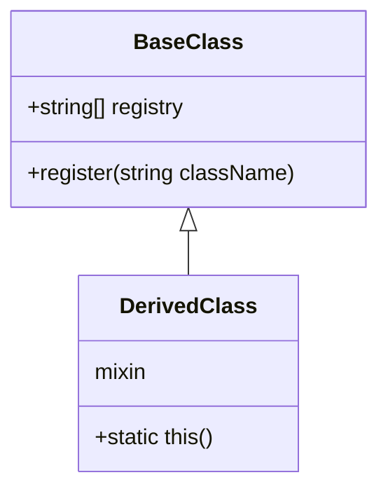

## 4.11 Using Mixins for Object Creation

In the realm of advanced systems programming, the D programming language offers a unique feature known as mixins, which can be leveraged to enhance object creation processes. Mixins in D allow developers to generate code dynamically at compile time, significantly reducing boilerplate and increasing flexibility. This section delves into the use of mixins for object creation, exploring their implementation, advantages, and practical use cases.

### Purpose of Mixins in Object Creation

The primary purpose of using mixins for object creation in D is to harness compile-time capabilities to generate object creation code dynamically. This approach not only reduces repetitive code but also enhances the flexibility and maintainability of the codebase. By centralizing object creation logic within mixins, developers can easily modify and extend object creation patterns without altering the core application logic.

### Implementing Object Creation with Mixins in D

#### String Mixins for Factories

String mixins in D allow for the inclusion of arbitrary code as a string, which is then compiled as part of the program. This feature is particularly useful for creating factory methods for various classes.

**Dynamic Class Registration**

One powerful use of string mixins is dynamic class registration. By mixing in code that adds classes to a registry, developers can automate the process of class registration in a factory.

```d
import std.stdio;

class BaseClass {
    static string[] registry;

    static void register(string className) {
        registry ~= className;
    }
}

mixin("class DerivedClass : BaseClass { static this() { register(\"DerivedClass\"); } }");

void main() {
    writeln(BaseClass.registry); // Output: ["DerivedClass"]
}
```

In this example, the `DerivedClass` is automatically registered in the `BaseClass` registry at compile time, demonstrating the power of string mixins for dynamic class registration.

**Custom Constructors**

Mixins can also be used to generate constructors with specific parameters or default values, allowing for more flexible object creation.

```d
import std.stdio;

class CustomClass {
    int value;

    mixin("this(int v) { value = v; }");
}

void main() {
    auto obj = new CustomClass(42);
    writeln(obj.value); // Output: 42
}
```

Here, the constructor for `CustomClass` is generated using a mixin, allowing for custom initialization logic to be embedded directly into the class.

#### Template Mixins for Reusable Code

Template mixins provide a mechanism for embedding common object construction logic into multiple classes, promoting code reuse and modularity.

**Composable Mixins**

By combining multiple behaviors or properties into a single class through mixins, developers can create highly composable and flexible object hierarchies.

```d
import std.stdio;

mixin template Logger() {
    void log(string message) {
        writeln("Log: ", message);
    }
}

class Component {
    mixin Logger;
}

void main() {
    auto comp = new Component();
    comp.log("Component initialized."); // Output: Log: Component initialized.
}
```

In this example, the `Logger` mixin is used to add logging capabilities to the `Component` class, demonstrating the composability of mixins.

**Parameterized Mixins**

Parameterized mixins allow for the customization of object creation behavior by passing parameters to the mixin.

```d
import std.stdio;

mixin template Initializer(int defaultValue) {
    int value = defaultValue;
}

class Configurable {
    mixin Initializer!(10);
}

void main() {
    auto config = new Configurable();
    writeln(config.value); // Output: 10
}
```

The `Initializer` mixin is parameterized with a default value, allowing for flexible initialization of the `Configurable` class.

### Advantages of Using Mixins

Using mixins for object creation in D offers several advantages:

- **Reduce Boilerplate**: Mixins eliminate repetitive code by generating it at compile time, leading to cleaner and more maintainable codebases.
- **Increase Flexibility**: Object creation logic can be easily modified by changing the mixin code, allowing for rapid adaptation to changing requirements.
- **Enhance Maintainability**: Centralizing object creation patterns in mixins simplifies updates and debugging, as changes are localized to the mixin code.

### Use Cases and Examples

#### Plugin Systems

Mixins can be used to dynamically generate code for instantiating plugin classes discovered at compile time. This approach allows for flexible and extensible plugin architectures.

```d
import std.stdio;

interface Plugin {
    void execute();
}

mixin("class PluginA : Plugin { void execute() { writeln(\"PluginA executed.\"); } }");
mixin("class PluginB : Plugin { void execute() { writeln(\"PluginB executed.\"); } }");

void main() {
    Plugin[] plugins = [new PluginA(), new PluginB()];
    foreach (plugin; plugins) {
        plugin.execute();
    }
    // Output:
    // PluginA executed.
    // PluginB executed.
}
```

In this example, plugins are dynamically generated and executed, showcasing the power of mixins in plugin systems.

#### Domain-Specific Languages (DSLs)

Mixins can facilitate the creation of objects based on DSL definitions by mixing in generated code, enabling the development of highly specialized applications.

```d
import std.stdio;

mixin("class DSLObject { string name; this(string n) { name = n; } }");

void main() {
    auto obj = new DSLObject("Example");
    writeln(obj.name); // Output: Example
}
```

Here, a DSL object is created using a mixin, demonstrating how mixins can be used to generate code based on DSL definitions.

#### Serialization/Deserialization

Automating the creation of objects from serialized data formats can be achieved by generating constructor code through mixins.

```d
import std.stdio;

mixin("class Serializable { int id; this(int i) { id = i; } }");

void main() {
    auto obj = new Serializable(123);
    writeln(obj.id); // Output: 123
}
```

In this example, the `Serializable` class is generated with a constructor for deserialization, illustrating the use of mixins in serialization scenarios.

#### Configuration-Based Object Creation

Mixins can generate objects based on compile-time configuration parameters or meta-programming, allowing for highly configurable applications.

```d
import std.stdio;

enum ConfigValue = 42;

mixin("class ConfiguredObject { int value = " ~ ConfigValue.stringof ~ "; }");

void main() {
    auto obj = new ConfiguredObject();
    writeln(obj.value); // Output: 42
}
```

The `ConfiguredObject` class is generated with a value based on a compile-time configuration, showcasing the flexibility of mixins in configuration-based object creation.

### Visualizing Mixins in Object Creation

To better understand the role of mixins in object creation, let's visualize the process using a class diagram.



**Diagram Description**: This class diagram illustrates the relationship between `BaseClass` and `DerivedClass`, where `DerivedClass` is dynamically generated using a mixin. The mixin adds the `DerivedClass` to the `BaseClass` registry, demonstrating dynamic class registration.

### Design Considerations

When using mixins for object creation, consider the following:

- **Complexity**: While mixins can reduce boilerplate, they can also introduce complexity if overused. Use them judiciously to maintain code readability.
- **Debugging**: Debugging mixin-generated code can be challenging. Ensure that mixin code is well-documented and tested.
- **Compile-Time Overhead**: Mixins are evaluated at compile time, which can increase compilation time for large projects. Balance the benefits of mixins with potential compile-time costs.

### Differences and Similarities

Mixins are often compared to inheritance and interfaces. While all three can be used to share code and behavior, mixins offer unique advantages in terms of code generation and flexibility. Unlike inheritance, mixins do not establish a parent-child relationship, allowing for more modular and composable code.

### Try It Yourself

To deepen your understanding of mixins in D, try modifying the code examples provided:

- **Experiment with Different Mixins**: Create your own mixins to add new behaviors or properties to classes.
- **Combine Multiple Mixins**: Use multiple mixins in a single class to explore composability.
- **Parameterize Mixins**: Pass different parameters to mixins to customize object creation logic.

### Knowledge Check

Reflect on the following questions to reinforce your understanding:

- How do mixins reduce boilerplate in object creation?
- What are the advantages of using parameterized mixins?
- How can mixins be used in plugin systems?

### Embrace the Journey

Remember, mastering mixins in D is just the beginning. As you continue to explore the D programming language, you'll discover even more powerful features and patterns. Keep experimenting, stay curious, and enjoy the journey!

## Quiz Time!



### What is the primary purpose of using mixins for object creation in D?

- [x] To generate object creation code dynamically at compile time
- [ ] To replace inheritance entirely
- [ ] To eliminate the need for constructors
- [ ] To enforce strict type checking

> **Explanation:** Mixins in D are used to dynamically generate object creation code at compile time, reducing boilerplate and increasing flexibility.

### How do string mixins facilitate dynamic class registration?

- [x] By mixing in code that adds classes to a registry
- [ ] By replacing class constructors
- [ ] By enforcing compile-time type checks
- [ ] By generating runtime exceptions

> **Explanation:** String mixins can include code that registers classes in a registry, automating the process of class registration.

### What is a key advantage of using template mixins?

- [x] They promote code reuse and modularity
- [ ] They eliminate the need for interfaces
- [ ] They enforce strict compile-time checks
- [ ] They replace all inheritance hierarchies

> **Explanation:** Template mixins allow for embedding common logic into multiple classes, promoting code reuse and modularity.

### How can mixins enhance maintainability?

- [x] By centralizing object creation patterns
- [ ] By eliminating all runtime errors
- [ ] By enforcing strict coding standards
- [ ] By generating runtime logs

> **Explanation:** Mixins centralize object creation patterns, making updates and debugging easier.

### In what scenario are mixins particularly useful?

- [x] Plugin systems
- [ ] Low-level memory management
- [ ] Network protocol implementation
- [ ] GUI design

> **Explanation:** Mixins are useful in plugin systems for dynamically generating code to instantiate plugin classes.

### What is a potential drawback of using mixins?

- [x] Increased complexity if overused
- [ ] Reduced code flexibility
- [ ] Increased runtime errors
- [ ] Decreased code readability

> **Explanation:** While mixins reduce boilerplate, they can introduce complexity if overused, affecting code readability.

### How can mixins be used in serialization/deserialization?

- [x] By generating constructor code for deserialization
- [ ] By enforcing runtime type checks
- [ ] By replacing serialization libraries
- [ ] By generating runtime exceptions

> **Explanation:** Mixins can automate the creation of objects from serialized data formats by generating constructor code.

### What is a key consideration when using mixins?

- [x] Compile-time overhead
- [ ] Runtime memory usage
- [ ] Network latency
- [ ] User interface design

> **Explanation:** Mixins are evaluated at compile time, which can increase compilation time for large projects.

### How do parameterized mixins enhance flexibility?

- [x] By allowing customization of object creation logic
- [ ] By enforcing strict type safety
- [ ] By eliminating all compile-time errors
- [ ] By generating runtime logs

> **Explanation:** Parameterized mixins allow for customization of object creation logic, enhancing flexibility.

### Mixins are often compared to which other programming concepts?

- [x] Inheritance and interfaces
- [ ] Pointers and references
- [ ] Arrays and lists
- [ ] Loops and conditionals

> **Explanation:** Mixins are compared to inheritance and interfaces as they all can be used to share code and behavior.


