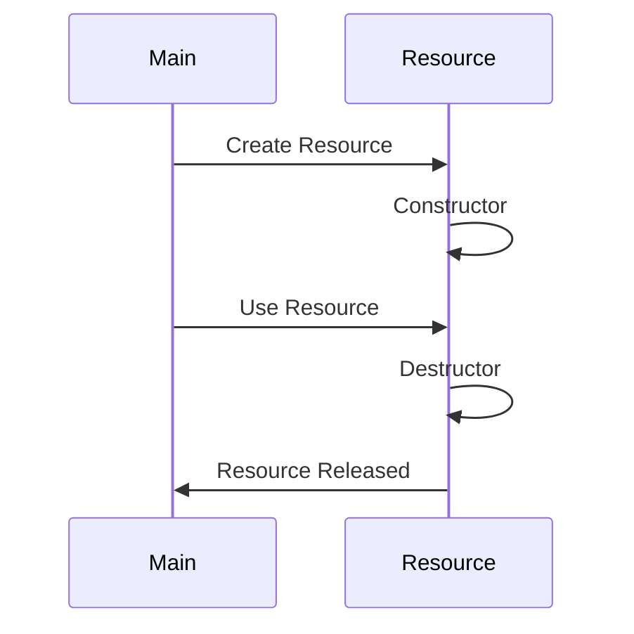

## 4.12 Resource Acquisition Is Initialization (RAII)

Resource Acquisition Is Initialization (RAII) is a powerful programming idiom that ensures resources are properly managed by tying their lifetimes to the lifetimes of objects. This approach is particularly useful in systems programming, where resource management is critical to performance and reliability. In this section, we will delve into the implementation of RAII in the D programming language, exploring its nuances and best practices.

### Purpose of RAII

The primary purpose of RAII is to manage resources such as memory, file handles, and locks by associating their acquisition with object initialization and their release with object destruction. This ensures that resources are automatically cleaned up when they are no longer needed, reducing the risk of resource leaks and improving exception safety.

### Implementing RAII in D

#### Constructors and Destructors

In D, constructors and destructors play a crucial role in implementing RAII. Let's explore how they work:

- **Resource Allocation in Constructors**: Resources are acquired when an object is created. This is typically done in the constructor, where you can open files, allocate memory, or acquire locks.

- **Resource Deallocation in Destructors**: Resources are released when the object's lifetime ends. The destructor is responsible for cleaning up resources, ensuring no leaks occur.

##### `struct` vs. `class`

- **Value Types (`struct`)**: In D, structs are value types, and their destructors are called deterministically when they go out of scope. This makes structs ideal for RAII, as you can be certain that resources will be released at the end of the scope.

- **Reference Types (`class`)**: Classes in D are reference types, and their destructors are called by the garbage collector. This means that destruction is not deterministic, which can be a drawback for RAII. However, you can use the `scope` keyword to ensure deterministic destruction.

##### Using `scope` Classes

The `scope` keyword in D allows you to allocate classes on the stack, ensuring that their destructors are called deterministically when they go out of scope. This is useful for implementing RAII with classes.

```d
import std.stdio;

class ScopedResource {
    this() {
        writeln("Resource acquired");
    }

    ~this() {
        writeln("Resource released");
    }
}

void main() {
    scope ScopedResource resource = new ScopedResource();
    writeln("Using resource");
}
```

In this example, the `ScopedResource` class is allocated on the stack using the `scope` keyword. Its destructor is called automatically when it goes out of scope, ensuring that the resource is released.

#### Scope Guards

Scope guards in D provide a mechanism to execute code when leaving a scope, regardless of how the scope is exited. This is particularly useful for implementing RAII.

- **`scope(exit)`**: Executes code when leaving a scope, whether it's due to normal execution or an exception.

- **`scope(success)` and `scope(failure)`**: Executes code based on whether the scope was exited normally or due to an exception.

```d
import std.stdio;

void main() {
    writeln("Entering scope");

    scope(exit) writeln("Exiting scope");
    scope(success) writeln("Scope exited successfully");
    scope(failure) writeln("Scope exited with failure");

    writeln("Inside scope");
}
```

In this example, the `scope(exit)` block ensures that the message "Exiting scope" is printed when the scope is exited, regardless of the reason. The `scope(success)` and `scope(failure)` blocks provide additional granularity based on the outcome.

#### RAII vs. Garbage Collection

RAII and garbage collection are complementary approaches to resource management in D.

- **Complementary Approaches**: RAII is ideal for resources that require deterministic cleanup, such as file handles and locks. The garbage collector handles memory management, freeing you from manual memory deallocation.

- **`@nogc` Code**: In scenarios where you want to avoid the garbage collector, RAII becomes essential for managing resources. Writing `@nogc` code ensures that your program doesn't rely on the garbage collector, making RAII a critical tool.

#### Best Practices

- **Avoiding Resource Leaks**: Ensure that all paths leading out of a scope release acquired resources. This is crucial for preventing resource leaks.

- **Exception Safety**: Use RAII to automatically clean up resources in case of exceptions. This enhances the robustness of your code.

- **Consistent Ownership**: Clearly define which parts of the code own which resources. This prevents confusion and ensures that resources are managed correctly.

### Use Cases and Examples

#### File Handling

RAII is particularly useful for managing file handles. By opening a file in a constructor and ensuring it's closed in the destructor, you can prevent resource leaks.

```d
import std.stdio;
import std.file;

struct FileHandle {
    private File file;

    this(string filename) {
        file = File(filename, "r");
        writeln("File opened: ", filename);
    }

    ~this() {
        file.close();
        writeln("File closed");
    }

    // File operations...
}

void main() {
    {
        FileHandle fh = FileHandle("example.txt");
        // Perform file operations...
    } // FileHandle goes out of scope, file is closed
}
```

In this example, the `FileHandle` struct opens a file in its constructor and closes it in its destructor. When the `FileHandle` goes out of scope, the file is automatically closed.

#### Mutex Locks

RAII can be used to manage mutex locks, ensuring that locks are acquired in the constructor and released in the destructor.

```d
import std.stdio;
import core.sync.mutex;

struct MutexLock {
    private Mutex mutex;

    this(Mutex m) {
        mutex = m;
        mutex.lock();
        writeln("Mutex locked");
    }

    ~this() {
        mutex.unlock();
        writeln("Mutex unlocked");
    }
}

void main() {
    Mutex m = new Mutex();
    {
        MutexLock lock = MutexLock(m);
        // Critical section...
    } // MutexLock goes out of scope, mutex is unlocked
}
```

In this example, the `MutexLock` struct acquires a mutex lock in its constructor and releases it in its destructor. This ensures that the mutex is always properly managed.

#### Network Connections

Managing network connections within an object's lifetime is another common use case for RAII. By opening a connection in the constructor and closing it in the destructor, you can ensure that connections are properly managed.

```d
import std.stdio;
import std.socket;

struct NetworkConnection {
    private TcpSocket socket;

    this(string address, ushort port) {
        socket = new TcpSocket();
        socket.connect(address, port);
        writeln("Connected to ", address, ":", port);
    }

    ~this() {
        socket.close();
        writeln("Connection closed");
    }

    // Network operations...
}

void main() {
    {
        NetworkConnection conn = NetworkConnection("127.0.0.1", 8080);
        // Perform network operations...
    } // NetworkConnection goes out of scope, connection is closed
}
```

In this example, the `NetworkConnection` struct manages a TCP connection, ensuring that it is opened and closed properly.

#### Temporary Resources

RAII is also useful for managing temporary resources, such as buffers or other resources needed within a specific scope.

```d
import std.stdio;
import std.array;

struct TempBuffer {
    private ubyte[] buffer;

    this(size_t size) {
        buffer = new ubyte[](size);
        writeln("Buffer allocated");
    }

    ~this() {
        buffer = null;
        writeln("Buffer deallocated");
    }

    // Buffer operations...
}

void main() {
    {
        TempBuffer buf = TempBuffer(1024);
        // Use buffer...
    } // TempBuffer goes out of scope, buffer is deallocated
}
```

In this example, the `TempBuffer` struct manages a temporary buffer, ensuring that it is allocated and deallocated properly.

### Visualizing RAII in D

To better understand the flow of RAII in D, let's visualize the process using a sequence diagram.



**Diagram Description**: This sequence diagram illustrates the lifecycle of a resource managed by RAII. The `Main` participant creates a `Resource`, which triggers the constructor. The `Main` participant then uses the resource, and finally, the destructor is called to release the resource.

### Differences and Similarities with Other Patterns

RAII is often compared to other resource management patterns, such as the Dispose pattern in C#. While both patterns aim to manage resources, RAII ties resource management to object lifetimes, whereas the Dispose pattern requires explicit calls to release resources.

### Try It Yourself

To gain a deeper understanding of RAII in D, try modifying the code examples provided. Experiment with different types of resources, such as database connections or custom data structures. Observe how RAII ensures that resources are properly managed, even in the presence of exceptions.

### Knowledge Check

Before we conclude, let's reinforce what we've learned with a few questions:

- How does RAII ensure resource management in D?
- What are the differences between `struct` and `class` in terms of RAII?
- How do scope guards enhance RAII in D?
- Why is RAII important for exception safety?

### Embrace the Journey

Remember, mastering RAII is just one step in your journey to becoming an expert in D programming. As you continue to explore the language, you'll discover new ways to leverage its features for efficient and reliable systems programming. Keep experimenting, stay curious, and enjoy the journey!

## Quiz Time!



### How does RAII ensure resource management in D?

- [x] By tying resource acquisition and release to object lifetimes
- [ ] By using manual memory management
- [ ] By relying on the garbage collector
- [ ] By using global variables

> **Explanation:** RAII ensures resource management by associating resource acquisition with object initialization and resource release with object destruction.

### What is the main advantage of using `struct` for RAII in D?

- [x] Destructors are called deterministically when they go out of scope
- [ ] They are always allocated on the heap
- [ ] They do not require constructors
- [ ] They can only manage memory resources

> **Explanation:** `struct` destructors in D are called deterministically when they go out of scope, making them ideal for RAII.

### How do scope guards enhance RAII in D?

- [x] By executing code when leaving a scope, regardless of how the scope is exited
- [ ] By preventing exceptions
- [ ] By managing memory allocation
- [ ] By enforcing type safety

> **Explanation:** Scope guards execute code when leaving a scope, ensuring that resources are released even if an exception occurs.

### Why is RAII important for exception safety?

- [x] It automatically cleans up resources in case of exceptions
- [ ] It prevents exceptions from occurring
- [ ] It requires manual cleanup of resources
- [ ] It relies on the garbage collector

> **Explanation:** RAII automatically cleans up resources in case of exceptions, enhancing the robustness of the code.

### What keyword in D ensures deterministic destruction of classes?

- [x] `scope`
- [ ] `static`
- [ ] `final`
- [ ] `override`

> **Explanation:** The `scope` keyword in D ensures deterministic destruction of classes by allocating them on the stack.

### Which of the following is a complementary approach to RAII in D?

- [x] Garbage collection
- [ ] Manual memory management
- [ ] Global variables
- [ ] Static methods

> **Explanation:** Garbage collection complements RAII by handling memory management, while RAII manages other resources.

### What is the purpose of `scope(exit)` in D?

- [x] To execute code when leaving a scope, regardless of how the scope is exited
- [ ] To prevent exceptions
- [ ] To manage memory allocation
- [ ] To enforce type safety

> **Explanation:** `scope(exit)` executes code when leaving a scope, ensuring resources are released even if an exception occurs.

### How does RAII differ from the Dispose pattern in C#?

- [x] RAII ties resource management to object lifetimes, while Dispose requires explicit calls
- [ ] RAII requires explicit calls, while Dispose ties resource management to object lifetimes
- [ ] RAII is only used for memory management
- [ ] Dispose is only used for file handling

> **Explanation:** RAII ties resource management to object lifetimes, whereas the Dispose pattern requires explicit calls to release resources.

### What is a common use case for RAII in D?

- [x] Managing file handles
- [ ] Implementing global variables
- [ ] Using static methods
- [ ] Creating singletons

> **Explanation:** RAII is commonly used for managing file handles, ensuring they are opened and closed properly.

### True or False: RAII can be used to manage network connections in D.

- [x] True
- [ ] False

> **Explanation:** RAII can manage network connections by opening them in the constructor and closing them in the destructor.


