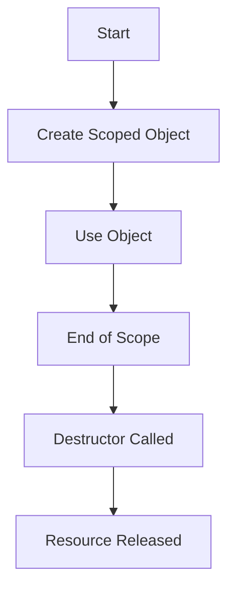

## 4.13 Scoped Classes and Resource Management

In the realm of systems programming, efficient resource management is paramount. The D programming language offers a unique feature known as `scope` classes, which allows developers to manage resources deterministically. This section delves into the intricacies of scoped classes and resource management in D, providing expert software engineers and architects with the knowledge to harness these features effectively.

### Purpose

The primary purpose of using scoped classes in D is to manage resources deterministically, ensuring their timely release without relying solely on the garbage collector. This approach is crucial in performance-critical applications where resource leaks can lead to significant issues.

### Implementing Scoped Classes in D

#### Using the `scope` Keyword

The `scope` keyword in D is a powerful tool for managing the lifetime of objects. It ensures that objects are allocated on the stack and are destroyed when they go out of scope. This section explores how to implement scoped classes using the `scope` keyword.

##### Stack Allocation of Classes

When you declare an object with the `scope` keyword, it is allocated on the stack rather than the heap. This allocation method provides several benefits, including faster allocation and deallocation, as well as deterministic destruction.

```d
void function() {
    scope MyClass obj = new MyClass();
    // Use obj within this scope
} // obj is destroyed here
```

In the above example, the object `obj` is allocated on the stack and is automatically destroyed when the function exits, ensuring that resources are released promptly.

##### Deterministic Destruction

One of the key advantages of using `scope` is deterministic destruction. The destructor of a scoped object is called as soon as the object goes out of scope, allowing for precise control over resource cleanup.

#### Combining with RAII

Resource Acquisition Is Initialization (RAII) is a programming idiom that ties resource management to object lifetime. By combining RAII with scoped classes, you can ensure that resources are acquired in the constructor and released in the destructor, with `scope` guaranteeing timely cleanup.

```d
class Resource {
    this() {
        // Acquire resource
    }
    ~this() {
        // Release resource
    }
}

void useResource() {
    scope Resource res = new Resource();
    // Use the resource
} // res is destroyed here, releasing the resource
```

In this example, the `Resource` class acquires a resource in its constructor and releases it in its destructor. The `scope` keyword ensures that the destructor is called when `res` goes out of scope.

#### Avoiding Dangling References

When using scoped classes, it's crucial to avoid dangling references, which occur when an object is used outside its intended scope. D's compiler helps enforce proper usage of `scope` objects, preventing undefined behavior.

##### Lifetime Constraints

Ensure that `scope` objects are not returned or used outside their intended scope. This constraint prevents dangling references and ensures that resources are managed correctly.

##### Compiler Enforcement

D's compiler provides checks to enforce the proper usage of `scope` objects. It ensures that scoped objects are not inadvertently returned or used beyond their lifetime, reducing the risk of resource leaks.

#### Limitations and Considerations

While scoped classes offer significant benefits, there are some limitations and considerations to keep in mind.

##### Not Compatible with Garbage Collection

Scoped classes are not managed by the garbage collector. This means that developers must manually manage memory, ensuring that resources are released appropriately.

##### Cannot Be Allocated with `new` Without `scope`

Scoped classes enforce stack allocation. Attempting to heap-allocate a scoped class without using `scope` is disallowed or discouraged, ensuring that resources are managed deterministically.

#### `RefCounted` Structs

In addition to scoped classes, D provides `std.typecons.RefCounted` for managing the lifetime of objects with shared ownership. This section explores how to use `RefCounted` structs for reference counting.

##### Reference Counting

`RefCounted` uses reference counting to manage the lifetime of objects. When the last reference to an object goes out of scope, the object is automatically deleted.

```d
import std.typecons;

void useRefCounted() {
    auto refCountedObj = RefCounted!MyClass();
    // Use refCountedObj
} // refCountedObj is deleted here
```

In this example, `refCountedObj` is a reference-counted object. It is automatically deleted when the last reference goes out of scope, ensuring proper resource management.

### Use Cases and Examples

Scoped classes and resource management are applicable in various scenarios. This section explores some common use cases and provides examples to illustrate their application.

#### Temporary Objects

Scoped classes are ideal for creating temporary objects that are needed only within a specific scope and must be destroyed immediately after.

```d
void processData() {
    scope TemporaryObject temp = new TemporaryObject();
    // Process data using temp
} // temp is destroyed here
```

In this example, `temp` is a temporary object that is destroyed when the function exits, ensuring that resources are released promptly.

#### Interfacing with C Libraries

When interfacing with C libraries, it's crucial to manage C resources correctly. Scoped classes can wrap C library handles or pointers, ensuring they are freed appropriately.

```d
class CResourceWrapper {
    private CResource* resource;

    this() {
        resource = acquireCResource();
    }

    ~this() {
        releaseCResource(resource);
    }
}

void useCResource() {
    scope CResourceWrapper wrapper = new CResourceWrapper();
    // Use the C resource
} // wrapper is destroyed here, releasing the C resource
```

In this example, `CResourceWrapper` manages a C resource, ensuring it is acquired and released correctly.

#### Exception Safety

Scoped classes provide guaranteed cleanup, ensuring that resources are released even if exceptions occur within the scope.

```d
void handleException() {
    scope Resource res = new Resource();
    // Perform operations that may throw exceptions
} // res is destroyed here, even if an exception is thrown
```

In this example, `res` is destroyed even if an exception is thrown, ensuring that resources are released safely.

#### Performance-Critical Code

In performance-critical code, reducing garbage collector pressure is essential. By using scoped classes and stack allocation, the garbage collector has less work, improving performance.

```d
void performanceCriticalFunction() {
    scope FastObject obj = new FastObject();
    // Perform operations with obj
} // obj is destroyed here, reducing GC pressure
```

In this example, `obj` is allocated on the stack, reducing the workload on the garbage collector.

#### Example Implementation

To illustrate the use of scoped classes and resource management, consider the following example implementation.

```d
class SocketConnection {
    // Socket handling code
    ~this() {
        // Close the socket connection
    }
}

void handleRequest() {
    scope SocketConnection conn = new SocketConnection();
    // Process the request using conn
} // conn is guaranteed to be destroyed here
```

In this example, `SocketConnection` manages a socket connection, ensuring it is closed when the object goes out of scope.

### Visualizing Scoped Classes and Resource Management

To enhance understanding, let's visualize the concept of scoped classes and resource management using a Mermaid.js diagram.



**Diagram Description**: This flowchart illustrates the lifecycle of a scoped object. It starts with the creation of a scoped object, followed by its usage. When the scope ends, the destructor is called, releasing the associated resources.

### References and Links

For further reading on scoped classes and resource management in D, consider the following resources:

- [D Programming Language Specification](https://dlang.org/spec/spec.html)
- [D Language Tour](https://tour.dlang.org/)
- [RAII Idiom](https://en.wikipedia.org/wiki/Resource_acquisition_is_initialization)

### Knowledge Check

To reinforce your understanding of scoped classes and resource management, consider the following questions:

1. What is the primary purpose of using scoped classes in D?
2. How does the `scope` keyword ensure deterministic destruction?
3. What are the benefits of combining RAII with scoped classes?
4. How does D's compiler help enforce proper usage of `scope` objects?
5. What are the limitations of using scoped classes in D?

### Embrace the Journey

Remember, mastering scoped classes and resource management is just the beginning. As you progress, you'll build more efficient and reliable software systems. Keep experimenting, stay curious, and enjoy the journey!

### Quiz Time!



### What is the primary purpose of using scoped classes in D?

- [x] To manage resources deterministically
- [ ] To increase garbage collection frequency
- [ ] To allow heap allocation of objects
- [ ] To prevent stack allocation

> **Explanation:** The primary purpose of using scoped classes in D is to manage resources deterministically, ensuring their timely release without relying solely on the garbage collector.

### How does the `scope` keyword ensure deterministic destruction?

- [x] By calling the destructor when the object goes out of scope
- [ ] By allocating objects on the heap
- [ ] By preventing object creation
- [ ] By disabling garbage collection

> **Explanation:** The `scope` keyword ensures deterministic destruction by calling the destructor of a scoped object as soon as it goes out of scope.

### What are the benefits of combining RAII with scoped classes?

- [x] Ensures resources are acquired and released timely
- [x] Provides exception safety
- [ ] Increases memory usage
- [ ] Requires manual memory management

> **Explanation:** Combining RAII with scoped classes ensures that resources are acquired in the constructor and released in the destructor, providing exception safety and timely resource management.

### How does D's compiler help enforce proper usage of `scope` objects?

- [x] By preventing scoped objects from being returned or used outside their intended scope
- [ ] By allowing heap allocation of scoped objects
- [ ] By disabling destructor calls
- [ ] By increasing garbage collection frequency

> **Explanation:** D's compiler helps enforce proper usage of `scope` objects by preventing them from being returned or used outside their intended scope, reducing the risk of resource leaks.

### What are the limitations of using scoped classes in D?

- [x] Not compatible with garbage collection
- [x] Cannot be allocated with `new` without `scope`
- [ ] Requires heap allocation
- [ ] Increases garbage collection pressure

> **Explanation:** Scoped classes are not managed by the garbage collector and cannot be allocated with `new` without `scope`, ensuring stack allocation and deterministic resource management.

### Which of the following is a use case for scoped classes?

- [x] Managing temporary objects
- [ ] Increasing garbage collection frequency
- [ ] Preventing stack allocation
- [ ] Disabling destructor calls

> **Explanation:** Scoped classes are ideal for managing temporary objects that are needed only within a specific scope and must be destroyed immediately after.

### How can scoped classes improve performance in critical code?

- [x] By reducing garbage collector pressure
- [ ] By increasing memory usage
- [ ] By preventing stack allocation
- [ ] By disabling destructor calls

> **Explanation:** Scoped classes improve performance in critical code by reducing garbage collector pressure through stack allocation and deterministic destruction.

### What is the role of `RefCounted` structs in D?

- [x] To manage the lifetime of objects with shared ownership
- [ ] To prevent object creation
- [ ] To increase garbage collection frequency
- [ ] To disable destructor calls

> **Explanation:** `RefCounted` structs manage the lifetime of objects with shared ownership using reference counting, ensuring proper resource management.

### How do scoped classes ensure exception safety?

- [x] By guaranteeing resource cleanup even if exceptions occur
- [ ] By preventing exception handling
- [ ] By increasing memory usage
- [ ] By disabling destructor calls

> **Explanation:** Scoped classes ensure exception safety by guaranteeing that resources are released even if exceptions occur within the scope.

### True or False: Scoped classes can be allocated on the heap without using `scope`.

- [ ] True
- [x] False

> **Explanation:** False. Scoped classes enforce stack allocation and cannot be allocated on the heap without using `scope`.



By mastering scoped classes and resource management in D, you can build high-performance, scalable, and maintainable software systems. Keep exploring and applying these concepts to enhance your expertise in D programming.
