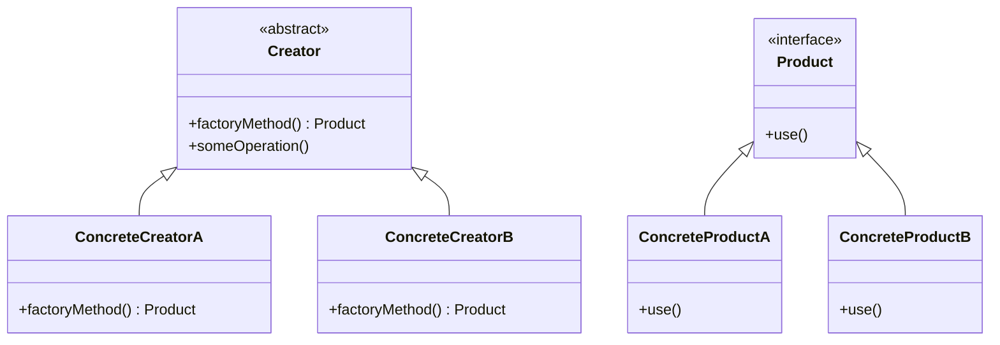

## 4.2 Factory Method Pattern

The Factory Method Pattern is a creational design pattern that provides an interface for creating objects in a superclass but allows subclasses to alter the type of objects that will be created. This pattern is particularly useful in scenarios where a class cannot anticipate the class of objects it must create. By delegating the instantiation to subclasses, the Factory Method Pattern promotes flexibility and scalability in software design.

### Purpose

The primary purpose of the Factory Method Pattern is to define an interface for creating objects, but to allow subclasses to decide which class to instantiate. This pattern is beneficial in systems that require a high degree of flexibility and extensibility, such as plugin systems and graphical user interfaces (GUIs).

### Implementing Factory Method in D

D, with its powerful features like templates, mixins, and compile-time function execution, provides a robust environment for implementing the Factory Method Pattern. Let's explore how we can leverage these features to create flexible and efficient factory methods.

#### Interfaces and Abstract Classes

In D, interfaces and abstract classes are used to define the types of products that the factory method will create. An interface can declare the methods that all concrete products must implement, while an abstract class can provide default implementations.

```d
interface Product {
    void use();
}

class ConcreteProductA : Product {
    override void use() {
        writeln("Using ConcreteProductA");
    }
}

class ConcreteProductB : Product {
    override void use() {
        writeln("Using ConcreteProductB");
    }
}

abstract class Creator {
    abstract Product factoryMethod();
    
    void someOperation() {
        auto product = factoryMethod();
        product.use();
    }
}
```

In this example, `Product` is an interface with a method `use()`. `ConcreteProductA` and `ConcreteProductB` are concrete implementations of `Product`. The `Creator` class declares the `factoryMethod()` which subclasses will override to create specific products.

#### Templates and Mixins

D's templates and mixins can be used to create more flexible factory methods. Templates allow us to define generic factory methods that can be specialized for different product types.

```d
template Factory(T) {
    T create() {
        return new T();
    }
}

mixin template FactoryMixin(T) {
    T create() {
        return new T();
    }
}

class ProductFactory {
    mixin FactoryMixin!ConcreteProductA;
    mixin FactoryMixin!ConcreteProductB;
}
```

In this example, `Factory` is a template that defines a generic `create()` method. The `FactoryMixin` is a mixin template that can be used to add factory methods to any class. The `ProductFactory` class uses mixins to provide factory methods for `ConcreteProductA` and `ConcreteProductB`.

#### Factory Kit Pattern

The Factory Kit Pattern is an extension of the Factory Method Pattern that groups related factory methods together, enhancing extensibility and organization.

##### Grouping Factories

The Factory Kit Pattern allows us to group related factory methods into a single factory class, making it easier to manage and extend.

```d
class FactoryKit {
    private alias FactoryMap = string delegate() function[string];
    private FactoryMap factories;

    void registerFactory(string name, string delegate() factory) {
        factories[name] = factory;
    }

    string create(string name) {
        return factories[name]();
    }
}

void main() {
    auto kit = new FactoryKit();
    kit.registerFactory("ProductA", () => "Created ProductA");
    kit.registerFactory("ProductB", () => "Created ProductB");

    writeln(kit.create("ProductA"));
    writeln(kit.create("ProductB"));
}
```

In this example, `FactoryKit` is a class that maintains a map of factory methods. The `registerFactory()` method allows us to add new factories, and the `create()` method uses the registered factories to create products.

##### Enhancing Extensibility

The Factory Kit Pattern enhances extensibility by allowing new product types to be added without modifying existing code. This is achieved by registering new factory methods at runtime.

### Extending Factories

The Factory Method Pattern aligns with the Open/Closed Principle, which states that software entities should be open for extension but closed for modification. By using the Factory Method Pattern, we can extend factories to create new product types without altering existing code.

#### Open/Closed Principle

The Open/Closed Principle is a fundamental concept in software design that promotes extensibility and maintainability. By designing factories that adhere to this principle, we can easily add new product types without modifying existing code.

```d
class ExtendedCreator : Creator {
    override Product factoryMethod() {
        return new ConcreteProductB();
    }
}
```

In this example, `ExtendedCreator` is a subclass of `Creator` that overrides the `factoryMethod()` to create `ConcreteProductB`. This allows us to extend the factory without modifying the original `Creator` class.

### Use Cases and Examples

The Factory Method Pattern is widely used in various applications, including plugin systems and GUI components.

#### Plugin Systems

In plugin systems, the Factory Method Pattern can be used to load different implementations at runtime. This allows the system to be extended with new plugins without modifying the core codebase.

```d
interface Plugin {
    void execute();
}

class PluginA : Plugin {
    override void execute() {
        writeln("Executing PluginA");
    }
}

class PluginB : Plugin {
    override void execute() {
        writeln("Executing PluginB");
    }
}

abstract class PluginLoader {
    abstract Plugin loadPlugin();
}

class PluginALoader : PluginLoader {
    override Plugin loadPlugin() {
        return new PluginA();
    }
}

class PluginBLoader : PluginLoader {
    override Plugin loadPlugin() {
        return new PluginB();
    }
}
```

In this example, `Plugin` is an interface for plugins, and `PluginA` and `PluginB` are concrete implementations. `PluginLoader` is an abstract class with a `loadPlugin()` method that subclasses override to load specific plugins.

#### GUI Components

In GUI applications, the Factory Method Pattern can be used to create UI elements with varying attributes. This allows for a flexible and dynamic user interface.

```d
interface Button {
    void render();
}

class WindowsButton : Button {
    override void render() {
        writeln("Rendering Windows Button");
    }
}

class MacOSButton : Button {
    override void render() {
        writeln("Rendering MacOS Button");
    }
}

abstract class Dialog {
    abstract Button createButton();
    
    void renderDialog() {
        auto button = createButton();
        button.render();
    }
}

class WindowsDialog : Dialog {
    override Button createButton() {
        return new WindowsButton();
    }
}

class MacOSDialog : Dialog {
    override Button createButton() {
        return new MacOSButton();
    }
}
```

In this example, `Button` is an interface for buttons, and `WindowsButton` and `MacOSButton` are concrete implementations. `Dialog` is an abstract class with a `createButton()` method that subclasses override to create specific buttons.

### Visualizing the Factory Method Pattern

To better understand the Factory Method Pattern, let's visualize the relationships between the classes using a class diagram.



In this diagram, `Creator` is an abstract class with a `factoryMethod()` that returns a `Product`. `ConcreteCreatorA` and `ConcreteCreatorB` are subclasses that override the `factoryMethod()` to create `ConcreteProductA` and `ConcreteProductB`, respectively.

### Design Considerations

When implementing the Factory Method Pattern in D, consider the following:

- **Flexibility**: Use templates and mixins to create flexible factory methods that can be easily extended.
- **Extensibility**: Design factories that adhere to the Open/Closed Principle, allowing new product types to be added without modifying existing code.
- **Performance**: Consider the performance implications of using factory methods, especially in systems with high object creation overhead.

### Differences and Similarities

The Factory Method Pattern is often confused with the Abstract Factory Pattern. While both patterns deal with object creation, the Factory Method Pattern focuses on creating a single product, whereas the Abstract Factory Pattern involves creating families of related products.

### Try It Yourself

To deepen your understanding of the Factory Method Pattern, try modifying the code examples provided:

- **Add a new product type**: Extend the factory to create a new product type and observe how the pattern facilitates this extension.
- **Experiment with templates**: Use D's templates to create a generic factory method that can handle multiple product types.
- **Implement a plugin system**: Create a simple plugin system using the Factory Method Pattern and explore how it can be extended with new plugins.

### References and Links

For further reading on the Factory Method Pattern and its applications, consider the following resources:

- [Design Patterns: Elements of Reusable Object-Oriented Software](https://en.wikipedia.org/wiki/Design_Patterns) by Erich Gamma, Richard Helm, Ralph Johnson, and John Vlissides.
- [D Programming Language](https://dlang.org/) official website for more information on D's features and capabilities.

### Knowledge Check

To reinforce your understanding of the Factory Method Pattern, consider the following questions and exercises:

- **What is the primary purpose of the Factory Method Pattern?**
- **How does the Factory Method Pattern promote flexibility and extensibility?**
- **What are the key differences between the Factory Method Pattern and the Abstract Factory Pattern?**

Remember, mastering design patterns is a journey. As you continue to explore and experiment with the Factory Method Pattern, you'll gain a deeper understanding of its applications and benefits. Keep experimenting, stay curious, and enjoy the journey!

## Quiz Time!



### What is the primary purpose of the Factory Method Pattern?

- [x] To define an interface for creating objects, allowing subclasses to alter the type of objects created.
- [ ] To create a single instance of a class.
- [ ] To provide a way to access the elements of an aggregate object sequentially.
- [ ] To define a family of algorithms.

> **Explanation:** The Factory Method Pattern defines an interface for creating objects but allows subclasses to alter the type of objects that will be created.

### Which D feature can be used to create flexible factory methods?

- [x] Templates
- [x] Mixins
- [ ] Interfaces
- [ ] Delegates

> **Explanation:** Templates and mixins in D can be used to create flexible factory methods that can be easily extended.

### What principle does the Factory Method Pattern adhere to?

- [x] Open/Closed Principle
- [ ] Single Responsibility Principle
- [ ] Liskov Substitution Principle
- [ ] Interface Segregation Principle

> **Explanation:** The Factory Method Pattern adheres to the Open/Closed Principle, allowing new product types to be added without modifying existing code.

### What is a common use case for the Factory Method Pattern?

- [x] Plugin Systems
- [ ] Singleton Pattern
- [ ] Iterator Pattern
- [ ] Observer Pattern

> **Explanation:** The Factory Method Pattern is commonly used in plugin systems to load different implementations at runtime.

### How does the Factory Kit Pattern enhance the Factory Method Pattern?

- [x] By grouping related factory methods together
- [ ] By creating a single instance of a class
- [ ] By providing a way to access the elements of an aggregate object sequentially
- [ ] By defining a family of algorithms

> **Explanation:** The Factory Kit Pattern groups related factory methods together, enhancing organization and extensibility.

### What is the difference between the Factory Method Pattern and the Abstract Factory Pattern?

- [x] Factory Method focuses on creating a single product, while Abstract Factory involves creating families of related products.
- [ ] Factory Method involves creating families of related products, while Abstract Factory focuses on creating a single product.
- [ ] Both patterns are identical in their implementation.
- [ ] Factory Method is used for object creation, while Abstract Factory is used for object destruction.

> **Explanation:** The Factory Method Pattern focuses on creating a single product, whereas the Abstract Factory Pattern involves creating families of related products.

### Which of the following is a benefit of using the Factory Method Pattern?

- [x] Flexibility in object creation
- [x] Extensibility without modifying existing code
- [ ] Reducing the number of classes in a system
- [ ] Ensuring a single instance of a class

> **Explanation:** The Factory Method Pattern provides flexibility in object creation and allows for extensibility without modifying existing code.

### In the provided code example, what does the `createButton()` method do?

- [x] It creates a specific button based on the subclass implementation.
- [ ] It renders the button on the screen.
- [ ] It registers a new button type.
- [ ] It deletes an existing button.

> **Explanation:** The `createButton()` method in the example is responsible for creating a specific button based on the subclass implementation.

### What is a key feature of the Factory Method Pattern in D?

- [x] The use of templates and mixins for flexible factory creation.
- [ ] The use of singletons to manage object instances.
- [ ] The use of delegates for event handling.
- [ ] The use of structs for data encapsulation.

> **Explanation:** A key feature of the Factory Method Pattern in D is the use of templates and mixins for flexible factory creation.

### True or False: The Factory Method Pattern can be used to create UI elements with varying attributes.

- [x] True
- [ ] False

> **Explanation:** The Factory Method Pattern can be used in GUI applications to create UI elements with varying attributes, allowing for a flexible and dynamic user interface.


