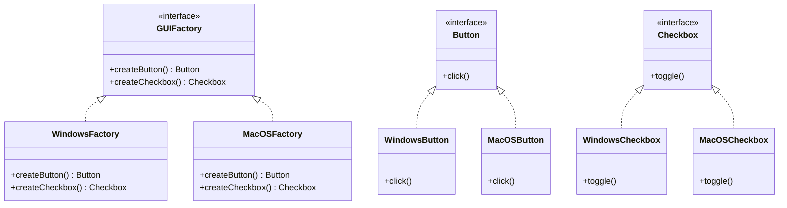

## 4.3 Abstract Factory Pattern

The Abstract Factory Pattern is a creational design pattern that provides an interface for creating families of related or dependent objects without specifying their concrete classes. This pattern is particularly useful in systems programming where flexibility and scalability are paramount. In this section, we will delve into the implementation of the Abstract Factory Pattern in the D programming language, leveraging its unique features such as templates and mixins to enhance flexibility and maintainability.

### Purpose

The primary purpose of the Abstract Factory Pattern is to encapsulate a group of individual factories with a common goal. It allows you to create a suite of related objects without being tightly coupled to their specific implementations. This is especially beneficial in scenarios where the system needs to support multiple product families or themes, such as cross-platform UI components or themable applications.

### Implementing Abstract Factory in D

#### Abstract Interfaces

To implement the Abstract Factory Pattern in D, we start by defining abstract interfaces for the product families. These interfaces declare the methods that the concrete products must implement.

```d
interface Button {
    void click();
}

interface Checkbox {
    void toggle();
}

interface GUIFactory {
    Button createButton();
    Checkbox createCheckbox();
}
```

In this example, we have two product interfaces: `Button` and `Checkbox`. The `GUIFactory` interface defines methods for creating these products.

#### Concrete Implementations

Next, we create concrete implementations of the product interfaces and the factory interface. Each concrete factory corresponds to a specific product family.

```d
class WindowsButton : Button {
    void click() {
        writeln("Windows Button clicked!");
    }
}

class WindowsCheckbox : Checkbox {
    void toggle() {
        writeln("Windows Checkbox toggled!");
    }
}

class WindowsFactory : GUIFactory {
    Button createButton() {
        return new WindowsButton();
    }

    Checkbox createCheckbox() {
        return new WindowsCheckbox();
    }
}

class MacOSButton : Button {
    void click() {
        writeln("MacOS Button clicked!");
    }
}

class MacOSCheckbox : Checkbox {
    void toggle() {
        writeln("MacOS Checkbox toggled!");
    }
}

class MacOSFactory : GUIFactory {
    Button createButton() {
        return new MacOSButton();
    }

    Checkbox createCheckbox() {
        return new MacOSCheckbox();
    }
}
```

Here, we have two concrete factories: `WindowsFactory` and `MacOSFactory`. Each factory produces products that are consistent with its platform.

#### Templates for Flexibility

D's template system can be used to generalize factory behavior, allowing for more flexible and reusable code.

```d
template Factory(TButton, TCheckbox) {
    class ConcreteFactory : GUIFactory {
        Button createButton() {
            return new TButton();
        }

        Checkbox createCheckbox() {
            return new TCheckbox();
        }
    }
}

alias WindowsGUIFactory = Factory!(WindowsButton, WindowsCheckbox).ConcreteFactory;
alias MacOSGUIFactory = Factory!(MacOSButton, MacOSCheckbox).ConcreteFactory;
```

By using templates, we can easily create new factories by specifying the product types, reducing code duplication and enhancing maintainability.

### Managing Multiple Product Families

#### Extensibility

One of the key advantages of the Abstract Factory Pattern is its extensibility. You can add new product families without altering existing code, which is crucial for maintaining large systems.

To add a new product family, simply define new concrete product classes and a corresponding factory class. The existing client code remains unchanged, as it interacts with the abstract interfaces.

### Use Cases and Examples

#### Cross-Platform Development

In cross-platform development, the Abstract Factory Pattern is invaluable for producing UI components that are consistent across different systems. By defining a factory for each platform, you can ensure that the application behaves uniformly, regardless of the underlying system.

#### Themable Applications

The pattern is also useful in applications that support multiple themes or skins. By switching the factory at runtime, you can change the look and feel of the application without modifying the core logic.

### Visualizing the Abstract Factory Pattern

To better understand the Abstract Factory Pattern, let's visualize its structure using a class diagram.



**Diagram Description**: This class diagram illustrates the relationships between the abstract factory, concrete factories, and product interfaces. The `GUIFactory` interface defines the methods for creating products, while the `WindowsFactory` and `MacOSFactory` provide concrete implementations. The `Button` and `Checkbox` interfaces represent the product families, with specific implementations for each platform.

### Design Considerations

When implementing the Abstract Factory Pattern, consider the following:

- **When to Use**: Use this pattern when you need to create families of related objects and want to ensure that the products are used together. It is particularly useful when the system needs to be independent of how its objects are created.
- **D-Specific Features**: Leverage D's templates and mixins to create flexible and reusable factory implementations. This can reduce code duplication and enhance maintainability.
- **Pitfalls**: Be cautious of over-engineering. If the system only requires a few products, the complexity introduced by the Abstract Factory Pattern may not be justified.

### Differences and Similarities

The Abstract Factory Pattern is often confused with the Factory Method Pattern. While both patterns deal with object creation, the key difference is that the Abstract Factory Pattern involves multiple factories, each responsible for creating a family of related products. In contrast, the Factory Method Pattern focuses on a single method for creating an object.

### Try It Yourself

To solidify your understanding of the Abstract Factory Pattern, try modifying the code examples provided. Here are some suggestions:

- **Add a New Product Family**: Implement a new product family, such as Linux UI components, and create a corresponding factory.
- **Experiment with Templates**: Use D's template system to create a more flexible factory that can handle additional product types.
- **Switch Themes at Runtime**: Implement a mechanism to switch between different factories at runtime, simulating a theme change in an application.

### Knowledge Check

Before moving on, let's review some key concepts:

- What is the primary purpose of the Abstract Factory Pattern?
- How does the Abstract Factory Pattern enhance extensibility?
- What are some use cases for the Abstract Factory Pattern in systems programming?

### Embrace the Journey

Remember, mastering design patterns is a journey. As you continue to explore and experiment with the Abstract Factory Pattern, you'll gain a deeper understanding of how to create flexible and maintainable software systems. Keep experimenting, stay curious, and enjoy the journey!

## Quiz Time!



### What is the primary purpose of the Abstract Factory Pattern?

- [x] To provide an interface for creating families of related objects without specifying their concrete classes.
- [ ] To create a single object without specifying its concrete class.
- [ ] To manage object lifecycles and dependencies.
- [ ] To optimize performance by reusing objects.

> **Explanation:** The Abstract Factory Pattern is designed to provide an interface for creating families of related or dependent objects without specifying their concrete classes.

### How does the Abstract Factory Pattern enhance extensibility?

- [x] By allowing new product families to be added without altering existing code.
- [ ] By reducing the number of classes needed in the system.
- [ ] By simplifying the object creation process.
- [ ] By enforcing strict type checking.

> **Explanation:** The Abstract Factory Pattern enhances extensibility by allowing new product families to be added without altering existing code, as the client code interacts with abstract interfaces.

### Which D language feature can be used to generalize factory behavior?

- [x] Templates
- [ ] Mixins
- [ ] Interfaces
- [ ] Delegates

> **Explanation:** D's template system can be used to generalize factory behavior, allowing for more flexible and reusable code.

### What is a common use case for the Abstract Factory Pattern?

- [x] Cross-platform development
- [ ] Memory management
- [ ] Network communication
- [ ] Data serialization

> **Explanation:** A common use case for the Abstract Factory Pattern is cross-platform development, where it helps produce UI components that are consistent across different systems.

### What is the difference between the Abstract Factory Pattern and the Factory Method Pattern?

- [x] The Abstract Factory Pattern involves multiple factories for creating families of related products, while the Factory Method Pattern focuses on a single method for creating an object.
- [ ] The Factory Method Pattern involves multiple factories, while the Abstract Factory Pattern focuses on a single method.
- [ ] The Abstract Factory Pattern is used for performance optimization, while the Factory Method Pattern is used for code simplification.
- [ ] There is no difference; they are the same pattern.

> **Explanation:** The key difference is that the Abstract Factory Pattern involves multiple factories, each responsible for creating a family of related products, while the Factory Method Pattern focuses on a single method for creating an object.

### Which of the following is a benefit of using the Abstract Factory Pattern?

- [x] It promotes consistency among products.
- [ ] It reduces the number of classes in the system.
- [ ] It simplifies the object creation process.
- [ ] It enforces strict type checking.

> **Explanation:** The Abstract Factory Pattern promotes consistency among products by ensuring that related products are used together.

### What is a potential pitfall of the Abstract Factory Pattern?

- [x] Over-engineering
- [ ] Under-engineering
- [ ] Lack of flexibility
- [ ] Poor performance

> **Explanation:** A potential pitfall of the Abstract Factory Pattern is over-engineering, as it introduces complexity that may not be justified if the system only requires a few products.

### How can D's mixins be used in the Abstract Factory Pattern?

- [x] To create flexible and reusable factory implementations.
- [ ] To enforce strict type checking.
- [ ] To simplify the object creation process.
- [ ] To optimize performance.

> **Explanation:** D's mixins can be used to create flexible and reusable factory implementations, reducing code duplication and enhancing maintainability.

### What is a key advantage of using templates in the Abstract Factory Pattern?

- [x] They allow for more flexible and reusable code.
- [ ] They enforce strict type checking.
- [ ] They simplify the object creation process.
- [ ] They reduce the number of classes in the system.

> **Explanation:** Templates allow for more flexible and reusable code by generalizing factory behavior, reducing code duplication and enhancing maintainability.

### True or False: The Abstract Factory Pattern is only useful in object-oriented programming.

- [ ] True
- [x] False

> **Explanation:** False. While the Abstract Factory Pattern is commonly used in object-oriented programming, its principles can be applied in other paradigms to create families of related objects without specifying their concrete classes.


