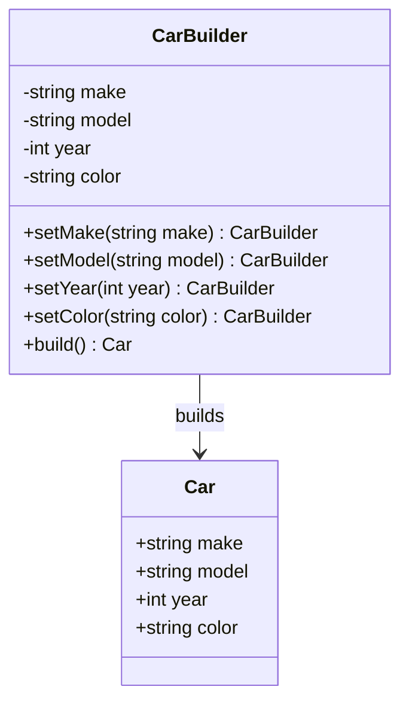

## 4.4 Builder Pattern

### Purpose

The Builder Pattern is a creational design pattern that separates the construction of a complex object from its representation. This separation allows the same construction process to create different representations, providing flexibility and clarity in the creation of complex objects. In the D programming language, the Builder Pattern can be implemented using its unique features such as method chaining through Uniform Function Call Syntax (UFCS) and compile-time capabilities.

### Implementing Builder in D

#### Builder Classes

In D, you can implement the Builder Pattern using classes or structs to assemble parts of an object. The Builder class is responsible for constructing the final object step by step, allowing for a more controlled and flexible construction process.

```d
class Car {
    string make;
    string model;
    int year;
    string color;

    this(string make, string model, int year, string color) {
        this.make = make;
        this.model = model;
        this.year = year;
        this.color = color;
    }
}

class CarBuilder {
    private string make;
    private string model;
    private int year;
    private string color;

    CarBuilder setMake(string make) {
        this.make = make;
        return this;
    }

    CarBuilder setModel(string model) {
        this.model = model;
        return this;
    }

    CarBuilder setYear(int year) {
        this.year = year;
        return this;
    }

    CarBuilder setColor(string color) {
        this.color = color;
        return this;
    }

    Car build() {
        return new Car(make, model, year, color);
    }
}

void main() {
    auto car = new CarBuilder()
        .setMake("Tesla")
        .setModel("Model S")
        .setYear(2023)
        .setColor("Red")
        .build();

    writeln("Car: ", car.make, " ", car.model, " ", car.year, " ", car.color);
}
```

In this example, `CarBuilder` is used to construct a `Car` object. Each method in `CarBuilder` returns the builder itself, allowing for method chaining.

#### Method Chaining

Method chaining is a technique that allows you to call multiple methods on the same object in a single line of code. In D, this can be elegantly achieved using Uniform Function Call Syntax (UFCS), which allows you to call functions as if they were methods on an object.

```d
auto car = new CarBuilder()
    .setMake("Tesla")
    .setModel("Model S")
    .setYear(2023)
    .setColor("Red")
    .build();
```

This approach makes the code more readable and expressive, as it clearly outlines the steps involved in constructing the object.

### Step Builder Pattern

#### Enforcing Construction Order

The Step Builder Pattern is a variation of the Builder Pattern that enforces a specific order of construction steps. This can be particularly useful when certain steps must be completed before others. In D, you can use interfaces or templates to guide the build process.

```d
interface MakeStep {
    ModelStep setMake(string make);
}

interface ModelStep {
    YearStep setModel(string model);
}

interface YearStep {
    ColorStep setYear(int year);
}

interface ColorStep {
    Car build();
}

class CarBuilder : MakeStep, ModelStep, YearStep, ColorStep {
    private string make;
    private string model;
    private int year;
    private string color;

    ModelStep setMake(string make) {
        this.make = make;
        return this;
    }

    YearStep setModel(string model) {
        this.model = model;
        return this;
    }

    ColorStep setYear(int year) {
        this.year = year;
        return this;
    }

    Car build() {
        return new Car(make, model, year, color);
    }
}

void main() {
    auto car = new CarBuilder()
        .setMake("Tesla")
        .setModel("Model S")
        .setYear(2023)
        .build();

    writeln("Car: ", car.make, " ", car.model, " ", car.year);
}
```

In this example, the `CarBuilder` class implements several interfaces, each representing a step in the construction process. This ensures that the steps are followed in the correct order.

### Use Cases and Examples

#### Complex Configurations

The Builder Pattern is particularly useful for constructing objects that require multiple initializations or configurations. For example, when building a complex configuration object for a software application, the Builder Pattern can help manage the complexity by breaking down the construction process into manageable steps.

#### Immutable Objects

The Builder Pattern is also ideal for creating immutable objects, where the object is fully constructed before it is used. This ensures that the object is in a valid state and cannot be modified after construction.

```d
class ImmutableCar {
    private immutable string make;
    private immutable string model;
    private immutable int year;
    private immutable string color;

    this(string make, string model, int year, string color) {
        this.make = make;
        this.model = model;
        this.year = year;
        this.color = color;
    }
}

class ImmutableCarBuilder {
    private string make;
    private string model;
    private int year;
    private string color;

    ImmutableCarBuilder setMake(string make) {
        this.make = make;
        return this;
    }

    ImmutableCarBuilder setModel(string model) {
        this.model = model;
        return this;
    }

    ImmutableCarBuilder setYear(int year) {
        this.year = year;
        return this;
    }

    ImmutableCarBuilder setColor(string color) {
        this.color = color;
        return this;
    }

    ImmutableCar build() {
        return new ImmutableCar(make, model, year, color);
    }
}

void main() {
    auto car = new ImmutableCarBuilder()
        .setMake("Tesla")
        .setModel("Model S")
        .setYear(2023)
        .setColor("Red")
        .build();

    writeln("Immutable Car: ", car.make, " ", car.model, " ", car.year, " ", car.color);
}
```

### Design Considerations

When using the Builder Pattern in D, consider the following:

- **Flexibility**: The Builder Pattern provides flexibility in object construction, allowing for different representations of the same object.
- **Complexity**: While the Builder Pattern can simplify the construction of complex objects, it can also introduce additional complexity in the form of multiple builder classes or interfaces.
- **Immutability**: The Builder Pattern is well-suited for creating immutable objects, ensuring that objects are fully constructed before use.

### Differences and Similarities

The Builder Pattern is often compared to other creational patterns such as the Factory Method and Abstract Factory patterns. While all these patterns deal with object creation, the Builder Pattern focuses on constructing a complex object step by step, whereas the Factory patterns are more concerned with creating objects without specifying the exact class of object that will be created.

### Try It Yourself

To deepen your understanding of the Builder Pattern in D, try modifying the code examples provided:

- Add additional properties to the `Car` class and update the `CarBuilder` to handle these new properties.
- Implement a `BikeBuilder` class using the Builder Pattern and create a `Bike` object.
- Experiment with the Step Builder Pattern by adding more steps to the construction process.

### Visualizing the Builder Pattern



This diagram illustrates the relationship between the `CarBuilder` and `Car` classes, showing how the builder constructs the car object.

### References and Links

- [Design Patterns: Elements of Reusable Object-Oriented Software](https://en.wikipedia.org/wiki/Design_Patterns) - A foundational book on design patterns.
- [D Programming Language](https://dlang.org/) - Official site for the D programming language.
- [Uniform Function Call Syntax (UFCS)](https://dlang.org/spec/function.html#pseudo-member) - D Language Specification on UFCS.

### Knowledge Check

Before moving on, ensure you understand the following key points:

- The purpose and benefits of the Builder Pattern.
- How to implement the Builder Pattern in D using classes and method chaining.
- The use of the Step Builder Pattern to enforce construction order.
- The differences between the Builder Pattern and other creational patterns.

## Quiz Time!



### What is the primary purpose of the Builder Pattern?

- [x] To separate the construction of a complex object from its representation.
- [ ] To create a single instance of a class.
- [ ] To provide an interface for creating families of related objects.
- [ ] To define an interface for creating an object, but let subclasses alter the type of objects that will be created.

> **Explanation:** The Builder Pattern is designed to separate the construction of a complex object from its representation, allowing the same construction process to create different representations.

### Which D feature is commonly used for method chaining in the Builder Pattern?

- [x] Uniform Function Call Syntax (UFCS)
- [ ] Mixins
- [ ] Templates
- [ ] Compile-Time Function Execution (CTFE)

> **Explanation:** Uniform Function Call Syntax (UFCS) in D allows for method chaining, making it a common choice for implementing the Builder Pattern.

### What is a key benefit of using the Step Builder Pattern?

- [x] It enforces a specific order of construction steps.
- [ ] It reduces the number of classes needed.
- [ ] It eliminates the need for method chaining.
- [ ] It allows for dynamic object creation at runtime.

> **Explanation:** The Step Builder Pattern enforces a specific order of construction steps, ensuring that the object is built correctly.

### How does the Builder Pattern differ from the Factory Method Pattern?

- [x] The Builder Pattern focuses on constructing a complex object step by step.
- [ ] The Builder Pattern creates objects without specifying the exact class.
- [ ] The Builder Pattern is used for creating single instances.
- [ ] The Builder Pattern is used for creating families of related objects.

> **Explanation:** The Builder Pattern is focused on constructing a complex object step by step, while the Factory Method Pattern is concerned with creating objects without specifying the exact class.

### What is a common use case for the Builder Pattern?

- [x] Constructing objects that require multiple initializations.
- [ ] Creating a single instance of a class.
- [ ] Providing an interface for creating families of related objects.
- [ ] Defining an interface for creating an object, but letting subclasses alter the type of objects that will be created.

> **Explanation:** The Builder Pattern is commonly used for constructing objects that require multiple initializations or configurations.

### Which of the following is true about immutable objects in the context of the Builder Pattern?

- [x] They are fully constructed before use.
- [ ] They can be modified after construction.
- [ ] They require fewer construction steps.
- [ ] They are always created using the Factory Method Pattern.

> **Explanation:** Immutable objects are fully constructed before use, ensuring they are in a valid state and cannot be modified after construction.

### What is the role of a builder class in the Builder Pattern?

- [x] To construct the final object step by step.
- [ ] To create a single instance of a class.
- [ ] To provide an interface for creating families of related objects.
- [ ] To define an interface for creating an object, but let subclasses alter the type of objects that will be created.

> **Explanation:** The builder class is responsible for constructing the final object step by step, allowing for a controlled and flexible construction process.

### Which of the following is a characteristic of method chaining?

- [x] It allows multiple methods to be called on the same object in a single line of code.
- [ ] It requires the use of templates.
- [ ] It eliminates the need for a builder class.
- [ ] It is only applicable to immutable objects.

> **Explanation:** Method chaining allows multiple methods to be called on the same object in a single line of code, enhancing readability and expressiveness.

### What is a potential drawback of the Builder Pattern?

- [x] It can introduce additional complexity with multiple builder classes or interfaces.
- [ ] It cannot be used with immutable objects.
- [ ] It does not support method chaining.
- [ ] It is less flexible than the Factory Method Pattern.

> **Explanation:** While the Builder Pattern simplifies the construction of complex objects, it can introduce additional complexity in the form of multiple builder classes or interfaces.

### True or False: The Builder Pattern is only applicable to object-oriented programming languages.

- [x] True
- [ ] False

> **Explanation:** The Builder Pattern is primarily used in object-oriented programming languages to manage the construction of complex objects.



Remember, this is just the beginning. As you progress, you'll build more complex and interactive systems using the Builder Pattern. Keep experimenting, stay curious, and enjoy the journey!
