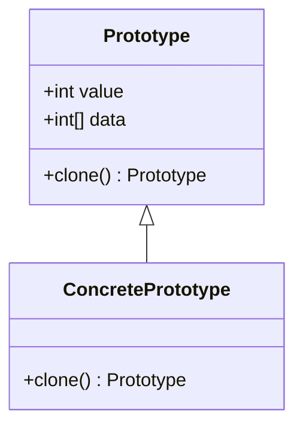

## 4.5 Prototype Pattern

The Prototype Pattern is a creational design pattern that allows for the creation of new objects by cloning an existing object, known as the prototype. This pattern is particularly useful in scenarios where the cost of creating a new instance of a class is more expensive than copying an existing instance. In the D programming language, the Prototype Pattern can be implemented effectively using D's unique features such as `dup`, `idup`, and custom cloning methods.

### Purpose

The primary purpose of the Prototype Pattern is to create new objects by duplicating an existing object, thereby avoiding the overhead associated with creating objects from scratch. This pattern is especially beneficial in systems programming where performance and resource management are critical.

### Implementing Prototype in D

#### Cloning Methods

In D, implementing a cloning method involves creating a `clone` function that returns a new instance of the object with the same state as the original. This method can be customized to perform either a shallow or deep copy, depending on the requirements.

```d
class Prototype {
    int value;
    int[] data;

    // Custom clone method
    Prototype clone() {
        auto newObject = new Prototype();
        newObject.value = this.value;
        newObject.data = this.data.dup; // Deep copy of the array
        return newObject;
    }
}

void main() {
    auto original = new Prototype();
    original.value = 42;
    original.data = [1, 2, 3];

    auto copy = original.clone();
    assert(copy.value == original.value);
    assert(copy.data == original.data);
    assert(copy.data !is original.data); // Ensure deep copy
}
```

In this example, the `clone` method creates a new `Prototype` object and copies the `value` and `data` fields. The `data` array is deep-copied using the `dup` function to ensure that modifications to the `copy` do not affect the `original`.

#### `dup` and `idup`

D provides built-in functions `dup` and `idup` for duplicating arrays and strings, respectively. These functions are essential for implementing deep copies in the Prototype Pattern.

- **`dup`**: Creates a duplicate of an array, ensuring that changes to the new array do not affect the original.
- **`idup`**: Similar to `dup`, but specifically for immutable strings.

```d
void main() {
    int[] originalArray = [1, 2, 3];
    int[] copiedArray = originalArray.dup;

    assert(copiedArray == originalArray);
    assert(copiedArray !is originalArray); // Different memory locations

    string originalString = "Hello, D!";
    string copiedString = originalString.idup;

    assert(copiedString == originalString);
    assert(copiedString !is originalString); // Different memory locations
}
```

#### Deep vs. Shallow Copy

Understanding the difference between deep and shallow copies is crucial when implementing the Prototype Pattern:

- **Shallow Copy**: Copies the object's fields as they are, without duplicating any referenced objects. This can lead to shared references between the original and the copy.
- **Deep Copy**: Duplicates all referenced objects, ensuring that the original and the copy are completely independent.

In D, you can choose between shallow and deep copies based on the specific needs of your application. For example, if your object contains complex data structures, a deep copy might be necessary to avoid unintended side effects.

### Use Cases and Examples

#### Performance Optimization

The Prototype Pattern is particularly useful for performance optimization. By cloning an existing object, you can avoid the overhead of initializing a new object from scratch, which can be costly in terms of both time and resources.

Consider a scenario where you need to create multiple instances of a complex object. Instead of constructing each instance individually, you can create one prototype and clone it as needed.

```d
class ComplexObject {
    // Simulate a costly initialization process
    this() {
        // Expensive operations
    }

    ComplexObject clone() {
        return new ComplexObject(); // Simplified for demonstration
    }
}

void main() {
    auto prototype = new ComplexObject();
    auto clone1 = prototype.clone();
    auto clone2 = prototype.clone();
    // Use clone1 and clone2 as needed
}
```

#### Dynamic Object Creation

The Prototype Pattern also facilitates dynamic object creation, allowing you to create new objects at runtime without knowing their class. This is particularly useful in systems where the exact types of objects to be created are determined at runtime.

```d
interface IPrototype {
    IPrototype clone();
}

class ConcretePrototype : IPrototype {
    int value;

    this(int value) {
        this.value = value;
    }

    IPrototype clone() {
        return new ConcretePrototype(this.value);
    }
}

void main() {
    IPrototype prototype = new ConcretePrototype(10);
    IPrototype clone = prototype.clone();

    assert(cast(ConcretePrototype)clone.value == 10);
}
```

In this example, the `IPrototype` interface defines a `clone` method, allowing different classes to implement their own cloning logic. The `ConcretePrototype` class implements this interface, enabling dynamic creation of new instances at runtime.

### Visualizing the Prototype Pattern

To better understand the Prototype Pattern, let's visualize the process of cloning an object using a class diagram.



**Diagram Description**: This class diagram illustrates the relationship between the `Prototype` class and its concrete implementation, `ConcretePrototype`. The `clone` method is defined in the `Prototype` class and implemented in `ConcretePrototype`, allowing for the creation of new instances by cloning.

### Design Considerations

When implementing the Prototype Pattern in D, consider the following:

- **Memory Management**: Ensure that cloned objects do not share references to mutable data unless intended. Use `dup` and `idup` for deep copies.
- **Performance**: While cloning can be more efficient than creating new objects from scratch, it can still be costly if the object is large or complex. Profile your application to determine the best approach.
- **Flexibility**: The Prototype Pattern provides flexibility in object creation, allowing for dynamic and runtime determination of object types.

### Differences and Similarities

The Prototype Pattern is often compared to other creational patterns such as Factory Method and Abstract Factory. While these patterns focus on creating objects through interfaces or abstract classes, the Prototype Pattern emphasizes cloning existing objects. This distinction makes the Prototype Pattern particularly useful when the cost of creating new instances is high.

### Try It Yourself

To deepen your understanding of the Prototype Pattern, try modifying the code examples provided:

- Implement a `clone` method for a class with nested objects and ensure a deep copy is performed.
- Experiment with `dup` and `idup` to see how they affect different data types.
- Create a dynamic object creation system using the Prototype Pattern and test it with various object types.

### Knowledge Check

Before we conclude, let's reinforce what we've learned with a few questions and exercises.

- What are the key differences between deep and shallow copies?
- How can the Prototype Pattern improve performance in systems programming?
- Implement a `clone` method for a class with both mutable and immutable fields.

### Embrace the Journey

Remember, mastering design patterns is a journey. The Prototype Pattern is just one of many tools in your toolbox. As you continue to explore and experiment with D, you'll discover new ways to optimize and enhance your software systems. Keep experimenting, stay curious, and enjoy the journey!

## Quiz Time!



### What is the primary purpose of the Prototype Pattern?

- [x] To create new objects by cloning an existing object.
- [ ] To define an interface for creating objects.
- [ ] To separate the construction of a complex object from its representation.
- [ ] To provide a way to access the elements of an aggregate object sequentially.

> **Explanation:** The Prototype Pattern is designed to create new objects by cloning an existing object, known as the prototype.

### Which D function is used to duplicate arrays?

- [x] `dup`
- [ ] `idup`
- [ ] `copy`
- [ ] `clone`

> **Explanation:** The `dup` function in D is used to create a duplicate of an array, ensuring that changes to the new array do not affect the original.

### What is the difference between `dup` and `idup` in D?

- [x] `dup` is for arrays, `idup` is for immutable strings.
- [ ] `dup` is for strings, `idup` is for arrays.
- [ ] `dup` is for deep copies, `idup` is for shallow copies.
- [ ] `dup` is for mutable data, `idup` is for immutable data.

> **Explanation:** In D, `dup` is used for duplicating arrays, while `idup` is specifically for immutable strings.

### What is a shallow copy?

- [x] A copy that duplicates the object's fields without duplicating referenced objects.
- [ ] A copy that duplicates all referenced objects.
- [ ] A copy that only duplicates primitive fields.
- [ ] A copy that duplicates the object's methods.

> **Explanation:** A shallow copy duplicates the object's fields as they are, without duplicating any referenced objects, leading to shared references.

### How does the Prototype Pattern facilitate dynamic object creation?

- [x] By allowing new objects to be created at runtime without knowing their class.
- [ ] By defining a static method for object creation.
- [ ] By using a factory to create objects.
- [ ] By separating object creation from its representation.

> **Explanation:** The Prototype Pattern allows for dynamic object creation by enabling new objects to be created at runtime without knowing their class.

### What is a deep copy?

- [x] A copy that duplicates all referenced objects, ensuring independence from the original.
- [ ] A copy that duplicates only primitive fields.
- [ ] A copy that duplicates the object's methods.
- [ ] A copy that duplicates the object's fields without duplicating referenced objects.

> **Explanation:** A deep copy duplicates all referenced objects, ensuring that the original and the copy are completely independent.

### Which method is typically used to implement the Prototype Pattern?

- [x] `clone`
- [ ] `create`
- [ ] `build`
- [ ] `initialize`

> **Explanation:** The `clone` method is typically used to implement the Prototype Pattern, allowing for the creation of new instances by cloning an existing object.

### What should be considered when implementing the Prototype Pattern in D?

- [x] Memory management and performance.
- [ ] Only the object's methods.
- [ ] The object's size.
- [ ] The object's color.

> **Explanation:** When implementing the Prototype Pattern in D, it's important to consider memory management and performance to ensure efficient cloning.

### How can the Prototype Pattern improve performance?

- [x] By avoiding the overhead of creating objects from scratch.
- [ ] By using more memory.
- [ ] By increasing the complexity of object creation.
- [ ] By duplicating methods.

> **Explanation:** The Prototype Pattern can improve performance by avoiding the overhead associated with creating objects from scratch, which can be costly.

### True or False: The Prototype Pattern is often compared to the Factory Method Pattern.

- [x] True
- [ ] False

> **Explanation:** True. The Prototype Pattern is often compared to other creational patterns like the Factory Method Pattern, but it focuses on cloning existing objects rather than creating new ones through interfaces.


