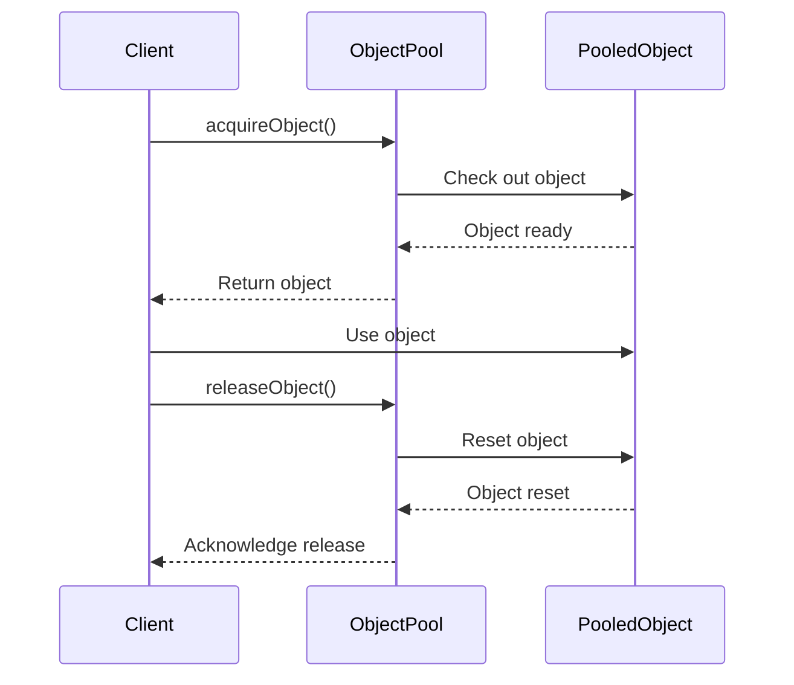

## 4.6 Object Pool Pattern

The Object Pool Pattern is a creational design pattern that focuses on optimizing resource management and performance by maintaining a pool of reusable objects. This pattern is particularly useful in scenarios where object creation and destruction are resource-intensive operations, such as managing database connections or handling large buffers for I/O operations. In this section, we will delve into the implementation of the Object Pool Pattern in the D programming language, leveraging its unique features to enhance performance and resource utilization.

### Purpose

The primary purpose of the Object Pool Pattern is to manage a pool of reusable objects, thereby reducing the overhead associated with creating and destroying objects repeatedly. By reusing objects, we can improve performance, especially in systems where object instantiation is costly.

### Implementing Object Pool in D

#### Pool Management

To implement an Object Pool in D, we need to create a system that allows objects to be checked out and returned to the pool. This involves maintaining a collection of available objects and a mechanism to track which objects are in use.

```d
import std.stdio;
import std.array;
import std.concurrency;
import std.exception;

class PooledObject {
    // Example resource-intensive object
    int data;

    this(int data) {
        this.data = data;
    }

    void reset() {
        // Reset object state
        data = 0;
    }
}

class ObjectPool {
    private PooledObject[] pool;
    private bool[] inUse;
    private size_t maxSize;

    this(size_t size) {
        maxSize = size;
        pool = new PooledObject[maxSize];
        inUse = new bool[maxSize];
        for (size_t i = 0; i < maxSize; i++) {
            pool[i] = new PooledObject(0);
            inUse[i] = false;
        }
    }

    PooledObject acquireObject() {
        for (size_t i = 0; i < maxSize; i++) {
            if (!inUse[i]) {
                inUse[i] = true;
                return pool[i];
            }
        }
        throw new Exception("No available objects in the pool.");
    }

    void releaseObject(PooledObject obj) {
        for (size_t i = 0; i < maxSize; i++) {
            if (pool[i] == obj) {
                inUse[i] = false;
                pool[i].reset();
                return;
            }
        }
        throw new Exception("Object not part of the pool.");
    }
}

void main() {
    auto pool = new ObjectPool(5);

    auto obj1 = pool.acquireObject();
    obj1.data = 42;
    writeln("Acquired object with data: ", obj1.data);

    pool.releaseObject(obj1);
    writeln("Released object.");

    auto obj2 = pool.acquireObject();
    writeln("Acquired object with data: ", obj2.data); // Should be reset to 0
}
```

In this example, we define a simple `PooledObject` class and an `ObjectPool` class that manages a fixed-size pool of these objects. The `acquireObject` method checks out an object from the pool, and the `releaseObject` method returns it to the pool, resetting its state.

#### Concurrency Considerations

When implementing an Object Pool in a multi-threaded environment, it is crucial to ensure thread safety. In D, we can use synchronization primitives such as mutexes or atomic operations to manage concurrent access to the pool.

```d
import core.sync.mutex;

class ThreadSafeObjectPool {
    private PooledObject[] pool;
    private bool[] inUse;
    private size_t maxSize;
    private Mutex mutex;

    this(size_t size) {
        maxSize = size;
        pool = new PooledObject[maxSize];
        inUse = new bool[maxSize];
        mutex = new Mutex();
        for (size_t i = 0; i < maxSize; i++) {
            pool[i] = new PooledObject(0);
            inUse[i] = false;
        }
    }

    PooledObject acquireObject() {
        synchronized(mutex) {
            for (size_t i = 0; i < maxSize; i++) {
                if (!inUse[i]) {
                    inUse[i] = true;
                    return pool[i];
                }
            }
        }
        throw new Exception("No available objects in the pool.");
    }

    void releaseObject(PooledObject obj) {
        synchronized(mutex) {
            for (size_t i = 0; i < maxSize; i++) {
                if (pool[i] == obj) {
                    inUse[i] = false;
                    pool[i].reset();
                    return;
                }
            }
        }
        throw new Exception("Object not part of the pool.");
    }
}
```

In this thread-safe version, we use a `Mutex` to synchronize access to the pool, ensuring that only one thread can acquire or release an object at a time.

### Resource Management

#### Lifecycle Handling

Proper lifecycle management is essential in an Object Pool to ensure that objects are correctly initialized and cleaned up. This involves resetting the object's state when it is returned to the pool and ensuring that resources are released when the pool is destroyed.

```d
class PooledObject {
    int data;
    bool isInitialized;

    this(int data) {
        this.data = data;
        this.isInitialized = true;
    }

    void reset() {
        data = 0;
        isInitialized = false;
    }

    void initialize(int newData) {
        data = newData;
        isInitialized = true;
    }
}

class ObjectPool {
    // ... (same as before)

    PooledObject acquireObject() {
        synchronized(mutex) {
            for (size_t i = 0; i < maxSize; i++) {
                if (!inUse[i]) {
                    inUse[i] = true;
                    pool[i].initialize(0); // Ensure object is initialized
                    return pool[i];
                }
            }
        }
        throw new Exception("No available objects in the pool.");
    }

    void releaseObject(PooledObject obj) {
        synchronized(mutex) {
            for (size_t i = 0; i < maxSize; i++) {
                if (pool[i] == obj) {
                    inUse[i] = false;
                    pool[i].reset(); // Clean up object state
                    return;
                }
            }
        }
        throw new Exception("Object not part of the pool.");
    }
}
```

In this enhanced version, we add an `initialize` method to the `PooledObject` class to ensure that objects are properly set up before use.

### Use Cases and Examples

#### Connection Pools

One of the most common use cases for the Object Pool Pattern is managing database or network connections. Establishing a connection can be a time-consuming operation, and reusing connections can significantly improve performance.

```d
class DatabaseConnection {
    bool isConnected;

    this() {
        connect();
    }

    void connect() {
        // Simulate connection setup
        isConnected = true;
    }

    void disconnect() {
        // Simulate connection teardown
        isConnected = false;
    }

    void reset() {
        disconnect();
        connect();
    }
}

class ConnectionPool {
    private DatabaseConnection[] pool;
    private bool[] inUse;
    private size_t maxSize;
    private Mutex mutex;

    this(size_t size) {
        maxSize = size;
        pool = new DatabaseConnection[maxSize];
        inUse = new bool[maxSize];
        mutex = new Mutex();
        for (size_t i = 0; i < maxSize; i++) {
            pool[i] = new DatabaseConnection();
            inUse[i] = false;
        }
    }

    DatabaseConnection acquireConnection() {
        synchronized(mutex) {
            for (size_t i = 0; i < maxSize; i++) {
                if (!inUse[i]) {
                    inUse[i] = true;
                    return pool[i];
                }
            }
        }
        throw new Exception("No available connections in the pool.");
    }

    void releaseConnection(DatabaseConnection conn) {
        synchronized(mutex) {
            for (size_t i = 0; i < maxSize; i++) {
                if (pool[i] == conn) {
                    inUse[i] = false;
                    pool[i].reset();
                    return;
                }
            }
        }
        throw new Exception("Connection not part of the pool.");
    }
}
```

In this example, we create a `ConnectionPool` class that manages a pool of `DatabaseConnection` objects, ensuring that connections are reused and properly reset.

#### Reusable Buffers

Another use case for the Object Pool Pattern is managing reusable buffers for I/O operations or memory-intensive tasks. By reusing buffers, we can reduce the overhead of memory allocation and deallocation.

```d
class Buffer {
    ubyte[] data;

    this(size_t size) {
        data = new ubyte[size];
    }

    void reset() {
        data[] = 0;
    }
}

class BufferPool {
    private Buffer[] pool;
    private bool[] inUse;
    private size_t maxSize;
    private Mutex mutex;

    this(size_t size, size_t bufferSize) {
        maxSize = size;
        pool = new Buffer[maxSize];
        inUse = new bool[maxSize];
        mutex = new Mutex();
        for (size_t i = 0; i < maxSize; i++) {
            pool[i] = new Buffer(bufferSize);
            inUse[i] = false;
        }
    }

    Buffer acquireBuffer() {
        synchronized(mutex) {
            for (size_t i = 0; i < maxSize; i++) {
                if (!inUse[i]) {
                    inUse[i] = true;
                    return pool[i];
                }
            }
        }
        throw new Exception("No available buffers in the pool.");
    }

    void releaseBuffer(Buffer buf) {
        synchronized(mutex) {
            for (size_t i = 0; i < maxSize; i++) {
                if (pool[i] == buf) {
                    inUse[i] = false;
                    pool[i].reset();
                    return;
                }
            }
        }
        throw new Exception("Buffer not part of the pool.");
    }
}
```

In this example, we define a `BufferPool` class that manages a pool of `Buffer` objects, allowing buffers to be reused for efficient memory management.

### Design Considerations

When implementing the Object Pool Pattern, consider the following:

- **Pool Size**: Determine the optimal size of the pool based on the application's requirements and resource constraints.
- **Initialization and Cleanup**: Ensure that objects are properly initialized and cleaned up to prevent resource leaks.
- **Concurrency**: Implement thread-safe mechanisms to manage concurrent access to the pool.
- **Performance**: Measure the performance benefits of using an object pool and adjust the implementation as needed.

### Differences and Similarities

The Object Pool Pattern is often compared to other creational patterns like the Singleton Pattern and Factory Method Pattern. While the Singleton Pattern ensures a single instance of a class, the Object Pool Pattern manages multiple instances for reuse. The Factory Method Pattern focuses on creating objects, whereas the Object Pool Pattern emphasizes reusing existing objects.

### Visualizing the Object Pool Pattern

To better understand the Object Pool Pattern, let's visualize the process of acquiring and releasing objects from the pool.



This sequence diagram illustrates the interaction between the client, the object pool, and the pooled objects during the acquire and release process.

### Try It Yourself

Experiment with the provided code examples by modifying the pool size, object types, or adding additional functionality such as logging or monitoring. Observe how these changes affect performance and resource utilization.

### References and Links

- [D Programming Language Official Website](https://dlang.org/)
- [Concurrency in D](https://dlang.org/phobos/std_concurrency.html)
- [Memory Management in D](https://dlang.org/spec/garbage.html)

### Knowledge Check

- What is the primary purpose of the Object Pool Pattern?
- How does the Object Pool Pattern improve performance?
- What are some common use cases for the Object Pool Pattern?
- How can you ensure thread safety when implementing an Object Pool?
- What are the key differences between the Object Pool Pattern and the Singleton Pattern?

### Embrace the Journey

Remember, mastering design patterns like the Object Pool Pattern is just the beginning. As you continue to explore the D programming language, you'll discover new ways to optimize performance and manage resources effectively. Keep experimenting, stay curious, and enjoy the journey!

## Quiz Time!



### What is the primary purpose of the Object Pool Pattern?

- [x] To manage a pool of reusable objects to improve performance and resource utilization.
- [ ] To create a single instance of a class.
- [ ] To provide a way to create objects without specifying the exact class.
- [ ] To define a family of algorithms.

> **Explanation:** The Object Pool Pattern focuses on managing a pool of reusable objects to optimize performance and resource utilization.

### How does the Object Pool Pattern improve performance?

- [x] By reusing objects instead of creating and destroying them repeatedly.
- [ ] By ensuring a single instance of a class is used.
- [ ] By allowing objects to be created without specifying the exact class.
- [ ] By defining a family of algorithms.

> **Explanation:** The Object Pool Pattern improves performance by reusing objects, reducing the overhead of object creation and destruction.

### What is a common use case for the Object Pool Pattern?

- [x] Managing database or network connections.
- [ ] Implementing a single instance of a class.
- [ ] Creating objects without specifying the exact class.
- [ ] Defining a family of algorithms.

> **Explanation:** A common use case for the Object Pool Pattern is managing database or network connections, where connection setup is resource-intensive.

### How can you ensure thread safety when implementing an Object Pool?

- [x] By using synchronization primitives like mutexes.
- [ ] By creating a single instance of the pool.
- [ ] By allowing objects to be created without specifying the exact class.
- [ ] By defining a family of algorithms.

> **Explanation:** Thread safety in an Object Pool can be ensured by using synchronization primitives like mutexes to manage concurrent access.

### What is a key difference between the Object Pool Pattern and the Singleton Pattern?

- [x] The Object Pool Pattern manages multiple instances for reuse, while the Singleton Pattern ensures a single instance.
- [ ] The Object Pool Pattern creates objects without specifying the exact class.
- [ ] The Object Pool Pattern defines a family of algorithms.
- [ ] The Object Pool Pattern ensures a single instance of a class.

> **Explanation:** The Object Pool Pattern manages multiple instances for reuse, whereas the Singleton Pattern ensures only one instance of a class exists.

### What should be considered when determining the pool size in an Object Pool?

- [x] The application's requirements and resource constraints.
- [ ] The number of algorithms to define.
- [ ] The exact class of objects to create.
- [ ] The number of single instances needed.

> **Explanation:** When determining the pool size, consider the application's requirements and resource constraints to optimize performance.

### What is the role of the `reset` method in a pooled object?

- [x] To clean up the object's state before returning it to the pool.
- [ ] To create a new instance of the object.
- [ ] To define a family of algorithms.
- [ ] To ensure a single instance of the object.

> **Explanation:** The `reset` method cleans up the object's state before it is returned to the pool, ensuring it is ready for reuse.

### What is the benefit of using an Object Pool for reusable buffers?

- [x] It reduces the overhead of memory allocation and deallocation.
- [ ] It ensures a single instance of the buffer.
- [ ] It allows buffers to be created without specifying the exact class.
- [ ] It defines a family of algorithms for buffers.

> **Explanation:** Using an Object Pool for reusable buffers reduces the overhead of memory allocation and deallocation, improving performance.

### How does the Object Pool Pattern relate to resource management?

- [x] It optimizes resource management by reusing objects and reducing creation overhead.
- [ ] It creates a single instance of a resource.
- [ ] It allows resources to be created without specifying the exact class.
- [ ] It defines a family of algorithms for resource management.

> **Explanation:** The Object Pool Pattern optimizes resource management by reusing objects, reducing the overhead of repeatedly creating and destroying them.

### True or False: The Object Pool Pattern is only useful for managing database connections.

- [ ] True
- [x] False

> **Explanation:** False. The Object Pool Pattern is useful for managing various types of resources, including database connections, network connections, and reusable buffers.


