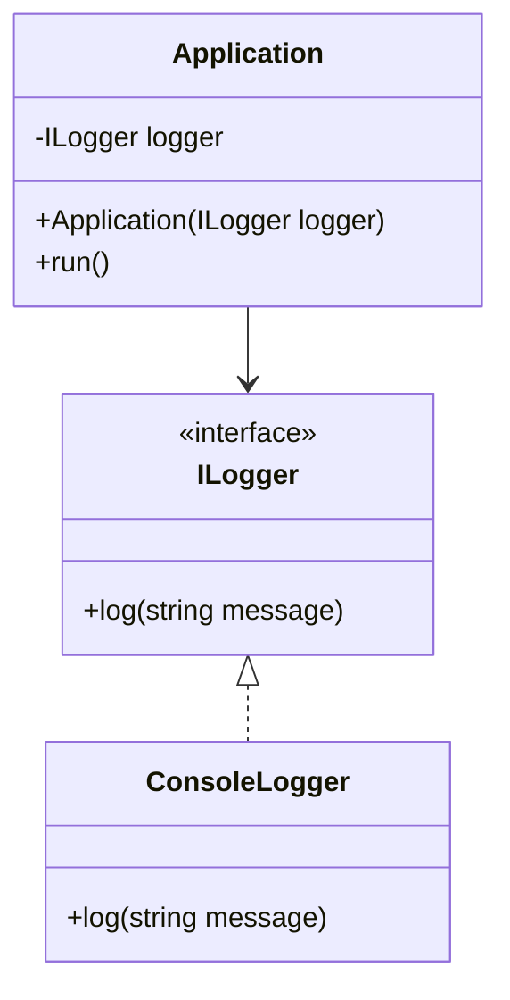

## 4.7 Dependency Injection Pattern

The Dependency Injection (DI) pattern is a fundamental design pattern that promotes loose coupling and enhances the modularity of software systems. By adhering to the dependency inversion principle, DI allows dependencies to be injected into a component rather than being created by the component itself. This pattern is particularly beneficial in systems programming with D, where flexibility, testability, and maintainability are paramount.

### Purpose

The primary purpose of the Dependency Injection pattern is to decouple the instantiation of a class from its dependencies, thereby promoting a more modular and testable architecture. This is achieved by injecting dependencies into a class, rather than allowing the class to create them directly. This approach aligns with the dependency inversion principle, which states that high-level modules should not depend on low-level modules, but both should depend on abstractions.

### Implementing Dependency Injection in D

In D, implementing Dependency Injection can be accomplished through various techniques, including constructor injection, property and method injection, and the use of interfaces and abstract classes. Let's explore each of these methods in detail.

#### Constructor Injection

Constructor injection is the most common form of dependency injection. It involves passing dependencies to a class through its constructor. This method ensures that a class is always in a valid state, as its dependencies are provided at the time of instantiation.

```d
interface ILogger {
    void log(string message);
}

class ConsoleLogger : ILogger {
    void log(string message) {
        writeln("Log: ", message);
    }
}

class Application {
    private ILogger logger;

    this(ILogger logger) {
        this.logger = logger;
    }

    void run() {
        logger.log("Application is running.");
    }
}

void main() {
    ILogger logger = new ConsoleLogger();
    Application app = new Application(logger);
    app.run();
}
```

In this example, the `Application` class depends on an `ILogger` interface. The `ConsoleLogger` class implements this interface, and an instance of `ConsoleLogger` is injected into the `Application` class via its constructor.

#### Property and Method Injection

Property and method injection provide an alternative to constructor injection by setting dependencies through properties or methods. This approach is useful when dependencies are optional or when they need to be changed after object creation.

```d
class Application {
    private ILogger logger;

    void setLogger(ILogger logger) {
        this.logger = logger;
    }

    void run() {
        if (logger) {
            logger.log("Application is running.");
        } else {
            writeln("Logger not set.");
        }
    }
}

void main() {
    ILogger logger = new ConsoleLogger();
    Application app = new Application();
    app.setLogger(logger);
    app.run();
}
```

Here, the `Application` class provides a `setLogger` method to inject the `ILogger` dependency. This allows for greater flexibility in configuring the application.

#### Interfaces and Abstract Classes

Using interfaces and abstract classes is a powerful way to decouple implementations from their usage. By relying on abstractions, we can easily swap out implementations without affecting the dependent code.

```d
abstract class Database {
    abstract void connect();
}

class MySQLDatabase : Database {
    override void connect() {
        writeln("Connecting to MySQL database.");
    }
}

class Application {
    private Database database;

    this(Database database) {
        this.database = database;
    }

    void start() {
        database.connect();
    }
}

void main() {
    Database db = new MySQLDatabase();
    Application app = new Application(db);
    app.start();
}
```

In this example, the `Application` class depends on the `Database` abstraction, allowing for different database implementations to be injected without modifying the `Application` class.

### Inversion of Control Containers

Inversion of Control (IoC) containers are frameworks that manage the creation and lifecycle of dependencies. They automate the process of dependency injection, making it easier to manage complex dependency graphs.

#### Implementing a DI Container

Implementing a simple DI container in D involves creating a registry of dependencies and resolving them as needed. Here's a basic example:

```d
class DIContainer {
    private alias Factory = Object delegate();
    private Factory[string] factories;

    void register(string name, Factory factory) {
        factories[name] = factory;
    }

    Object resolve(string name) {
        return factories[name]();
    }
}

void main() {
    auto container = new DIContainer();
    container.register("logger", () => new ConsoleLogger());

    ILogger logger = cast(ILogger) container.resolve("logger");
    logger.log("Dependency Injection with DI Container.");
}
```

This simple DI container allows us to register and resolve dependencies by name, providing a basic mechanism for managing dependencies.

#### Third-Party Libraries

While D does not have a plethora of DI frameworks like some other languages, there are libraries available that can facilitate dependency injection. Exploring these libraries can provide additional features and ease of use.

### Use Cases and Examples

Dependency Injection is particularly useful in scenarios where flexibility, testability, and modularity are required.

#### Testing and Mocking

DI facilitates unit testing by allowing mock dependencies to be injected into a class. This enables testing of a class in isolation from its dependencies.

```d
class MockLogger : ILogger {
    void log(string message) {
        writeln("Mock log: ", message);
    }
}

void main() {
    ILogger mockLogger = new MockLogger();
    Application app = new Application(mockLogger);
    app.run(); // Outputs: Mock log: Application is running.
}
```

By injecting a `MockLogger`, we can test the `Application` class without relying on the actual `ConsoleLogger` implementation.

#### Modular Applications

DI enhances the modularity of applications by decoupling components and promoting reusability. This is particularly beneficial in large systems where components need to be developed and maintained independently.

### Visualizing Dependency Injection

To better understand the flow of dependencies in a system using DI, let's visualize the process with a class diagram.



**Diagram Description**: This class diagram illustrates the relationship between the `Application`, `ILogger`, and `ConsoleLogger` classes. The `Application` class depends on the `ILogger` interface, which is implemented by the `ConsoleLogger` class. This setup allows for different logger implementations to be injected into the `Application`.

### Design Considerations

When implementing Dependency Injection in D, consider the following:

- **Lifecycle Management**: Ensure that dependencies are managed correctly, especially when dealing with resources that need to be disposed of.
- **Performance**: Be mindful of the overhead introduced by DI, particularly in performance-critical applications.
- **Complexity**: While DI promotes modularity, it can also introduce complexity. Use it judiciously and avoid over-engineering.

### Differences and Similarities

Dependency Injection is often confused with other patterns like Service Locator. While both manage dependencies, DI injects them directly into a class, whereas Service Locator provides a mechanism to look up dependencies.

### Try It Yourself

Experiment with the provided code examples by modifying the injected dependencies. Try creating different implementations of the `ILogger` interface and observe how the `Application` class behaves with each.

### Knowledge Check

- Explain the benefits of using Dependency Injection in a software system.
- Describe the differences between constructor injection and property injection.
- How does Dependency Injection facilitate unit testing?

### Embrace the Journey

Remember, mastering Dependency Injection is a journey. As you continue to explore and implement DI in your projects, you'll discover new ways to enhance the flexibility and maintainability of your software. Keep experimenting, stay curious, and enjoy the process!

## Quiz Time!



### What is the primary purpose of the Dependency Injection pattern?

- [x] To decouple the instantiation of a class from its dependencies
- [ ] To increase the performance of a software system
- [ ] To simplify the user interface design
- [ ] To enhance the security of a software system

> **Explanation:** The primary purpose of Dependency Injection is to decouple the instantiation of a class from its dependencies, promoting a more modular and testable architecture.

### Which of the following is a form of dependency injection?

- [x] Constructor Injection
- [ ] Singleton Pattern
- [ ] Observer Pattern
- [ ] Factory Method

> **Explanation:** Constructor Injection is a form of dependency injection where dependencies are passed to a class through its constructor.

### What is the role of an IoC container in Dependency Injection?

- [x] To manage the creation and lifecycle of dependencies
- [ ] To handle user authentication
- [ ] To render the user interface
- [ ] To compile the source code

> **Explanation:** An IoC container manages the creation and lifecycle of dependencies, automating the process of dependency injection.

### How does Dependency Injection facilitate unit testing?

- [x] By allowing mock dependencies to be injected into a class
- [ ] By increasing the execution speed of tests
- [ ] By reducing the number of test cases needed
- [ ] By automatically generating test reports

> **Explanation:** Dependency Injection facilitates unit testing by allowing mock dependencies to be injected into a class, enabling testing in isolation from actual implementations.

### What is a potential drawback of using Dependency Injection?

- [x] It can introduce complexity
- [ ] It decreases code readability
- [ ] It reduces code reusability
- [ ] It limits the use of interfaces

> **Explanation:** While Dependency Injection promotes modularity, it can also introduce complexity, especially in large systems with many dependencies.

### Which of the following is NOT a method of implementing Dependency Injection?

- [ ] Constructor Injection
- [ ] Property Injection
- [ ] Method Injection
- [x] Singleton Injection

> **Explanation:** Singleton Injection is not a recognized method of implementing Dependency Injection. The common methods are Constructor, Property, and Method Injection.

### What is the Dependency Inversion Principle?

- [x] High-level modules should not depend on low-level modules, but both should depend on abstractions
- [ ] Low-level modules should not depend on high-level modules, but both should depend on concrete implementations
- [ ] High-level modules should depend on low-level modules
- [ ] Low-level modules should depend on high-level modules

> **Explanation:** The Dependency Inversion Principle states that high-level modules should not depend on low-level modules, but both should depend on abstractions.

### In the context of DI, what is a "mock"?

- [x] A simulated object that mimics the behavior of real objects
- [ ] A type of database used for testing
- [ ] A graphical user interface component
- [ ] A network protocol

> **Explanation:** In the context of DI, a "mock" is a simulated object that mimics the behavior of real objects, used for testing purposes.

### What is a benefit of using interfaces in Dependency Injection?

- [x] They allow for different implementations to be injected without modifying dependent code
- [ ] They increase the execution speed of the application
- [ ] They simplify the user interface design
- [ ] They enhance the security of the application

> **Explanation:** Using interfaces in Dependency Injection allows for different implementations to be injected without modifying dependent code, promoting flexibility and modularity.

### Dependency Injection can be used to enhance the modularity of applications.

- [x] True
- [ ] False

> **Explanation:** True. Dependency Injection enhances the modularity of applications by decoupling components and promoting reusability.


