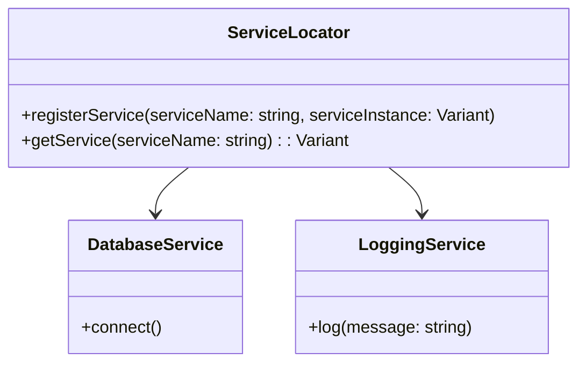

## 4.8 Service Locator Pattern

In the realm of software architecture, managing dependencies effectively is crucial for building scalable and maintainable systems. The Service Locator Pattern is a creational design pattern that provides a global registry for obtaining services or dependencies. This pattern is particularly useful in scenarios where dependency injection (DI) is impractical or when dealing with legacy codebases. In this section, we will explore the implementation of the Service Locator Pattern in the D programming language, discuss its use cases, and examine the criticisms and alternatives associated with it.

### Purpose

The primary purpose of the Service Locator Pattern is to provide a centralized mechanism for accessing services or dependencies. This pattern abstracts the process of locating and retrieving service instances, allowing for a more modular and flexible architecture. By using a service locator, developers can decouple the client code from the concrete implementations of services, promoting a more maintainable and scalable system design.

### Implementing Service Locator in D

#### Centralized Access

To implement the Service Locator Pattern in D, we start by creating a centralized registry that holds references to service instances. This registry acts as a global access point for retrieving services, allowing clients to obtain the necessary dependencies without directly instantiating them.

```d
module service_locator;

import std.stdio;
import std.typecons;

class ServiceLocator {
    private static ServiceLocator instance;
    private static immutable string[] services = ["DatabaseService", "LoggingService"];
    private static Variant[string] serviceRegistry;

    static this() {
        instance = new ServiceLocator();
    }

    static ServiceLocator getInstance() {
        return instance;
    }

    void registerService(string serviceName, Variant serviceInstance) {
        serviceRegistry[serviceName] = serviceInstance;
    }

    Variant getService(string serviceName) {
        return serviceRegistry.get(serviceName, Variant.init);
    }
}
```

In this example, the `ServiceLocator` class maintains a static instance of itself and a registry of services. The `registerService` method allows for adding services to the registry, while the `getService` method retrieves the service instance by name.

#### Service Registration and Retrieval

Once the service locator is in place, services can be registered and retrieved as needed. This process involves adding service instances to the registry and accessing them through the service locator.

```d
module main;

import std.stdio;
import service_locator;

class DatabaseService {
    void connect() {
        writeln("Connecting to the database...");
    }
}

class LoggingService {
    void log(string message) {
        writeln("Log: ", message);
    }
}

void main() {
    auto locator = ServiceLocator.getInstance();

    // Register services
    locator.registerService("DatabaseService", new DatabaseService());
    locator.registerService("LoggingService", new LoggingService());

    // Retrieve and use services
    auto dbService = locator.getService("DatabaseService").get!DatabaseService();
    dbService.connect();

    auto logService = locator.getService("LoggingService").get!LoggingService();
    logService.log("Service Locator Pattern in action!");
}
```

In this code snippet, we register instances of `DatabaseService` and `LoggingService` with the service locator. We then retrieve these services using the `getService` method and invoke their respective methods.

### Criticism and Alternatives

While the Service Locator Pattern offers several benefits, it is not without its criticisms. Understanding these drawbacks is essential for making informed architectural decisions.

#### Tight Coupling

One of the primary criticisms of the Service Locator Pattern is that it can lead to tight coupling between the client code and the service locator. Unlike dependency injection, where dependencies are explicitly passed to the client, the service locator hides the dependency resolution process. This can make the code less transparent and harder to test.

#### Hidden Dependencies

Another drawback is the risk of hidden dependencies. Since the service locator abstracts the process of obtaining services, it can be challenging to determine which dependencies a particular piece of code relies on. This can lead to maintenance challenges and make the codebase harder to understand.

### Use Cases and Examples

Despite its criticisms, the Service Locator Pattern is useful in certain scenarios, particularly in legacy codebases and plugin architectures.

#### Legacy Codebases

In legacy systems where refactoring to use dependency injection is impractical, the Service Locator Pattern can provide a way to manage dependencies without extensive code changes. By introducing a service locator, developers can gradually decouple components and improve the system's modularity.

#### Plugin Architectures

In plugin-based systems, the Service Locator Pattern can facilitate the dynamic loading and retrieval of services. By using a service locator, plugins can register their services at runtime, allowing the host application to access them without prior knowledge of their existence.

### Visualizing the Service Locator Pattern

To better understand the Service Locator Pattern, let's visualize its components and interactions using a class diagram.



In this diagram, the `ServiceLocator` class interacts with `DatabaseService` and `LoggingService`, providing a centralized access point for these services.

### Design Considerations

When implementing the Service Locator Pattern in D, consider the following design considerations:

- **Use with Caution**: The Service Locator Pattern should be used judiciously, particularly in systems where transparency and testability are critical.
- **Combine with Other Patterns**: Consider combining the Service Locator Pattern with other design patterns, such as the Factory Method Pattern, to enhance flexibility and maintainability.
- **Monitor Performance**: Be mindful of the performance implications of using a service locator, especially in high-performance systems where latency is a concern.

### Differences and Similarities

The Service Locator Pattern is often compared to the Dependency Injection Pattern. While both patterns aim to manage dependencies, they differ in their approach:

- **Dependency Injection**: Dependencies are explicitly passed to the client, promoting transparency and testability.
- **Service Locator**: Dependencies are retrieved from a centralized registry, which can lead to hidden dependencies and tight coupling.

### Try It Yourself

To deepen your understanding of the Service Locator Pattern, try modifying the code examples provided:

- **Add New Services**: Implement additional services and register them with the service locator.
- **Experiment with Retrieval**: Modify the retrieval logic to handle cases where a service is not registered.
- **Combine with Other Patterns**: Integrate the Service Locator Pattern with other design patterns, such as the Singleton Pattern, to explore different architectural approaches.

### Embrace the Journey

Remember, mastering design patterns is a journey. As you explore the Service Locator Pattern and its applications, you'll gain valuable insights into managing dependencies and building scalable systems. Keep experimenting, stay curious, and enjoy the process of learning and discovery!

## Quiz Time!



### What is the primary purpose of the Service Locator Pattern?

- [x] To provide a centralized mechanism for accessing services or dependencies.
- [ ] To enforce strict type safety in service retrieval.
- [ ] To replace all instances of dependency injection.
- [ ] To improve the performance of service-based applications.

> **Explanation:** The Service Locator Pattern provides a centralized mechanism for accessing services or dependencies, allowing for a more modular and flexible architecture.

### What is a common criticism of the Service Locator Pattern?

- [x] It can lead to tight coupling between client code and the service locator.
- [ ] It enforces too much transparency in code.
- [ ] It is incompatible with legacy systems.
- [ ] It requires extensive refactoring to implement.

> **Explanation:** A common criticism of the Service Locator Pattern is that it can lead to tight coupling between client code and the service locator, making the code less transparent and harder to test.

### In which scenario is the Service Locator Pattern particularly useful?

- [x] In legacy systems where refactoring to use dependency injection is impractical.
- [ ] In systems that require strict compile-time type checking.
- [ ] In applications with no external dependencies.
- [ ] In systems that do not use any design patterns.

> **Explanation:** The Service Locator Pattern is particularly useful in legacy systems where refactoring to use dependency injection is impractical, as it allows for managing dependencies without extensive code changes.

### How does the Service Locator Pattern differ from Dependency Injection?

- [x] Dependencies are retrieved from a centralized registry in the Service Locator Pattern.
- [ ] Dependencies are explicitly passed to the client in the Service Locator Pattern.
- [ ] The Service Locator Pattern enforces compile-time dependency resolution.
- [ ] The Service Locator Pattern is used only in functional programming.

> **Explanation:** In the Service Locator Pattern, dependencies are retrieved from a centralized registry, whereas in Dependency Injection, dependencies are explicitly passed to the client.

### What is a potential drawback of using the Service Locator Pattern?

- [x] Hidden dependencies can make the codebase harder to understand.
- [ ] It requires all services to be implemented as singletons.
- [ ] It enforces strict compile-time checks.
- [ ] It is incompatible with modern programming languages.

> **Explanation:** A potential drawback of using the Service Locator Pattern is that hidden dependencies can make the codebase harder to understand and maintain.

### Which design pattern can be combined with the Service Locator Pattern to enhance flexibility?

- [x] Factory Method Pattern
- [ ] Singleton Pattern
- [ ] Observer Pattern
- [ ] Strategy Pattern

> **Explanation:** The Factory Method Pattern can be combined with the Service Locator Pattern to enhance flexibility and maintainability.

### What is a key benefit of using the Service Locator Pattern in plugin architectures?

- [x] It facilitates the dynamic loading and retrieval of services.
- [ ] It enforces strict compile-time type checking.
- [ ] It eliminates the need for service registration.
- [ ] It improves the performance of all plugins.

> **Explanation:** In plugin architectures, the Service Locator Pattern facilitates the dynamic loading and retrieval of services, allowing the host application to access them without prior knowledge of their existence.

### How can the Service Locator Pattern be visualized?

- [x] Using a class diagram to represent the components and interactions.
- [ ] Using a sequence diagram to show the order of service retrieval.
- [ ] Using a flowchart to depict the service registration process.
- [ ] Using a pie chart to illustrate service usage statistics.

> **Explanation:** The Service Locator Pattern can be visualized using a class diagram to represent the components and interactions involved in the pattern.

### What should be monitored when using the Service Locator Pattern in high-performance systems?

- [x] The performance implications and potential latency.
- [ ] The number of services registered.
- [ ] The compile-time type safety.
- [ ] The number of lines of code.

> **Explanation:** When using the Service Locator Pattern in high-performance systems, it is important to monitor the performance implications and potential latency.

### True or False: The Service Locator Pattern is always the best choice for managing dependencies in modern systems.

- [ ] True
- [x] False

> **Explanation:** False. The Service Locator Pattern is not always the best choice for managing dependencies in modern systems, as it can lead to tight coupling and hidden dependencies. It should be used judiciously and in appropriate scenarios.


