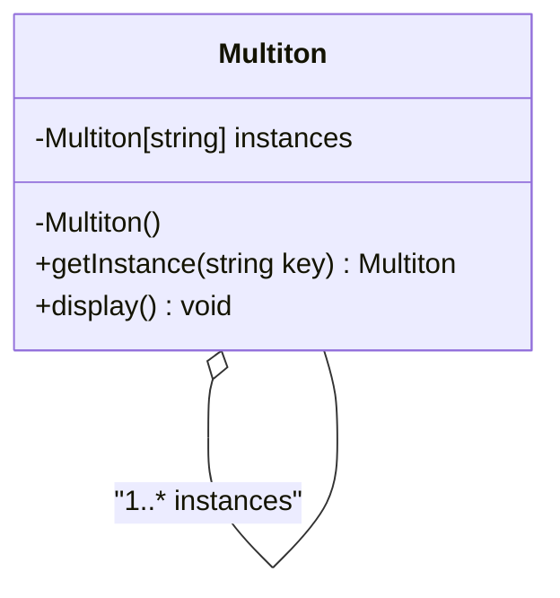

## 4.9 Multiton Pattern

The Multiton Pattern is a creational design pattern that extends the Singleton pattern by allowing multiple instances of a class to be created, each identified by a unique key. This pattern is particularly useful in scenarios where you need to manage a set of named instances, such as database connections or configuration settings. In this section, we will delve into the Multiton Pattern, its implementation in the D programming language, and its practical applications.

### Purpose

The primary purpose of the Multiton Pattern is to manage a map of named instances, providing controlled access to these instances. Unlike the Singleton pattern, which restricts the instantiation of a class to a single object, the Multiton pattern allows for multiple instances, each associated with a unique key. This makes it ideal for scenarios where different instances are required for different contexts.

### Implementing Multiton in D

#### Instance Registry

In D, we can leverage associative arrays to implement the instance registry for the Multiton pattern. Associative arrays in D provide an efficient way to map keys to values, making them an ideal choice for storing instances identified by unique keys.

```d
import std.stdio;
import std.string;
import std.conv;

class Multiton {
    private static Multiton[string] instances;

    private this() {
        // Private constructor to prevent direct instantiation
    }

    public static Multiton getInstance(string key) {
        if (!instances.exists(key)) {
            instances[key] = new Multiton();
        }
        return instances[key];
    }

    public void display() {
        writeln("Instance with key: ", this.toString());
    }
}

void main() {
    auto instance1 = Multiton.getInstance("first");
    auto instance2 = Multiton.getInstance("second");
    auto instance3 = Multiton.getInstance("first");

    instance1.display();
    instance2.display();
    instance3.display();

    // Verify that instance1 and instance3 are the same
    assert(instance1 is instance3);
}
```

**Explanation:**

- **Associative Array**: We use a static associative array `instances` to store instances of the `Multiton` class, indexed by a string key.
- **Private Constructor**: The constructor is private to prevent direct instantiation of the class.
- **getInstance Method**: This method checks if an instance with the given key exists. If not, it creates a new instance and stores it in the associative array.

#### Controlled Access

The Multiton pattern provides controlled access to instances through a centralized method. This ensures that instances are created and accessed in a consistent manner.

- **Key-Based Access**: Instances are accessed using a unique key, allowing for easy retrieval and management.
- **Lazy Initialization**: Instances are created only when they are first requested, optimizing resource usage.

### Use Cases and Examples

#### Resource Management

One of the primary use cases for the Multiton pattern is resource management. For example, managing database connections where each connection is identified by a unique user or session ID.

```d
class DatabaseConnection {
    private static DatabaseConnection[string] connections;

    private this() {
        // Simulate a database connection
    }

    public static DatabaseConnection getConnection(string userId) {
        if (!connections.exists(userId)) {
            connections[userId] = new DatabaseConnection();
        }
        return connections[userId];
    }

    public void query(string sql) {
        writeln("Executing query for user: ", sql);
    }
}

void main() {
    auto user1Connection = DatabaseConnection.getConnection("user1");
    auto user2Connection = DatabaseConnection.getConnection("user2");
    auto user1ConnectionAgain = DatabaseConnection.getConnection("user1");

    user1Connection.query("SELECT * FROM users");
    user2Connection.query("SELECT * FROM orders");

    // Verify that user1Connection and user1ConnectionAgain are the same
    assert(user1Connection is user1ConnectionAgain);
}
```

**Explanation:**

- **User-Specific Connections**: Each user gets a unique database connection, identified by their user ID.
- **Reusability**: The same connection is reused for the same user, reducing overhead.

#### Configuration Settings

Another common use case for the Multiton pattern is managing configuration settings for different contexts. This is particularly useful in applications that need to support multiple environments, such as development, testing, and production.

```d
class ConfigurationManager {
    private static ConfigurationManager[string] configurations;

    private string environment;

    private this(string environment) {
        this.environment = environment;
        // Load configuration for the specified environment
    }

    public static ConfigurationManager getConfiguration(string environment) {
        if (!configurations.exists(environment)) {
            configurations[environment] = new ConfigurationManager(environment);
        }
        return configurations[environment];
    }

    public void displaySettings() {
        writeln("Configuration for environment: ", environment);
    }
}

void main() {
    auto devConfig = ConfigurationManager.getConfiguration("development");
    auto prodConfig = ConfigurationManager.getConfiguration("production");
    auto testConfig = ConfigurationManager.getConfiguration("testing");

    devConfig.displaySettings();
    prodConfig.displaySettings();
    testConfig.displaySettings();
}
```

**Explanation:**

- **Environment-Specific Configurations**: Each environment has its own configuration settings, managed by the `ConfigurationManager`.
- **Centralized Management**: Configurations are managed centrally, ensuring consistency across different environments.

### Design Considerations

When implementing the Multiton pattern, there are several design considerations to keep in mind:

- **Thread Safety**: Ensure that the implementation is thread-safe if instances are accessed from multiple threads. This can be achieved using synchronization mechanisms provided by D, such as `synchronized` blocks or `std.concurrency`.
- **Memory Management**: Be mindful of memory usage, especially if the number of instances can grow significantly. Consider implementing a cleanup mechanism to remove unused instances.
- **Performance**: The use of associative arrays provides efficient access to instances, but performance can degrade if the number of keys becomes very large.

### Differences and Similarities

The Multiton pattern is often compared to the Singleton pattern due to their similarities in managing instances. However, there are key differences:

- **Singleton Pattern**: Restricts instantiation to a single instance, providing a global point of access.
- **Multiton Pattern**: Allows multiple instances, each identified by a unique key, providing controlled access to these instances.

### Visualizing the Multiton Pattern

To better understand the Multiton pattern, let's visualize its structure using a class diagram.



**Diagram Explanation:**

- **Multiton Class**: Represents the class implementing the Multiton pattern.
- **Instances**: An associative array storing instances of the Multiton class.
- **getInstance Method**: Provides access to instances based on a unique key.

### Try It Yourself

To deepen your understanding of the Multiton pattern, try modifying the code examples provided:

- **Add Logging**: Implement logging to track when instances are created and accessed.
- **Thread Safety**: Modify the implementation to make it thread-safe using D's concurrency features.
- **Cleanup Mechanism**: Implement a mechanism to remove instances that are no longer needed.

### Knowledge Check

Before we conclude, let's reinforce what we've learned with a few questions:

- What is the primary purpose of the Multiton pattern?
- How does the Multiton pattern differ from the Singleton pattern?
- What are some common use cases for the Multiton pattern?
- How can you ensure thread safety in a Multiton implementation?

### Embrace the Journey

Remember, mastering design patterns is a journey. The Multiton pattern is just one of many tools in your arsenal as a software engineer. As you continue to explore and experiment with design patterns, you'll gain a deeper understanding of how to build robust and scalable software systems. Keep experimenting, stay curious, and enjoy the journey!

## Quiz Time!



### What is the primary purpose of the Multiton pattern?

- [x] To manage a map of named instances
- [ ] To restrict instantiation to a single object
- [ ] To provide a global point of access
- [ ] To manage a list of unnamed instances

> **Explanation:** The Multiton pattern manages a map of named instances, allowing for multiple instances identified by unique keys.

### How does the Multiton pattern differ from the Singleton pattern?

- [x] It allows multiple instances identified by unique keys
- [ ] It restricts instantiation to a single instance
- [ ] It provides a global point of access
- [ ] It uses a list instead of a map

> **Explanation:** Unlike the Singleton pattern, the Multiton pattern allows multiple instances, each identified by a unique key.

### Which data structure is commonly used to implement the instance registry in the Multiton pattern in D?

- [x] Associative arrays
- [ ] Linked lists
- [ ] Stacks
- [ ] Queues

> **Explanation:** Associative arrays are commonly used in D to implement the instance registry for the Multiton pattern.

### What is a common use case for the Multiton pattern?

- [x] Managing database connections per user
- [ ] Implementing a global logger
- [ ] Creating a single configuration object
- [ ] Managing a list of tasks

> **Explanation:** The Multiton pattern is commonly used to manage resources like database connections, where each connection is identified by a unique key.

### How can you ensure thread safety in a Multiton implementation?

- [x] Use synchronization mechanisms like `synchronized` blocks
- [ ] Use a global variable
- [ ] Avoid using keys
- [ ] Use a list instead of a map

> **Explanation:** Thread safety can be ensured by using synchronization mechanisms provided by D, such as `synchronized` blocks.

### What is a potential drawback of the Multiton pattern?

- [x] Increased memory usage
- [ ] Restriction to a single instance
- [ ] Lack of controlled access
- [ ] Difficulty in implementation

> **Explanation:** The Multiton pattern can lead to increased memory usage if the number of instances grows significantly.

### What is lazy initialization in the context of the Multiton pattern?

- [x] Instances are created only when first requested
- [ ] Instances are created at program start
- [ ] Instances are never created
- [ ] Instances are created in a separate thread

> **Explanation:** Lazy initialization means that instances are created only when they are first requested, optimizing resource usage.

### In the Multiton pattern, how are instances accessed?

- [x] Using a unique key
- [ ] Using an index
- [ ] Using a global variable
- [ ] Using a random number

> **Explanation:** Instances in the Multiton pattern are accessed using a unique key, allowing for easy retrieval and management.

### What is a benefit of using the Multiton pattern for configuration settings?

- [x] Centralized management of configurations
- [ ] Restriction to a single configuration
- [ ] Increased complexity
- [ ] Lack of flexibility

> **Explanation:** The Multiton pattern allows for centralized management of configuration settings, ensuring consistency across different contexts.

### True or False: The Multiton pattern is a type of structural design pattern.

- [ ] True
- [x] False

> **Explanation:** The Multiton pattern is a creational design pattern, not a structural one.


