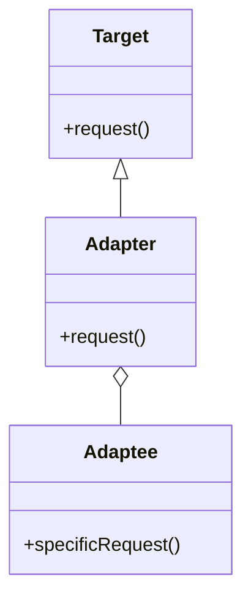

## 5.1 Adapter Pattern

In the realm of software design, the Adapter Pattern plays a crucial role in ensuring that different components of a system can communicate effectively, even if they were not originally designed to work together. This pattern is particularly useful in systems programming, where integrating various libraries and legacy systems is a common task. In this section, we will delve into the Adapter Pattern, its implementation in the D programming language, and explore practical use cases.

### Purpose of the Adapter Pattern

The primary purpose of the Adapter Pattern is to allow incompatible interfaces to work together. It achieves this by converting the interface of one class into another interface that a client expects. This pattern is part of the structural design patterns, which focus on how classes and objects are composed to form larger structures.

### Implementing Adapter in D

In D, the Adapter Pattern can be implemented in two main ways: through class adapters and object adapters. Each approach has its own advantages and is suited to different scenarios.

#### Class Adapters

Class adapters use inheritance to adapt one interface to another. This approach involves creating a new class that inherits from the target interface and implements the methods by delegating calls to an instance of the adaptee class.

**Example:**

```d
// Target interface
interface Target {
    void request();
}

// Adaptee class with an incompatible interface
class Adaptee {
    void specificRequest() {
        writeln("Specific request executed.");
    }
}

// Adapter class that makes Adaptee compatible with Target
class ClassAdapter : Target {
    private Adaptee adaptee;

    this(Adaptee adaptee) {
        this.adaptee = adaptee;
    }

    override void request() {
        adaptee.specificRequest();
    }
}

void main() {
    Adaptee adaptee = new Adaptee();
    Target adapter = new ClassAdapter(adaptee);
    adapter.request(); // Outputs: Specific request executed.
}
```

In this example, the `ClassAdapter` inherits from the `Target` interface and adapts the `Adaptee` class by implementing the `request` method, which internally calls the `specificRequest` method of the `Adaptee`.

#### Object Adapters

Object adapters use composition instead of inheritance. This approach involves creating an adapter class that holds an instance of the adaptee and implements the target interface by delegating calls to the adaptee.

**Example:**

```d
// Target interface
interface Target {
    void request();
}

// Adaptee class with an incompatible interface
class Adaptee {
    void specificRequest() {
        writeln("Specific request executed.");
    }
}

// Adapter class that makes Adaptee compatible with Target
class ObjectAdapter : Target {
    private Adaptee adaptee;

    this(Adaptee adaptee) {
        this.adaptee = adaptee;
    }

    override void request() {
        adaptee.specificRequest();
    }
}

void main() {
    Adaptee adaptee = new Adaptee();
    Target adapter = new ObjectAdapter(adaptee);
    adapter.request(); // Outputs: Specific request executed.
}
```

The `ObjectAdapter` class in this example holds a reference to an `Adaptee` object and implements the `Target` interface by forwarding the `request` call to the `specificRequest` method of the `Adaptee`.

### Use Cases and Examples

The Adapter Pattern is widely used in software development, particularly in scenarios where systems need to integrate with external libraries or legacy systems.

#### API Integration

When integrating third-party libraries, you may encounter situations where the library's interface does not match the expected interface of your application. The Adapter Pattern can be used to bridge this gap.

**Example:**

Consider a scenario where you are using a third-party logging library with a different interface than your application's logging system. You can create an adapter to make the library compatible with your system.

```d
// Application's logging interface
interface Logger {
    void log(string message);
}

// Third-party logging library
class ThirdPartyLogger {
    void writeLog(string msg) {
        writeln("Log: ", msg);
    }
}

// Adapter to make ThirdPartyLogger compatible with Logger
class LoggerAdapter : Logger {
    private ThirdPartyLogger thirdPartyLogger;

    this(ThirdPartyLogger thirdPartyLogger) {
        this.thirdPartyLogger = thirdPartyLogger;
    }

    override void log(string message) {
        thirdPartyLogger.writeLog(message);
    }
}

void main() {
    ThirdPartyLogger thirdPartyLogger = new ThirdPartyLogger();
    Logger logger = new LoggerAdapter(thirdPartyLogger);
    logger.log("Adapter pattern in action!"); // Outputs: Log: Adapter pattern in action!
}
```

#### Legacy Systems

In legacy systems, you often need to interface old code with new systems. The Adapter Pattern can help by creating a bridge between the old and new interfaces.

**Example:**

Suppose you have an old payment processing system that you want to integrate with a new e-commerce platform. You can use an adapter to make the old system's interface compatible with the new platform.

```d
// New platform's payment interface
interface PaymentProcessor {
    void processPayment(double amount);
}

// Legacy payment system
class LegacyPaymentSystem {
    void makePayment(double amount) {
        writeln("Payment of $", amount, " processed.");
    }
}

// Adapter to make LegacyPaymentSystem compatible with PaymentProcessor
class PaymentAdapter : PaymentProcessor {
    private LegacyPaymentSystem legacySystem;

    this(LegacyPaymentSystem legacySystem) {
        this.legacySystem = legacySystem;
    }

    override void processPayment(double amount) {
        legacySystem.makePayment(amount);
    }
}

void main() {
    LegacyPaymentSystem legacySystem = new LegacyPaymentSystem();
    PaymentProcessor paymentProcessor = new PaymentAdapter(legacySystem);
    paymentProcessor.processPayment(100.0); // Outputs: Payment of $100.0 processed.
}
```

### Visualizing the Adapter Pattern

To better understand the Adapter Pattern, let's visualize the relationships between the components using a class diagram.



**Diagram Description:** The class diagram illustrates the Adapter Pattern, showing how the `Adapter` class implements the `Target` interface and holds a reference to the `Adaptee` class. The `Adapter` class translates the `request` call into a `specificRequest` call on the `Adaptee`.

### Design Considerations

When implementing the Adapter Pattern in D, consider the following:

- **Class vs. Object Adapter**: Choose between class and object adapters based on your needs. Class adapters use inheritance, which can be limiting if the adaptee class is final or if you need to adapt multiple classes. Object adapters use composition, offering more flexibility.
- **Performance**: Adapters introduce an additional layer of abstraction, which may impact performance. Ensure that the benefits of using an adapter outweigh any performance costs.
- **Maintainability**: Adapters can simplify code maintenance by decoupling client code from specific implementations. However, they can also add complexity if overused.

### Differences and Similarities

The Adapter Pattern is often confused with other structural patterns, such as the Facade Pattern. While both patterns provide a simplified interface, the Adapter Pattern is specifically used to make two incompatible interfaces work together, whereas the Facade Pattern provides a unified interface to a set of interfaces in a subsystem.

### Try It Yourself

To deepen your understanding of the Adapter Pattern, try modifying the examples provided:

- **Experiment with Different Interfaces**: Create your own interfaces and adaptee classes, and implement adapters to make them compatible.
- **Combine Adapters**: Implement a scenario where multiple adapters are used together to integrate several incompatible systems.
- **Performance Testing**: Measure the performance impact of using adapters in your code and explore optimization techniques.

### References and Links

For further reading on the Adapter Pattern and related topics, consider the following resources:

- [Design Patterns: Elements of Reusable Object-Oriented Software](https://en.wikipedia.org/wiki/Design_Patterns) - The seminal book by Erich Gamma, Richard Helm, Ralph Johnson, and John Vlissides.
- [D Programming Language](https://dlang.org/) - Official website for the D programming language.
- [Adapter Pattern on Wikipedia](https://en.wikipedia.org/wiki/Adapter_pattern) - Overview of the Adapter Pattern.

### Knowledge Check

To reinforce your understanding of the Adapter Pattern, consider the following questions and exercises:

- **What are the key differences between class adapters and object adapters?**
- **How can the Adapter Pattern be used to integrate third-party libraries?**
- **What are some potential drawbacks of using the Adapter Pattern?**

### Embrace the Journey

Remember, mastering design patterns is a journey. As you continue to explore and implement patterns like the Adapter Pattern, you'll gain valuable insights into building robust and maintainable software systems. Keep experimenting, stay curious, and enjoy the process of learning and growing as a software engineer.

## Quiz Time!



### What is the primary purpose of the Adapter Pattern?

- [x] To allow incompatible interfaces to work together
- [ ] To provide a simplified interface to a complex subsystem
- [ ] To ensure that a class has only one instance
- [ ] To define a family of algorithms

> **Explanation:** The Adapter Pattern allows incompatible interfaces to work together by converting one interface into another.

### Which approach does a class adapter use?

- [x] Inheritance
- [ ] Composition
- [ ] Aggregation
- [ ] Delegation

> **Explanation:** A class adapter uses inheritance to adapt one interface to another.

### What is a key advantage of using object adapters over class adapters?

- [x] Flexibility
- [ ] Simplicity
- [ ] Performance
- [ ] Readability

> **Explanation:** Object adapters use composition, offering more flexibility than class adapters, which use inheritance.

### In the Adapter Pattern, what role does the adapter class play?

- [x] It translates requests from the target interface to the adaptee
- [ ] It provides a simplified interface to a complex subsystem
- [ ] It manages the lifecycle of objects
- [ ] It defines a family of algorithms

> **Explanation:** The adapter class translates requests from the target interface to the adaptee, allowing them to work together.

### Which of the following is a common use case for the Adapter Pattern?

- [x] API Integration
- [ ] Singleton Implementation
- [ ] Factory Method
- [ ] Observer Pattern

> **Explanation:** The Adapter Pattern is commonly used for API integration to adapt third-party libraries.

### What is a potential drawback of using the Adapter Pattern?

- [x] Performance impact due to additional abstraction
- [ ] Increased code readability
- [ ] Simplified code maintenance
- [ ] Enhanced flexibility

> **Explanation:** Adapters introduce an additional layer of abstraction, which may impact performance.

### How does the Adapter Pattern differ from the Facade Pattern?

- [x] The Adapter Pattern makes incompatible interfaces work together, while the Facade Pattern provides a unified interface
- [ ] The Adapter Pattern provides a unified interface, while the Facade Pattern makes incompatible interfaces work together
- [ ] Both patterns serve the same purpose
- [ ] The Adapter Pattern is used for concurrency, while the Facade Pattern is used for security

> **Explanation:** The Adapter Pattern makes incompatible interfaces work together, while the Facade Pattern provides a unified interface to a set of interfaces.

### Which D language feature is particularly useful for implementing object adapters?

- [x] Composition
- [ ] Inheritance
- [ ] Templates
- [ ] Mixins

> **Explanation:** Composition is particularly useful for implementing object adapters, as it allows for more flexibility.

### What is the role of the adaptee in the Adapter Pattern?

- [x] It is the existing interface that needs to be adapted
- [ ] It is the new interface that clients expect
- [ ] It manages the lifecycle of objects
- [ ] It defines a family of algorithms

> **Explanation:** The adaptee is the existing interface that needs to be adapted to work with the target interface.

### True or False: The Adapter Pattern can be used to interface old code with new systems.

- [x] True
- [ ] False

> **Explanation:** True. The Adapter Pattern is often used to interface old code with new systems, making them compatible.


