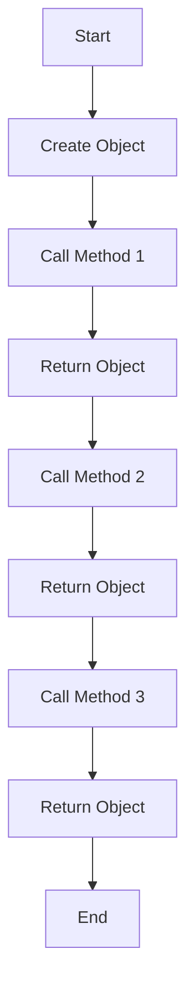

## 5.10 Using UFCS for Fluent Interfaces

In the realm of modern software development, readability and expressiveness are paramount. As systems grow in complexity, the ability to write code that is both concise and understandable becomes a critical skill. The D programming language offers a unique feature known as Uniform Function Call Syntax (UFCS) that can be leveraged to create fluent interfaces, enhancing both the readability and expressiveness of your code.

### Implementing Fluent APIs

Fluent interfaces are a design pattern that allows for method chaining, enabling developers to write code that reads like natural language. This pattern is particularly useful in scenarios where you need to configure complex objects or process data through a series of transformations. Let's delve into how UFCS can be used to implement fluent APIs in D.

#### Enhancing Readability

Fluent interfaces aim to make code more readable by allowing method calls to be chained together. This is achieved by returning the object itself from each method, enabling subsequent method calls to be made on the same object. UFCS in D takes this a step further by allowing functions to be called as if they were methods on an object, even if they are not defined within the object's class or struct.

##### Method Chaining with UFCS

UFCS allows you to call free functions as if they were member functions of a struct or class. This is particularly useful when you want to extend the functionality of a type without modifying its original definition. Here's a simple example to illustrate this concept:

```d
struct Point {
    double x, y;
}

// Define a free function that operates on Point
Point move(Point p, double dx, double dy) {
    p.x += dx;
    p.y += dy;
    return p;
}

// Use UFCS to chain method calls
void main() {
    Point p = Point(0, 0);
    p = p.move(1, 1).move(2, 2); // Chaining using UFCS
    writeln("Point: ", p.x, ", ", p.y); // Output: Point: 3, 3
}
```

In this example, the `move` function is a free function that operates on a `Point` struct. Using UFCS, we can call `move` as if it were a method of `Point`, allowing us to chain multiple calls together.

#### Use Cases and Examples

Fluent interfaces are particularly useful in scenarios where you need to configure objects or process data in a series of steps. Let's explore two common use cases: configuration builders and data processing pipelines.

##### Configuration Builders

Configuration builders are a common use case for fluent interfaces. They allow you to set up complex objects in a readable and maintainable manner. Consider the following example of a configuration builder for a hypothetical `DatabaseConnection` object:

```d
class DatabaseConnection {
    string host;
    int port;
    string username;
    string password;

    this() {
        // Default values
        host = "localhost";
        port = 5432;
    }

    DatabaseConnection setHost(string h) {
        host = h;
        return this;
    }

    DatabaseConnection setPort(int p) {
        port = p;
        return this;
    }

    DatabaseConnection setUsername(string u) {
        username = u;
        return this;
    }

    DatabaseConnection setPassword(string p) {
        password = p;
        return this;
    }

    void connect() {
        writeln("Connecting to ", host, ":", port, " as ", username);
    }
}

void main() {
    auto connection = new DatabaseConnection()
        .setHost("db.example.com")
        .setPort(3306)
        .setUsername("admin")
        .setPassword("secret");
    
    connection.connect(); // Output: Connecting to db.example.com:3306 as admin
}
```

In this example, the `DatabaseConnection` class uses method chaining to allow for a fluent configuration of its properties. Each setter method returns the object itself, enabling the chaining of multiple method calls.

##### Data Processing Pipelines

Another powerful use case for fluent interfaces is in the creation of data processing pipelines. These pipelines allow you to compose operations on data in an elegant and readable manner. Consider the following example of a simple data processing pipeline:

```d
import std.stdio;
import std.algorithm;
import std.array;

void main() {
    auto data = [1, 2, 3, 4, 5];

    auto result = data
        .filter!(x => x % 2 == 0) // Filter even numbers
        .map!(x => x * x)         // Square each number
        .array;                   // Convert to array

    writeln(result); // Output: [4, 16]
}
```

In this example, we use D's standard library functions to create a pipeline that filters, transforms, and collects data. The use of UFCS allows us to chain these operations together in a fluent manner, making the code both concise and expressive.

### Visualizing Fluent Interfaces with UFCS

To better understand how UFCS facilitates fluent interfaces, let's visualize the method chaining process using a flowchart.



This flowchart illustrates the process of method chaining in a fluent interface. Each method call returns the object itself, allowing the next method to be called on the same object.

### Design Considerations

When designing fluent interfaces using UFCS, there are several considerations to keep in mind:

- **Consistency**: Ensure that all methods in the fluent interface return the object itself to maintain the chain.
- **Readability**: Aim for method names that clearly convey their purpose, enhancing the readability of the chained calls.
- **Error Handling**: Consider how errors will be handled within the chain. You may need to break the chain to handle exceptions or invalid states.
- **Performance**: Be mindful of the performance implications of chaining, especially in performance-critical applications.

### Differences and Similarities

Fluent interfaces are often compared to builder patterns, as both aim to simplify the construction of complex objects. However, fluent interfaces focus more on enhancing readability through method chaining, while builder patterns emphasize the separation of construction and representation.

### Try It Yourself

To deepen your understanding of UFCS and fluent interfaces, try modifying the examples provided:

- **Experiment with Additional Methods**: Add new methods to the `DatabaseConnection` class to configure additional properties.
- **Create a New Data Pipeline**: Design a new data processing pipeline that performs different operations on a dataset.
- **Explore Error Handling**: Implement error handling within a fluent interface to see how it affects the chaining process.

### References and Links

For further reading on UFCS and fluent interfaces, consider the following resources:

- [D Language Specification on UFCS](https://dlang.org/spec/function.html#pseudo-member)
- [Fluent Interface Pattern on Wikipedia](https://en.wikipedia.org/wiki/Fluent_interface)
- [MDN Web Docs on Method Chaining](https://developer.mozilla.org/en-US/docs/Web/JavaScript/Guide/Working_with_Objects#chaining)

### Knowledge Check

As you explore UFCS and fluent interfaces, consider the following questions to test your understanding:

- How does UFCS enhance the readability of code?
- What are the key benefits of using fluent interfaces in software design?
- How can method chaining be implemented in D using UFCS?

### Embrace the Journey

Remember, mastering UFCS and fluent interfaces is just one step in your journey to becoming a proficient D programmer. As you continue to explore the language, you'll discover new ways to write expressive and maintainable code. Keep experimenting, stay curious, and enjoy the journey!

## Quiz Time!



### What is the primary purpose of using UFCS in D?

- [x] To allow free functions to be called as if they were member functions
- [ ] To enforce strict type checking
- [ ] To improve memory management
- [ ] To simplify error handling

> **Explanation:** UFCS allows free functions to be called as if they were member functions, enabling method chaining and enhancing code readability.

### Which design pattern is closely related to fluent interfaces?

- [ ] Singleton
- [ ] Observer
- [x] Builder
- [ ] Factory

> **Explanation:** Fluent interfaces are often compared to the builder pattern, as both simplify the construction of complex objects.

### In the context of fluent interfaces, what does method chaining achieve?

- [x] It enhances code readability by allowing multiple method calls to be chained together.
- [ ] It improves memory allocation efficiency.
- [ ] It enforces strict type safety.
- [ ] It simplifies error handling.

> **Explanation:** Method chaining enhances code readability by allowing multiple method calls to be chained together, making the code more expressive.

### What should each method in a fluent interface return to maintain the chain?

- [ ] A new object
- [x] The object itself
- [ ] A boolean value
- [ ] An integer

> **Explanation:** Each method in a fluent interface should return the object itself to maintain the chain of method calls.

### Which of the following is a common use case for fluent interfaces?

- [ ] Memory management
- [x] Configuration builders
- [ ] Error handling
- [ ] Type safety enforcement

> **Explanation:** Configuration builders are a common use case for fluent interfaces, allowing for readable and maintainable object setup.

### How does UFCS contribute to the implementation of fluent interfaces?

- [x] By allowing free functions to be called as if they were methods, enabling method chaining.
- [ ] By enforcing strict type checking.
- [ ] By improving memory management.
- [ ] By simplifying error handling.

> **Explanation:** UFCS allows free functions to be called as if they were methods, enabling method chaining and the creation of fluent interfaces.

### What is a potential design consideration when implementing fluent interfaces?

- [ ] Ensuring strict type safety
- [x] Consistency in method return values
- [ ] Minimizing memory usage
- [ ] Simplifying error handling

> **Explanation:** Consistency in method return values is important to maintain the chain in fluent interfaces.

### What is the main advantage of using fluent interfaces in data processing pipelines?

- [ ] Improved memory management
- [x] Enhanced readability and expressiveness
- [ ] Simplified error handling
- [ ] Enforced type safety

> **Explanation:** Fluent interfaces enhance readability and expressiveness, making data processing pipelines more elegant and understandable.

### True or False: Fluent interfaces and builder patterns are the same.

- [ ] True
- [x] False

> **Explanation:** Fluent interfaces and builder patterns are related but not the same. Fluent interfaces focus on readability through method chaining, while builder patterns emphasize the separation of construction and representation.

### What is a key benefit of using UFCS in D programming?

- [x] It enhances code readability by allowing method chaining.
- [ ] It enforces strict type checking.
- [ ] It simplifies memory management.
- [ ] It improves error handling.

> **Explanation:** UFCS enhances code readability by allowing method chaining, making the code more expressive and maintainable.


