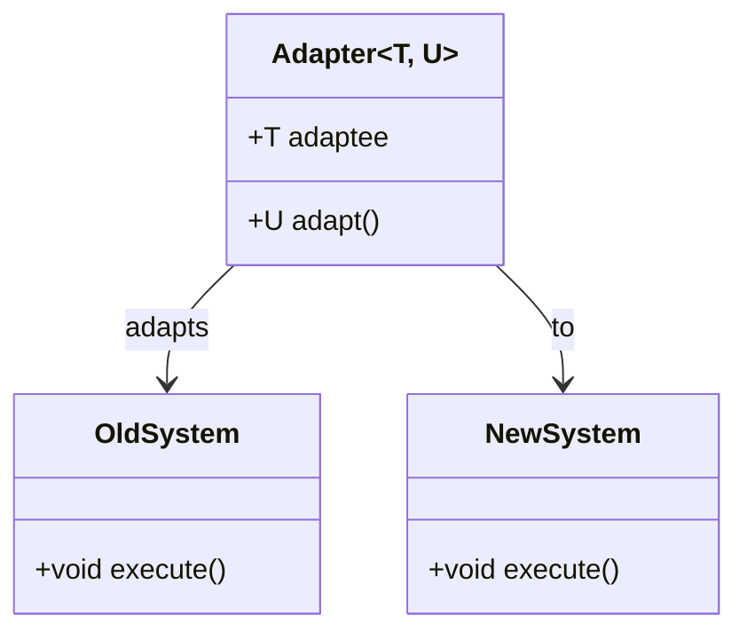
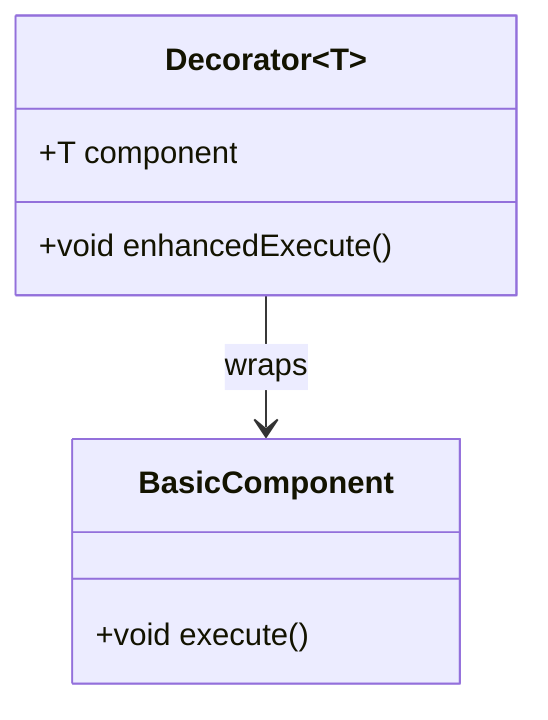

## 5.11 Implementing Structural Patterns with Templates

In this section, we delve into the powerful synergy between structural design patterns and templates in the D programming language. By leveraging templates, we can generalize structural patterns for reuse, creating flexible and type-safe implementations that enhance code reusability and adaptability. This approach is particularly beneficial in systems programming, where performance and maintainability are paramount.

### Leveraging Templates for Structural Patterns

Templates in D allow us to write generic and reusable code. They enable us to define algorithms and data structures that can operate with any data type, making them ideal for implementing structural design patterns. Let's explore how templates can be used to generalize structural patterns such as Adapters and Decorators.

#### Code Reusability with Templates

One of the primary benefits of using templates is the ability to create reusable components. By abstracting the type-specific details, templates allow us to write code that can be applied to a wide range of types. This is particularly useful in structural patterns, where the goal is often to compose objects or extend their functionality without modifying their code.

##### Generic Adapters

The Adapter pattern is used to allow incompatible interfaces to work together. By using templates, we can create a generic adapter that can adapt any type to a desired interface. This approach not only reduces code duplication but also enhances type safety.

```d
// Define a generic adapter template
template Adapter(T, U)
{
    struct Adapter
    {
        T adaptee;
        
        // Adapt the interface of T to match U
        U adapt()
        {
            // Implement the adaptation logic here
            // For demonstration, assume T and U have a method `execute`
            return U(adaptee.execute());
        }
    }
}

// Example usage
struct OldSystem
{
    void execute() { writeln("Executing Old System"); }
}

struct NewSystem
{
    void execute() { writeln("Executing New System"); }
}

void main()
{
    OldSystem oldSystem;
    auto adapter = Adapter!(OldSystem, NewSystem)(oldSystem);
    adapter.adapt().execute(); // Outputs: Executing Old System
}
```

In this example, the `Adapter` template takes two types, `T` and `U`, and adapts `T` to match the interface of `U`. This allows us to use `OldSystem` as if it were a `NewSystem`, demonstrating the flexibility of templates in implementing the Adapter pattern.

##### Generic Decorators

The Decorator pattern is used to add new functionality to an object dynamically. By using templates, we can create a generic decorator that can wrap any type, adding additional behavior without altering the original object's code.

```d
// Define a generic decorator template
template Decorator(T)
{
    struct Decorator
    {
        T component;
        
        void enhancedExecute()
        {
            // Add additional behavior
            writeln("Enhancing behavior...");
            component.execute();
        }
    }
}

// Example usage
struct BasicComponent
{
    void execute() { writeln("Executing Basic Component"); }
}

void main()
{
    BasicComponent basic;
    auto decorator = Decorator!(BasicComponent)(basic);
    decorator.enhancedExecute(); // Outputs: Enhancing behavior... Executing Basic Component
}
```

Here, the `Decorator` template wraps a `BasicComponent`, adding an `enhancedExecute` method that provides additional behavior. This demonstrates how templates can be used to implement the Decorator pattern, allowing for flexible and reusable code.

### Use Cases and Examples

Templates are not only useful for implementing individual patterns but also for building entire frameworks and libraries that can adapt to various types. Let's explore some use cases and examples of how templates can be used in practice.

#### Building Generic Libraries

By leveraging templates, we can create libraries that are both flexible and type-safe. This is particularly useful in systems programming, where performance and adaptability are crucial.

##### Example: A Generic Collection Library

Consider a generic collection library that provides various data structures, such as lists and maps. By using templates, we can create a library that can handle any data type, providing a consistent interface for different types of collections.

```d
// Define a generic list template
template List(T)
{
    struct List
    {
        T[] items;
        
        void add(T item)
        {
            items ~= item;
        }
        
        void remove(T item)
        {
            items = items.filter!(a => a != item).array;
        }
        
        void display()
        {
            foreach (item; items)
            {
                writeln(item);
            }
        }
    }
}

// Example usage
void main()
{
    auto intList = List!int();
    intList.add(1);
    intList.add(2);
    intList.display(); // Outputs: 1 2
    
    auto stringList = List!string();
    stringList.add("Hello");
    stringList.add("World");
    stringList.display(); // Outputs: Hello World
}
```

In this example, the `List` template provides a generic list implementation that can handle any data type. This allows us to create lists of integers, strings, or any other type, demonstrating the power of templates in building generic libraries.

### Visualizing Structural Patterns with Templates

To better understand how templates can be used to implement structural patterns, let's visualize the process using Mermaid.js diagrams.

#### Diagram: Adapter Pattern with Templates



This diagram illustrates the relationship between the `Adapter` template and the `OldSystem` and `NewSystem` classes. The `Adapter` adapts the interface of `OldSystem` to match that of `NewSystem`, demonstrating the flexibility of templates in implementing the Adapter pattern.

#### Diagram: Decorator Pattern with Templates



This diagram shows how the `Decorator` template wraps a `BasicComponent`, adding additional behavior through the `enhancedExecute` method. This demonstrates how templates can be used to implement the Decorator pattern, allowing for flexible and reusable code.

### Design Considerations

When implementing structural patterns with templates, there are several design considerations to keep in mind:

- **Type Safety**: Templates provide compile-time type checking, ensuring that only compatible types are used. This enhances the safety and reliability of the code.
- **Code Reusability**: By abstracting type-specific details, templates allow for highly reusable code, reducing duplication and improving maintainability.
- **Performance**: Templates are resolved at compile time, resulting in optimized code that is as efficient as manually written type-specific code.
- **Complexity**: While templates offer many benefits, they can also increase the complexity of the code. It's important to balance the use of templates with readability and maintainability.

### Differences and Similarities with Other Patterns

Templates can be used to implement a wide range of design patterns, not just structural ones. However, it's important to understand the differences and similarities between patterns to choose the right one for a given problem.

- **Adapter vs. Decorator**: Both patterns involve wrapping an object to provide additional functionality. However, the Adapter pattern focuses on interface compatibility, while the Decorator pattern focuses on adding behavior.
- **Templates vs. Inheritance**: Templates provide a way to achieve polymorphism without inheritance, offering more flexibility and type safety. However, they can also lead to more complex code compared to traditional inheritance-based approaches.

### Try It Yourself

To deepen your understanding of implementing structural patterns with templates, try modifying the code examples provided:

- **Experiment with Different Types**: Use the `Adapter` and `Decorator` templates with different types to see how they adapt and extend functionality.
- **Create Your Own Patterns**: Try implementing other structural patterns, such as the Proxy or Composite patterns, using templates.
- **Build a Generic Library**: Create a small library using templates that provides a set of reusable components, such as data structures or algorithms.

### Conclusion

Implementing structural patterns with templates in D offers a powerful way to create flexible, reusable, and type-safe code. By leveraging templates, we can generalize patterns for reuse, building frameworks and libraries that can adapt to various types. This approach not only enhances code reusability but also improves performance and maintainability, making it an essential tool for advanced systems programming.

Remember, this is just the beginning. As you continue to explore the capabilities of templates in D, you'll discover even more ways to enhance your software design and architecture. Keep experimenting, stay curious, and enjoy the journey!

## Quiz Time!



### What is the primary benefit of using templates in D for structural patterns?

- [x] Code reusability
- [ ] Runtime polymorphism
- [ ] Dynamic typing
- [ ] Manual memory management

> **Explanation:** Templates allow for code reusability by abstracting type-specific details, enabling the creation of generic and reusable components.

### Which pattern is used to allow incompatible interfaces to work together?

- [x] Adapter
- [ ] Decorator
- [ ] Proxy
- [ ] Composite

> **Explanation:** The Adapter pattern is used to allow incompatible interfaces to work together by adapting one interface to another.

### What is the focus of the Decorator pattern?

- [ ] Interface compatibility
- [x] Adding behavior
- [ ] Object creation
- [ ] Data encapsulation

> **Explanation:** The Decorator pattern focuses on adding behavior to an object dynamically without altering its code.

### How are templates resolved in D?

- [x] At compile time
- [ ] At runtime
- [ ] During linking
- [ ] During execution

> **Explanation:** Templates in D are resolved at compile time, resulting in optimized and efficient code.

### What is a potential downside of using templates?

- [ ] Reduced performance
- [x] Increased complexity
- [ ] Lack of type safety
- [ ] Limited reusability

> **Explanation:** While templates offer many benefits, they can also increase the complexity of the code, making it harder to read and maintain.

### Which pattern involves wrapping an object to provide additional functionality?

- [x] Decorator
- [ ] Adapter
- [ ] Singleton
- [ ] Factory

> **Explanation:** The Decorator pattern involves wrapping an object to provide additional functionality without altering its code.

### What is the difference between templates and inheritance?

- [x] Templates provide polymorphism without inheritance
- [ ] Templates are resolved at runtime
- [ ] Inheritance offers more flexibility
- [ ] Templates are less type-safe

> **Explanation:** Templates provide a way to achieve polymorphism without inheritance, offering more flexibility and type safety.

### Which diagramming tool is used to visualize structural patterns in this guide?

- [x] Mermaid.js
- [ ] UML
- [ ] Graphviz
- [ ] PlantUML

> **Explanation:** Mermaid.js is used in this guide to create diagrams that visualize structural patterns and their relationships.

### What is the purpose of the `enhancedExecute` method in the Decorator example?

- [x] To add additional behavior
- [ ] To adapt the interface
- [ ] To manage resources
- [ ] To encapsulate data

> **Explanation:** The `enhancedExecute` method in the Decorator example adds additional behavior to the wrapped component.

### True or False: Templates can be used to implement both structural and creational patterns.

- [x] True
- [ ] False

> **Explanation:** Templates can be used to implement a wide range of design patterns, including both structural and creational patterns.


