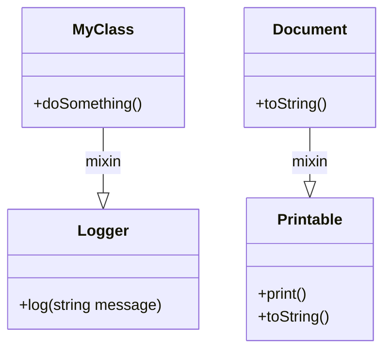

## 5.12 Mixins and Code Reuse Strategies

In the realm of software engineering, code reuse is a fundamental principle that enhances productivity and maintainability. The D programming language offers a powerful feature known as mixins, which facilitates code reuse and modularity without the constraints of traditional inheritance. In this section, we will delve into the concept of mixins, explore their advantages, and provide practical examples to demonstrate their application in real-world scenarios.

### Understanding Mixins in D

Mixins in D allow you to include code within classes or structs without using inheritance. This feature is particularly useful for implementing cross-cutting concerns such as logging, validation, or caching. By using mixins, you can inject code into multiple classes or structs, reducing boilerplate and enhancing modularity.

#### What Are Mixins?

Mixins are a form of code inclusion that allows you to inject code into a class or struct at compile time. Unlike inheritance, which creates a parent-child relationship, mixins simply insert code directly into the target type. This approach provides flexibility and avoids the complexities associated with deep inheritance hierarchies.

#### Types of Mixins in D

D supports two types of mixins:

1. **String Mixins**: These allow you to include code represented as strings. The string is evaluated and inserted into the target type at compile time.
2. **Template Mixins**: These allow you to include code defined in templates. Template mixins are more type-safe and maintainable compared to string mixins.

### Advantages of Using Mixins

Mixins offer several advantages that make them a valuable tool in a developer's arsenal:

- **Reducing Boilerplate**: Mixins help eliminate repetitive code by allowing you to define common functionality once and reuse it across multiple types.
- **Enhancing Modularity**: By composing classes or structs from reusable components, mixins promote modularity and separation of concerns.
- **Flexibility**: Mixins provide a flexible way to inject behavior into types without the constraints of inheritance.
- **Compile-Time Code Generation**: Mixins leverage D's compile-time capabilities to generate code, resulting in efficient and optimized binaries.

### Use Cases and Examples

Let's explore some common use cases for mixins and provide practical examples to illustrate their application.

#### Cross-Cutting Concerns

One of the primary use cases for mixins is implementing cross-cutting concerns such as logging, validation, or caching. These concerns often span multiple classes or modules, making mixins an ideal solution for injecting the necessary code.

**Example: Logging with Mixins**

```d
mixin template Logger() {
    void log(string message) {
        import std.stdio;
        writeln("[LOG]: ", message);
    }
}

class MyClass {
    mixin Logger;

    void doSomething() {
        log("Doing something important.");
    }
}

void main() {
    MyClass obj = new MyClass();
    obj.doSomething();
}
```

In this example, the `Logger` mixin template provides a `log` method that can be included in any class. The `MyClass` class uses the `Logger` mixin to gain logging capabilities without inheriting from a base class.

#### Enhancing Modularity

Mixins can be used to compose classes or structs from reusable components, promoting modularity and separation of concerns.

**Example: Composing Classes with Mixins**

```d
mixin template Printable() {
    void print() {
        import std.stdio;
        writeln(toString());
    }

    string toString() {
        return "Printable object";
    }
}

class Document {
    mixin Printable;

    override string toString() {
        return "Document content";
    }
}

void main() {
    Document doc = new Document();
    doc.print(); // Outputs: Document content
}
```

In this example, the `Printable` mixin provides a `print` method that can be included in any class. The `Document` class uses the `Printable` mixin and overrides the `toString` method to provide custom content.

### Mixins and Code Reuse Strategies

To fully leverage the power of mixins, it's essential to adopt effective code reuse strategies. Here are some strategies to consider:

#### Strategy 1: Define Reusable Mixins

Identify common functionality that can be abstracted into mixins. Define mixin templates for these functionalities and reuse them across multiple types.

#### Strategy 2: Use Template Mixins for Type Safety

Whenever possible, prefer template mixins over string mixins for better type safety and maintainability. Template mixins allow you to define generic code that can be reused with different types.

#### Strategy 3: Combine Mixins with Other Patterns

Mixins can be combined with other design patterns to create powerful and flexible solutions. For example, you can use mixins in conjunction with the Strategy pattern to inject different behaviors into a class.

**Example: Combining Mixins with Strategy Pattern**

```d
interface Strategy {
    void execute();
}

mixin template StrategyMixin(T : Strategy) {
    void perform() {
        T strategy = new T();
        strategy.execute();
    }
}

class ConcreteStrategyA : Strategy {
    void execute() {
        import std.stdio;
        writeln("Executing Strategy A");
    }
}

class Context {
    mixin StrategyMixin!ConcreteStrategyA;
}

void main() {
    Context context = new Context();
    context.perform(); // Outputs: Executing Strategy A
}
```

In this example, the `StrategyMixin` template allows you to inject a strategy into the `Context` class. By changing the mixin parameter, you can easily switch between different strategies.

### Visualizing Mixins and Code Reuse

To better understand the concept of mixins and their role in code reuse, let's visualize the process using a class diagram.



**Diagram Description**: This class diagram illustrates how mixins are used to inject functionality into classes. The `Logger` mixin is included in `MyClass`, and the `Printable` mixin is included in `Document`.

### Try It Yourself

To gain a deeper understanding of mixins and code reuse, try modifying the examples provided:

1. **Extend the Logger Mixin**: Add additional logging levels (e.g., `info`, `warn`, `error`) to the `Logger` mixin and use them in `MyClass`.

2. **Create a New Mixin**: Define a new mixin for a common functionality (e.g., serialization) and include it in multiple classes.

3. **Combine Mixins**: Experiment with combining multiple mixins in a single class and observe how they interact.

### References and Further Reading

- [D Programming Language Documentation](https://dlang.org/)
- [Mixins in D](https://dlang.org/spec/template-mixin.html)
- [Design Patterns: Elements of Reusable Object-Oriented Software](https://en.wikipedia.org/wiki/Design_Patterns)

### Knowledge Check

To reinforce your understanding of mixins and code reuse strategies, consider the following questions:

1. What are the main advantages of using mixins in D programming?
2. How do mixins differ from traditional inheritance?
3. What are some common use cases for mixins?
4. How can mixins enhance modularity in software design?
5. What is the difference between string mixins and template mixins?

### Embrace the Journey

Remember, mastering mixins and code reuse strategies is just the beginning. As you progress, you'll discover more ways to leverage these powerful tools to build efficient and maintainable software systems. Keep experimenting, stay curious, and enjoy the journey!

## Quiz Time!



### What is a primary advantage of using mixins in D programming?

- [x] Reducing boilerplate code
- [ ] Enforcing strict inheritance hierarchies
- [ ] Increasing runtime overhead
- [ ] Limiting code reuse

> **Explanation:** Mixins help reduce boilerplate code by allowing you to define common functionality once and reuse it across multiple types.

### How do mixins differ from traditional inheritance?

- [x] Mixins inject code directly into the target type
- [ ] Mixins create a parent-child relationship
- [ ] Mixins require runtime evaluation
- [ ] Mixins enforce strict type hierarchies

> **Explanation:** Mixins inject code directly into the target type at compile time, unlike inheritance which creates a parent-child relationship.

### Which type of mixin is more type-safe?

- [x] Template mixins
- [ ] String mixins
- [ ] Dynamic mixins
- [ ] Runtime mixins

> **Explanation:** Template mixins are more type-safe and maintainable compared to string mixins.

### What is a common use case for mixins?

- [x] Implementing cross-cutting concerns
- [ ] Enforcing single inheritance
- [ ] Increasing code complexity
- [ ] Limiting code reuse

> **Explanation:** Mixins are commonly used to implement cross-cutting concerns such as logging, validation, or caching.

### How can mixins enhance modularity in software design?

- [x] By composing classes from reusable components
- [ ] By enforcing strict inheritance hierarchies
- [ ] By increasing code duplication
- [ ] By limiting code reuse

> **Explanation:** Mixins enhance modularity by allowing you to compose classes or structs from reusable components.

### What is the difference between string mixins and template mixins?

- [x] String mixins use strings, template mixins use templates
- [ ] String mixins are more type-safe
- [ ] Template mixins require runtime evaluation
- [ ] Template mixins use strings

> **Explanation:** String mixins use code represented as strings, while template mixins use templates for better type safety.

### Which mixin type is preferred for better maintainability?

- [x] Template mixins
- [ ] String mixins
- [ ] Dynamic mixins
- [ ] Runtime mixins

> **Explanation:** Template mixins are preferred for better maintainability due to their type safety.

### How can mixins be combined with other design patterns?

- [x] By injecting behavior into classes
- [ ] By enforcing strict inheritance
- [ ] By increasing code duplication
- [ ] By limiting code reuse

> **Explanation:** Mixins can be combined with other design patterns to inject behavior into classes, enhancing flexibility.

### What is a strategy for effective code reuse with mixins?

- [x] Define reusable mixins for common functionality
- [ ] Use mixins to increase code complexity
- [ ] Limit mixin usage to a single class
- [ ] Avoid combining mixins with other patterns

> **Explanation:** Defining reusable mixins for common functionality is a strategy for effective code reuse.

### Mixins in D programming are evaluated at which time?

- [x] Compile time
- [ ] Runtime
- [ ] Load time
- [ ] Link time

> **Explanation:** Mixins in D programming are evaluated at compile time, allowing for efficient code generation.


