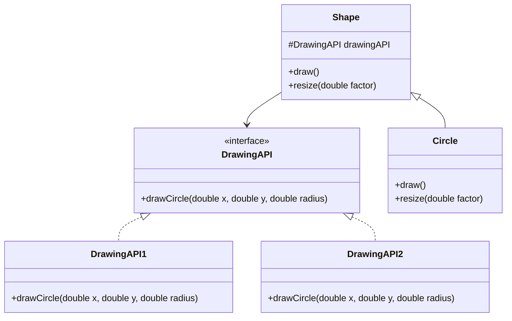

## 5.2 Bridge Pattern

In the realm of software design, achieving flexibility and scalability often requires decoupling components so they can evolve independently. The Bridge Pattern is a structural design pattern that addresses this need by separating an abstraction from its implementation, allowing both to vary independently. This pattern is particularly useful in systems programming with the D language, where performance and adaptability are paramount.

### Purpose

The primary purpose of the Bridge Pattern is to decouple an abstraction from its implementation, enabling both to change independently without affecting each other. This separation is achieved by defining a bridge interface that acts as an intermediary between the abstraction and its implementation.

### Implementing Bridge in D

Implementing the Bridge Pattern in D involves creating two hierarchies: one for the abstraction and another for the implementation. Let's explore how to achieve this in D, leveraging its unique features such as interfaces, classes, and templates.

#### Abstraction Hierarchy

The abstraction hierarchy defines the high-level interface that clients interact with. In D, this can be achieved using interfaces or abstract classes. The abstraction delegates the actual work to the implementation hierarchy.

```d
interface DrawingAPI {
    void drawCircle(double x, double y, double radius);
}

class Shape {
    protected DrawingAPI drawingAPI;

    this(DrawingAPI api) {
        this.drawingAPI = api;
    }

    void draw() {}
    void resize(double factor) {}
}
```

In this example, `DrawingAPI` is an interface representing the implementation hierarchy, while `Shape` is an abstract class representing the abstraction hierarchy. The `Shape` class holds a reference to a `DrawingAPI` object, allowing it to delegate drawing operations.

#### Implementation Hierarchy

The implementation hierarchy provides concrete implementations of the abstraction's operations. These implementations can vary independently of the abstraction.

```d
class DrawingAPI1 : DrawingAPI {
    override void drawCircle(double x, double y, double radius) {
        writeln("API1.circle at (", x, ", ", y, ") with radius ", radius);
    }
}

class DrawingAPI2 : DrawingAPI {
    override void drawCircle(double x, double y, double radius) {
        writeln("API2.circle at (", x, ", ", y, ") with radius ", radius);
    }
}
```

Here, `DrawingAPI1` and `DrawingAPI2` are concrete implementations of the `DrawingAPI` interface. Each provides a different way to draw a circle, demonstrating how implementations can vary.

#### Decoupling

Decoupling is achieved by allowing the abstraction to interact with any implementation through the bridge interface. This flexibility enables changes in the implementation without affecting the abstraction or its clients.

```d
class Circle : Shape {
    private double x, y, radius;

    this(double x, double y, double radius, DrawingAPI api) {
        super(api);
        this.x = x;
        this.y = y;
        this.radius = radius;
    }

    override void draw() {
        drawingAPI.drawCircle(x, y, radius);
    }

    override void resize(double factor) {
        radius *= factor;
    }
}

void main() {
    Circle circle1 = new Circle(1, 2, 3, new DrawingAPI1());
    Circle circle2 = new Circle(5, 7, 11, new DrawingAPI2());

    circle1.draw();
    circle2.draw();
}
```

In this code, `Circle` is a concrete class extending `Shape`. It uses the `DrawingAPI` interface to draw itself, allowing the drawing method to vary independently of the circle's properties.

### Use Cases and Examples

The Bridge Pattern is particularly useful in scenarios where you need to separate high-level logic from platform-specific details or when dealing with multiple implementations of a concept.

#### Cross-Platform Applications

In cross-platform applications, the Bridge Pattern can abstract platform-specific details, allowing the core logic to remain unchanged while adapting to different environments.

#### Graphics Rendering

In graphics rendering, the Bridge Pattern can separate high-level drawing commands from low-level rendering APIs. This separation allows for different rendering techniques or libraries to be used without altering the drawing logic.

### Visualizing the Bridge Pattern

To better understand the Bridge Pattern, let's visualize the relationship between the abstraction and implementation hierarchies using a class diagram.



This diagram illustrates how the `Shape` class interacts with the `DrawingAPI` interface, which is implemented by `DrawingAPI1` and `DrawingAPI2`. The `Circle` class extends `Shape`, demonstrating the separation of abstraction and implementation.

### Design Considerations

When implementing the Bridge Pattern in D, consider the following:

- **Flexibility**: The Bridge Pattern provides flexibility by allowing the abstraction and implementation to evolve independently.
- **Complexity**: Introducing a bridge interface can add complexity, so it's essential to evaluate whether the benefits outweigh the costs.
- **Performance**: Ensure that the additional layer of abstraction does not introduce performance bottlenecks, especially in performance-critical applications.

### Differences and Similarities

The Bridge Pattern is often confused with the Adapter Pattern. While both involve interfaces, the Bridge Pattern is used to separate abstraction from implementation, whereas the Adapter Pattern is used to make incompatible interfaces compatible.

### Try It Yourself

To deepen your understanding of the Bridge Pattern, try modifying the code examples:

- Implement additional shapes, such as `Rectangle` or `Triangle`, using the Bridge Pattern.
- Create new drawing APIs that provide different rendering techniques.
- Experiment with different ways to resize shapes, such as scaling only one dimension.

### Knowledge Check

Before moving on, let's reinforce what we've learned:

- How does the Bridge Pattern decouple abstraction from implementation?
- What are the key components of the Bridge Pattern in D?
- How can the Bridge Pattern be applied in cross-platform applications?

### Embrace the Journey

Remember, mastering design patterns is an ongoing journey. The Bridge Pattern is just one tool in your toolkit for building flexible, scalable software systems. Keep experimenting, stay curious, and enjoy the process of learning and applying these concepts in your projects.

## Quiz Time!



### What is the primary purpose of the Bridge Pattern?

- [x] To separate an abstraction from its implementation so that the two can vary independently.
- [ ] To make incompatible interfaces compatible.
- [ ] To provide a simplified interface to a complex subsystem.
- [ ] To ensure a class has only one instance.

> **Explanation:** The Bridge Pattern's primary purpose is to decouple an abstraction from its implementation, allowing both to change independently.

### In the Bridge Pattern, what does the abstraction hierarchy represent?

- [x] The high-level interface that clients interact with.
- [ ] The concrete implementation of the abstraction.
- [ ] The specific details of the platform.
- [ ] The low-level rendering API.

> **Explanation:** The abstraction hierarchy defines the high-level interface that clients interact with, delegating work to the implementation hierarchy.

### Which of the following is a key benefit of using the Bridge Pattern?

- [x] It allows for independent variation of abstraction and implementation.
- [ ] It simplifies the interface to a complex subsystem.
- [ ] It ensures a class has only one instance.
- [ ] It makes incompatible interfaces compatible.

> **Explanation:** The Bridge Pattern allows for independent variation of abstraction and implementation, enhancing flexibility.

### How does the Bridge Pattern differ from the Adapter Pattern?

- [x] The Bridge Pattern separates abstraction from implementation, while the Adapter Pattern makes incompatible interfaces compatible.
- [ ] The Bridge Pattern makes incompatible interfaces compatible, while the Adapter Pattern separates abstraction from implementation.
- [ ] Both patterns serve the same purpose.
- [ ] The Bridge Pattern is used for creating single instances of a class.

> **Explanation:** The Bridge Pattern separates abstraction from implementation, whereas the Adapter Pattern makes incompatible interfaces compatible.

### What is the role of the bridge interface in the Bridge Pattern?

- [x] It acts as an intermediary between the abstraction and its implementation.
- [ ] It provides a simplified interface to a complex subsystem.
- [ ] It ensures a class has only one instance.
- [ ] It makes incompatible interfaces compatible.

> **Explanation:** The bridge interface acts as an intermediary, allowing the abstraction to interact with any implementation.

### In the provided code example, what does the `Circle` class represent?

- [x] A concrete class extending the abstraction hierarchy.
- [ ] A concrete implementation of the bridge interface.
- [ ] A high-level interface that clients interact with.
- [ ] A low-level rendering API.

> **Explanation:** The `Circle` class is a concrete class extending the abstraction hierarchy, using the bridge interface to draw itself.

### What is a potential drawback of using the Bridge Pattern?

- [x] It can add complexity to the design.
- [ ] It limits the flexibility of the design.
- [ ] It makes the code less maintainable.
- [ ] It introduces performance bottlenecks.

> **Explanation:** Introducing a bridge interface can add complexity, so it's essential to evaluate whether the benefits outweigh the costs.

### How can the Bridge Pattern be applied in graphics rendering?

- [x] By separating high-level drawing commands from low-level rendering APIs.
- [ ] By making incompatible interfaces compatible.
- [ ] By ensuring a class has only one instance.
- [ ] By providing a simplified interface to a complex subsystem.

> **Explanation:** In graphics rendering, the Bridge Pattern can separate high-level drawing commands from low-level rendering APIs.

### What is the significance of decoupling in the Bridge Pattern?

- [x] It allows implementations to change without affecting clients.
- [ ] It ensures a class has only one instance.
- [ ] It makes incompatible interfaces compatible.
- [ ] It provides a simplified interface to a complex subsystem.

> **Explanation:** Decoupling allows implementations to change without affecting clients, enhancing flexibility.

### True or False: The Bridge Pattern is used to ensure a class has only one instance.

- [ ] True
- [x] False

> **Explanation:** The Bridge Pattern is not used to ensure a class has only one instance; that is the purpose of the Singleton Pattern.


