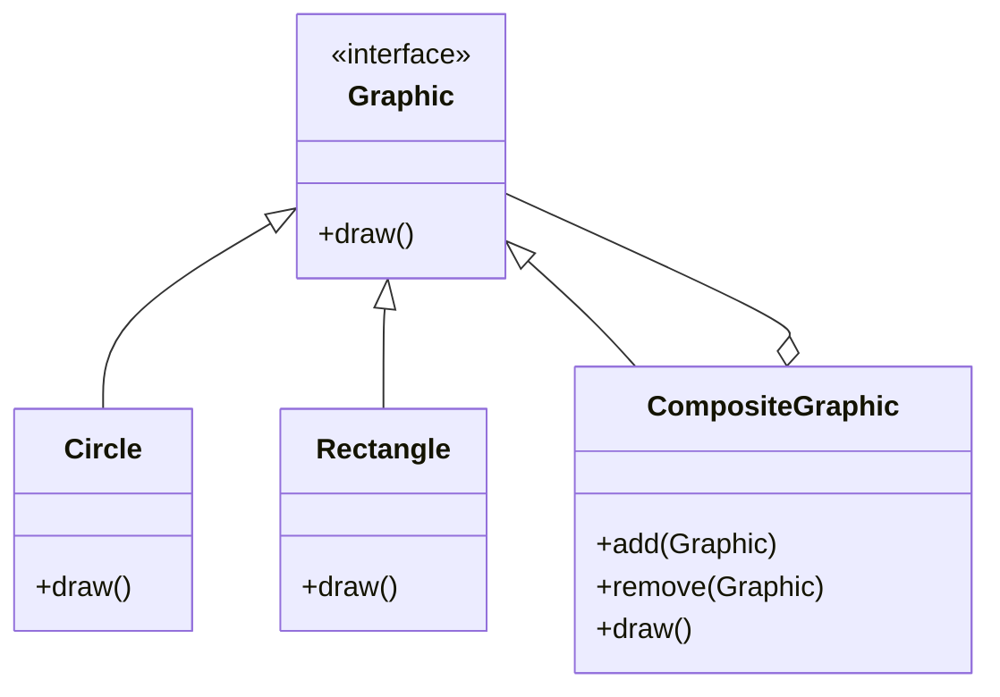

## 5.3 Composite Pattern

The Composite Pattern is a structural design pattern that enables you to compose objects into tree structures to represent part-whole hierarchies. This pattern allows clients to treat individual objects and compositions of objects uniformly. In the context of the D programming language, the Composite Pattern leverages D's features such as interfaces, classes, and templates to create flexible and efficient hierarchical structures.

### Purpose

The primary purpose of the Composite Pattern is to simplify client code by allowing uniform treatment of individual objects and compositions. This is particularly useful in scenarios where you need to work with tree structures, such as file systems, organizational charts, or user interface components.

### Implementing Composite in D

To implement the Composite Pattern in D, we need to define a common interface for all objects, create leaf nodes for individual objects, and composite nodes for objects that hold children and implement aggregate operations.

#### Component Interface

The component interface defines the common operations that both leaf and composite nodes must implement. In D, this can be achieved using an interface.

```d
interface Graphic {
    void draw();
}
```

#### Leaf Nodes

Leaf nodes are individual objects that do not have any children. They implement the component interface and provide specific functionality.

```d
class Circle : Graphic {
    void draw() {
        writeln("Drawing a Circle");
    }
}

class Rectangle : Graphic {
    void draw() {
        writeln("Drawing a Rectangle");
    }
}
```

#### Composite Nodes

Composite nodes are objects that can hold children and implement aggregate operations. They also implement the component interface.

```d
class CompositeGraphic : Graphic {
    private Graphic[] children;

    void add(Graphic graphic) {
        children ~= graphic;
    }

    void remove(Graphic graphic) {
        children = children.filter!(g => g !is graphic).array;
    }

    void draw() {
        foreach (child; children) {
            child.draw();
        }
    }
}
```

### Use Cases and Examples

The Composite Pattern is widely used in scenarios where hierarchical data structures are prevalent. Let's explore some common use cases.

#### Hierarchical Data

One of the most common applications of the Composite Pattern is in representing hierarchical data structures, such as file systems or organizational charts.

**Example: File System**

```d
interface FileSystemComponent {
    void display();
}

class File : FileSystemComponent {
    string name;

    this(string name) {
        this.name = name;
    }

    void display() {
        writeln("File: ", name);
    }
}

class Directory : FileSystemComponent {
    string name;
    private FileSystemComponent[] children;

    this(string name) {
        this.name = name;
    }

    void add(FileSystemComponent component) {
        children ~= component;
    }

    void display() {
        writeln("Directory: ", name);
        foreach (child; children) {
            child.display();
        }
    }
}

void main() {
    auto file1 = new File("file1.txt");
    auto file2 = new File("file2.txt");
    auto dir = new Directory("Documents");
    dir.add(file1);
    dir.add(file2);

    dir.display();
}
```

#### UI Components

In user interface design, the Composite Pattern is used to build complex interfaces from simple elements. This allows for flexible and reusable UI components.

**Example: UI Components**

```d
interface UIComponent {
    void render();
}

class Button : UIComponent {
    void render() {
        writeln("Rendering Button");
    }
}

class Panel : UIComponent {
    private UIComponent[] components;

    void add(UIComponent component) {
        components ~= component;
    }

    void render() {
        writeln("Rendering Panel");
        foreach (component; components) {
            component.render();
        }
    }
}

void main() {
    auto button1 = new Button();
    auto button2 = new Button();
    auto panel = new Panel();
    panel.add(button1);
    panel.add(button2);

    panel.render();
}
```

### Visualizing the Composite Pattern

To better understand the structure of the Composite Pattern, let's visualize it using a class diagram.



**Diagram Description**: This class diagram illustrates the Composite Pattern structure, where `Graphic` is the component interface, `Circle` and `Rectangle` are leaf nodes, and `CompositeGraphic` is the composite node that can hold children.

### Design Considerations

When implementing the Composite Pattern in D, consider the following:

- **Uniformity**: Ensure that both leaf and composite nodes implement the same interface, allowing clients to treat them uniformly.
- **Efficiency**: Be mindful of the performance implications of managing large numbers of child objects, especially in memory-constrained environments.
- **Flexibility**: Leverage D's features such as templates and mixins to create flexible and reusable composite structures.

### Differences and Similarities

The Composite Pattern is often compared to other structural patterns such as the Decorator Pattern. While both patterns involve composing objects, the Composite Pattern focuses on part-whole hierarchies, whereas the Decorator Pattern focuses on adding responsibilities to objects dynamically.

### Try It Yourself

To deepen your understanding of the Composite Pattern, try modifying the code examples provided:

- **Add New Components**: Create additional leaf and composite nodes, such as `Triangle` or `Window`, and integrate them into the existing structure.
- **Implement Additional Operations**: Extend the component interface to include more operations, such as `resize()` or `move()`, and implement these in both leaf and composite nodes.
- **Experiment with Templates**: Use D's template features to create a generic composite structure that can handle different types of components.

### Knowledge Check

- **What is the primary purpose of the Composite Pattern?**
- **How does the Composite Pattern enable uniform treatment of objects?**
- **What are the key components of the Composite Pattern in D?**
- **How can the Composite Pattern be applied to UI components?**
- **What are some design considerations when implementing the Composite Pattern?**

### Embrace the Journey

Remember, mastering design patterns is a journey. As you explore the Composite Pattern, you'll gain insights into creating flexible and efficient software architectures. Keep experimenting, stay curious, and enjoy the process of learning and applying design patterns in D.

## Quiz Time!



### What is the primary purpose of the Composite Pattern?

- [x] To compose objects into tree structures to represent part-whole hierarchies.
- [ ] To add responsibilities to objects dynamically.
- [ ] To separate the construction of a complex object from its representation.
- [ ] To define a family of algorithms and make them interchangeable.

> **Explanation:** The Composite Pattern is used to compose objects into tree structures to represent part-whole hierarchies, allowing clients to treat individual objects and compositions uniformly.

### Which of the following is a key component of the Composite Pattern in D?

- [x] Component Interface
- [ ] Singleton Class
- [ ] Observer Interface
- [ ] Factory Method

> **Explanation:** The Component Interface is a key component of the Composite Pattern, defining the common operations for both leaf and composite nodes.

### How does the Composite Pattern enable uniform treatment of objects?

- [x] By defining a common interface for all objects.
- [ ] By using inheritance to extend functionality.
- [ ] By encapsulating object creation.
- [ ] By separating the abstraction from the implementation.

> **Explanation:** The Composite Pattern enables uniform treatment of objects by defining a common interface that both leaf and composite nodes implement.

### In the context of UI components, how can the Composite Pattern be applied?

- [x] By building complex interfaces from simple elements.
- [ ] By dynamically adding responsibilities to UI elements.
- [ ] By separating the construction of UI components from their representation.
- [ ] By defining a family of UI algorithms and making them interchangeable.

> **Explanation:** The Composite Pattern can be applied to UI components by building complex interfaces from simple elements, allowing for flexible and reusable UI structures.

### What is a design consideration when implementing the Composite Pattern?

- [x] Ensuring uniformity between leaf and composite nodes.
- [ ] Using inheritance to extend functionality.
- [ ] Encapsulating object creation.
- [ ] Separating the abstraction from the implementation.

> **Explanation:** A design consideration when implementing the Composite Pattern is ensuring uniformity between leaf and composite nodes, allowing clients to treat them uniformly.

### Which pattern is often compared to the Composite Pattern due to its focus on composing objects?

- [x] Decorator Pattern
- [ ] Singleton Pattern
- [ ] Factory Method Pattern
- [ ] Observer Pattern

> **Explanation:** The Decorator Pattern is often compared to the Composite Pattern because both involve composing objects, although they serve different purposes.

### What is a common use case for the Composite Pattern?

- [x] Representing hierarchical data structures.
- [ ] Adding responsibilities to objects dynamically.
- [ ] Separating the construction of a complex object from its representation.
- [ ] Defining a family of algorithms and making them interchangeable.

> **Explanation:** A common use case for the Composite Pattern is representing hierarchical data structures, such as file systems or organizational charts.

### What is a key difference between the Composite Pattern and the Decorator Pattern?

- [x] The Composite Pattern focuses on part-whole hierarchies, while the Decorator Pattern focuses on adding responsibilities.
- [ ] The Composite Pattern uses inheritance, while the Decorator Pattern uses composition.
- [ ] The Composite Pattern is used for object creation, while the Decorator Pattern is used for object behavior.
- [ ] The Composite Pattern is used for algorithm interchangeability, while the Decorator Pattern is used for object creation.

> **Explanation:** The key difference is that the Composite Pattern focuses on part-whole hierarchies, while the Decorator Pattern focuses on adding responsibilities to objects dynamically.

### What is the role of a leaf node in the Composite Pattern?

- [x] To represent individual objects without children.
- [ ] To hold children and implement aggregate operations.
- [ ] To define a common interface for all objects.
- [ ] To separate the construction of a complex object from its representation.

> **Explanation:** A leaf node in the Composite Pattern represents individual objects without children, implementing the component interface.

### True or False: The Composite Pattern can only be used with graphical user interfaces.

- [ ] True
- [x] False

> **Explanation:** False. The Composite Pattern can be used in various scenarios, including hierarchical data structures, file systems, and organizational charts, not just graphical user interfaces.


