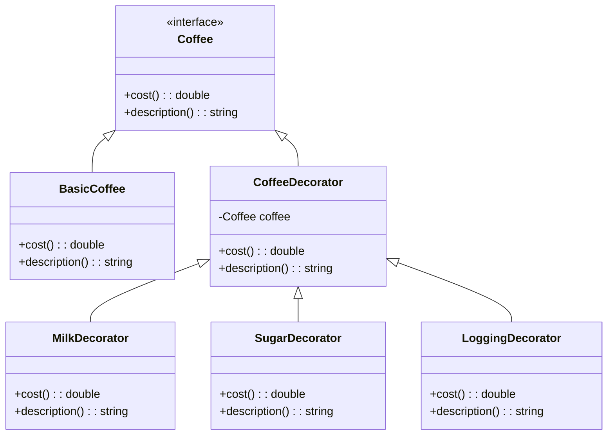

## 5.4 Decorator Pattern

The Decorator Pattern is a structural design pattern that allows behavior to be added to individual objects, either statically or dynamically, without affecting the behavior of other objects from the same class. This pattern is particularly useful in scenarios where you need to add responsibilities to objects without modifying their code, thus adhering to the Open/Closed Principle.

### Purpose

The primary purpose of the Decorator Pattern is to provide a flexible alternative to subclassing for extending functionality. By using this pattern, you can add new functionality to an object without altering its structure, which is especially beneficial in systems programming where flexibility and performance are crucial.

### Implementing Decorator in D

In the D programming language, implementing the Decorator Pattern involves creating a component interface that both the original object and the decorators will implement. Decorator classes are then used to wrap these components and add new functionality.

#### Component Interface

The component interface defines the methods that will be implemented by both the concrete component and the decorators. This ensures that the decorators can be used interchangeably with the original object.

```d
interface Coffee {
    double cost();
    string description();
}
```

#### Concrete Component

The concrete component is the original object to which new behavior will be added.

```d
class BasicCoffee : Coffee {
    double cost() {
        return 2.0;
    }

    string description() {
        return "Basic Coffee";
    }
}
```

#### Decorator Classes

Decorator classes implement the component interface and contain a reference to a component object. They add new behavior by calling the methods of the component object and then adding something extra.

```d
class CoffeeDecorator : Coffee {
    protected Coffee coffee;

    this(Coffee coffee) {
        this.coffee = coffee;
    }

    double cost() {
        return coffee.cost();
    }

    string description() {
        return coffee.description();
    }
}

class MilkDecorator : CoffeeDecorator {
    this(Coffee coffee) {
        super(coffee);
    }

    double cost() {
        return super.cost() + 0.5;
    }

    string description() {
        return super.description() ~ ", Milk";
    }
}

class SugarDecorator : CoffeeDecorator {
    this(Coffee coffee) {
        super(coffee);
    }

    double cost() {
        return super.cost() + 0.2;
    }

    string description() {
        return super.description() ~ ", Sugar";
    }
}
```

### Use Cases and Examples

The Decorator Pattern is versatile and can be used in various scenarios, such as enhancing objects with additional features like logging, security checks, or even graphical elements in a UI.

#### Enhancing Objects

Consider a scenario where you need to add logging to a component. Instead of modifying the component's code, you can create a decorator that adds logging functionality.

```d
class LoggingDecorator : CoffeeDecorator {
    this(Coffee coffee) {
        super(coffee);
    }

    double cost() {
        writeln("Calculating cost...");
        return super.cost();
    }

    string description() {
        return super.description();
    }
}
```

#### Flexible Designs

The Decorator Pattern allows behaviors to be mixed and matched at runtime, providing a flexible design that can adapt to changing requirements.

```d
void main() {
    Coffee myCoffee = new BasicCoffee();
    myCoffee = new MilkDecorator(myCoffee);
    myCoffee = new SugarDecorator(myCoffee);
    myCoffee = new LoggingDecorator(myCoffee);

    writeln("Cost: ", myCoffee.cost());
    writeln("Description: ", myCoffee.description());
}
```

### Visualizing the Decorator Pattern

To better understand the structure of the Decorator Pattern, let's visualize it using a class diagram.



### Key Participants

- **Component**: Defines the interface for objects that can have responsibilities added to them dynamically.
- **ConcreteComponent**: The original object to which additional responsibilities can be attached.
- **Decorator**: Maintains a reference to a component object and defines an interface that conforms to the component's interface.
- **ConcreteDecorator**: Adds responsibilities to the component.

### Applicability

Use the Decorator Pattern when:

- You need to add responsibilities to individual objects dynamically and transparently, without affecting other objects.
- You want to avoid a feature-laden class hierarchy by creating a set of decorator classes for each feature.
- You need to extend the functionality of a class in a flexible and reusable way.

### Design Considerations

When using the Decorator Pattern in D, consider the following:

- **Performance**: Each layer of decoration adds a level of indirection, which can impact performance. Use this pattern judiciously in performance-critical applications.
- **Complexity**: Decorators can lead to a system with many small objects that are difficult to understand and maintain.
- **D-Specific Features**: Leverage D's mixins and templates to create more flexible and reusable decorators.

### Differences and Similarities

The Decorator Pattern is often confused with the Proxy Pattern. While both involve a level of indirection, the Proxy Pattern controls access to an object, whereas the Decorator Pattern adds behavior to an object.

### Try It Yourself

Experiment with the code examples provided by:

- Adding new decorators, such as a `VanillaDecorator` or `CaramelDecorator`.
- Modifying existing decorators to change their behavior.
- Creating a decorator that combines multiple functionalities, such as a `MochaDecorator` that adds both chocolate and milk.

### Knowledge Check

- What is the primary purpose of the Decorator Pattern?
- How does the Decorator Pattern adhere to the Open/Closed Principle?
- What are some potential drawbacks of using the Decorator Pattern?

### Embrace the Journey

Remember, mastering design patterns is a journey. As you continue to explore the Decorator Pattern, you'll discover new ways to enhance your software designs. Keep experimenting, stay curious, and enjoy the journey!

## Quiz Time!



### What is the main purpose of the Decorator Pattern?

- [x] To add behavior to individual objects dynamically without affecting other objects.
- [ ] To control access to an object.
- [ ] To create a complex object from simpler objects.
- [ ] To define a family of algorithms.

> **Explanation:** The Decorator Pattern is used to add behavior to individual objects dynamically without affecting other objects.

### Which principle does the Decorator Pattern adhere to?

- [x] Open/Closed Principle
- [ ] Single Responsibility Principle
- [ ] Liskov Substitution Principle
- [ ] Dependency Inversion Principle

> **Explanation:** The Decorator Pattern adheres to the Open/Closed Principle by allowing objects to be extended with new behavior without modifying their code.

### What is a potential drawback of using the Decorator Pattern?

- [x] It can lead to a system with many small objects that are difficult to understand.
- [ ] It requires modifying the original object's code.
- [ ] It cannot be used with interfaces.
- [ ] It is not compatible with object-oriented programming.

> **Explanation:** The Decorator Pattern can lead to a system with many small objects, making it difficult to understand and maintain.

### How does a decorator add new behavior to an object?

- [x] By wrapping the object and adding functionality before or after delegating to the original object.
- [ ] By modifying the object's class definition.
- [ ] By inheriting from the object's class.
- [ ] By creating a new instance of the object with additional features.

> **Explanation:** A decorator wraps the object and adds functionality before or after delegating to the original object.

### What is the difference between the Decorator and Proxy Patterns?

- [x] The Decorator Pattern adds behavior, while the Proxy Pattern controls access.
- [ ] The Proxy Pattern adds behavior, while the Decorator Pattern controls access.
- [ ] Both patterns add behavior to objects.
- [ ] Both patterns control access to objects.

> **Explanation:** The Decorator Pattern adds behavior to an object, while the Proxy Pattern controls access to an object.

### In D, what feature can be leveraged to create more flexible decorators?

- [x] Mixins and templates
- [ ] Inline assembly
- [ ] Garbage collection
- [ ] Dynamic arrays

> **Explanation:** Mixins and templates in D can be used to create more flexible and reusable decorators.

### When should you use the Decorator Pattern?

- [x] When you need to add responsibilities to individual objects dynamically.
- [ ] When you need to create a complex object from simpler objects.
- [ ] When you need to control access to an object.
- [ ] When you need to define a family of algorithms.

> **Explanation:** Use the Decorator Pattern when you need to add responsibilities to individual objects dynamically.

### What is a key participant in the Decorator Pattern?

- [x] Component
- [ ] Factory
- [ ] Singleton
- [ ] Observer

> **Explanation:** The Component is a key participant in the Decorator Pattern, defining the interface for objects that can have responsibilities added to them.

### True or False: The Decorator Pattern can only be used with classes, not interfaces.

- [ ] True
- [x] False

> **Explanation:** The Decorator Pattern can be used with both classes and interfaces, as it relies on a common interface for the component and decorators.

### What is a common use case for the Decorator Pattern?

- [x] Adding logging functionality to an object.
- [ ] Creating a new instance of an object.
- [ ] Defining a family of algorithms.
- [ ] Controlling access to an object.

> **Explanation:** A common use case for the Decorator Pattern is adding logging functionality to an object.


