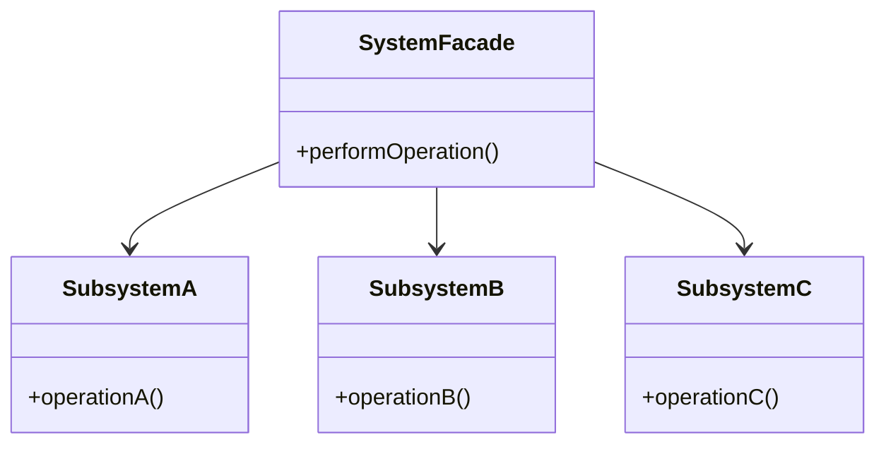

## 5.5 Facade Pattern

The Facade Pattern is a structural design pattern that provides a simplified interface to a complex subsystem. This pattern is particularly useful in software engineering when dealing with intricate systems that require a more user-friendly and cohesive interface. In this section, we will explore the Facade Pattern in the context of the D programming language, focusing on its implementation, use cases, and benefits.

### Purpose of the Facade Pattern

The primary purpose of the Facade Pattern is to simplify interactions with complex systems by providing a unified interface. This pattern achieves encapsulation by hiding the complexities of subsystem interactions, making it easier for developers to work with large and intricate codebases.

#### Key Benefits

- **Simplification**: Reduces the complexity of interacting with a subsystem.
- **Decoupling**: Minimizes dependencies between clients and subsystems.
- **Ease of Use**: Provides a more intuitive API for developers.
- **Improved Maintenance**: Facilitates easier updates and modifications to the subsystem.

### Implementing Facade in D

Implementing the Facade Pattern in D involves creating a class that serves as the interface to the subsystem. This class will expose a set of APIs that simplify the underlying complexity.

#### Unified Interface

The facade class acts as a single point of interaction for the client, providing a cohesive set of methods that abstract the underlying subsystem's complexity.

```d
// Facade class providing a simplified interface
class SystemFacade {
    private SubsystemA subsystemA;
    private SubsystemB subsystemB;
    private SubsystemC subsystemC;

    this() {
        subsystemA = new SubsystemA();
        subsystemB = new SubsystemB();
        subsystemC = new SubsystemC();
    }

    void performOperation() {
        // Simplified method that combines operations from multiple subsystems
        subsystemA.operationA();
        subsystemB.operationB();
        subsystemC.operationC();
    }
}

// Subsystem classes
class SubsystemA {
    void operationA() {
        writeln("SubsystemA: Operation A");
    }
}

class SubsystemB {
    void operationB() {
        writeln("SubsystemB: Operation B");
    }
}

class SubsystemC {
    void operationC() {
        writeln("SubsystemC: Operation C");
    }
}

// Client code
void main() {
    auto facade = new SystemFacade();
    facade.performOperation();
}
```

In this example, `SystemFacade` provides a unified interface to the client, abstracting the operations of `SubsystemA`, `SubsystemB`, and `SubsystemC`.

#### Encapsulation

Encapsulation is achieved by hiding the complexities of subsystem interactions within the facade class. This ensures that clients interact with a simplified API, without needing to understand the intricate details of the subsystem.

### Use Cases and Examples

The Facade Pattern is applicable in various scenarios, particularly when dealing with complex systems or legacy codebases.

#### API Simplification

When working with a complex library, the Facade Pattern can be used to create a simplified API that is easier for developers to use.

```d
// Example of a facade for a complex library
class LibraryFacade {
    private ComplexLibrary library;

    this() {
        library = new ComplexLibrary();
    }

    void simplifiedMethod() {
        library.complexMethod1();
        library.complexMethod2();
        library.complexMethod3();
    }
}

// Complex library class
class ComplexLibrary {
    void complexMethod1() {
        writeln("ComplexLibrary: Method 1");
    }

    void complexMethod2() {
        writeln("ComplexLibrary: Method 2");
    }

    void complexMethod3() {
        writeln("ComplexLibrary: Method 3");
    }
}

// Client code
void main() {
    auto facade = new LibraryFacade();
    facade.simplifiedMethod();
}
```

In this example, `LibraryFacade` provides a simplified method that abstracts the complexity of the `ComplexLibrary`.

#### Legacy Systems

The Facade Pattern is also useful for wrapping legacy systems, allowing developers to present a cleaner and more modern interface.

```d
// Facade for a legacy system
class LegacySystemFacade {
    private LegacySystem legacySystem;

    this() {
        legacySystem = new LegacySystem();
    }

    void modernInterface() {
        legacySystem.legacyMethod1();
        legacySystem.legacyMethod2();
    }
}

// Legacy system class
class LegacySystem {
    void legacyMethod1() {
        writeln("LegacySystem: Method 1");
    }

    void legacyMethod2() {
        writeln("LegacySystem: Method 2");
    }
}

// Client code
void main() {
    auto facade = new LegacySystemFacade();
    facade.modernInterface();
}
```

Here, `LegacySystemFacade` wraps the `LegacySystem`, providing a modern interface for clients.

### Design Considerations

When implementing the Facade Pattern in D, consider the following:

- **Subsystem Complexity**: Ensure that the facade adequately abstracts the complexity of the subsystem.
- **Interface Design**: Design the facade interface to be intuitive and easy to use.
- **Dependency Management**: Minimize dependencies between the facade and the subsystem to enhance maintainability.

### Differences and Similarities

The Facade Pattern is often confused with other structural patterns, such as the Adapter Pattern. While both patterns provide a way to interface with existing code, the Facade Pattern focuses on simplifying interactions with a complex subsystem, whereas the Adapter Pattern is used to make incompatible interfaces compatible.

### Visualizing the Facade Pattern

To better understand the Facade Pattern, let's visualize the relationships between the facade and the subsystems using a class diagram.



In this diagram, `SystemFacade` interacts with `SubsystemA`, `SubsystemB`, and `SubsystemC`, providing a simplified interface to the client.

### Try It Yourself

To deepen your understanding of the Facade Pattern, try modifying the code examples provided:

- Add additional methods to the subsystems and update the facade to include these methods.
- Create a new facade for a different set of subsystems and experiment with different ways to simplify the interface.

### Knowledge Check

Before moving on, let's review some key points:

- The Facade Pattern simplifies interactions with complex subsystems by providing a unified interface.
- It is useful for API simplification and wrapping legacy systems.
- The pattern enhances maintainability by decoupling clients from subsystem complexities.

Remember, mastering the Facade Pattern in D is just one step in your journey to becoming an expert in design patterns. Keep experimenting, stay curious, and enjoy the process!

## Quiz Time!



### What is the primary purpose of the Facade Pattern?

- [x] To provide a simplified interface to a complex subsystem.
- [ ] To make incompatible interfaces compatible.
- [ ] To allow objects to communicate without knowing each other's classes.
- [ ] To ensure a class has only one instance.

> **Explanation:** The Facade Pattern is designed to provide a simplified interface to a complex subsystem, making it easier for clients to interact with it.

### Which of the following is a benefit of using the Facade Pattern?

- [x] Simplification of complex subsystems.
- [x] Improved maintainability.
- [ ] Ensuring a class has only one instance.
- [ ] Allowing incompatible interfaces to work together.

> **Explanation:** The Facade Pattern simplifies complex subsystems and improves maintainability by providing a unified interface.

### How does the Facade Pattern achieve encapsulation?

- [x] By hiding the complexities of subsystem interactions within the facade class.
- [ ] By making incompatible interfaces compatible.
- [ ] By ensuring a class has only one instance.
- [ ] By allowing objects to communicate without knowing each other's classes.

> **Explanation:** The Facade Pattern encapsulates complexity by hiding subsystem interactions within the facade class.

### In which scenario is the Facade Pattern particularly useful?

- [x] When dealing with complex libraries or legacy systems.
- [ ] When ensuring a class has only one instance.
- [ ] When making incompatible interfaces compatible.
- [ ] When allowing objects to communicate without knowing each other's classes.

> **Explanation:** The Facade Pattern is useful for simplifying complex libraries and wrapping legacy systems to provide a cleaner interface.

### What is a key difference between the Facade Pattern and the Adapter Pattern?

- [x] The Facade Pattern simplifies interactions with a complex subsystem, while the Adapter Pattern makes incompatible interfaces compatible.
- [ ] The Facade Pattern ensures a class has only one instance, while the Adapter Pattern allows objects to communicate without knowing each other's classes.
- [ ] The Facade Pattern allows objects to communicate without knowing each other's classes, while the Adapter Pattern simplifies interactions with a complex subsystem.
- [ ] The Facade Pattern makes incompatible interfaces compatible, while the Adapter Pattern simplifies interactions with a complex subsystem.

> **Explanation:** The Facade Pattern simplifies interactions with complex subsystems, whereas the Adapter Pattern is used to make incompatible interfaces compatible.

### What is the role of the facade class in the Facade Pattern?

- [x] To act as a single point of interaction for the client.
- [ ] To ensure a class has only one instance.
- [ ] To make incompatible interfaces compatible.
- [ ] To allow objects to communicate without knowing each other's classes.

> **Explanation:** The facade class acts as a single point of interaction for the client, providing a unified interface to the subsystem.

### How can the Facade Pattern improve maintainability?

- [x] By decoupling clients from subsystem complexities.
- [ ] By ensuring a class has only one instance.
- [ ] By making incompatible interfaces compatible.
- [ ] By allowing objects to communicate without knowing each other's classes.

> **Explanation:** The Facade Pattern improves maintainability by decoupling clients from the complexities of the subsystem.

### What should be considered when designing a facade interface?

- [x] It should be intuitive and easy to use.
- [ ] It should ensure a class has only one instance.
- [ ] It should make incompatible interfaces compatible.
- [ ] It should allow objects to communicate without knowing each other's classes.

> **Explanation:** When designing a facade interface, it should be intuitive and easy to use to simplify client interactions.

### True or False: The Facade Pattern can be used to wrap legacy systems.

- [x] True
- [ ] False

> **Explanation:** True. The Facade Pattern can be used to wrap legacy systems, providing a modern and cleaner interface.

### True or False: The Facade Pattern is primarily used to make incompatible interfaces compatible.

- [ ] True
- [x] False

> **Explanation:** False. The Facade Pattern is primarily used to provide a simplified interface to a complex subsystem, not to make incompatible interfaces compatible.


