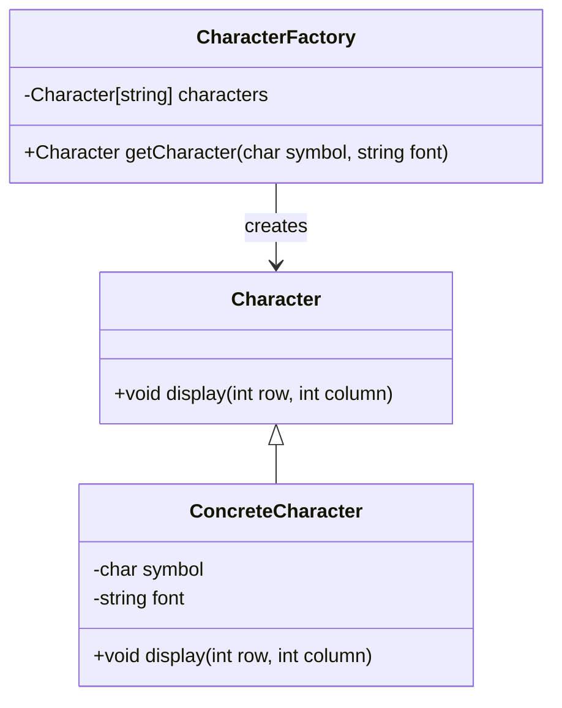

## 5.6 Flyweight Pattern

In the realm of software design, the Flyweight Pattern stands out as a powerful structural design pattern aimed at optimizing memory usage. By sharing as much data as possible among similar objects, the Flyweight Pattern enables efficient management of large numbers of objects, making it a valuable tool for systems programming in D.

### Purpose

The primary purpose of the Flyweight Pattern is to reduce memory consumption by sharing common parts of object states among multiple objects. This is particularly useful in scenarios where applications need to handle a large number of similar objects, such as graphical applications, text editors, or any system requiring efficient data caching.

### Implementing Flyweight in D

To implement the Flyweight Pattern in D, we need to understand two key concepts: intrinsic and extrinsic states.

#### Intrinsic State

The intrinsic state is the part of an object's state that is shared among multiple objects. This state is independent of the object's context and remains constant across different instances. In D, intrinsic states can be efficiently managed using immutable data structures or shared resources.

#### Extrinsic State

The extrinsic state, on the other hand, is context-dependent and varies between different instances. This state is not shared and must be supplied by the client code whenever the flyweight object is used. In D, extrinsic states can be passed as parameters to methods or managed externally.

#### Factory Methods

Factory methods play a crucial role in the Flyweight Pattern by ensuring the proper sharing of flyweight instances. These methods are responsible for creating and managing flyweight objects, ensuring that shared instances are reused whenever possible.

### Use Cases and Examples

#### Large-Scale Object Management

Consider a graphical application that needs to render thousands of shapes on the screen. Each shape has properties like color, texture, and position. By using the Flyweight Pattern, we can share the color and texture properties (intrinsic state) among similar shapes, while the position (extrinsic state) is managed externally.

#### Data Caching

In scenarios where immutable data is frequently accessed, the Flyweight Pattern can be used to cache and reuse data, reducing memory overhead. This is particularly useful in applications that deal with large datasets or require frequent access to configuration data.

### Sample Code Snippet

Let's explore a practical example of implementing the Flyweight Pattern in D. We'll create a simple text editor that uses flyweight objects to manage character formatting efficiently.

```d
import std.stdio;
import std.string;
import std.conv;

// Flyweight Interface
interface Character {
    void display(int row, int column);
}

// Concrete Flyweight
class ConcreteCharacter : Character {
    private immutable(char) symbol;
    private immutable(string) font;

    this(char symbol, string font) {
        this.symbol = symbol;
        this.font = font;
    }

    override void display(int row, int column) {
        writeln("Character: ", symbol, " Font: ", font, " Position: (", row, ", ", column, ")");
    }
}

// Flyweight Factory
class CharacterFactory {
    private Character[string] characters;

    Character getCharacter(char symbol, string font) {
        string key = to!string(symbol) ~ font;
        if (!characters.exists(key)) {
            characters[key] = new ConcreteCharacter(symbol, font);
        }
        return characters[key];
    }
}

void main() {
    auto factory = new CharacterFactory();

    // Create flyweight characters
    auto charA = factory.getCharacter('A', "Arial");
    auto charB = factory.getCharacter('B', "Arial");
    auto charA2 = factory.getCharacter('A', "Arial");

    // Display characters with extrinsic state
    charA.display(1, 1);
    charB.display(1, 2);
    charA2.display(2, 1);

    // Verify that charA and charA2 are the same instance
    assert(charA is charA2);
}
```

### Design Considerations

When implementing the Flyweight Pattern in D, consider the following:

- **Memory vs. Performance Trade-off**: While the Flyweight Pattern reduces memory usage, it may introduce additional complexity in managing extrinsic states. Ensure that the performance benefits outweigh the overhead.
- **Thread Safety**: If flyweight objects are shared across multiple threads, ensure proper synchronization to avoid race conditions.
- **D Language Features**: Leverage D's powerful type system and compile-time features to optimize flyweight implementations. Use `immutable` for intrinsic states to ensure data integrity.

### Differences and Similarities

The Flyweight Pattern is often compared to other structural patterns like the Singleton Pattern. While both patterns aim to manage shared resources, the Flyweight Pattern focuses on sharing parts of an object's state, whereas the Singleton Pattern ensures a single instance of an entire object.

### Visualizing the Flyweight Pattern

To better understand the Flyweight Pattern, let's visualize its structure using a class diagram.



**Diagram Description**: This class diagram illustrates the Flyweight Pattern's structure. The `Character` interface defines the common behavior, while `ConcreteCharacter` implements the flyweight objects. The `CharacterFactory` manages the creation and sharing of flyweight instances.

### Try It Yourself

To deepen your understanding of the Flyweight Pattern, try modifying the code example:

- **Experiment with Different Fonts**: Add more fonts and observe how the factory manages different flyweight instances.
- **Add More Characters**: Extend the example to include more characters and verify the memory savings.
- **Implement Thread Safety**: Modify the factory to be thread-safe and test it in a multi-threaded environment.

### Knowledge Check

Before we conclude, let's reinforce your understanding with a few questions:

- What are the key differences between intrinsic and extrinsic states?
- How does the Flyweight Pattern optimize memory usage?
- What role does the factory method play in the Flyweight Pattern?

### Embrace the Journey

Remember, mastering design patterns is a journey. As you explore the Flyweight Pattern, you'll gain insights into efficient memory management and object sharing. Keep experimenting, stay curious, and enjoy the process of building high-performance applications in D.

## Quiz Time!



### What is the primary purpose of the Flyweight Pattern?

- [x] To reduce memory usage by sharing data among similar objects.
- [ ] To ensure a single instance of an object.
- [ ] To manage object creation.
- [ ] To encapsulate a group of individual factories.

> **Explanation:** The Flyweight Pattern is designed to reduce memory usage by sharing as much data as possible with similar objects.

### In the Flyweight Pattern, what is the intrinsic state?

- [x] The part of an object's state that is shared among multiple objects.
- [ ] The part of an object's state that is context-dependent.
- [ ] The state that is managed externally.
- [ ] The state that is passed as parameters.

> **Explanation:** The intrinsic state is the part of an object's state that is shared among multiple objects and remains constant.

### What is the role of the factory method in the Flyweight Pattern?

- [x] To ensure proper sharing of flyweight instances.
- [ ] To create new objects every time.
- [ ] To manage extrinsic states.
- [ ] To encapsulate object creation logic.

> **Explanation:** The factory method ensures proper sharing of flyweight instances by managing their creation and reuse.

### How does the Flyweight Pattern handle extrinsic state?

- [x] It is passed in or managed externally.
- [ ] It is shared among all objects.
- [ ] It is stored within the flyweight object.
- [ ] It is ignored.

> **Explanation:** The extrinsic state is context-dependent and is passed in or managed externally.

### Which of the following is a use case for the Flyweight Pattern?

- [x] Large-scale object management.
- [ ] Ensuring a single instance of an object.
- [ ] Managing object dependencies.
- [ ] Encapsulating a group of individual factories.

> **Explanation:** The Flyweight Pattern is useful for managing large numbers of similar objects efficiently.

### What is a potential drawback of the Flyweight Pattern?

- [x] It may introduce additional complexity in managing extrinsic states.
- [ ] It increases memory usage.
- [ ] It reduces performance.
- [ ] It limits the number of objects.

> **Explanation:** The Flyweight Pattern may introduce complexity in managing extrinsic states, which can be a drawback.

### How can D's `immutable` keyword be used in the Flyweight Pattern?

- [x] To ensure data integrity for intrinsic states.
- [ ] To manage extrinsic states.
- [ ] To create new flyweight instances.
- [ ] To encapsulate object creation logic.

> **Explanation:** The `immutable` keyword in D can be used to ensure data integrity for intrinsic states by making them constant.

### What is a key difference between the Flyweight Pattern and the Singleton Pattern?

- [x] The Flyweight Pattern focuses on sharing parts of an object's state, while the Singleton Pattern ensures a single instance of an entire object.
- [ ] The Flyweight Pattern ensures a single instance of an object, while the Singleton Pattern shares parts of an object's state.
- [ ] Both patterns focus on memory optimization.
- [ ] Both patterns manage object creation.

> **Explanation:** The Flyweight Pattern focuses on sharing parts of an object's state, while the Singleton Pattern ensures a single instance of an entire object.

### Can the Flyweight Pattern be used in a multi-threaded environment?

- [x] True
- [ ] False

> **Explanation:** The Flyweight Pattern can be used in a multi-threaded environment, but proper synchronization is needed to avoid race conditions.

### What is the benefit of using the Flyweight Pattern in data caching?

- [x] It reduces memory overhead by reusing immutable data.
- [ ] It increases memory usage by creating new instances.
- [ ] It simplifies object creation.
- [ ] It ensures a single instance of an object.

> **Explanation:** The Flyweight Pattern reduces memory overhead by reusing immutable data, making it beneficial for data caching.



By mastering the Flyweight Pattern, you are well on your way to building efficient and scalable software systems in D. Keep exploring and applying these concepts to enhance your skills as an expert software engineer and architect.
