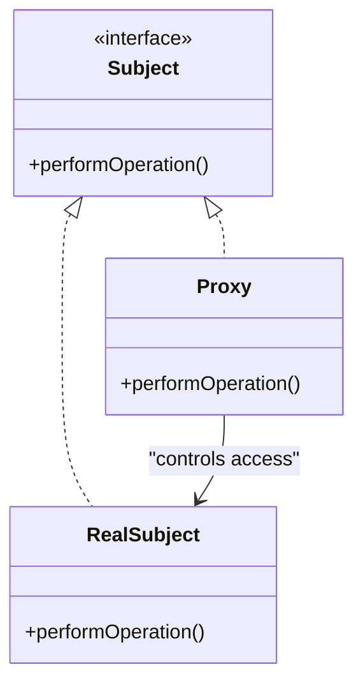

## 5.7 Proxy Pattern

The Proxy Pattern is a structural design pattern that provides a surrogate or placeholder for another object to control access to it. This pattern is particularly useful in systems programming where managing resources efficiently and securely is paramount. In the D programming language, the Proxy Pattern can be implemented using various techniques, leveraging D's unique features such as templates, mixins, and compile-time function execution.

### Purpose of the Proxy Pattern

The primary purpose of the Proxy Pattern is to control access to an object. This can be achieved in several ways, including:

- **Remote Proxy**: Manages communication with a remote object, often used in distributed systems.
- **Virtual Proxy**: Controls access to resource-intensive objects, creating them on demand.
- **Protection Proxy**: Adds access control to ensure that only authorized users can access certain functionalities.

### Key Participants

- **Subject**: The common interface for RealSubject and Proxy, allowing Proxy to be used anywhere RealSubject is expected.
- **RealSubject**: The actual object that the proxy represents.
- **Proxy**: The surrogate that controls access to the RealSubject.

### Applicability

- Use the Proxy Pattern when you need to control access to an object.
- Apply it when you want to add a layer of security or manage resource-intensive operations.
- Consider it for lazy initialization, where object creation is deferred until necessary.

### Implementing Proxy in D

#### Remote Proxy

A Remote Proxy is used to manage communication with a remote object. This is particularly useful in distributed systems where objects may reside on different machines.

```d
interface IService {
    void performOperation();
}

class RealService : IService {
    void performOperation() {
        writeln("Performing operation in RealService.");
    }
}

class RemoteProxy : IService {
    private RealService realService;

    void performOperation() {
        if (realService is null) {
            realService = new RealService();
        }
        writeln("RemoteProxy: Forwarding request to RealService.");
        realService.performOperation();
    }
}

void main() {
    IService service = new RemoteProxy();
    service.performOperation();
}
```

In this example, `RemoteProxy` acts as a stand-in for `RealService`, managing its instantiation and access.

#### Virtual Proxy

A Virtual Proxy controls access to resource-intensive objects, creating them only when necessary. This is useful for optimizing performance and resource usage.

```d
interface IImage {
    void display();
}

class RealImage : IImage {
    private string filename;

    this(string filename) {
        this.filename = filename;
        loadFromDisk();
    }

    void loadFromDisk() {
        writeln("Loading " ~ filename);
    }

    void display() {
        writeln("Displaying " ~ filename);
    }
}

class VirtualProxyImage : IImage {
    private RealImage realImage;
    private string filename;

    this(string filename) {
        this.filename = filename;
    }

    void display() {
        if (realImage is null) {
            realImage = new RealImage(filename);
        }
        realImage.display();
    }
}

void main() {
    IImage image = new VirtualProxyImage("test.jpg");
    image.display(); // Image is loaded and displayed
    image.display(); // Image is displayed without loading
}
```

Here, `VirtualProxyImage` delays the loading of `RealImage` until `display()` is called, optimizing resource usage.

#### Protection Proxy

A Protection Proxy adds access control to an object, ensuring that only authorized users can perform certain actions.

```d
interface IDocument {
    void read();
    void write();
}

class RealDocument : IDocument {
    void read() {
        writeln("Reading document.");
    }

    void write() {
        writeln("Writing document.");
    }
}

class ProtectionProxy : IDocument {
    private RealDocument realDocument;
    private bool hasWriteAccess;

    this(bool hasWriteAccess) {
        this.hasWriteAccess = hasWriteAccess;
        realDocument = new RealDocument();
    }

    void read() {
        realDocument.read();
    }

    void write() {
        if (hasWriteAccess) {
            realDocument.write();
        } else {
            writeln("Access Denied: Write operation not permitted.");
        }
    }
}

void main() {
    IDocument document = new ProtectionProxy(false);
    document.read();
    document.write();
}
```

In this example, `ProtectionProxy` checks for write access before allowing modifications to the document.

### Use Cases and Examples

#### Lazy Loading

Lazy loading is a common use case for the Proxy Pattern, where object creation is delayed until it is actually needed. This can significantly improve performance and reduce memory usage.

#### Security Proxies

Security proxies restrict access to certain functionalities based on user permissions. This is particularly useful in applications where different users have different levels of access.

### Design Considerations

- **Performance**: Consider the overhead introduced by the proxy. While it can optimize resource usage, it may also introduce latency.
- **Security**: Ensure that the proxy does not expose sensitive information or introduce security vulnerabilities.
- **Complexity**: The Proxy Pattern can add complexity to the codebase. Use it judiciously and only when necessary.

### Differences and Similarities

- **Proxy vs. Decorator**: Both patterns involve a level of indirection, but the Proxy Pattern is primarily about controlling access, while the Decorator Pattern is about adding behavior.
- **Proxy vs. Adapter**: The Adapter Pattern is used to make two incompatible interfaces work together, whereas the Proxy Pattern controls access to an object.

### Visualizing the Proxy Pattern



This diagram illustrates the relationship between `Subject`, `RealSubject`, and `Proxy`, highlighting the control flow.

### Try It Yourself

Experiment with the provided code examples by modifying the access control logic in the `ProtectionProxy` or by adding logging functionality to the `RemoteProxy`. Observe how these changes affect the behavior of the proxies.

### Knowledge Check

- What are the key differences between a Proxy and a Decorator?
- How does a Virtual Proxy optimize resource usage?
- In what scenarios would a Protection Proxy be most beneficial?

### Embrace the Journey

Remember, mastering design patterns is a journey. As you explore the Proxy Pattern, consider how it can be applied to your own projects. Keep experimenting, stay curious, and enjoy the process of learning and applying these powerful concepts.

## Quiz Time!



### What is the primary purpose of the Proxy Pattern?

- [x] To control access to an object
- [ ] To add new behavior to an object
- [ ] To make two incompatible interfaces work together
- [ ] To create a new object

> **Explanation:** The Proxy Pattern is used to control access to an object, often adding a layer of security or managing resource-intensive operations.

### Which type of proxy is used to manage communication with a remote object?

- [x] Remote Proxy
- [ ] Virtual Proxy
- [ ] Protection Proxy
- [ ] Security Proxy

> **Explanation:** A Remote Proxy is used to manage communication with a remote object, often in distributed systems.

### What is a key benefit of using a Virtual Proxy?

- [x] Delaying the creation of resource-intensive objects
- [ ] Adding security features
- [ ] Making incompatible interfaces work together
- [ ] Enhancing performance through caching

> **Explanation:** A Virtual Proxy delays the creation of resource-intensive objects until they are needed, optimizing resource usage.

### How does a Protection Proxy enhance security?

- [x] By adding access control to an object
- [ ] By encrypting data
- [ ] By logging all operations
- [ ] By compressing data

> **Explanation:** A Protection Proxy enhances security by adding access control, ensuring only authorized users can perform certain actions.

### What is a common use case for the Proxy Pattern?

- [x] Lazy Loading
- [ ] Data Transformation
- [ ] Interface Compatibility
- [ ] Object Creation

> **Explanation:** Lazy Loading is a common use case for the Proxy Pattern, where object creation is delayed until necessary.

### How does the Proxy Pattern differ from the Decorator Pattern?

- [x] Proxy controls access, Decorator adds behavior
- [ ] Proxy adds behavior, Decorator controls access
- [ ] Both control access
- [ ] Both add behavior

> **Explanation:** The Proxy Pattern controls access to an object, while the Decorator Pattern adds new behavior to an object.

### In which scenario would a Remote Proxy be most useful?

- [x] Distributed systems
- [ ] Single-threaded applications
- [ ] Local file access
- [ ] User interface design

> **Explanation:** A Remote Proxy is most useful in distributed systems where objects may reside on different machines.

### What is the role of the RealSubject in the Proxy Pattern?

- [x] The actual object that the proxy represents
- [ ] The interface for the proxy
- [ ] The object that adds behavior
- [ ] The object that controls access

> **Explanation:** The RealSubject is the actual object that the proxy represents and controls access to.

### Which feature of D can be leveraged in implementing the Proxy Pattern?

- [x] Templates and mixins
- [ ] Garbage collection
- [ ] Dynamic typing
- [ ] Weak typing

> **Explanation:** D's templates and mixins can be leveraged to implement the Proxy Pattern effectively.

### True or False: The Proxy Pattern can add complexity to the codebase.

- [x] True
- [ ] False

> **Explanation:** The Proxy Pattern can add complexity to the codebase, so it should be used judiciously and only when necessary.


