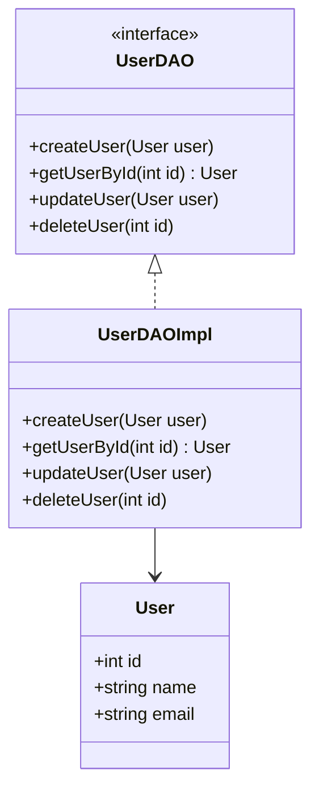

## 5.8.1 Data Access Object (DAO) Pattern

The Data Access Object (DAO) pattern is a structural design pattern that provides an abstract interface to some type of database or other persistence mechanism. By mapping application calls to the persistence layer, the DAO pattern provides specific data operations without exposing details of the database. This pattern is especially useful in D programming for systems that require efficient data access and manipulation.

### Intent

The primary intent of the DAO pattern is to abstract and encapsulate all access to the data source, ensuring that the rest of the application remains decoupled from the specifics of data storage. This abstraction allows for easier maintenance and flexibility in changing the underlying data source without affecting the business logic.

### Key Participants

- **DAO Interface**: Defines the standard operations to be performed on a model object(s).
- **Concrete DAO**: Implements the DAO interface. This class is responsible for interacting with the data source.
- **Model Object or Value Object**: Represents the data that is being accessed or manipulated.
- **Client**: Uses the DAO to perform operations on the data source.

### Applicability

Use the DAO pattern when:

- You need to separate data access logic from business logic.
- You want to provide a uniform interface to different types of data sources.
- You aim to make your application more maintainable and scalable by decoupling data access code.

### Implementing DAO in D

#### Separation of Concerns

In D, the DAO pattern helps maintain a clean separation of concerns by isolating the data access logic from the business logic. This separation makes the codebase easier to manage and test.

#### Interface Definition

Define a DAO interface that specifies the CRUD (Create, Read, Update, Delete) operations. This interface acts as a contract for any concrete DAO implementation.

```d
interface UserDAO {
    void createUser(User user);
    User getUserById(int id);
    void updateUser(User user);
    void deleteUser(int id);
}
```

#### Concrete DAO Implementation

Implement the DAO interface in a concrete class. This class will handle the actual data source interactions, such as database queries.

```d
class UserDAOImpl : UserDAO {
    override void createUser(User user) {
        // Code to insert user into the database
    }

    override User getUserById(int id) {
        // Code to retrieve user from the database
        return new User(); // Placeholder return
    }

    override void updateUser(User user) {
        // Code to update user in the database
    }

    override void deleteUser(int id) {
        // Code to delete user from the database
    }
}
```

### Use Cases and Examples

#### Database Interactions

The DAO pattern is particularly useful for simplifying and standardizing database interactions. By using DAOs, you can ensure that all database access is performed through a consistent interface, making it easier to manage and modify.

```d
class User {
    int id;
    string name;
    string email;
}

void main() {
    UserDAO userDao = new UserDAOImpl();
    
    // Create a new user
    User newUser = new User();
    newUser.id = 1;
    newUser.name = "John Doe";
    newUser.email = "john.doe@example.com";
    userDao.createUser(newUser);
    
    // Retrieve a user
    User user = userDao.getUserById(1);
    
    // Update a user
    user.name = "Jane Doe";
    userDao.updateUser(user);
    
    // Delete a user
    userDao.deleteUser(1);
}
```

### Design Considerations

When implementing the DAO pattern in D, consider the following:

- **Concurrency**: Ensure that your DAO implementation is thread-safe if it will be accessed by multiple threads simultaneously.
- **Error Handling**: Implement robust error handling to manage database exceptions and ensure that the application can recover gracefully.
- **Performance**: Optimize your DAO methods for performance, especially if they will be called frequently or handle large amounts of data.

### Differences and Similarities

The DAO pattern is often confused with the Repository pattern. While both patterns abstract data access, the DAO pattern is more focused on a single data source, whereas the Repository pattern can aggregate data from multiple sources.

### Visualizing the DAO Pattern

Below is a class diagram illustrating the DAO pattern:



### Try It Yourself

To better understand the DAO pattern, try modifying the code examples:

- Add more fields to the `User` class and update the DAO methods accordingly.
- Implement a new DAO for a different entity, such as `Product`.
- Experiment with different data sources, such as a file or an in-memory list, instead of a database.

### Knowledge Check

- What is the primary purpose of the DAO pattern?
- How does the DAO pattern help in separating concerns?
- What are the key participants in the DAO pattern?
- How can you ensure thread safety in a DAO implementation?

### Embrace the Journey

Remember, mastering design patterns like DAO is just the beginning. As you progress, you'll build more complex and efficient systems. Keep experimenting, stay curious, and enjoy the journey!

## Quiz Time!



### What is the primary purpose of the DAO pattern?

- [x] To abstract and encapsulate all access to the data source
- [ ] To provide a user interface for data entry
- [ ] To optimize database queries
- [ ] To manage application state

> **Explanation:** The DAO pattern abstracts and encapsulates all access to the data source, ensuring that the rest of the application remains decoupled from the specifics of data storage.

### Which of the following is a key participant in the DAO pattern?

- [x] DAO Interface
- [ ] User Interface
- [ ] Network Interface
- [ ] File System Interface

> **Explanation:** The DAO Interface defines the standard operations to be performed on a model object(s).

### What does CRUD stand for in the context of DAO?

- [x] Create, Read, Update, Delete
- [ ] Connect, Retrieve, Update, Delete
- [ ] Create, Retrieve, Upload, Delete
- [ ] Connect, Read, Upload, Delete

> **Explanation:** CRUD stands for Create, Read, Update, Delete, which are the basic operations performed on data.

### How does the DAO pattern help in separating concerns?

- [x] By isolating data access logic from business logic
- [ ] By combining data access and business logic
- [ ] By merging data access with user interface logic
- [ ] By integrating data access with network operations

> **Explanation:** The DAO pattern helps maintain a clean separation of concerns by isolating the data access logic from the business logic.

### What is a common use case for the DAO pattern?

- [x] Simplifying and standardizing database interactions
- [ ] Designing user interfaces
- [ ] Managing application state
- [ ] Handling network communication

> **Explanation:** The DAO pattern is particularly useful for simplifying and standardizing database interactions.

### What should you consider when implementing a DAO in D?

- [x] Concurrency and thread safety
- [ ] User interface design
- [ ] Network latency
- [ ] File system access

> **Explanation:** When implementing the DAO pattern in D, ensure that your DAO implementation is thread-safe if it will be accessed by multiple threads simultaneously.

### What is the difference between the DAO and Repository patterns?

- [x] DAO is focused on a single data source, while Repository can aggregate data from multiple sources
- [ ] DAO is used for user interfaces, while Repository is used for databases
- [ ] DAO is for network operations, while Repository is for file systems
- [ ] DAO is for application state, while Repository is for user data

> **Explanation:** The DAO pattern is more focused on a single data source, whereas the Repository pattern can aggregate data from multiple sources.

### What is a benefit of using the DAO pattern?

- [x] Easier maintenance and flexibility in changing the underlying data source
- [ ] Faster network communication
- [ ] Improved user interface design
- [ ] Enhanced application state management

> **Explanation:** The DAO pattern allows for easier maintenance and flexibility in changing the underlying data source without affecting the business logic.

### What is a potential pitfall when implementing the DAO pattern?

- [x] Poor error handling leading to database exceptions
- [ ] Overly complex user interfaces
- [ ] Slow network communication
- [ ] Inefficient application state management

> **Explanation:** Implement robust error handling to manage database exceptions and ensure that the application can recover gracefully.

### True or False: The DAO pattern can only be used with relational databases.

- [ ] True
- [x] False

> **Explanation:** The DAO pattern can be used with various types of data sources, not just relational databases.


