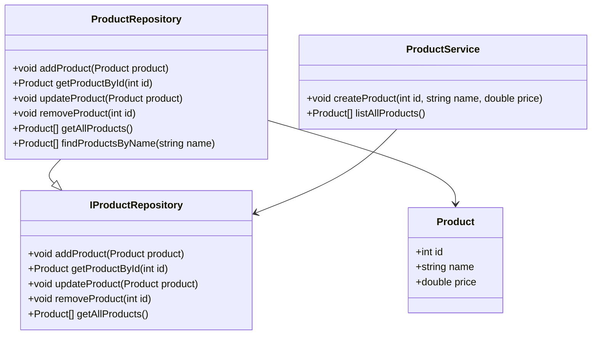

## 5.8.2 Repository Pattern

The Repository Pattern is a crucial structural design pattern that serves as a mediator between the domain and data mapping layers, providing a collection-like interface for accessing domain objects. This pattern is particularly beneficial in systems programming with the D language, where it can help manage complexity and improve maintainability by abstracting data access logic.

### Purpose

The primary purpose of the Repository Pattern is to decouple the domain logic from data access logic. By doing so, it provides a clean separation of concerns, allowing developers to focus on the business logic without worrying about the underlying data storage mechanisms. This pattern is especially useful in Domain-Driven Design (DDD), where managing domain objects efficiently is paramount.

### Implementing Repository in D

Implementing the Repository Pattern in D involves creating a repository class or interface that encapsulates all data access logic. This repository acts as a collection of domain objects, providing methods for adding, removing, and querying these objects.

#### Aggregating Data Operations

The repository serves as a centralized point for data operations, aggregating CRUD (Create, Read, Update, Delete) operations. This centralization simplifies data management and ensures consistency across the application.

```d
// Define a simple domain object
struct Product {
    int id;
    string name;
    double price;
}

// Define a repository interface
interface IProductRepository {
    void addProduct(Product product);
    Product getProductById(int id);
    void updateProduct(Product product);
    void removeProduct(int id);
    Product[] getAllProducts();
}

// Implement the repository
class ProductRepository : IProductRepository {
    private Product[] products;

    void addProduct(Product product) {
        products ~= product;
    }

    Product getProductById(int id) {
        return products.find!(p => p.id == id);
    }

    void updateProduct(Product product) {
        auto index = products.indexOf!(p => p.id == product.id);
        if (index != -1) {
            products[index] = product;
        }
    }

    void removeProduct(int id) {
        products = products.filter!(p => p.id != id).array;
    }

    Product[] getAllProducts() {
        return products;
    }
}
```

In this example, the `ProductRepository` class implements the `IProductRepository` interface, providing methods to manage `Product` objects. The repository encapsulates all data operations, making it easier to manage and test.

#### Query Abstraction

The Repository Pattern also encapsulates query logic, allowing for more flexible and maintainable code. By abstracting queries, developers can change the underlying data storage mechanism without affecting the domain logic.

```d
// Add a method to find products by name
Product[] findProductsByName(string name) {
    return products.filter!(p => p.name == name).array;
}
```

This method abstracts the query logic for finding products by name, allowing for easy modifications if the data storage mechanism changes.

### Use Cases and Examples

The Repository Pattern is widely used in Domain-Driven Design (DDD) to manage domain objects. It provides a consistent API for accessing data, making it easier to implement business logic without worrying about data storage details.

#### Domain-Driven Design

In DDD, the Repository Pattern is used to manage domain objects, providing a clear separation between the domain logic and data access logic. This separation allows developers to focus on the business logic, improving maintainability and scalability.

```d
// Define a domain service that uses the repository
class ProductService {
    private IProductRepository repository;

    this(IProductRepository repository) {
        this.repository = repository;
    }

    void createProduct(int id, string name, double price) {
        auto product = Product(id, name, price);
        repository.addProduct(product);
    }

    Product[] listAllProducts() {
        return repository.getAllProducts();
    }
}
```

In this example, the `ProductService` class uses the `IProductRepository` interface to manage `Product` objects. This separation of concerns allows the service to focus on business logic, while the repository handles data access.

### Visualizing the Repository Pattern

To better understand the Repository Pattern, let's visualize its structure using a class diagram.



**Diagram Description:** This class diagram illustrates the relationship between the `Product`, `IProductRepository`, `ProductRepository`, and `ProductService` classes. The `ProductRepository` implements the `IProductRepository` interface, while the `ProductService` depends on the `IProductRepository` to manage `Product` objects.

### Design Considerations

When implementing the Repository Pattern in D, consider the following:

- **Interface Segregation**: Define interfaces for repositories to ensure a clear contract for data access operations.
- **Dependency Injection**: Use dependency injection to provide repositories to services, promoting loose coupling and testability.
- **Transaction Management**: Consider how transactions will be managed within the repository, especially if using a database.
- **Caching**: Implement caching strategies to improve performance, especially for frequently accessed data.

### Differences and Similarities

The Repository Pattern is often confused with the Data Access Object (DAO) pattern. While both patterns abstract data access logic, the Repository Pattern is more focused on domain-driven design and provides a collection-like interface for managing domain objects. In contrast, the DAO pattern is more concerned with the persistence mechanism and often includes more detailed CRUD operations.

### Try It Yourself

To deepen your understanding of the Repository Pattern, try modifying the code examples provided:

- **Add New Methods**: Implement additional query methods in the `ProductRepository` class, such as finding products by price range.
- **Change Data Storage**: Modify the `ProductRepository` to use a different data storage mechanism, such as a database or file system.
- **Implement Caching**: Add caching to the `ProductRepository` to improve performance for frequently accessed data.

### Knowledge Check

- **What is the primary purpose of the Repository Pattern?**
- **How does the Repository Pattern improve maintainability in Domain-Driven Design?**
- **What are the key differences between the Repository Pattern and the DAO pattern?**

### Embrace the Journey

Remember, mastering design patterns is a journey. As you continue to explore the Repository Pattern in D, you'll gain a deeper understanding of how to manage data access in complex systems. Keep experimenting, stay curious, and enjoy the process of learning and growing as a software engineer.

## Quiz Time!



### What is the primary purpose of the Repository Pattern?

- [x] To decouple domain logic from data access logic
- [ ] To manage memory allocation
- [ ] To handle concurrency
- [ ] To optimize performance

> **Explanation:** The Repository Pattern is designed to decouple domain logic from data access logic, providing a clean separation of concerns.

### How does the Repository Pattern improve maintainability?

- [x] By providing a consistent API for data access
- [ ] By reducing code duplication
- [ ] By increasing performance
- [ ] By simplifying memory management

> **Explanation:** The Repository Pattern improves maintainability by providing a consistent API for data access, allowing developers to focus on business logic.

### What is a key difference between the Repository Pattern and the DAO pattern?

- [x] The Repository Pattern is more focused on domain-driven design
- [ ] The DAO pattern provides a collection-like interface
- [ ] The Repository Pattern is concerned with persistence mechanisms
- [ ] The DAO pattern is used for memory management

> **Explanation:** The Repository Pattern is more focused on domain-driven design, while the DAO pattern is concerned with persistence mechanisms.

### Which of the following is a benefit of using the Repository Pattern?

- [x] Improved testability
- [ ] Increased memory usage
- [ ] Reduced performance
- [ ] Simplified concurrency management

> **Explanation:** The Repository Pattern improves testability by decoupling domain logic from data access logic.

### What is an important consideration when implementing the Repository Pattern?

- [x] Interface segregation
- [ ] Memory allocation
- [ ] Concurrency control
- [ ] Performance optimization

> **Explanation:** Interface segregation is important to ensure a clear contract for data access operations.

### How can the Repository Pattern be used in Domain-Driven Design?

- [x] By managing domain objects
- [ ] By optimizing performance
- [ ] By handling concurrency
- [ ] By managing memory

> **Explanation:** In Domain-Driven Design, the Repository Pattern is used to manage domain objects, providing a clear separation between domain logic and data access logic.

### What is a common use case for the Repository Pattern?

- [x] Managing domain objects
- [ ] Handling concurrency
- [ ] Optimizing performance
- [ ] Managing memory

> **Explanation:** A common use case for the Repository Pattern is managing domain objects, especially in Domain-Driven Design.

### How does the Repository Pattern encapsulate query logic?

- [x] By providing methods for querying domain objects
- [ ] By optimizing memory usage
- [ ] By handling concurrency
- [ ] By managing transactions

> **Explanation:** The Repository Pattern encapsulates query logic by providing methods for querying domain objects, allowing for flexible and maintainable code.

### What is a potential pitfall of the Repository Pattern?

- [x] Overcomplicating simple data access
- [ ] Reducing performance
- [ ] Increasing memory usage
- [ ] Simplifying concurrency management

> **Explanation:** A potential pitfall of the Repository Pattern is overcomplicating simple data access scenarios.

### True or False: The Repository Pattern is only useful in large applications.

- [ ] True
- [x] False

> **Explanation:** The Repository Pattern can be useful in applications of all sizes, providing benefits such as improved maintainability and testability.


