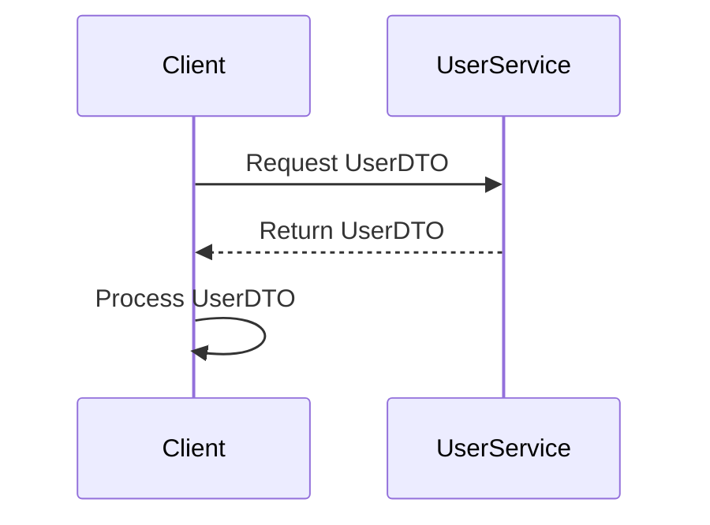

## 5.8.3 Data Transfer Object (DTO) Pattern

The Data Transfer Object (DTO) pattern is a structural design pattern used to transfer data between software application subsystems. It is particularly useful in distributed systems where reducing the number of method calls is crucial for performance optimization. In this section, we will explore how to implement the DTO pattern in the D programming language, focusing on creating simple data containers and preparing them for serialization.

### Purpose of the DTO Pattern

The primary purpose of the DTO pattern is to encapsulate data and transfer it between processes or systems efficiently. By using DTOs, you can reduce the number of remote calls required to fetch or send data, as a single DTO can carry multiple pieces of information at once. This is especially beneficial in distributed systems where network latency can be a bottleneck.

### Implementing DTO in D

#### Simple Data Containers

In D, DTOs can be implemented using structs or classes. Structs are often preferred for DTOs due to their value-type semantics, which can lead to performance benefits. However, classes can also be used when inheritance or polymorphism is required.

**Example: Implementing a DTO using a Struct**

```d
struct UserDTO {
    string username;
    string email;
    int age;
    // Additional fields can be added as needed
}

// Usage
UserDTO user = UserDTO("john_doe", "john@example.com", 30);
```

In this example, `UserDTO` is a simple struct that holds user-related data. It can be easily instantiated and used to transfer user information between different parts of an application or across network boundaries.

#### Serialization

Serialization is the process of converting a DTO into a format that can be easily transmitted over a network or stored in a file. In D, serialization can be achieved using various libraries, such as `std.json` for JSON serialization or `std.xml` for XML serialization.

**Example: Serializing a DTO to JSON**

```d
import std.json;
import std.stdio;

struct UserDTO {
    string username;
    string email;
    int age;
}

string serializeToJson(UserDTO user) {
    JSONValue json = JSONValue([
        "username": user.username,
        "email": user.email,
        "age": user.age
    ]);
    return json.toString();
}

// Usage
void main() {
    UserDTO user = UserDTO("john_doe", "john@example.com", 30);
    string jsonString = serializeToJson(user);
    writeln("Serialized JSON: ", jsonString);
}
```

In this code snippet, we define a function `serializeToJson` that takes a `UserDTO` and converts it into a JSON string using the `std.json` module. This serialized string can then be transmitted over a network or stored for later use.

### Use Cases and Examples

#### Distributed Systems

DTOs are particularly useful in distributed systems where services need to communicate with each other efficiently. By using DTOs, you can bundle multiple pieces of data into a single object, reducing the number of remote calls and improving performance.

**Example: Using DTOs in a Distributed System**

Consider a microservices architecture where a client needs to fetch user data from a user service. Instead of making multiple calls to retrieve different pieces of information, the client can request a single DTO that contains all the necessary data.

```d
// User Service
struct UserDTO {
    string username;
    string email;
    int age;
}

UserDTO getUserData(string userId) {
    // Simulate fetching data from a database
    return UserDTO("john_doe", "john@example.com", 30);
}

// Client
void main() {
    UserDTO user = getUserData("12345");
    // Use the user data as needed
}
```

In this example, the `getUserData` function returns a `UserDTO` containing all the relevant user information. The client can then use this DTO without needing to make additional calls to the user service.

### Visualizing the DTO Pattern

To better understand the flow of data in a system using DTOs, let's visualize the process using a sequence diagram.



In this diagram, the client sends a request to the user service for a `UserDTO`. The user service responds with the DTO, and the client processes the data locally.

### Design Considerations

When implementing the DTO pattern in D, consider the following:

- **Immutability**: DTOs should be immutable to prevent accidental modification of data. Use `const` or `immutable` keywords in D to enforce immutability.
- **Versioning**: In distributed systems, DTOs may evolve over time. Plan for versioning to ensure backward compatibility.
- **Serialization Format**: Choose a serialization format (e.g., JSON, XML, binary) that suits your application's needs and performance requirements.

### Differences and Similarities

The DTO pattern is often confused with the Value Object pattern. While both patterns encapsulate data, DTOs are primarily used for data transfer, whereas Value Objects are used to represent domain-specific values with behavior.

### Try It Yourself

Experiment with the DTO pattern by modifying the `UserDTO` struct to include additional fields, such as `address` or `phoneNumber`. Implement serialization for these new fields and test the serialization and deserialization process.

### Knowledge Check

- Explain the primary purpose of the DTO pattern.
- Describe how to implement a DTO in D using structs.
- Discuss the benefits of using DTOs in distributed systems.
- Demonstrate how to serialize a DTO to JSON in D.

### Embrace the Journey

Remember, mastering design patterns like DTO is a journey. As you continue to explore and implement these patterns, you'll gain a deeper understanding of how to build efficient and scalable systems. Keep experimenting, stay curious, and enjoy the process!

## Quiz Time!



### What is the primary purpose of the DTO pattern?

- [x] To encapsulate data and transfer it efficiently between systems
- [ ] To provide a way to create objects without specifying their concrete classes
- [ ] To define a family of algorithms and make them interchangeable
- [ ] To separate the construction of a complex object from its representation

> **Explanation:** The DTO pattern is designed to encapsulate data and transfer it efficiently between systems, reducing the number of method calls.

### How can DTOs be implemented in D?

- [x] Using structs or classes
- [ ] Using interfaces
- [ ] Using enums
- [ ] Using delegates

> **Explanation:** DTOs can be implemented using structs or classes in D, with structs being preferred for their value-type semantics.

### What is a common use case for DTOs?

- [x] Distributed systems
- [ ] Local file storage
- [ ] GUI applications
- [ ] Real-time gaming

> **Explanation:** DTOs are commonly used in distributed systems to efficiently pass data between services.

### Which D module can be used for JSON serialization?

- [x] std.json
- [ ] std.xml
- [ ] std.file
- [ ] std.stream

> **Explanation:** The `std.json` module in D is used for JSON serialization.

### What is a key consideration when designing DTOs?

- [x] Immutability
- [ ] Inheritance
- [ ] Polymorphism
- [ ] Dynamic typing

> **Explanation:** Immutability is a key consideration when designing DTOs to prevent accidental modification of data.

### What is the difference between DTOs and Value Objects?

- [x] DTOs are used for data transfer, while Value Objects represent domain-specific values with behavior.
- [ ] DTOs are used for creating objects, while Value Objects are used for data transfer.
- [ ] DTOs are used for defining algorithms, while Value Objects are used for encapsulating data.
- [ ] DTOs are used for serialization, while Value Objects are used for deserialization.

> **Explanation:** DTOs are primarily used for data transfer, whereas Value Objects represent domain-specific values with behavior.

### What keyword can be used in D to enforce immutability in DTOs?

- [x] const
- [x] immutable
- [ ] static
- [ ] volatile

> **Explanation:** The `const` and `immutable` keywords in D can be used to enforce immutability in DTOs.

### What is a benefit of using DTOs in distributed systems?

- [x] Reducing the number of remote calls
- [ ] Increasing the number of method calls
- [ ] Simplifying local file storage
- [ ] Enhancing GUI responsiveness

> **Explanation:** DTOs help reduce the number of remote calls in distributed systems, improving performance.

### What should be considered when choosing a serialization format for DTOs?

- [x] Application needs and performance requirements
- [ ] The number of fields in the DTO
- [ ] The programming language used
- [ ] The operating system

> **Explanation:** When choosing a serialization format, consider the application's needs and performance requirements.

### True or False: DTOs should be mutable to allow easy modification of data.

- [ ] True
- [x] False

> **Explanation:** DTOs should be immutable to prevent accidental modification of data.


