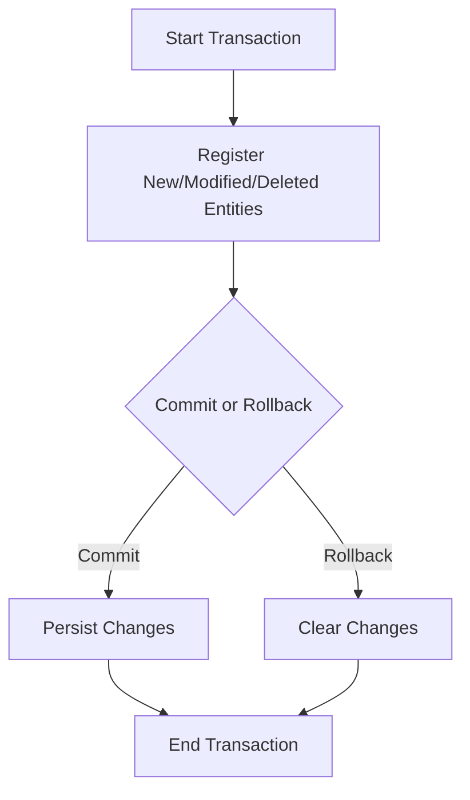

## 5.8.4 Unit of Work Pattern

The Unit of Work pattern is a crucial design pattern in the realm of data access and transaction management. It plays a vital role in maintaining consistency and integrity within a system by managing changes to a set of objects and coordinating the writing out of these changes as a single transaction. In this section, we will delve into the intricacies of implementing the Unit of Work pattern in the D programming language, leveraging its unique features to enhance performance and maintainability.

### Purpose of the Unit of Work Pattern

The primary purpose of the Unit of Work pattern is to:

- **Maintain a list of objects** that have been changed during a business transaction.
- **Coordinate the writing out** of changes to the database or any persistent storage.
- **Ensure data consistency** by committing or rolling back changes as a single unit.

### Implementing Unit of Work in D

Implementing the Unit of Work pattern in D involves several key components, including change tracking, transaction management, and ensuring data consistency. Let's explore each of these components in detail.

#### Change Tracking

Change tracking is the process of monitoring changes to objects within a transaction. This involves keeping track of new, modified, and deleted objects. In D, we can utilize its powerful type system and metaprogramming capabilities to efficiently implement change tracking.

```d
import std.stdio;
import std.container.array;

class Entity {
    int id;
    string name;
}

class UnitOfWork {
    private Array!Entity newEntities;
    private Array!Entity modifiedEntities;
    private Array!Entity deletedEntities;

    void registerNew(Entity entity) {
        writeln("Registering new entity: ", entity.name);
        newEntities.insert(entity);
    }

    void registerModified(Entity entity) {
        writeln("Registering modified entity: ", entity.name);
        modifiedEntities.insert(entity);
    }

    void registerDeleted(Entity entity) {
        writeln("Registering deleted entity: ", entity.name);
        deletedEntities.insert(entity);
    }

    void commit() {
        writeln("Committing transaction...");
        // Persist new entities
        foreach (entity; newEntities) {
            writeln("Persisting new entity: ", entity.name);
            // Code to persist entity
        }
        // Update modified entities
        foreach (entity; modifiedEntities) {
            writeln("Updating modified entity: ", entity.name);
            // Code to update entity
        }
        // Delete removed entities
        foreach (entity; deletedEntities) {
            writeln("Deleting entity: ", entity.name);
            // Code to delete entity
        }
        clear();
    }

    void rollback() {
        writeln("Rolling back transaction...");
        clear();
    }

    private void clear() {
        newEntities.clear();
        modifiedEntities.clear();
        deletedEntities.clear();
    }
}

void main() {
    auto uow = new UnitOfWork();
    auto entity1 = new Entity(1, "Entity1");
    auto entity2 = new Entity(2, "Entity2");

    uow.registerNew(entity1);
    uow.registerModified(entity2);
    uow.commit();
}
```

In this example, we define a `UnitOfWork` class that tracks new, modified, and deleted entities. The `commit` method handles the persistence of these entities, while the `rollback` method clears the tracked changes.

#### Transaction Management

Transaction management is a critical aspect of the Unit of Work pattern. It ensures that all changes within a transaction are applied consistently. In D, we can leverage its exception handling capabilities to manage transactions effectively.

```d
void performTransaction(UnitOfWork uow) {
    try {
        // Perform operations
        auto entity3 = new Entity(3, "Entity3");
        uow.registerNew(entity3);

        // Simulate an error
        throw new Exception("An error occurred");

        uow.commit();
    } catch (Exception e) {
        writeln("Exception caught: ", e.msg);
        uow.rollback();
    }
}

void main() {
    auto uow = new UnitOfWork();
    performTransaction(uow);
}
```

In this code snippet, we demonstrate how to manage transactions using a try-catch block. If an exception occurs, the transaction is rolled back, ensuring that no partial changes are applied.

### Use Cases and Examples

The Unit of Work pattern is particularly useful in scenarios where consistency in data access is paramount. Let's explore some common use cases and examples.

#### Consistency in Data Access

In systems where multiple operations need to be performed as a single unit, the Unit of Work pattern ensures that all changes are applied correctly. This is especially important in distributed systems or applications with complex business logic.

```d
class Order {
    int id;
    string status;
}

class OrderService {
    UnitOfWork uow;

    this(UnitOfWork uow) {
        this.uow = uow;
    }

    void processOrder(Order order) {
        order.status = "Processed";
        uow.registerModified(order);
    }
}

void main() {
    auto uow = new UnitOfWork();
    auto orderService = new OrderService(uow);
    auto order = new Order(1, "New");

    orderService.processOrder(order);
    uow.commit();
}
```

In this example, we have an `OrderService` that processes orders. The `processOrder` method modifies the order status and registers the change with the Unit of Work. The `commit` method ensures that all changes are persisted as a single transaction.

### Visualizing the Unit of Work Pattern

To better understand the Unit of Work pattern, let's visualize its components and workflow using a Mermaid.js diagram.



**Diagram Description:** This flowchart illustrates the workflow of the Unit of Work pattern. It starts with a transaction, registers changes to entities, and either commits or rolls back the transaction, ensuring data consistency.

### Design Considerations

When implementing the Unit of Work pattern in D, consider the following:

- **Concurrency:** Ensure that the Unit of Work is thread-safe if used in a concurrent environment.
- **Performance:** Minimize the overhead of tracking changes by using efficient data structures.
- **Error Handling:** Implement robust error handling to manage transaction failures gracefully.

### Differences and Similarities

The Unit of Work pattern is often compared to the Repository pattern. While both patterns deal with data access, the Unit of Work pattern focuses on managing transactions and ensuring consistency, whereas the Repository pattern abstracts data access logic.

### Try It Yourself

To deepen your understanding of the Unit of Work pattern, try modifying the code examples to:

- Add support for batch processing of entities.
- Implement a mechanism to track changes to specific fields within an entity.
- Experiment with different data structures for change tracking to optimize performance.

### References and Links

For further reading on the Unit of Work pattern and related topics, consider the following resources:

- [Martin Fowler's Patterns of Enterprise Application Architecture](https://martinfowler.com/eaaCatalog/unitOfWork.html)
- [D Programming Language Documentation](https://dlang.org/documentation.html)
- [Design Patterns: Elements of Reusable Object-Oriented Software](https://en.wikipedia.org/wiki/Design_Patterns)

### Knowledge Check

To reinforce your understanding of the Unit of Work pattern, consider the following questions:

- What are the main responsibilities of the Unit of Work pattern?
- How does the Unit of Work pattern ensure data consistency?
- What are some common use cases for the Unit of Work pattern?

### Embrace the Journey

Remember, mastering design patterns is a journey. As you continue to explore and implement patterns like the Unit of Work, you'll gain a deeper understanding of how to build robust and maintainable software systems. Keep experimenting, stay curious, and enjoy the journey!

## Quiz Time!



### What is the primary purpose of the Unit of Work pattern?

- [x] To maintain a list of objects affected by a business transaction and coordinate the writing out of changes.
- [ ] To abstract data access logic.
- [ ] To manage user authentication.
- [ ] To handle network communication.

> **Explanation:** The Unit of Work pattern is designed to maintain a list of objects affected by a business transaction and coordinate the writing out of changes.

### Which D language feature is particularly useful for implementing change tracking in the Unit of Work pattern?

- [x] Metaprogramming
- [ ] Inline Assembly
- [ ] Garbage Collection
- [ ] Network Programming

> **Explanation:** Metaprogramming in D allows for efficient implementation of change tracking by leveraging compile-time features.

### What is the role of the `commit` method in the Unit of Work pattern?

- [x] To persist changes to the database or storage.
- [ ] To initialize a new transaction.
- [ ] To clear all tracked changes.
- [ ] To handle exceptions.

> **Explanation:** The `commit` method is responsible for persisting changes to the database or storage as a single transaction.

### How does the Unit of Work pattern ensure data consistency?

- [x] By committing or rolling back changes as a single unit.
- [ ] By using multiple threads.
- [ ] By encrypting data.
- [ ] By logging all operations.

> **Explanation:** The Unit of Work pattern ensures data consistency by committing or rolling back changes as a single unit, preventing partial updates.

### What is a common use case for the Unit of Work pattern?

- [x] Ensuring consistency in data access.
- [ ] Managing user sessions.
- [ ] Handling file uploads.
- [ ] Rendering graphics.

> **Explanation:** A common use case for the Unit of Work pattern is ensuring consistency in data access, particularly in complex transactions.

### Which method is used to clear all tracked changes in the Unit of Work pattern?

- [x] `clear`
- [ ] `commit`
- [ ] `rollback`
- [ ] `initialize`

> **Explanation:** The `clear` method is used to clear all tracked changes, typically after a commit or rollback.

### What should be considered when implementing the Unit of Work pattern in a concurrent environment?

- [x] Thread safety
- [ ] Network latency
- [ ] User interface design
- [ ] File system access

> **Explanation:** Thread safety is crucial when implementing the Unit of Work pattern in a concurrent environment to avoid data corruption.

### How can you handle transaction failures in the Unit of Work pattern?

- [x] By implementing robust error handling and using try-catch blocks.
- [ ] By ignoring errors.
- [ ] By restarting the application.
- [ ] By logging errors only.

> **Explanation:** Robust error handling and using try-catch blocks help manage transaction failures gracefully.

### What is a key difference between the Unit of Work and Repository patterns?

- [x] Unit of Work focuses on transaction management, while Repository abstracts data access logic.
- [ ] Unit of Work is used for user authentication, while Repository is for data storage.
- [ ] Unit of Work is a structural pattern, while Repository is a behavioral pattern.
- [ ] Unit of Work is for network communication, while Repository is for file handling.

> **Explanation:** The Unit of Work pattern focuses on transaction management, ensuring consistency, while the Repository pattern abstracts data access logic.

### True or False: The Unit of Work pattern can be used to manage user authentication.

- [ ] True
- [x] False

> **Explanation:** The Unit of Work pattern is not designed for managing user authentication; it is used for managing transactions and ensuring data consistency.


