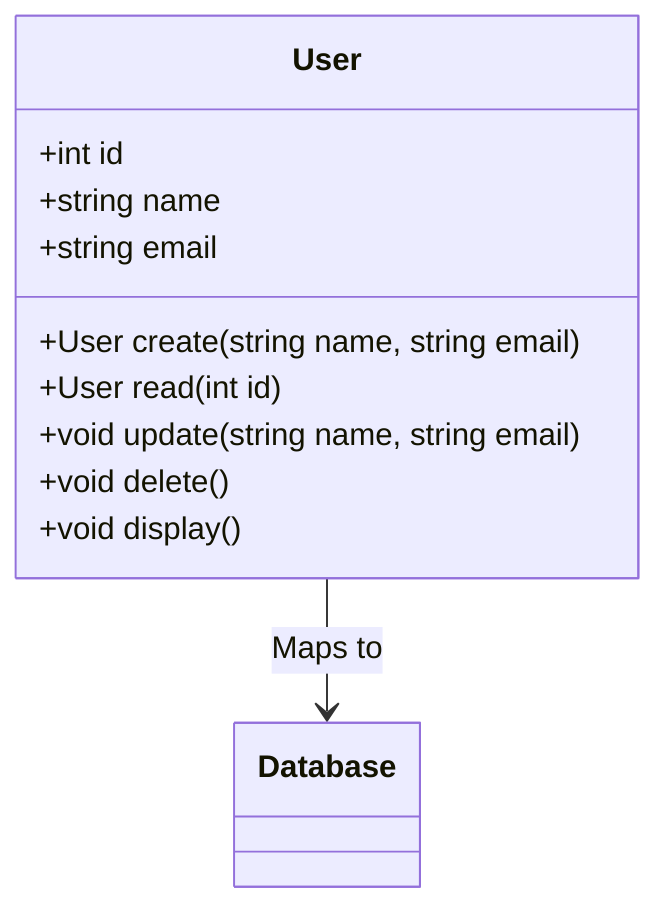

## 5.8.5 Active Record Pattern

The Active Record pattern is a structural design pattern that is widely used in software development to simplify database interactions. It provides a straightforward way to map database tables to classes in an object-oriented programming language like D. This pattern is particularly beneficial for rapid application development, where ease of use and simplicity are prioritized.

### Purpose

The primary purpose of the Active Record pattern is to encapsulate database access within an object that represents a row in a database table or view. This pattern allows developers to perform CRUD (Create, Read, Update, Delete) operations directly on the object, making database interactions more intuitive and less error-prone.

### Implementing Active Record in D

In D, implementing the Active Record pattern involves mapping database tables to classes and embedding data access methods within these classes. Let's explore how to achieve this step by step.

#### Mapping Tables to Classes

To map a database table to a class in D, each class should represent a table, and each instance of the class should represent a row in that table. This mapping allows you to work with database records as if they were regular objects in your application.

```d
import std.stdio;
import std.string;
import std.conv;

class User {
    int id;
    string name;
    string email;

    // Constructor to initialize a User object
    this(int id, string name, string email) {
        this.id = id;
        this.name = name;
        this.email = email;
    }

    // Display user information
    void display() {
        writeln("User ID: ", id);
        writeln("Name: ", name);
        writeln("Email: ", email);
    }
}
```

In this example, the `User` class represents a table with columns `id`, `name`, and `email`. Each instance of `User` corresponds to a row in the table.

#### CRUD Operations

CRUD operations are fundamental to the Active Record pattern. By embedding these operations within the class, we can simplify database interactions.

```d
import std.stdio;
import std.string;
import std.conv;
import std.array;

class User {
    int id;
    string name;
    string email;

    this(int id, string name, string email) {
        this.id = id;
        this.name = name;
        this.email = email;
    }

    void display() {
        writeln("User ID: ", id);
        writeln("Name: ", name);
        writeln("Email: ", email);
    }

    // Create a new user in the database
    static User create(string name, string email) {
        // Simulate database insertion and return a new User object
        int newId = 1; // Assume new ID is generated by the database
        return new User(newId, name, email);
    }

    // Read user data from the database
    static User read(int id) {
        // Simulate database read operation
        return new User(id, "John Doe", "john.doe@example.com");
    }

    // Update user data in the database
    void update(string name, string email) {
        this.name = name;
        this.email = email;
        // Simulate database update operation
    }

    // Delete user from the database
    void delete() {
        // Simulate database delete operation
    }
}
```

In this code, we define static methods `create` and `read` for creating and reading user data, and instance methods `update` and `delete` for updating and deleting user data. These methods simulate database operations, making it easy to manage user records.

### Use Cases and Examples

The Active Record pattern is particularly useful in scenarios where rapid development is required. It simplifies database operations, making it ideal for simple applications or prototypes.

#### Rapid Development

In rapid development environments, the Active Record pattern can significantly reduce the amount of boilerplate code required for database interactions. By encapsulating database logic within the class, developers can focus on building features rather than managing database connections and queries.

#### Example: A Simple User Management System

Let's consider a simple user management system that uses the Active Record pattern to manage user data.

```d
import std.stdio;
import std.string;
import std.conv;
import std.array;

class User {
    int id;
    string name;
    string email;

    this(int id, string name, string email) {
        this.id = id;
        this.name = name;
        this.email = email;
    }

    void display() {
        writeln("User ID: ", id);
        writeln("Name: ", name);
        writeln("Email: ", email);
    }

    static User create(string name, string email) {
        int newId = 1; // Assume new ID is generated by the database
        return new User(newId, name, email);
    }

    static User read(int id) {
        return new User(id, "John Doe", "john.doe@example.com");
    }

    void update(string name, string email) {
        this.name = name;
        this.email = email;
    }

    void delete() {
        // Simulate database delete operation
    }
}

void main() {
    // Create a new user
    auto user = User.create("Alice", "alice@example.com");
    user.display();

    // Read user data
    auto existingUser = User.read(1);
    existingUser.display();

    // Update user data
    existingUser.update("Alice Smith", "alice.smith@example.com");
    existingUser.display();

    // Delete user
    existingUser.delete();
}
```

In this example, we demonstrate how to create, read, update, and delete user data using the Active Record pattern. This approach simplifies database operations and makes the code more readable and maintainable.

### Visualizing the Active Record Pattern

To better understand the Active Record pattern, let's visualize the relationship between the class and the database table.



In this diagram, the `User` class is mapped to a database table. The class contains methods for CRUD operations, which interact with the database to manage user data.

### Design Considerations

When implementing the Active Record pattern in D, consider the following:

- **Simplicity vs. Flexibility**: The Active Record pattern is simple and easy to use, but it may not be suitable for complex applications with intricate database relationships.
- **Performance**: Embedding database logic within the class can lead to performance issues if not managed properly. Consider using caching or other optimization techniques for large datasets.
- **Testing**: Testing Active Record classes can be challenging due to their dependency on the database. Use mock objects or in-memory databases for testing purposes.

### Differences and Similarities

The Active Record pattern is often compared to the Data Mapper pattern. While both patterns aim to simplify database interactions, they differ in their approach:

- **Active Record**: Encapsulates database access within the object, making it easy to use but less flexible for complex scenarios.
- **Data Mapper**: Separates database logic from the object, providing more flexibility and control over database interactions.

### Try It Yourself

To deepen your understanding of the Active Record pattern, try modifying the code examples provided. Experiment with adding new fields to the `User` class, implementing additional methods, or integrating with a real database.

### References and Links

- [Active Record Pattern on Wikipedia](https://en.wikipedia.org/wiki/Active_record_pattern)
- [D Programming Language Official Website](https://dlang.org/)
- [Object-Relational Mapping (ORM) in D](https://wiki.dlang.org/Category:Database)

### Knowledge Check

To reinforce your understanding of the Active Record pattern, consider the following questions:

- What are the key benefits of using the Active Record pattern?
- How does the Active Record pattern differ from the Data Mapper pattern?
- What are some potential drawbacks of using the Active Record pattern in complex applications?

### Embrace the Journey

Remember, mastering design patterns like Active Record is just the beginning. As you continue to explore the D programming language, you'll discover new ways to optimize and enhance your applications. Keep experimenting, stay curious, and enjoy the journey!

## Quiz Time!



### What is the primary purpose of the Active Record pattern?

- [x] To encapsulate database access within an object that represents a row in a database table.
- [ ] To separate database logic from the object.
- [ ] To provide a flexible way to manage complex database relationships.
- [ ] To optimize database performance.

> **Explanation:** The Active Record pattern encapsulates database access within an object, simplifying CRUD operations.

### How does the Active Record pattern differ from the Data Mapper pattern?

- [x] Active Record encapsulates database access within the object, while Data Mapper separates it.
- [ ] Active Record is more flexible than Data Mapper.
- [ ] Data Mapper is easier to use than Active Record.
- [ ] Active Record is used for complex applications, while Data Mapper is for simple ones.

> **Explanation:** Active Record encapsulates database logic within the object, whereas Data Mapper separates it for more flexibility.

### What is a potential drawback of using the Active Record pattern?

- [x] It may not be suitable for complex applications with intricate database relationships.
- [ ] It is too complex for simple applications.
- [ ] It requires a lot of boilerplate code.
- [ ] It cannot be used with relational databases.

> **Explanation:** The simplicity of Active Record can be a limitation in complex applications with intricate relationships.

### What does CRUD stand for in the context of database operations?

- [x] Create, Read, Update, Delete
- [ ] Connect, Retrieve, Update, Delete
- [ ] Create, Retrieve, Update, Drop
- [ ] Connect, Read, Update, Drop

> **Explanation:** CRUD stands for Create, Read, Update, and Delete, which are the basic operations for managing data.

### Which method in the User class is responsible for creating a new user in the database?

- [x] create
- [ ] read
- [ ] update
- [ ] delete

> **Explanation:** The `create` method is responsible for creating a new user in the database.

### In the Active Record pattern, what does each class instance represent?

- [x] A row in the database table
- [ ] A column in the database table
- [ ] The entire database
- [ ] A database view

> **Explanation:** Each instance of a class in the Active Record pattern represents a row in the database table.

### What is one advantage of using the Active Record pattern for rapid development?

- [x] It reduces the amount of boilerplate code required for database interactions.
- [ ] It increases the complexity of the codebase.
- [ ] It requires extensive database knowledge.
- [ ] It is only suitable for large-scale applications.

> **Explanation:** The Active Record pattern simplifies database interactions, reducing the need for boilerplate code.

### What is the role of the `update` method in the User class?

- [x] To modify existing user data in the database.
- [ ] To create a new user in the database.
- [ ] To delete a user from the database.
- [ ] To read user data from the database.

> **Explanation:** The `update` method modifies existing user data in the database.

### How can testing Active Record classes be challenging?

- [x] Due to their dependency on the database.
- [ ] Because they are too simple.
- [ ] Because they do not interact with the database.
- [ ] Due to their lack of flexibility.

> **Explanation:** Active Record classes depend on the database, making testing challenging without mock objects or in-memory databases.

### True or False: The Active Record pattern is ideal for applications with complex database relationships.

- [ ] True
- [x] False

> **Explanation:** The Active Record pattern is simple and best suited for applications with straightforward database interactions.




