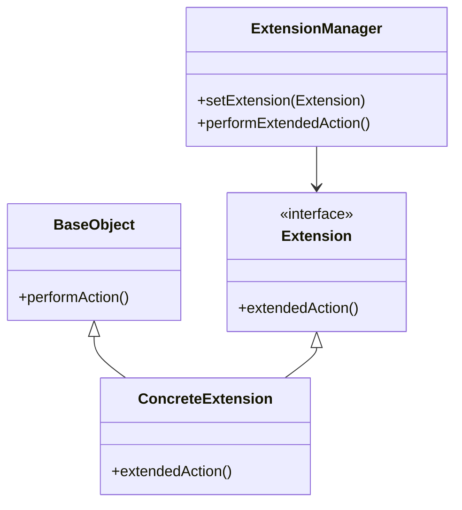

## 5.9 Extension Object Pattern

In the realm of software design, flexibility and modularity are paramount. The Extension Object Pattern is a structural design pattern that allows developers to add new behaviors or services to an object without modifying its existing structure. This pattern is particularly useful in scenarios where the system needs to be extended with new functionalities dynamically, such as in plugin architectures or when dealing with third-party libraries.

### Intent

The primary intent of the Extension Object Pattern is to enable the addition of new functionalities to objects in a flexible and decoupled manner. By using this pattern, we can extend the capabilities of objects without altering their core structure, thus adhering to the Open/Closed Principle—a fundamental tenet of object-oriented design.

### Key Participants

1. **Base Object**: The original object that can be extended with new functionalities.
2. **Extension Interface**: Defines the contract for the new functionalities that can be added to the base object.
3. **Concrete Extension**: Implements the extension interface, providing the actual behavior or service.
4. **Extension Manager**: Manages the extensions and provides a mechanism to query and retrieve specific extensions.

### Applicability

The Extension Object Pattern is applicable in scenarios where:

- New functionalities need to be added to objects dynamically.
- The system requires a plugin or modular architecture.
- There is a need to decouple the core functionality of an object from its extensions.
- The design must adhere to the Open/Closed Principle, allowing objects to be open for extension but closed for modification.

### Implementing Extension Objects in D

The D programming language, with its powerful features like templates, mixins, and interfaces, provides an excellent platform for implementing the Extension Object Pattern. Let's explore how we can leverage these features to create flexible and modular systems.

#### Templates and Mixins

Templates and mixins in D allow us to inject additional code into existing classes, providing a mechanism to extend their functionalities without altering their core structure.

```d
// Define a base class
class BaseObject {
    void performAction() {
        writeln("Base action performed.");
    }
}

// Define an extension interface
interface Extension {
    void extendedAction();
}

// Implement a concrete extension using mixins
mixin template ConcreteExtension() {
    void extendedAction() {
        writeln("Extended action performed.");
    }
}

// Extend the base object with the concrete extension
class ExtendedObject : BaseObject, Extension {
    mixin ConcreteExtension;
}

void main() {
    auto obj = new ExtendedObject();
    obj.performAction(); // Outputs: Base action performed.
    obj.extendedAction(); // Outputs: Extended action performed.
}
```

In this example, we define a `BaseObject` class and an `Extension` interface. The `ConcreteExtension` mixin provides an implementation of the `extendedAction` method, which is then mixed into the `ExtendedObject` class.

#### Interfaces and Delegates

Interfaces and delegates in D can be used to decouple extensions from the base object, allowing for greater flexibility and modularity.

```d
// Define a base class
class BaseObject {
    void performAction() {
        writeln("Base action performed.");
    }
}

// Define an extension interface
interface Extension {
    void extendedAction();
}

// Implement a concrete extension
class ConcreteExtension : Extension {
    void extendedAction() {
        writeln("Extended action performed.");
    }
}

// Use a delegate to manage extensions
class ExtensionManager {
    private Extension extension;

    void setExtension(Extension ext) {
        extension = ext;
    }

    void performExtendedAction() {
        if (extension !is null) {
            extension.extendedAction();
        } else {
            writeln("No extension available.");
        }
    }
}

void main() {
    auto obj = new BaseObject();
    auto ext = new ConcreteExtension();
    auto manager = new ExtensionManager();

    obj.performAction(); // Outputs: Base action performed.
    manager.setExtension(ext);
    manager.performExtendedAction(); // Outputs: Extended action performed.
}
```

Here, we define an `ExtensionManager` class that uses a delegate to manage extensions. This approach allows us to dynamically add or remove extensions from the base object.

### Use Cases and Examples

The Extension Object Pattern is particularly useful in scenarios where modular enhancements are required. Let's explore some common use cases and examples.

#### Modular Enhancements

In systems that require modular enhancements, such as plugin architectures, the Extension Object Pattern provides a flexible mechanism to add new functionalities without altering the core system.

```d
// Define a plugin interface
interface Plugin {
    void execute();
}

// Implement a concrete plugin
class LoggingPlugin : Plugin {
    void execute() {
        writeln("Logging plugin executed.");
    }
}

// Implement another concrete plugin
class AuthenticationPlugin : Plugin {
    void execute() {
        writeln("Authentication plugin executed.");
    }
}

// Plugin manager to handle plugins
class PluginManager {
    private Plugin[] plugins;

    void addPlugin(Plugin plugin) {
        plugins ~= plugin;
    }

    void executePlugins() {
        foreach (plugin; plugins) {
            plugin.execute();
        }
    }
}

void main() {
    auto manager = new PluginManager();
    manager.addPlugin(new LoggingPlugin());
    manager.addPlugin(new AuthenticationPlugin());

    manager.executePlugins();
    // Outputs:
    // Logging plugin executed.
    // Authentication plugin executed.
}
```

In this example, we define a `Plugin` interface and implement two concrete plugins: `LoggingPlugin` and `AuthenticationPlugin`. The `PluginManager` class manages these plugins and executes them as needed.

### Design Considerations

When implementing the Extension Object Pattern, consider the following:

- **Decoupling**: Ensure that extensions are decoupled from the base object to maintain flexibility and modularity.
- **Performance**: Be mindful of the performance implications of adding multiple extensions to an object.
- **Complexity**: Avoid overcomplicating the design with too many extensions, which can lead to maintenance challenges.

### Differences and Similarities

The Extension Object Pattern is often compared to other patterns like the Decorator Pattern and the Strategy Pattern. While all these patterns aim to add new functionalities to objects, they differ in their approach:

- **Decorator Pattern**: Focuses on adding responsibilities to objects dynamically by wrapping them with additional functionality.
- **Strategy Pattern**: Encapsulates algorithms within a family of interchangeable strategies, allowing the algorithm to vary independently from the clients that use it.
- **Extension Object Pattern**: Adds new behaviors or services to an object without changing the object itself, often used in plugin architectures.

### Visualizing the Extension Object Pattern

To better understand the Extension Object Pattern, let's visualize its structure using a class diagram.



This diagram illustrates the relationship between the `BaseObject`, `Extension`, `ConcreteExtension`, and `ExtensionManager` classes. The `ConcreteExtension` class implements the `Extension` interface, and the `ExtensionManager` manages the extensions.

### Try It Yourself

Now that we've explored the Extension Object Pattern, let's encourage you to experiment with the code examples provided. Try modifying the `ConcreteExtension` class to add additional functionalities or create new extensions. Experiment with the `PluginManager` by adding more plugins and observing how they interact with each other.

### Knowledge Check

To reinforce your understanding of the Extension Object Pattern, consider the following questions:

- What are the key participants in the Extension Object Pattern?
- How does the Extension Object Pattern differ from the Decorator Pattern?
- What are some common use cases for the Extension Object Pattern?
- How can templates and mixins be used to implement the Extension Object Pattern in D?

### Embrace the Journey

Remember, mastering design patterns is a journey. As you continue to explore and experiment with the Extension Object Pattern, you'll gain a deeper understanding of how to build flexible and modular systems. Keep experimenting, stay curious, and enjoy the journey!

## Quiz Time!



### What is the primary intent of the Extension Object Pattern?

- [x] To add new behaviors or services to an object without modifying its existing structure.
- [ ] To encapsulate algorithms within a family of interchangeable strategies.
- [ ] To add responsibilities to objects dynamically by wrapping them with additional functionality.
- [ ] To manage object creation in a flexible and reusable manner.

> **Explanation:** The primary intent of the Extension Object Pattern is to add new behaviors or services to an object without modifying its existing structure, allowing for flexible and modular enhancements.

### Which D language feature is particularly useful for implementing the Extension Object Pattern?

- [x] Templates and Mixins
- [ ] Inline Assembly
- [ ] Garbage Collection
- [ ] Slices

> **Explanation:** Templates and mixins in D allow for injecting additional code into existing classes, making them particularly useful for implementing the Extension Object Pattern.

### What is the role of the Extension Manager in the Extension Object Pattern?

- [x] To manage the extensions and provide a mechanism to query and retrieve specific extensions.
- [ ] To encapsulate algorithms within a family of interchangeable strategies.
- [ ] To add responsibilities to objects dynamically by wrapping them with additional functionality.
- [ ] To manage object creation in a flexible and reusable manner.

> **Explanation:** The Extension Manager manages the extensions and provides a mechanism to query and retrieve specific extensions, facilitating the dynamic addition of new functionalities.

### How does the Extension Object Pattern differ from the Decorator Pattern?

- [x] The Extension Object Pattern adds new behaviors without changing the object itself, while the Decorator Pattern wraps objects with additional functionality.
- [ ] The Extension Object Pattern encapsulates algorithms within a family of interchangeable strategies, while the Decorator Pattern manages object creation.
- [ ] The Extension Object Pattern manages object creation, while the Decorator Pattern adds responsibilities to objects dynamically.
- [ ] The Extension Object Pattern and Decorator Pattern are identical in their approach.

> **Explanation:** The Extension Object Pattern adds new behaviors without changing the object itself, while the Decorator Pattern wraps objects with additional functionality.

### What is a common use case for the Extension Object Pattern?

- [x] Enabling plugins or add-ons in a modular architecture.
- [ ] Encapsulating algorithms within a family of interchangeable strategies.
- [ ] Managing object creation in a flexible and reusable manner.
- [ ] Adding responsibilities to objects dynamically by wrapping them with additional functionality.

> **Explanation:** A common use case for the Extension Object Pattern is enabling plugins or add-ons in a modular architecture, allowing for dynamic enhancements.

### Which of the following is a key participant in the Extension Object Pattern?

- [x] Extension Interface
- [ ] Strategy Context
- [ ] Factory Method
- [ ] Decorator Wrapper

> **Explanation:** The Extension Interface is a key participant in the Extension Object Pattern, defining the contract for the new functionalities that can be added to the base object.

### What is the benefit of using interfaces and delegates in the Extension Object Pattern?

- [x] They decouple extensions from the base object, allowing for greater flexibility and modularity.
- [ ] They encapsulate algorithms within a family of interchangeable strategies.
- [ ] They manage object creation in a flexible and reusable manner.
- [ ] They add responsibilities to objects dynamically by wrapping them with additional functionality.

> **Explanation:** Interfaces and delegates decouple extensions from the base object, allowing for greater flexibility and modularity in the Extension Object Pattern.

### What should be considered when implementing the Extension Object Pattern?

- [x] Decoupling extensions from the base object to maintain flexibility and modularity.
- [ ] Encapsulating algorithms within a family of interchangeable strategies.
- [ ] Managing object creation in a flexible and reusable manner.
- [ ] Adding responsibilities to objects dynamically by wrapping them with additional functionality.

> **Explanation:** When implementing the Extension Object Pattern, it's important to decouple extensions from the base object to maintain flexibility and modularity.

### Which pattern is often compared to the Extension Object Pattern?

- [x] Decorator Pattern
- [ ] Singleton Pattern
- [ ] Factory Pattern
- [ ] Observer Pattern

> **Explanation:** The Decorator Pattern is often compared to the Extension Object Pattern, as both aim to add new functionalities to objects, but they differ in their approach.

### True or False: The Extension Object Pattern is useful for systems that require a plugin or modular architecture.

- [x] True
- [ ] False

> **Explanation:** True. The Extension Object Pattern is particularly useful for systems that require a plugin or modular architecture, allowing for dynamic enhancements.


