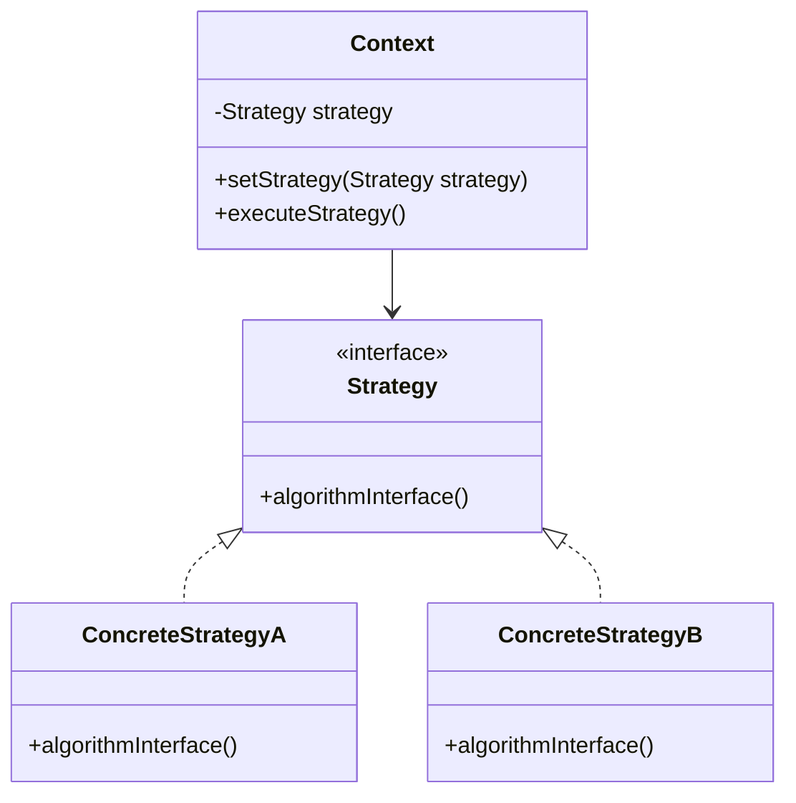

## 6.1 Strategy Pattern

The Strategy Pattern is a behavioral design pattern that enables selecting an algorithm's behavior at runtime. It defines a family of algorithms, encapsulates each one, and makes them interchangeable. This pattern allows the algorithm to vary independently from the clients that use it, promoting flexibility and reusability in code design.

### Intent

The primary intent of the Strategy Pattern is to define a set of algorithms, encapsulate each one, and make them interchangeable. This pattern allows the client to choose which algorithm to use at runtime, without altering the client code. It is particularly useful when you have multiple algorithms for a specific task and want to switch between them easily.

### Key Participants

1. **Strategy Interface**: Declares an interface common to all supported algorithms. The `Context` uses this interface to call the algorithm defined by a `ConcreteStrategy`.
2. **ConcreteStrategy**: Implements the algorithm using the `Strategy` interface.
3. **Context**: Maintains a reference to a `Strategy` object and is configured with a `ConcreteStrategy` object. It may define an interface that lets `Strategy` access its data.

### Applicability

Use the Strategy Pattern when:
- You have multiple related classes that differ only in their behavior.
- You need different variants of an algorithm.
- An algorithm uses data that clients should not know about.
- A class defines many behaviors, and these appear as multiple conditional statements in its operations.

### Implementing Strategy in D

#### Interfaces and Delegates

In D, interfaces and delegates can be used to define strategies. Interfaces provide a way to define a contract for the strategies, while delegates allow for more flexible function pointers.

**Example: Sorting Algorithms**

Let's consider a scenario where we have different sorting algorithms, and we want to choose one at runtime.

```d
interface SortStrategy {
    void sort(int[] data);
}

class BubbleSort : SortStrategy {
    override void sort(int[] data) {
        // Bubble sort implementation
        for (size_t i = 0; i < data.length; i++) {
            for (size_t j = 0; j < data.length - i - 1; j++) {
                if (data[j] > data[j + 1]) {
                    int temp = data[j];
                    data[j] = data[j + 1];
                    data[j + 1] = temp;
                }
            }
        }
    }
}

class QuickSort : SortStrategy {
    override void sort(int[] data) {
        // Quick sort implementation
        quickSort(data, 0, data.length - 1);
    }

    private void quickSort(int[] data, int low, int high) {
        if (low < high) {
            int pi = partition(data, low, high);
            quickSort(data, low, pi - 1);
            quickSort(data, pi + 1, high);
        }
    }

    private int partition(int[] data, int low, int high) {
        int pivot = data[high];
        int i = (low - 1);
        for (int j = low; j <= high - 1; j++) {
            if (data[j] < pivot) {
                i++;
                int temp = data[i];
                data[i] = data[j];
                data[j] = temp;
            }
        }
        int temp = data[i + 1];
        data[i + 1] = data[high];
        data[high] = temp;
        return (i + 1);
    }
}

class Context {
    private SortStrategy strategy;

    void setStrategy(SortStrategy strategy) {
        this.strategy = strategy;
    }

    void executeStrategy(int[] data) {
        strategy.sort(data);
    }
}

void main() {
    int[] data = [64, 34, 25, 12, 22, 11, 90];
    Context context = new Context();

    // Use BubbleSort
    context.setStrategy(new BubbleSort());
    context.executeStrategy(data);
    writeln("Sorted using BubbleSort: ", data);

    // Use QuickSort
    context.setStrategy(new QuickSort());
    context.executeStrategy(data);
    writeln("Sorted using QuickSort: ", data);
}
```

In this example, we define a `SortStrategy` interface and two concrete strategies: `BubbleSort` and `QuickSort`. The `Context` class uses these strategies to sort data.

#### Template Strategies

D's powerful template system allows for compile-time strategy selection, providing a way to choose strategies without runtime overhead.

**Example: Template-Based Strategy**

```d
template SortStrategy(T) {
    void sort(T[] data) {
        static if (is(T == int)) {
            // Use QuickSort for integers
            quickSort(data, 0, data.length - 1);
        } else {
            // Use BubbleSort for other types
            bubbleSort(data);
        }
    }

    private void quickSort(T[] data, int low, int high) {
        if (low < high) {
            int pi = partition(data, low, high);
            quickSort(data, low, pi - 1);
            quickSort(data, pi + 1, high);
        }
    }

    private int partition(T[] data, int low, int high) {
        T pivot = data[high];
        int i = (low - 1);
        for (int j = low; j <= high - 1; j++) {
            if (data[j] < pivot) {
                i++;
                T temp = data[i];
                data[i] = data[j];
                data[j] = temp;
            }
        }
        T temp = data[i + 1];
        data[i + 1] = data[high];
        data[high] = temp;
        return (i + 1);
    }

    private void bubbleSort(T[] data) {
        for (size_t i = 0; i < data.length; i++) {
            for (size_t j = 0; j < data.length - i - 1; j++) {
                if (data[j] > data[j + 1]) {
                    T temp = data[j];
                    data[j] = data[j + 1];
                    data[j + 1] = temp;
                }
            }
        }
    }
}

void main() {
    int[] intData = [64, 34, 25, 12, 22, 11, 90];
    SortStrategy!(int).sort(intData);
    writeln("Sorted integers: ", intData);

    float[] floatData = [64.5, 34.2, 25.1, 12.3, 22.4, 11.5, 90.6];
    SortStrategy!(float).sort(floatData);
    writeln("Sorted floats: ", floatData);
}
```

In this example, we use a template to define a sorting strategy that selects the appropriate algorithm based on the data type.

#### Dynamic Selection

Dynamic selection allows switching strategies at runtime based on conditions, providing flexibility in choosing the most suitable algorithm for the current context.

**Example: Dynamic Strategy Selection**

```d
import std.stdio;

interface CompressionStrategy {
    void compress(string data);
}

class ZipCompression : CompressionStrategy {
    override void compress(string data) {
        writeln("Compressing using ZIP: ", data);
    }
}

class RarCompression : CompressionStrategy {
    override void compress(string data) {
        writeln("Compressing using RAR: ", data);
    }
}

class CompressionContext {
    private CompressionStrategy strategy;

    void setStrategy(CompressionStrategy strategy) {
        this.strategy = strategy;
    }

    void executeStrategy(string data) {
        strategy.compress(data);
    }
}

void main() {
    CompressionContext context = new CompressionContext();
    string data = "Example data to compress";

    // Choose strategy based on some condition
    bool useZip = true; // This could be a runtime condition
    if (useZip) {
        context.setStrategy(new ZipCompression());
    } else {
        context.setStrategy(new RarCompression());
    }

    context.executeStrategy(data);
}
```

In this example, we dynamically select a compression strategy based on a condition, allowing flexibility in choosing the algorithm at runtime.

### Design Considerations

- **Flexibility**: The Strategy Pattern provides flexibility in choosing algorithms, making it easy to switch between them without altering the client code.
- **Encapsulation**: By encapsulating algorithms, the pattern promotes separation of concerns, making the code more maintainable.
- **Overhead**: Be mindful of the overhead introduced by using interfaces and dynamic dispatch. Consider using templates for compile-time strategy selection when performance is critical.
- **D-Specific Features**: Leverage D's powerful template system and compile-time features to optimize strategy selection and reduce runtime overhead.

### Differences and Similarities

- **Strategy vs. State Pattern**: Both patterns involve changing behavior at runtime. However, the Strategy Pattern focuses on interchangeable algorithms, while the State Pattern is about changing an object's behavior when its state changes.
- **Strategy vs. Template Method Pattern**: The Template Method Pattern defines the skeleton of an algorithm, deferring some steps to subclasses. In contrast, the Strategy Pattern allows the entire algorithm to be replaced.

### Visualizing Strategy Pattern



This diagram illustrates the relationship between the `Context`, `Strategy`, and `ConcreteStrategy` classes. The `Context` maintains a reference to a `Strategy` and delegates the algorithm execution to the `ConcreteStrategy`.

### Try It Yourself

Experiment with the code examples provided by:
- Implementing additional sorting algorithms, such as MergeSort or InsertionSort.
- Creating new compression strategies, like Gzip or Bzip2.
- Modifying the conditions for dynamic strategy selection to explore different scenarios.

### Knowledge Check

- What is the primary intent of the Strategy Pattern?
- How can D's template system be used to implement the Strategy Pattern?
- What are the key differences between the Strategy Pattern and the State Pattern?

### Embrace the Journey

Remember, mastering design patterns is a journey. The Strategy Pattern is just one of many tools in your software engineering toolkit. As you continue to explore and apply these patterns, you'll gain deeper insights into building flexible, maintainable, and efficient software systems. Keep experimenting, stay curious, and enjoy the journey!

## Quiz Time!



### What is the primary intent of the Strategy Pattern?

- [x] To define a family of algorithms, encapsulate each one, and make them interchangeable.
- [ ] To allow an object to alter its behavior when its internal state changes.
- [ ] To provide a way to access the elements of an aggregate object sequentially.
- [ ] To define the skeleton of an algorithm, deferring some steps to subclasses.

> **Explanation:** The Strategy Pattern's primary intent is to define a family of algorithms, encapsulate each one, and make them interchangeable, allowing the algorithm to vary independently from the clients that use it.

### How can D's template system be used in the Strategy Pattern?

- [x] By selecting strategies at compile-time based on data types.
- [ ] By dynamically switching strategies at runtime.
- [ ] By defining a common interface for all strategies.
- [ ] By using delegates to encapsulate algorithms.

> **Explanation:** D's template system allows for compile-time strategy selection, enabling the choice of strategies based on data types without runtime overhead.

### What is a key difference between the Strategy Pattern and the State Pattern?

- [x] Strategy Pattern focuses on interchangeable algorithms, while State Pattern is about changing behavior based on state.
- [ ] Strategy Pattern is used for creating objects, while State Pattern is used for managing object states.
- [ ] Strategy Pattern uses inheritance, while State Pattern uses composition.
- [ ] Strategy Pattern is only applicable to sorting algorithms.

> **Explanation:** The Strategy Pattern focuses on interchangeable algorithms, allowing them to vary independently, while the State Pattern changes an object's behavior when its state changes.

### Which of the following is a benefit of using the Strategy Pattern?

- [x] It promotes flexibility and reusability in code design.
- [ ] It increases the complexity of the codebase.
- [ ] It makes it difficult to add new algorithms.
- [ ] It tightly couples the algorithm with the client.

> **Explanation:** The Strategy Pattern promotes flexibility and reusability by allowing algorithms to be interchangeable and vary independently from the clients that use them.

### What is the role of the Context class in the Strategy Pattern?

- [x] To maintain a reference to a Strategy object and delegate algorithm execution.
- [ ] To implement the algorithm using the Strategy interface.
- [ ] To define a common interface for all supported algorithms.
- [ ] To encapsulate the details of the algorithm.

> **Explanation:** The Context class maintains a reference to a Strategy object and is responsible for delegating the algorithm execution to the ConcreteStrategy.

### Which of the following is a potential drawback of the Strategy Pattern?

- [x] It can introduce overhead due to dynamic dispatch.
- [ ] It makes the code less flexible.
- [ ] It prevents the addition of new algorithms.
- [ ] It tightly couples the algorithm with the client.

> **Explanation:** The Strategy Pattern can introduce overhead due to dynamic dispatch, especially when using interfaces for strategy selection.

### How does the Strategy Pattern promote encapsulation?

- [x] By encapsulating algorithms and promoting separation of concerns.
- [ ] By tightly coupling algorithms with the client code.
- [ ] By using inheritance to define algorithms.
- [ ] By preventing the use of interfaces.

> **Explanation:** The Strategy Pattern promotes encapsulation by encapsulating algorithms, allowing them to vary independently and promoting separation of concerns.

### What is a common use case for the Strategy Pattern?

- [x] Choosing different sorting algorithms at runtime.
- [ ] Managing object states.
- [ ] Creating objects with complex initialization.
- [ ] Accessing elements of an aggregate object sequentially.

> **Explanation:** A common use case for the Strategy Pattern is choosing different sorting algorithms at runtime, allowing flexibility in algorithm selection.

### How can dynamic selection be implemented in the Strategy Pattern?

- [x] By switching strategies at runtime based on conditions.
- [ ] By using templates for compile-time selection.
- [ ] By defining a common interface for all strategies.
- [ ] By using delegates to encapsulate algorithms.

> **Explanation:** Dynamic selection in the Strategy Pattern can be implemented by switching strategies at runtime based on conditions, providing flexibility in algorithm choice.

### True or False: The Strategy Pattern allows the algorithm to vary independently from the clients that use it.

- [x] True
- [ ] False

> **Explanation:** True. The Strategy Pattern allows the algorithm to vary independently from the clients that use it, promoting flexibility and reusability.


