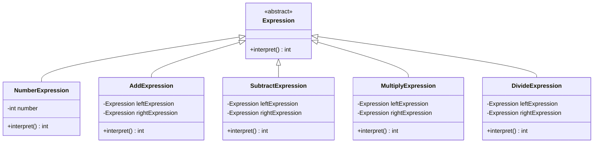

## 6.10 Interpreter Pattern

The Interpreter Pattern is a powerful design pattern used to define a grammatical representation for a language and provide an interpreter to process and evaluate the grammar. This pattern is particularly useful in scenarios where you need to interpret or execute a language or expression, such as in scripting languages or expression evaluation engines.

### Purpose

The primary purpose of the Interpreter Pattern is to provide a way to evaluate sentences in a language. By defining a grammar and creating an interpreter, you can process complex expressions and commands, making it a valuable tool for implementing scripting languages, expression evaluators, and more.

### Implementing Interpreter in D

To implement the Interpreter Pattern in D, we need to focus on two main components:

1. **Grammar Classes**: These classes represent the rules of the language or expressions you want to interpret.
2. **Interpret Method**: This method processes and evaluates the expressions based on the defined grammar.

#### Grammar Classes

Grammar classes form the backbone of the Interpreter Pattern. Each class typically represents a rule or a terminal/non-terminal in the grammar. Let's consider a simple arithmetic expression grammar as an example:

- **Expression**: Represents the abstract concept of an expression.
- **NumberExpression**: Represents a numeric value.
- **AddExpression**: Represents an addition operation.
- **SubtractExpression**: Represents a subtraction operation.

Here's how you can define these classes in D:

```d
// Abstract class for all expressions
abstract class Expression {
    abstract int interpret();
}

// Terminal expression for numbers
class NumberExpression : Expression {
    private int number;

    this(int number) {
        this.number = number;
    }

    override int interpret() {
        return number;
    }
}

// Non-terminal expression for addition
class AddExpression : Expression {
    private Expression leftExpression;
    private Expression rightExpression;

    this(Expression left, Expression right) {
        this.leftExpression = left;
        this.rightExpression = right;
    }

    override int interpret() {
        return leftExpression.interpret() + rightExpression.interpret();
    }
}

// Non-terminal expression for subtraction
class SubtractExpression : Expression {
    private Expression leftExpression;
    private Expression rightExpression;

    this(Expression left, Expression right) {
        this.leftExpression = left;
        this.rightExpression = right;
    }

    override int interpret() {
        return leftExpression.interpret() - rightExpression.interpret();
    }
}
```

In this example, `Expression` is the abstract class that defines the `interpret` method. `NumberExpression` is a terminal expression that returns a numeric value, while `AddExpression` and `SubtractExpression` are non-terminal expressions that perform addition and subtraction, respectively.

#### Interpret Method

The `interpret` method is crucial as it evaluates the expression based on the grammar rules. Each expression class implements this method to perform its specific operation. The method recursively evaluates the expression tree, allowing complex expressions to be broken down into simpler parts.

### Use Cases and Examples

The Interpreter Pattern is versatile and can be applied in various scenarios. Here are some common use cases:

#### Scripting Languages

The Interpreter Pattern is ideal for implementing custom scripting languages. By defining a grammar and interpreter, you can create a language that allows users to write scripts to automate tasks or configure applications.

#### Expression Evaluation

Another common use case is parsing and evaluating user input, such as mathematical expressions or logical conditions. The Interpreter Pattern provides a structured way to process these inputs and produce results.

### Example: Arithmetic Expression Evaluator

Let's build a simple arithmetic expression evaluator using the Interpreter Pattern in D. We'll extend the previous example to include multiplication and division:

```d
// Non-terminal expression for multiplication
class MultiplyExpression : Expression {
    private Expression leftExpression;
    private Expression rightExpression;

    this(Expression left, Expression right) {
        this.leftExpression = left;
        this.rightExpression = right;
    }

    override int interpret() {
        return leftExpression.interpret() * rightExpression.interpret();
    }
}

// Non-terminal expression for division
class DivideExpression : Expression {
    private Expression leftExpression;
    private Expression rightExpression;

    this(Expression left, Expression right) {
        this.leftExpression = left;
        this.rightExpression = right;
    }

    override int interpret() {
        return leftExpression.interpret() / rightExpression.interpret();
    }
}

// Main function to demonstrate the interpreter pattern
void main() {
    // (5 + 3) * (10 - 2)
    Expression expression = new MultiplyExpression(
        new AddExpression(new NumberExpression(5), new NumberExpression(3)),
        new SubtractExpression(new NumberExpression(10), new NumberExpression(2))
    );

    writeln("Result: ", expression.interpret()); // Output: Result: 64
}
```

In this example, we added `MultiplyExpression` and `DivideExpression` to handle multiplication and division. The main function demonstrates how to create and evaluate an expression tree representing `(5 + 3) * (10 - 2)`.

### Visualizing the Interpreter Pattern

To better understand the structure of the Interpreter Pattern, let's visualize the expression tree for the example `(5 + 3) * (10 - 2)` using a class diagram:



This diagram illustrates the hierarchy of expression classes, with `Expression` as the abstract base class and various concrete classes implementing specific operations.

### Design Considerations

When implementing the Interpreter Pattern, consider the following:

- **Complexity**: The pattern can become complex with large grammars, as each rule requires a corresponding class.
- **Performance**: Recursive evaluation of expression trees can impact performance, especially with deep or complex expressions.
- **Extensibility**: The pattern is highly extensible, allowing you to add new operations or rules by creating new classes.

### Differences and Similarities

The Interpreter Pattern is often compared to the Composite Pattern, as both involve tree structures. However, the Interpreter Pattern focuses on evaluating expressions, while the Composite Pattern is about composing objects into tree structures to represent part-whole hierarchies.

### Try It Yourself

Experiment with the Interpreter Pattern by modifying the code examples:

- Add support for additional operations, such as modulus or exponentiation.
- Implement a simple scripting language with variables and control structures.
- Create a more complex grammar with nested expressions and precedence rules.

### References and Links

For further reading on the Interpreter Pattern and related topics, consider the following resources:

- [Design Patterns: Elements of Reusable Object-Oriented Software](https://en.wikipedia.org/wiki/Design_Patterns) by Erich Gamma et al.
- [D Programming Language Documentation](https://dlang.org/)
- [Interpreter Pattern on Wikipedia](https://en.wikipedia.org/wiki/Interpreter_pattern)

### Knowledge Check

Let's reinforce your understanding of the Interpreter Pattern with a quiz.

## Quiz Time!



### What is the primary purpose of the Interpreter Pattern?

- [x] To define a grammatical representation for a language and provide an interpreter to evaluate it.
- [ ] To create a user interface for an application.
- [ ] To manage object creation in a system.
- [ ] To facilitate communication between objects.

> **Explanation:** The Interpreter Pattern is designed to define a grammar and provide an interpreter to evaluate expressions or sentences in that language.

### Which of the following is a key component of the Interpreter Pattern?

- [x] Grammar Classes
- [ ] User Interface Components
- [ ] Database Connections
- [ ] Network Protocols

> **Explanation:** Grammar classes represent the rules of the language or expressions you want to interpret, making them a key component of the Interpreter Pattern.

### In the provided example, what does the `interpret` method do?

- [x] Evaluates the expression based on the grammar rules.
- [ ] Connects to a database.
- [ ] Renders a user interface.
- [ ] Sends data over a network.

> **Explanation:** The `interpret` method evaluates the expression according to the defined grammar rules, processing and returning the result.

### What is a common use case for the Interpreter Pattern?

- [x] Implementing custom scripting languages.
- [ ] Designing user interfaces.
- [ ] Managing network connections.
- [ ] Storing data in a database.

> **Explanation:** The Interpreter Pattern is commonly used to implement custom scripting languages by defining a grammar and interpreter.

### How can the Interpreter Pattern be extended?

- [x] By adding new classes for additional operations or rules.
- [ ] By creating new database tables.
- [ ] By designing new user interfaces.
- [ ] By establishing new network protocols.

> **Explanation:** The Interpreter Pattern is highly extensible, allowing you to add new operations or rules by creating new classes.

### What is a potential drawback of the Interpreter Pattern?

- [x] Complexity with large grammars.
- [ ] Lack of scalability.
- [ ] Difficulty in creating user interfaces.
- [ ] Inability to handle network connections.

> **Explanation:** The Interpreter Pattern can become complex with large grammars, as each rule requires a corresponding class.

### Which pattern is often compared to the Interpreter Pattern?

- [x] Composite Pattern
- [ ] Singleton Pattern
- [ ] Factory Pattern
- [ ] Observer Pattern

> **Explanation:** The Interpreter Pattern is often compared to the Composite Pattern, as both involve tree structures.

### What is the role of `NumberExpression` in the example?

- [x] Represents a numeric value in the expression.
- [ ] Represents an addition operation.
- [ ] Represents a subtraction operation.
- [ ] Represents a multiplication operation.

> **Explanation:** `NumberExpression` is a terminal expression that represents a numeric value in the expression.

### What does the `MultiplyExpression` class do?

- [x] Performs multiplication of two expressions.
- [ ] Performs addition of two expressions.
- [ ] Performs subtraction of two expressions.
- [ ] Performs division of two expressions.

> **Explanation:** `MultiplyExpression` is a non-terminal expression that performs multiplication of two expressions.

### True or False: The Interpreter Pattern is suitable for evaluating mathematical expressions.

- [x] True
- [ ] False

> **Explanation:** The Interpreter Pattern is well-suited for evaluating mathematical expressions by defining a grammar and interpreter.



Remember, mastering the Interpreter Pattern in D is just the beginning. As you continue to explore design patterns, you'll gain the skills to build more complex and efficient systems. Keep experimenting, stay curious, and enjoy the journey!
