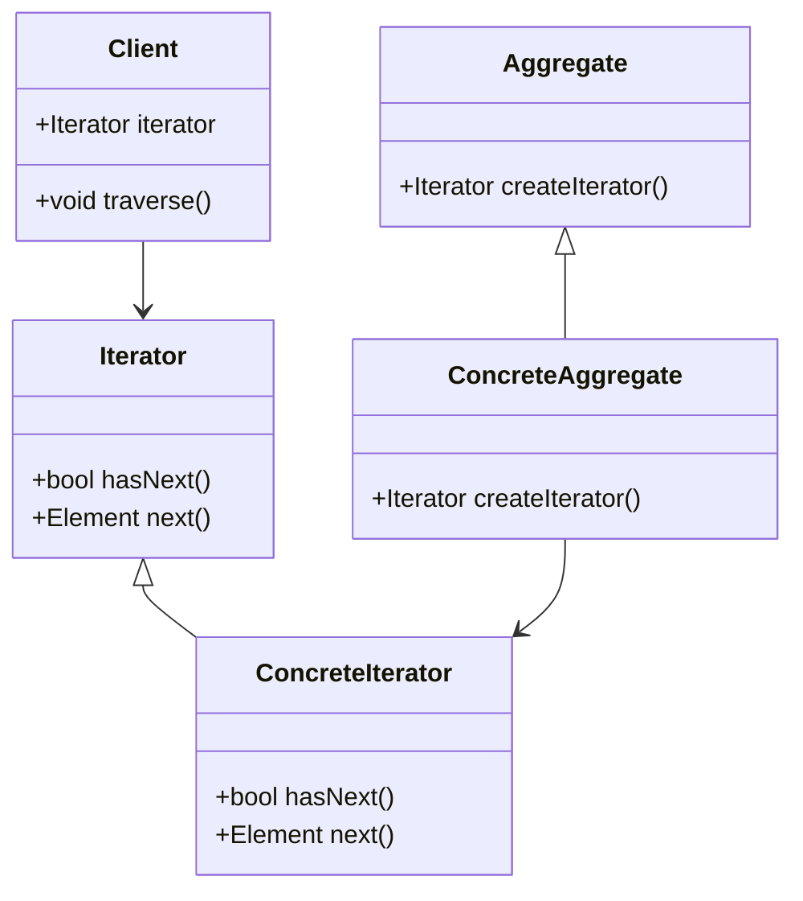

## 6.11 Iterator Pattern

### Introduction

The Iterator Pattern is a fundamental behavioral design pattern that provides a way to access the elements of an aggregate object sequentially without exposing its underlying representation. This pattern is particularly useful when dealing with collections of objects, allowing for a uniform traversal mechanism. In the D programming language, the concept of iteration is elegantly handled through the use of ranges, which offer a powerful and flexible way to iterate over collections. This section will delve into the implementation of the Iterator Pattern in D, focusing on utilizing D's range-based iteration and defining custom iterators for specialized use cases.

### Purpose of the Iterator Pattern

The primary purpose of the Iterator Pattern is to decouple the traversal of a collection from the collection itself. This separation allows for different traversal strategies without modifying the collection's implementation. By providing a standard interface for iteration, the pattern enables polymorphic iteration over different types of collections.

### Implementing Iterator in D

#### Ranges: Utilizing D's Range-Based Iteration

In D, ranges are a central concept for iteration. A range is an abstraction that represents a sequence of elements and provides a uniform interface for iteration. Ranges in D are inspired by the concept of iterators but offer more flexibility and power. They are defined by three core properties:

1. **Front**: Accesses the current element.
2. **PopFront**: Advances the range to the next element.
3. **Empty**: Checks if the range has been exhausted.

Ranges can be finite or infinite, and they support lazy evaluation, meaning elements are computed on-demand. This feature is particularly useful for processing large datasets or streams of data.

```d
import std.stdio;
import std.range;

void main() {
    auto numbers = iota(1, 10); // Creates a range from 1 to 9

    foreach (n; numbers) {
        writeln(n); // Prints numbers 1 to 9
    }
}
```

In this example, `iota` generates a range of numbers from 1 to 9. The `foreach` loop iterates over the range, demonstrating how ranges can be used for simple iteration.

#### Custom Iterators: Defining Custom Range Types

While D's standard library provides a variety of built-in ranges, there are scenarios where custom iterators are necessary. Custom ranges can be defined by implementing the `front`, `popFront`, and `empty` properties. This allows for tailored iteration logic specific to the data structure or algorithm.

```d
import std.stdio;

struct FibonacciRange {
    int a = 0;
    int b = 1;

    @property bool empty() const {
        return false; // Infinite range
    }

    @property int front() const {
        return a;
    }

    void popFront() {
        int next = a + b;
        a = b;
        b = next;
    }
}

void main() {
    auto fib = FibonacciRange();

    foreach (i; 0 .. 10) {
        writeln(fib.front); // Prints first 10 Fibonacci numbers
        fib.popFront();
    }
}
```

In this example, we define a `FibonacciRange` struct that generates Fibonacci numbers. The range is infinite, as indicated by the `empty` property always returning `false`. The `front` property returns the current Fibonacci number, and `popFront` advances the sequence.

### Use Cases and Examples

#### Collection Traversal: Iterating Over Custom Data Structures

The Iterator Pattern is particularly useful for traversing custom data structures. By implementing a range interface, you can provide a consistent way to iterate over elements, regardless of the underlying data structure.

Consider a custom linked list implementation:

```d
import std.stdio;

struct Node {
    int value;
    Node* next;
}

struct LinkedList {
    Node* head;

    struct Range {
        Node* current;

        @property bool empty() const {
            return current is null;
        }

        @property int front() const {
            return current.value;
        }

        void popFront() {
            current = current.next;
        }
    }

    Range opSlice() {
        return Range(head);
    }
}

void main() {
    Node node3 = {3, null};
    Node node2 = {2, &node3};
    Node node1 = {1, &node2};

    LinkedList list = {&node1};

    foreach (value; list[]) {
        writeln(value); // Prints 1, 2, 3
    }
}
```

In this example, we define a `LinkedList` with an internal `Range` struct for iteration. The `opSlice` method returns a range starting from the head of the list, allowing for easy traversal using `foreach`.

#### Lazy Evaluation: Processing Elements On-Demand

Lazy evaluation is a powerful feature of ranges that allows elements to be processed only when needed. This can lead to significant performance improvements, especially when dealing with large datasets or computationally expensive operations.

```d
import std.stdio;
import std.range;
import std.algorithm.iteration;

void main() {
    auto numbers = iota(1, 1000)
        .filter!(n => n % 2 == 0) // Lazily filter even numbers
        .map!(n => n * n); // Lazily square each number

    foreach (n; numbers.take(5)) {
        writeln(n); // Prints squares of first 5 even numbers
    }
}
```

In this example, we use `iota` to generate a range of numbers, then lazily filter and transform the range using `filter` and `map`. The `take` function limits the output to the first 5 elements, demonstrating how lazy evaluation can be used to efficiently process data.

### Visualizing the Iterator Pattern

To better understand the flow of the Iterator Pattern, let's visualize the interaction between the client, iterator, and aggregate objects.



**Diagram Explanation**: This class diagram illustrates the relationships between the client, iterator, and aggregate classes. The `Client` interacts with the `Iterator` to traverse elements. The `Aggregate` provides a method to create an `Iterator`, and the `ConcreteIterator` implements the iteration logic.

### Design Considerations

When implementing the Iterator Pattern in D, consider the following:

- **Performance**: Ranges in D are designed for efficiency, but custom iterators should be carefully implemented to avoid unnecessary overhead.
- **Infinite Ranges**: Ensure that infinite ranges are handled correctly to prevent infinite loops.
- **Lazy Evaluation**: Leverage lazy evaluation to improve performance, especially for large datasets or complex transformations.

### Differences and Similarities

The Iterator Pattern is often compared to other traversal patterns, such as the Visitor Pattern. While both involve iterating over elements, the Visitor Pattern is more suited for performing operations on elements, whereas the Iterator Pattern focuses on traversal.

### Try It Yourself

Experiment with the provided code examples by modifying the range logic or implementing your own custom iterators. Consider creating a range that generates prime numbers or a custom data structure with a unique traversal order.

### Knowledge Check

- Explain the purpose of the Iterator Pattern.
- How do ranges in D differ from traditional iterators?
- What are the core properties of a range in D?
- How can lazy evaluation improve performance in D?
- Implement a custom range that generates prime numbers.

### Embrace the Journey

Remember, mastering the Iterator Pattern in D is just the beginning. As you continue to explore design patterns, you'll discover new ways to enhance your software's performance and maintainability. Keep experimenting, stay curious, and enjoy the journey!

## Quiz Time!



### What is the primary purpose of the Iterator Pattern?

- [x] To provide a way to access elements of a collection sequentially without exposing its underlying representation.
- [ ] To allow multiple algorithms to operate on a collection.
- [ ] To provide a mechanism for lazy evaluation.
- [ ] To enable concurrent access to a collection.

> **Explanation:** The Iterator Pattern is designed to provide a way to access elements of a collection sequentially without exposing its underlying representation.

### Which of the following is NOT a core property of a range in D?

- [ ] Front
- [ ] PopFront
- [x] Back
- [ ] Empty

> **Explanation:** The core properties of a range in D are `front`, `popFront`, and `empty`. `Back` is not a core property.

### How does lazy evaluation benefit performance in D?

- [x] By processing elements only when needed, reducing unnecessary computations.
- [ ] By precomputing all elements in advance.
- [ ] By storing all elements in memory.
- [ ] By using multiple threads for computation.

> **Explanation:** Lazy evaluation processes elements only when needed, which can reduce unnecessary computations and improve performance.

### What is the role of the `opSlice` method in a custom range?

- [x] To return a range for iteration.
- [ ] To modify the elements of the range.
- [ ] To filter elements in the range.
- [ ] To sort elements in the range.

> **Explanation:** The `opSlice` method is used to return a range for iteration, allowing the `foreach` loop to traverse the elements.

### Which of the following is a benefit of using ranges in D?

- [x] They provide a uniform interface for iteration.
- [x] They support lazy evaluation.
- [ ] They require all elements to be stored in memory.
- [ ] They are limited to finite sequences.

> **Explanation:** Ranges provide a uniform interface for iteration and support lazy evaluation, making them efficient and flexible.

### What is a key difference between the Iterator Pattern and the Visitor Pattern?

- [x] The Iterator Pattern focuses on traversal, while the Visitor Pattern focuses on performing operations on elements.
- [ ] The Iterator Pattern is used for concurrent access, while the Visitor Pattern is not.
- [ ] The Visitor Pattern is used for lazy evaluation, while the Iterator Pattern is not.
- [ ] The Iterator Pattern is used for modifying elements, while the Visitor Pattern is not.

> **Explanation:** The Iterator Pattern focuses on traversal, while the Visitor Pattern is more suited for performing operations on elements.

### How can you create an infinite range in D?

- [x] By implementing the `empty` property to always return `false`.
- [ ] By using the `iota` function with a large upper bound.
- [ ] By precomputing all elements in advance.
- [ ] By using a `foreach` loop.

> **Explanation:** An infinite range can be created by implementing the `empty` property to always return `false`, indicating that the range never ends.

### What is the function of the `popFront` method in a range?

- [x] To advance the range to the next element.
- [ ] To return the current element.
- [ ] To check if the range is empty.
- [ ] To reset the range to the beginning.

> **Explanation:** The `popFront` method is used to advance the range to the next element, moving the iteration forward.

### Which of the following is a common use case for the Iterator Pattern?

- [x] Collection traversal
- [ ] Concurrent access
- [ ] Data encryption
- [ ] Memory management

> **Explanation:** A common use case for the Iterator Pattern is collection traversal, allowing for sequential access to elements.

### True or False: Ranges in D can only be used with built-in data types.

- [ ] True
- [x] False

> **Explanation:** False. Ranges in D can be used with both built-in data types and custom data structures, providing flexibility in iteration.




