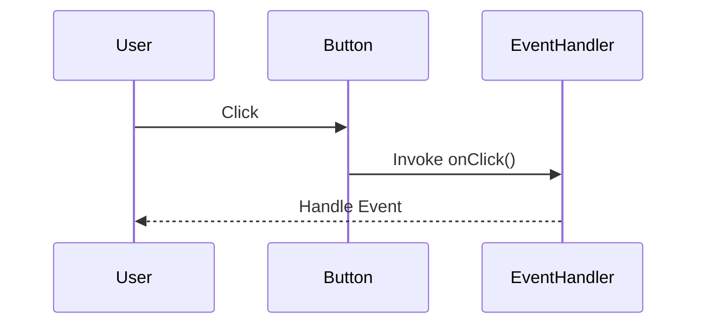

## 6.12 Event-Driven Programming with Delegates

Event-driven programming is a paradigm that revolves around the occurrence of events and the execution of corresponding event handlers. In the D programming language, delegates play a crucial role in implementing this paradigm. Delegates are powerful constructs that allow functions to be treated as first-class objects, enabling dynamic assignment and invocation of functions at runtime. This section will delve into the intricacies of event-driven programming using delegates in D, focusing on implementing callbacks, multicast delegates, and practical use cases such as GUI applications and asynchronous operations.

### Understanding Delegates in D

Delegates in D are similar to function pointers in C or C++, but with additional capabilities. They are objects that encapsulate both a function pointer and a context (usually an object instance). This allows delegates to call member functions of objects, maintaining the state of the object across invocations.

#### Key Characteristics of Delegates

- **Encapsulation**: Delegates encapsulate a method and an optional object instance.
- **Type Safety**: Delegates are type-safe, ensuring that the signature of the method matches the delegate type.
- **Flexibility**: Delegates can be reassigned to different methods at runtime, providing flexibility in event handling.

#### Basic Delegate Syntax

Here's a simple example of how to define and use a delegate in D:

```d
import std.stdio;

// Define a delegate type
alias MyDelegate = void delegate(int);

// A function that matches the delegate signature
void myFunction(int value) {
    writeln("Value: ", value);
}

void main() {
    // Create a delegate instance
    MyDelegate del = &myFunction;

    // Invoke the delegate
    del(42); // Output: Value: 42
}
```

In this example, `MyDelegate` is a delegate type that encapsulates a function taking an `int` parameter and returning `void`. The delegate `del` is assigned the address of `myFunction`, and invoking `del` calls `myFunction`.

### Event Handling with Delegates

Event handling is a core aspect of event-driven programming. It involves responding to events such as user interactions, system notifications, or completion of asynchronous tasks. Delegates in D provide a robust mechanism for implementing event handling.

#### Implementing Callbacks

Callbacks are functions that are passed as arguments to other functions and are invoked after a certain event or operation completes. Delegates are ideal for implementing callbacks due to their encapsulation and flexibility.

Consider the following example of a simple callback mechanism:

```d
import std.stdio;

// Define a delegate type for callbacks
alias Callback = void delegate(string);

// A function that performs an operation and invokes a callback
void performOperation(Callback callback) {
    writeln("Performing operation...");
    // Simulate an operation
    callback("Operation completed");
}

void main() {
    // Define a callback function
    void onCompletion(string message) {
        writeln("Callback received: ", message);
    }

    // Pass the callback to the operation
    performOperation(&onCompletion);
}
```

In this example, `performOperation` takes a `Callback` delegate as a parameter and invokes it after completing its task. The `onCompletion` function is passed as a callback, and it gets executed once the operation is done.

#### Multicast Delegates

Multicast delegates allow multiple methods to be attached to a single delegate instance. This is useful when an event needs to notify multiple subscribers.

Here's how you can implement multicast delegates in D:

```d
import std.stdio;

// Define a delegate type
alias EventHandler = void delegate(string);

// A class that manages event handlers
class EventSource {
    private EventHandler[] handlers;

    // Add a handler to the list
    void addHandler(EventHandler handler) {
        handlers ~= handler;
    }

    // Remove a handler from the list
    void removeHandler(EventHandler handler) {
        handlers = handlers.filter!(h => h != handler).array;
    }

    // Trigger the event
    void triggerEvent(string message) {
        foreach (handler; handlers) {
            handler(message);
        }
    }
}

void main() {
    // Define some event handlers
    void handler1(string message) {
        writeln("Handler 1: ", message);
    }

    void handler2(string message) {
        writeln("Handler 2: ", message);
    }

    // Create an event source
    auto source = new EventSource();

    // Add handlers
    source.addHandler(&handler1);
    source.addHandler(&handler2);

    // Trigger the event
    source.triggerEvent("Event occurred");
}
```

In this example, `EventSource` manages a list of `EventHandler` delegates. Handlers can be added or removed, and when an event is triggered, all registered handlers are invoked.

### Use Cases and Examples

Delegates are particularly useful in scenarios where dynamic behavior is required, such as GUI applications and asynchronous operations.

#### GUI Applications

In GUI applications, user interactions such as button clicks, mouse movements, or keyboard inputs are events that need to be handled. Delegates provide a flexible way to assign and manage event handlers for these interactions.

Consider a simple GUI application using a hypothetical GUI library:

```d
import std.stdio;

// Define a button class with an event
class Button {
    private void delegate() onClick;

    // Set the click event handler
    void setOnClick(void delegate() handler) {
        onClick = handler;
    }

    // Simulate a button click
    void click() {
        if (onClick) {
            onClick();
        }
    }
}

void main() {
    // Create a button
    auto button = new Button();

    // Set the click event handler
    button.setOnClick(() {
        writeln("Button clicked!");
    });

    // Simulate a click
    button.click();
}
```

In this example, the `Button` class has an `onClick` delegate that can be set to handle click events. When the button is clicked, the assigned handler is invoked.

#### Asynchronous Operations

Asynchronous operations often require handling completion events. Delegates can be used to implement callbacks that are executed once an asynchronous task completes.

Here's an example of handling an asynchronous operation:

```d
import std.stdio;
import std.concurrency;

// Define a delegate type for completion handlers
alias CompletionHandler = void delegate(string);

// A function that performs an asynchronous task
void asyncTask(CompletionHandler handler) {
    spawn({
        // Simulate a long-running task
        Thread.sleep(2.seconds);
        handler("Task completed");
    });
}

void main() {
    // Define a completion handler
    void onComplete(string message) {
        writeln("Async operation: ", message);
    }

    // Start the asynchronous task
    asyncTask(&onComplete);

    writeln("Async task started...");
}
```

In this example, `asyncTask` performs a task asynchronously using `std.concurrency.spawn` and invokes the `CompletionHandler` delegate upon completion.

### Visualizing Event-Driven Programming with Delegates

To better understand the flow of event-driven programming with delegates, let's visualize the process using a sequence diagram.



**Diagram Description**: This sequence diagram illustrates the flow of a button click event in a GUI application. The user clicks the button, which triggers the `onClick` event handler, and the event is handled accordingly.

### Design Considerations

When implementing event-driven programming with delegates, consider the following:

- **Memory Management**: Ensure that delegates do not hold references to objects longer than necessary to avoid memory leaks.
- **Thread Safety**: When dealing with asynchronous operations, ensure that delegate invocations are thread-safe.
- **Performance**: Be mindful of the overhead introduced by multicast delegates, especially when dealing with a large number of handlers.

### Differences and Similarities

Delegates in D are similar to function pointers in C/C++ but offer more flexibility and type safety. They are also akin to lambda expressions or anonymous functions in other languages, providing a way to encapsulate behavior.

### Try It Yourself

Experiment with the provided examples by modifying the delegate signatures or adding additional event handlers. Try implementing a simple GUI application with multiple buttons, each with its own event handler.

### Knowledge Check

- What are the key characteristics of delegates in D?
- How can you implement a callback mechanism using delegates?
- What are multicast delegates, and how do they differ from single-cast delegates?
- How can delegates be used in GUI applications?
- What are some considerations when using delegates in asynchronous operations?

### Embrace the Journey

Remember, mastering event-driven programming with delegates in D is a journey. As you explore these concepts, you'll gain a deeper understanding of how to build responsive and dynamic applications. Keep experimenting, stay curious, and enjoy the process!

## Quiz Time!



### What is a delegate in D?

- [x] An object that encapsulates a function pointer and a context
- [ ] A type of class in D
- [ ] A built-in function in D
- [ ] A data structure for storing events

> **Explanation:** A delegate in D is an object that encapsulates a function pointer and a context, allowing it to call member functions of objects.

### How do you define a delegate type in D?

- [x] Using the `alias` keyword followed by the delegate signature
- [ ] Using the `class` keyword
- [ ] Using the `struct` keyword
- [ ] Using the `interface` keyword

> **Explanation:** Delegate types in D are defined using the `alias` keyword followed by the delegate signature.

### What is a multicast delegate?

- [x] A delegate that can have multiple methods attached to it
- [ ] A delegate that can only have one method attached to it
- [ ] A delegate that broadcasts messages to all objects
- [ ] A delegate that is used for network communication

> **Explanation:** A multicast delegate is a delegate that can have multiple methods attached to it, allowing multiple handlers to be invoked for a single event.

### In the context of GUI applications, what is a common use of delegates?

- [x] Handling user interaction events such as button clicks
- [ ] Managing memory allocation
- [ ] Performing mathematical calculations
- [ ] Rendering graphics

> **Explanation:** In GUI applications, delegates are commonly used to handle user interaction events such as button clicks.

### What is a key consideration when using delegates in asynchronous operations?

- [x] Ensuring thread safety
- [ ] Ensuring memory allocation
- [ ] Ensuring fast execution
- [ ] Ensuring low latency

> **Explanation:** When using delegates in asynchronous operations, it is important to ensure thread safety to avoid race conditions and data corruption.

### How can you remove a handler from a multicast delegate?

- [x] By filtering the handler list and removing the specific handler
- [ ] By using the `delete` keyword
- [ ] By setting the handler to `null`
- [ ] By using the `remove` keyword

> **Explanation:** To remove a handler from a multicast delegate, you can filter the handler list and remove the specific handler.

### What is the purpose of the `spawn` function in the asynchronous operation example?

- [x] To execute a task in a separate thread
- [ ] To allocate memory for a task
- [ ] To create a new delegate
- [ ] To handle exceptions

> **Explanation:** The `spawn` function is used to execute a task in a separate thread, allowing for asynchronous operation.

### What is the output of the following code?
```d
alias MyDelegate = void delegate(int);
void myFunction(int value) {
    writeln("Value: ", value);
}
void main() {
    MyDelegate del = &myFunction;
    del(42);
}
```

- [x] Value: 42
- [ ] Value: 0
- [ ] Error: Delegate not defined
- [ ] No output

> **Explanation:** The delegate `del` is assigned the address of `myFunction`, and invoking `del` with the argument `42` results in the output "Value: 42".

### What is the main advantage of using delegates over function pointers?

- [x] Type safety and encapsulation
- [ ] Faster execution
- [ ] Simpler syntax
- [ ] Greater memory efficiency

> **Explanation:** Delegates offer type safety and encapsulation, making them more flexible and safer to use than function pointers.

### True or False: Delegates in D can only be used with member functions.

- [ ] True
- [x] False

> **Explanation:** Delegates in D can be used with both member functions and free functions, providing flexibility in their use.


