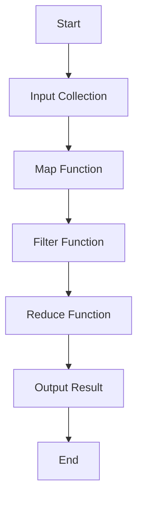

## 6.13 Functional Combinators and Higher-Order Functions

In this section, we delve into the world of functional combinators and higher-order functions in the D programming language. These concepts are pivotal in modern software development, especially when dealing with complex data transformations and creating reusable, modular code. By mastering these techniques, you can write more expressive, concise, and maintainable code.

### Understanding Higher-Order Functions

Higher-order functions are functions that can take other functions as arguments or return them as results. This capability allows for a high degree of abstraction and code reuse. In D, higher-order functions are a cornerstone of functional programming paradigms, enabling developers to build powerful and flexible systems.

#### Key Concepts

- **Function as a Parameter**: Passing a function as an argument to another function.
- **Function as a Return Value**: Returning a function from another function.
- **Function Composition**: Combining simple functions to build more complex ones.

#### Example: Basic Higher-Order Function

```d
import std.stdio;

// A simple higher-order function that applies a function to two integers
int applyFunction(int a, int b, int function(int, int)) {
    return function(a, b);
}

// A function to add two numbers
int add(int x, int y) {
    return x + y;
}

// A function to multiply two numbers
int multiply(int x, int y) {
    return x * y;
}

void main() {
    writeln(applyFunction(5, 3, &add));       // Outputs: 8
    writeln(applyFunction(5, 3, &multiply));  // Outputs: 15
}
```

In this example, `applyFunction` is a higher-order function that takes another function as an argument and applies it to two integers. This pattern is useful for abstracting common operations and making your code more flexible.

### Functional Combinators

Functional combinators are higher-order functions that combine multiple functions to produce new behavior. They are essential in functional programming for creating pipelines and transforming data.

#### Common Functional Combinators

- **Map**: Applies a function to each element of a collection, returning a new collection with the results.
- **Filter**: Selects elements from a collection that satisfy a predicate function.
- **Reduce (Fold)**: Aggregates elements of a collection using a binary function.

#### Example: Map, Filter, and Reduce

```d
import std.stdio;
import std.algorithm.iteration : map, filter;
import std.algorithm.mutation : reduce;

void main() {
    int[] numbers = [1, 2, 3, 4, 5];

    // Map: Increment each number by 1
    auto incremented = numbers.map!(n => n + 1);
    writeln(incremented);  // Outputs: [2, 3, 4, 5, 6]

    // Filter: Keep only even numbers
    auto evens = numbers.filter!(n => n % 2 == 0);
    writeln(evens);  // Outputs: [2, 4]

    // Reduce: Sum all numbers
    int sum = numbers.reduce!((a, b) => a + b);
    writeln(sum);  // Outputs: 15
}
```

In this code, we use D's standard library functions to perform common data transformations. The `map`, `filter`, and `reduce` functions are powerful tools for processing collections in a functional style.

### Use Cases and Examples

#### Data Transformation

Functional combinators are particularly useful in data transformation tasks, such as processing data pipelines. By chaining combinators, you can create complex transformations in a clear and concise manner.

##### Example: Data Pipeline

```d
import std.stdio;
import std.algorithm.iteration : map, filter;
import std.algorithm.mutation : reduce;

void main() {
    int[] data = [1, 2, 3, 4, 5, 6, 7, 8, 9, 10];

    // Pipeline: Filter, Map, Reduce
    int result = data
        .filter!(n => n % 2 == 0)  // Keep even numbers
        .map!(n => n * n)          // Square each number
        .reduce!((a, b) => a + b); // Sum the squares

    writeln(result);  // Outputs: 220
}
```

This example demonstrates a data pipeline that filters even numbers, squares them, and then sums the squares. The use of functional combinators makes the transformation process straightforward and easy to understand.

#### Reusable Behavior

Higher-order functions and combinators allow you to abstract common functionality into reusable components. This abstraction reduces code duplication and enhances maintainability.

##### Example: Reusable Function

```d
import std.stdio;

// A reusable higher-order function for logging
void logOperation(string operation, int a, int b, int function(int, int)) {
    int result = function(a, b);
    writeln(operation, ": ", a, " and ", b, " = ", result);
}

int subtract(int x, int y) {
    return x - y;
}

void main() {
    logOperation("Addition", 10, 5, &add);       // Outputs: Addition: 10 and 5 = 15
    logOperation("Subtraction", 10, 5, &subtract); // Outputs: Subtraction: 10 and 5 = 5
}
```

In this example, `logOperation` is a higher-order function that logs the result of an operation. By passing different functions, you can reuse the logging logic for various operations.

### Visualizing Functional Combinators

To better understand how functional combinators work, let's visualize the process using a flowchart.



**Figure 1: Visualizing the Functional Combinator Pipeline**

This flowchart illustrates the sequence of operations in a functional combinator pipeline. Each step transforms the data, leading to the final result.

### Design Considerations

When using functional combinators and higher-order functions, consider the following:

- **Performance**: While functional combinators provide clarity and conciseness, they may introduce overhead. Profile your code to ensure performance meets your requirements.
- **Readability**: Ensure that the use of combinators enhances readability. Overuse or complex chaining can make code difficult to understand.
- **Immutability**: Embrace immutability where possible to avoid side effects and enhance predictability.

### Differences and Similarities

Functional combinators and higher-order functions are often confused with each other. While both involve functions, combinators specifically refer to functions that combine other functions, whereas higher-order functions are a broader category that includes any function taking or returning functions.

### Try It Yourself

Experiment with the provided examples by modifying the functions or data collections. Try creating your own combinators or higher-order functions to solve different problems. This hands-on practice will deepen your understanding and proficiency.

### Knowledge Check

- **What is a higher-order function?**
- **How do functional combinators like map, filter, and reduce work?**
- **What are some use cases for higher-order functions?**
- **How can you visualize a functional combinator pipeline?**

### Embrace the Journey

Remember, mastering functional combinators and higher-order functions is a journey. As you continue to explore these concepts, you'll unlock new ways to write efficient and elegant code. Keep experimenting, stay curious, and enjoy the process!

## Quiz Time!



### What is a higher-order function?

- [x] A function that takes other functions as parameters or returns them.
- [ ] A function that only performs arithmetic operations.
- [ ] A function that cannot be passed as an argument.
- [ ] A function that is always recursive.

> **Explanation:** Higher-order functions can take other functions as parameters or return them, allowing for greater abstraction and code reuse.

### Which of the following is a functional combinator?

- [x] Map
- [x] Filter
- [x] Reduce
- [ ] Loop

> **Explanation:** Map, filter, and reduce are common functional combinators used to transform collections of data.

### What does the map function do?

- [x] Applies a function to each element of a collection.
- [ ] Filters elements based on a condition.
- [ ] Aggregates elements using a binary function.
- [ ] Sorts elements in ascending order.

> **Explanation:** The map function applies a given function to each element of a collection, returning a new collection with the results.

### How does the filter function work?

- [x] Selects elements from a collection that satisfy a predicate function.
- [ ] Applies a function to each element of a collection.
- [ ] Aggregates elements using a binary function.
- [ ] Sorts elements in descending order.

> **Explanation:** The filter function selects elements from a collection that satisfy a given predicate function.

### What is the purpose of the reduce function?

- [x] Aggregates elements of a collection using a binary function.
- [ ] Applies a function to each element of a collection.
- [ ] Selects elements based on a condition.
- [ ] Splits a collection into smaller parts.

> **Explanation:** The reduce function aggregates elements of a collection using a binary function, often used for summing or combining values.

### What is a common use case for higher-order functions?

- [x] Abstracting common functionality into reusable components.
- [ ] Performing only arithmetic operations.
- [ ] Writing low-level assembly code.
- [ ] Designing user interfaces.

> **Explanation:** Higher-order functions are often used to abstract common functionality into reusable components, enhancing code modularity.

### How can functional combinators improve code?

- [x] By making it more expressive and concise.
- [x] By enhancing readability and maintainability.
- [ ] By increasing the number of lines of code.
- [ ] By making it less efficient.

> **Explanation:** Functional combinators can make code more expressive, concise, and maintainable, improving overall readability.

### What should you consider when using functional combinators?

- [x] Performance and readability.
- [x] Immutability and side effects.
- [ ] Only the number of lines of code.
- [ ] The color of the code editor.

> **Explanation:** When using functional combinators, consider performance, readability, immutability, and side effects to ensure efficient and maintainable code.

### What is the benefit of immutability in functional programming?

- [x] Avoiding side effects and enhancing predictability.
- [ ] Increasing the number of variables.
- [ ] Making code harder to read.
- [ ] Slowing down program execution.

> **Explanation:** Immutability helps avoid side effects and enhances predictability, making code easier to reason about.

### True or False: Functional combinators and higher-order functions are the same.

- [ ] True
- [x] False

> **Explanation:** While both involve functions, functional combinators specifically refer to functions that combine other functions, whereas higher-order functions are a broader category that includes any function taking or returning functions.


