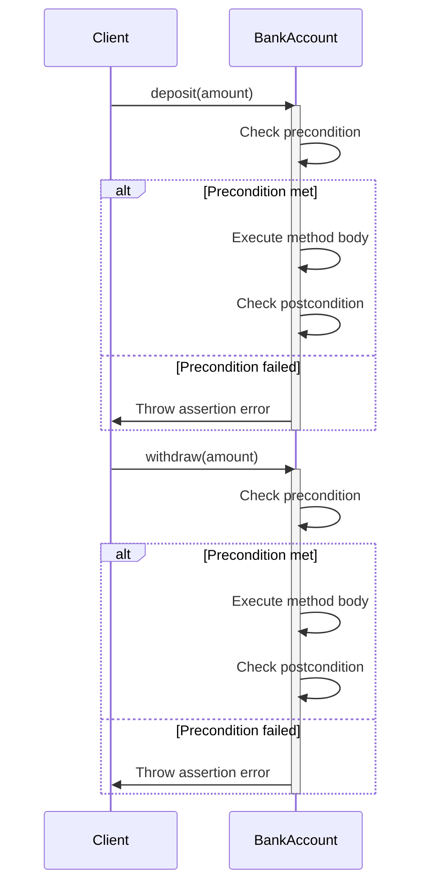

## 6.14 Contract Programming and Design by Contract

In the realm of software engineering, ensuring the correctness and reliability of software systems is paramount. Contract Programming, also known as Design by Contract (DbC), is a methodology that aids in achieving this goal by defining formal, precise, and verifiable interface specifications for software components. In this section, we will delve into the principles of Contract Programming in the D programming language, focusing on the use of preconditions, postconditions, and invariants to ensure software correctness.

### Understanding Contract Programming

Contract Programming is a design methodology where software designers define formal contracts for software components. These contracts specify the obligations and guarantees of a component, which are expressed through:

- **Preconditions**: Conditions that must be true before a function or method is executed.
- **Postconditions**: Conditions that must be true after a function or method has executed.
- **Invariants**: Conditions that must always hold true during the lifetime of an object.

The primary goal of Contract Programming is to improve software reliability by catching errors early in the development process. By explicitly stating the expectations and guarantees of software components, developers can create more robust and maintainable systems.

### Implementing Contracts in D

The D programming language provides built-in support for Contract Programming through the use of `in`, `out`, and `invariant` blocks. These constructs allow developers to embed contracts directly within their code, making it easier to define and enforce the expected behavior of functions and classes.

#### `in` and `out` Blocks

In D, `in` and `out` blocks are used to define preconditions and postconditions for functions. Let's explore how these constructs work with a simple example.

```d
class BankAccount {
    private double balance;

    // Constructor
    this(double initialBalance) {
        balance = initialBalance;
    }

    // Deposit method with preconditions and postconditions
    void deposit(double amount)
    in {
        // Precondition: The amount to deposit must be positive
        assert(amount > 0, "Deposit amount must be positive");
    }
    out (result) {
        // Postcondition: The balance should increase by the deposit amount
        assert(balance == result + amount, "Balance did not increase correctly");
    }
    body {
        balance += amount;
        return balance;
    }

    // Getter for balance
    double getBalance() {
        return balance;
    }
}
```

In this example, the `deposit` method of the `BankAccount` class has an `in` block that specifies a precondition: the deposit amount must be positive. The `out` block specifies a postcondition: the balance should increase by the deposit amount. If these conditions are not met, an assertion error will be thrown, indicating a contract violation.

#### Invariants

Invariants are conditions that must always hold true for an object throughout its lifetime. In D, invariants are defined using the `invariant` block within a class. Let's extend our `BankAccount` example to include an invariant.

```d
class BankAccount {
    private double balance;

    // Constructor
    this(double initialBalance) {
        balance = initialBalance;
    }

    // Invariant: The balance should never be negative
    invariant {
        assert(balance >= 0, "Balance cannot be negative");
    }

    // Deposit method with preconditions and postconditions
    void deposit(double amount)
    in {
        assert(amount > 0, "Deposit amount must be positive");
    }
    out (result) {
        assert(balance == result + amount, "Balance did not increase correctly");
    }
    body {
        balance += amount;
        return balance;
    }

    // Getter for balance
    double getBalance() {
        return balance;
    }
}
```

The `invariant` block ensures that the balance of the `BankAccount` is never negative. This invariant is checked before and after each public method call, providing an additional layer of correctness assurance.

### Use Cases and Examples

Contract Programming is particularly useful in scenarios where software correctness is critical. Let's explore some common use cases and examples.

#### API Design

When designing APIs, it's crucial to define clear expectations for function usage. Contracts can help achieve this by specifying the conditions under which a function can be called and the guarantees it provides.

Consider a simple API for a mathematical library that calculates the square root of a number:

```d
module mathlib;

double sqrt(double x)
in {
    // Precondition: The input must be non-negative
    assert(x >= 0, "Input must be non-negative");
}
out (result) {
    // Postcondition: The result should be non-negative
    assert(result >= 0, "Result must be non-negative");
}
body {
    return x.sqrt();
}
```

By defining preconditions and postconditions, the API clearly communicates the expected input and output, reducing the likelihood of misuse and errors.

#### Error Detection

Contract Programming is an effective tool for catching contract violations during development. By embedding contracts in the code, developers can detect errors early, before they propagate through the system.

Let's consider a scenario where a developer mistakenly attempts to withdraw a negative amount from a bank account:

```d
void withdraw(double amount)
in {
    // Precondition: The amount to withdraw must be positive
    assert(amount > 0, "Withdrawal amount must be positive");
}
out (result) {
    // Postcondition: The balance should decrease by the withdrawal amount
    assert(balance == result - amount, "Balance did not decrease correctly");
}
body {
    balance -= amount;
    return balance;
}
```

If a negative amount is passed to the `withdraw` method, the precondition will fail, triggering an assertion error and alerting the developer to the mistake.

### Visualizing Contract Programming

To better understand the flow of Contract Programming, let's visualize the process using a sequence diagram.



This diagram illustrates the sequence of events when a client interacts with the `BankAccount` class. Preconditions and postconditions are checked before and after method execution, ensuring that the contract is upheld.

### Design Considerations

When implementing Contract Programming in D, consider the following design considerations:

- **Performance Impact**: Contracts introduce additional checks that may impact performance. Consider disabling contracts in production builds if performance is a concern.
- **Granularity**: Define contracts at an appropriate level of granularity. Overly detailed contracts can be cumbersome, while overly vague contracts may not provide sufficient guarantees.
- **Documentation**: Use contracts as a form of documentation. They provide a clear and concise way to communicate the expected behavior of software components.

### Differences and Similarities

Contract Programming shares similarities with other design methodologies, such as Test-Driven Development (TDD) and Defensive Programming. However, it differs in its focus on defining formal contracts rather than writing tests or defensive code.

- **Test-Driven Development (TDD)**: TDD focuses on writing tests before code, while Contract Programming focuses on defining contracts that specify the expected behavior of code.
- **Defensive Programming**: Defensive Programming involves writing code that anticipates and handles potential errors, while Contract Programming defines explicit contracts that specify the conditions under which code should operate.

### Try It Yourself

To deepen your understanding of Contract Programming in D, try modifying the code examples provided. Experiment with different preconditions, postconditions, and invariants to see how they affect the behavior of the program. Consider creating your own classes and functions with contracts to explore the benefits of this methodology.

### Knowledge Check

To reinforce your understanding of Contract Programming and Design by Contract, consider the following questions and challenges:

- What are the key components of a contract in Contract Programming?
- How do `in`, `out`, and `invariant` blocks work in D?
- What are the benefits of using Contract Programming in API design?
- How can Contract Programming help detect errors during development?
- What are the design considerations when implementing contracts in D?

### Embrace the Journey

Remember, mastering Contract Programming is a journey. As you continue to explore this methodology, you'll gain a deeper understanding of how to create reliable and maintainable software systems. Keep experimenting, stay curious, and enjoy the journey!

## Quiz Time!



### What is the primary goal of Contract Programming?

- [x] To improve software reliability by catching errors early
- [ ] To increase software performance
- [ ] To reduce code complexity
- [ ] To enhance user interface design

> **Explanation:** Contract Programming aims to improve software reliability by defining formal contracts that catch errors early in the development process.

### Which D language constructs are used to define preconditions and postconditions?

- [x] `in` and `out` blocks
- [ ] `try` and `catch` blocks
- [ ] `if` and `else` statements
- [ ] `for` and `while` loops

> **Explanation:** In D, `in` and `out` blocks are used to define preconditions and postconditions for functions.

### What is an invariant in Contract Programming?

- [x] A condition that must always hold true during the lifetime of an object
- [ ] A condition that must be true before a function is executed
- [ ] A condition that must be true after a function has executed
- [ ] A condition that is checked only during testing

> **Explanation:** An invariant is a condition that must always hold true for an object throughout its lifetime.

### How can Contract Programming help in API design?

- [x] By specifying clear expectations for function usage
- [ ] By reducing the number of functions in the API
- [ ] By improving the visual design of the API
- [ ] By increasing the API's performance

> **Explanation:** Contract Programming helps in API design by specifying clear preconditions and postconditions, which define the expected input and output of functions.

### What happens if a precondition in a D function is not met?

- [x] An assertion error is thrown
- [ ] The function executes with default values
- [ ] The function returns `null`
- [ ] The program continues without interruption

> **Explanation:** If a precondition is not met, an assertion error is thrown, indicating a contract violation.

### Which of the following is a design consideration for Contract Programming?

- [x] Performance impact of contract checks
- [ ] Reducing the number of classes
- [ ] Increasing code complexity
- [ ] Enhancing user interface design

> **Explanation:** Contracts introduce additional checks that may impact performance, so it's important to consider this when implementing Contract Programming.

### How does Contract Programming differ from Defensive Programming?

- [x] Contract Programming defines explicit contracts, while Defensive Programming anticipates potential errors
- [ ] Contract Programming focuses on user interface design, while Defensive Programming focuses on code structure
- [ ] Contract Programming is used only in testing, while Defensive Programming is used in production
- [ ] Contract Programming is a subset of Defensive Programming

> **Explanation:** Contract Programming defines explicit contracts that specify the conditions under which code should operate, while Defensive Programming involves writing code that anticipates and handles potential errors.

### What is the benefit of using contracts as a form of documentation?

- [x] They provide a clear and concise way to communicate expected behavior
- [ ] They reduce the need for comments in the code
- [ ] They increase the complexity of the code
- [ ] They enhance the visual design of the code

> **Explanation:** Contracts provide a clear and concise way to communicate the expected behavior of software components, serving as a form of documentation.

### What is the role of postconditions in Contract Programming?

- [x] To specify conditions that must be true after a function has executed
- [ ] To specify conditions that must be true before a function is executed
- [ ] To specify conditions that must always hold true during the lifetime of an object
- [ ] To specify conditions that are checked only during testing

> **Explanation:** Postconditions specify the conditions that must be true after a function has executed, ensuring that the function's output meets expectations.

### True or False: Contract Programming can be used to enhance user interface design.

- [ ] True
- [x] False

> **Explanation:** Contract Programming focuses on defining formal contracts for software components to ensure correctness, rather than enhancing user interface design.


