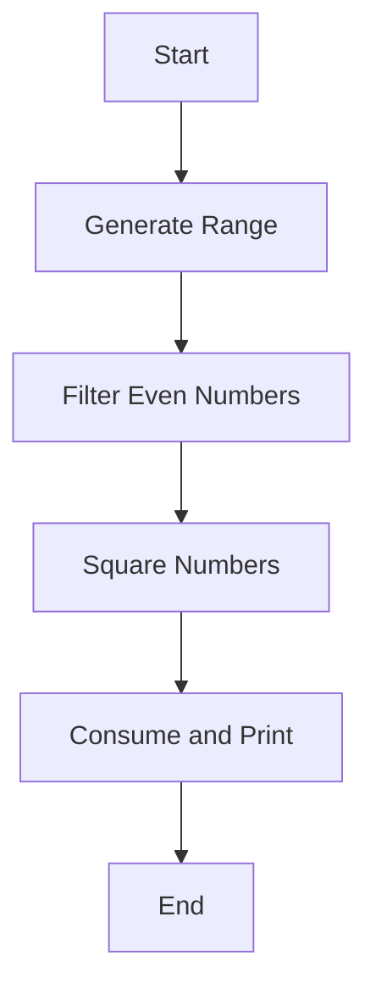

## 6.15 Implementing Behavioral Patterns with Ranges

In this section, we delve into the fascinating world of behavioral design patterns in D, focusing on the implementation using ranges. Ranges are a powerful abstraction in D that allow for efficient and expressive manipulation of sequences of data. By leveraging ranges, we can implement behavioral patterns that are both performant and flexible, thanks to features like lazy evaluation and deferred execution. Let's explore how these concepts come together to enhance your systems programming capabilities in D.

### Understanding Ranges in D

Ranges in D are a fundamental concept that represent a sequence of elements. They provide a unified interface for iterating over collections, enabling powerful and expressive operations on data. Ranges are characterized by three main properties: **empty**, **front**, and **popFront**. These properties allow ranges to be consumed in a lazy manner, meaning elements are only computed as needed.

#### Key Properties of Ranges

- **empty**: A boolean property that indicates whether the range has been fully consumed.
- **front**: Provides access to the current element in the range.
- **popFront**: Advances the range to the next element.

By adhering to these properties, ranges offer a consistent and efficient way to handle sequences of data, making them ideal for implementing behavioral patterns.

### Lazy Evaluation and Deferred Execution

Lazy evaluation is a technique where computations are deferred until their results are actually needed. This can lead to significant performance improvements, especially when dealing with large datasets or complex operations. In D, ranges inherently support lazy evaluation, allowing us to build efficient pipelines for data processing.

#### Benefits of Lazy Evaluation

- **Performance**: By deferring computations, we avoid unnecessary work and reduce resource consumption.
- **Flexibility**: Lazy evaluation allows us to compose operations dynamically, adapting to changing requirements.
- **Scalability**: Efficient handling of large datasets becomes feasible, as only the necessary elements are processed.

Let's see how lazy evaluation can be applied to implement behavioral patterns using ranges.

### Implementing Behavioral Patterns with Ranges

Behavioral design patterns focus on the interaction between objects and the delegation of responsibilities. By using ranges, we can implement these patterns in a way that is both efficient and expressive. We'll explore several use cases and examples to illustrate this approach.

#### Stream Processing with Ranges

Stream processing is a common use case for ranges, where data flows through a series of transformations. By leveraging lazy evaluation, we can build efficient pipelines that process data on-the-fly.

**Example: Filtering and Transforming a Data Stream**

```d
import std.stdio;
import std.range;
import std.algorithm;

void main() {
    auto data = iota(1, 100); // Generate a range of numbers from 1 to 99

    // Define a pipeline to filter and transform the data
    auto result = data
        .filter!(x => x % 2 == 0) // Keep only even numbers
        .map!(x => x * x); // Square each number

    // Consume the range and print the results
    foreach (num; result) {
        writeln(num);
    }
}
```

In this example, we use the `filter` and `map` functions to create a pipeline that processes a range of numbers. The operations are applied lazily, meaning each element is only processed when needed.

#### Deferred Execution for Enhanced Flexibility

Deferred execution allows us to build flexible systems that can adapt to changing conditions. By deferring the execution of certain operations, we can optimize performance and resource usage.

**Example: Conditional Execution with Ranges**

```d
import std.stdio;
import std.range;
import std.algorithm;

void main() {
    auto data = iota(1, 100);

    // Define a condition for processing
    bool shouldProcess = true;

    // Create a pipeline with deferred execution
    auto result = data
        .filter!(x => x % 2 == 0)
        .map!(x => x * x);

    // Conditionally consume the range
    if (shouldProcess) {
        foreach (num; result) {
            writeln(num);
        }
    } else {
        writeln("Processing skipped.");
    }
}
```

Here, we use a boolean flag to control whether the range is consumed. The operations are defined, but execution is deferred until the condition is met.

### Visualizing Range-Based Pipelines

To better understand how ranges work in D, let's visualize a simple pipeline using a flowchart.



This flowchart represents the sequence of operations in our stream processing example. Each step corresponds to a transformation applied to the range, illustrating the flow of data through the pipeline.

### Use Cases and Examples

Ranges are versatile and can be applied to a wide range of use cases. Let's explore some additional examples to demonstrate their power and flexibility.

#### Example: Implementing the Observer Pattern

The Observer pattern is a behavioral design pattern that defines a one-to-many dependency between objects. By using ranges, we can efficiently manage the list of observers and notify them of changes.

**Code Example: Observer Pattern with Ranges**

```d
import std.stdio;
import std.range;
import std.algorithm;

interface Observer {
    void update(string message);
}

class ConcreteObserver : Observer {
    string name;
    this(string name) {
        this.name = name;
    }
    void update(string message) {
        writeln(name, " received update: ", message);
    }
}

class Subject {
    private Observer[] observers;

    void attach(Observer observer) {
        observers ~= observer;
    }

    void detach(Observer observer) {
        observers = observers.remove(observer);
    }

    void notify(string message) {
        foreach (observer; observers) {
            observer.update(message);
        }
    }
}

void main() {
    auto observer1 = new ConcreteObserver("Observer 1");
    auto observer2 = new ConcreteObserver("Observer 2");

    auto subject = new Subject();
    subject.attach(observer1);
    subject.attach(observer2);

    subject.notify("Hello, Observers!");
}
```

In this example, we define an `Observer` interface and a `ConcreteObserver` class. The `Subject` class manages a list of observers and notifies them of changes. By using ranges, we can efficiently iterate over the list of observers.

### Design Considerations

When implementing behavioral patterns with ranges, consider the following:

- **Performance**: Leverage lazy evaluation to optimize performance and reduce resource consumption.
- **Flexibility**: Use deferred execution to build adaptable systems that can respond to changing conditions.
- **Scalability**: Ensure your implementations can handle large datasets efficiently by processing elements on-demand.

### Differences and Similarities

Ranges in D are similar to iterators in other languages, but with some key differences:

- **Lazy Evaluation**: Ranges inherently support lazy evaluation, whereas iterators may not.
- **Unified Interface**: Ranges provide a consistent interface for all collections, simplifying code and reducing complexity.
- **Functional Composition**: Ranges support functional composition, allowing for expressive and concise code.

### Try It Yourself

Experiment with the code examples provided in this section. Try modifying the conditions, transformations, and data sources to see how ranges can be applied to different scenarios. Consider implementing additional behavioral patterns using ranges to further enhance your understanding.

### References and Links

For further reading on ranges and behavioral patterns in D, consider the following resources:

- [D Programming Language Documentation](https://dlang.org/)
- [Ranges in D](https://dlang.org/phobos/std_range.html)
- [Design Patterns: Elements of Reusable Object-Oriented Software](https://en.wikipedia.org/wiki/Design_Patterns)

### Knowledge Check

- What are the key properties of ranges in D?
- How does lazy evaluation improve performance?
- How can deferred execution enhance flexibility in a system?
- What are some use cases for ranges in behavioral patterns?

### Embrace the Journey

Remember, mastering design patterns in D is a journey. As you explore the power of ranges and behavioral patterns, you'll gain valuable insights into building efficient and scalable systems. Keep experimenting, stay curious, and enjoy the journey!

## Quiz Time!



### What are the key properties of ranges in D?

- [x] empty, front, popFront
- [ ] size, capacity, length
- [ ] start, end, step
- [ ] first, last, next

> **Explanation:** Ranges in D are characterized by the properties `empty`, `front`, and `popFront`, which allow for lazy evaluation and efficient iteration.

### How does lazy evaluation improve performance?

- [x] By deferring computations until results are needed
- [ ] By precomputing all results in advance
- [ ] By using more memory to store intermediate results
- [ ] By parallelizing all operations

> **Explanation:** Lazy evaluation defers computations until their results are actually needed, reducing unnecessary work and resource consumption.

### What is a benefit of using deferred execution?

- [x] Enhanced flexibility and adaptability
- [ ] Increased memory usage
- [ ] Immediate execution of all operations
- [ ] Reduced code readability

> **Explanation:** Deferred execution allows systems to adapt to changing conditions by delaying the execution of certain operations, enhancing flexibility.

### Which pattern defines a one-to-many dependency between objects?

- [x] Observer Pattern
- [ ] Singleton Pattern
- [ ] Strategy Pattern
- [ ] Factory Pattern

> **Explanation:** The Observer Pattern defines a one-to-many dependency between objects, allowing multiple observers to be notified of changes.

### What is a key difference between ranges and iterators?

- [x] Ranges support lazy evaluation
- [ ] Ranges are always mutable
- [ ] Iterators are more efficient
- [ ] Iterators support functional composition

> **Explanation:** Ranges in D inherently support lazy evaluation, whereas iterators in other languages may not.

### How can ranges be used in stream processing?

- [x] By creating pipelines of transformations
- [ ] By storing all data in memory
- [ ] By executing operations eagerly
- [ ] By using fixed-size buffers

> **Explanation:** Ranges can be used to create pipelines of transformations, processing data on-the-fly in a lazy manner.

### What is the role of the `filter` function in a range pipeline?

- [x] To select elements based on a condition
- [ ] To transform elements into a new form
- [ ] To sort elements in ascending order
- [ ] To concatenate multiple ranges

> **Explanation:** The `filter` function selects elements from a range based on a specified condition, allowing for selective processing.

### How can deferred execution be controlled in a range-based system?

- [x] By using conditional statements
- [ ] By precomputing all results
- [ ] By using fixed-size buffers
- [ ] By parallelizing all operations

> **Explanation:** Deferred execution can be controlled using conditional statements to determine when operations should be executed.

### What is a common use case for lazy evaluation in D?

- [x] Handling large datasets efficiently
- [ ] Precomputing all results in advance
- [ ] Storing data in fixed-size buffers
- [ ] Using more memory to store intermediate results

> **Explanation:** Lazy evaluation is commonly used to handle large datasets efficiently by processing elements on-demand.

### True or False: Ranges in D provide a unified interface for all collections.

- [x] True
- [ ] False

> **Explanation:** Ranges in D provide a consistent and unified interface for iterating over all collections, simplifying code and reducing complexity.




